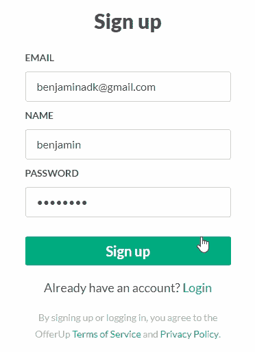

# 用 Formik、Yup 和 GraphQL 进行表单验证

> 原文：<https://levelup.gitconnected.com/react-form-validation-with-graphql-formik-yup-f31e83f38bb0>

验证用户注册表单听起来很简单，不是吗？只要确保所提供的电子邮件格式正确，并且密码符合任何标准，就万事俱备了，对吗？

对我来说，直到我开始实现代码，我才意识到实际上有很多活动的部分。当连接一个完整的栈 *JavaScript* 应用程序时尤其如此，在这种情况下，一个 [React](https://reactjs.org/docs/getting-started.html) 和 [Apollo](https://www.apollographql.com/) 客户端与一个 [Express](https://expressjs.com/) 和 [GraphQL Yoga(还有 Apollo)](https://github.com/prisma/graphql-yoga) 服务器。有相当多的考虑最终会影响用户注册过程。

1.  需要什么样的信条？`email/password`还是`email/name/password`还是更复杂更烦人的？
2.  发生了什么验证，它们发生在客户端还是服务器上——需要`regex`吗？
3.  对于`signup`突变来说`schema`看起来像什么？
4.  错误信息如何显示给用户——文本、颜色、在页面上的位置？
5.  在什么情况下会显示这些错误？

# 放弃

完成这项任务的方法可能和实现它的开发人员一样多。这只是我最近偶然发现的一种方式，我喜欢它的结果。



# 服务器逻辑

服务器的细节没有我们将要关注的 [GraphQL 变异](https://graphql.org/learn/queries/#mutations)解析器重要，但是看到一切都在运行是有帮助的。克隆我的服务器样板文件，然后按照`README`运行你自己的服务器，或者只是跟着做。

```
git clone [https://github.com/benjaminadk/graphql-server-boilerplate-ts](https://github.com/benjaminadk/graphql-server-boilerplate-ts)
```

本文真正关心的唯一代码是验证逻辑、`signup`变异的解析器和相应的前端标记。

## (计划或理论的)纲要

*   `signup`变异返回一个`Error`或`null`的数组
*   如果返回`null`,我们可以假设一切正常，数据库中有了一个新用户
*   每个`Error`的`path`指的是出错的字段的名称，因此在本例中是`email`、`name`或`password`
*   每个`Error`的`message`是描述错误的短文本消息

```
type Error {
  path: String!
  message: String!
}

type Mutation {
  signup(email: String!, name: String!, password: String!): [Error!]
}
```

## 是错误验证

*   [是](https://github.com/jquense/yup)用于验证
*   语法类似于[反应道具类型](https://github.com/facebook/prop-types)
*   提供类型、最小/最大长度、整体对象形状等各种验证
*   将自定义错误信息作为最后一个参数传递
*   `formatYupError`将*是的*错误形状映射到我们的模式

```
const yup = require('yup')

const emailNotLongEnough = 'email must be at least 3 characters'
const nameNotLongEnough = 'name must be at least 3 characters'
const passwordNotLongEnough = 'password must be at least 8 characters'
const invalidEmail = 'email must be a valid email'

const validator = yup.object().shape({
  email: yup
    .string()
    .min(3, emailNotLongEnough)
    .max(100)
    .email(invalidEmail),
  name: yup
    .string()
    .min(3, nameNotLongEnough)
    .max(100),
  password: yup
    .string()
    .min(8, passwordNotLongEnough)
    .max(100)
})

const formatYupError = err => {
  const errors = []
  err.inner.forEach(e => {
    errors.push({
      path: e.path,
      message: e.message
    })
  })
  return errors
}

module.exports = { validator, formatYupError }
```

## 注册突变解析器

*   `User`表示您的服务器访问其数据库模型的方式
*   `try/catch`与`abortEarly: false`将在任何其他逻辑运行之前触发返回错误
*   使用`email`检查数据库中的现有用户，如果有，则抛出错误
*   如果没有触发错误，最后创建`User`，但返回`null`

```
const { User } = require('./User')
const { validator, formatYupError } = require('./errorHelpers')

module.exports = async (_, args) => {
  const duplicateEmail = 'email already taken'

  try {
    await validator.validate(args, { abortEarly: false })
  } catch (err) {
    return formatYupError(err)
  }

  const { email, name, password } = args

  const userExists = await User.findOne({
    where: { email },
    select: ['id']
  })

  if (userExists) {
    return [
      {
        path: 'email',
        message: duplicateEmail
      }
    ]
  }

  const user = User.create({ email, name, password })

  await user.save()

  return null
} 
```

# 客户端逻辑

同样，精确的前端设置没有`SignupForm`组件本身重要。我喜欢*高阶组件*或者 *HOC* 版本的 [Formik](https://jaredpalmer.com/formik/docs/api/withformik) 叫做`withFormik`。组件`InnerForm`包含表单的 *JSX* 标记，从外部组件接收道具。外部`SignupForm` if where *Formik* 选项定义了表单的行为方式。

## 注册表单

```
import React from 'react'
import { withFormik } from 'formik'

import { normalizeErrors, formatError } from '../../../utils/errorHelpers'
import { validUserSchema } from './validation'
import { Form, Field, Button } from './styles'
import Svg from '../../shared/Svg'

const fields = ['email', 'name', 'password']

const InnerForm = props => {
  const { values, touched, errors, isSubmitting, handleChange, handleBlur, handleSubmit } = props

  return (
    <Form onSubmit={handleSubmit}>
      {fields.map(field => {
        let error = Boolean(errors[field] && touched[field])

        return (
          <Field key={field} error={error}>
            <label>{field}</label>
            <input
              type={field}
              onChange={handleChange}
              onBlur={handleBlur}
              value={values[field]}
              name={field}
              placeholder={field === 'email' ? 'Ex. johndoe@mail.com' : ''}
              spellCheck={false}
            />
            <div className='error'>{formatError(errors[field])}</div>
          </Field>
        )
      })}
      <Button type='submit' disabled={isSubmitting}>
        {isSubmitting ? <Svg name='logo' /> : 'Sign up'}
      </Button>
    </Form>
  )
}

const SignupForm = withFormik({
  mapPropsToValues: () => ({ email: '', name: '', password: '' }),

  validationSchema: validUserSchema,

  handleSubmit: async (values, { props, setErrors, setSubmitting }) => {
    await new Promise(resolve => setTimeout(resolve, 3000))
    const errors = await props.submit(values)
    if (errors) {
      setErrors(normalizeErrors(errors))
    } else {
      props.onFinish()
    }
    setSubmitting(false)
  },

  displayName: 'SignupForm'
})(InnerForm)

export default SignupForm
```

*Formik* 很有帮助，因为它处理了一些烦人的小细节，比如`touched`——如果用户将光标放在给定的字段中，它就是`true`。如果用户提交表单时没有输入任何字段，并将整个表单留空，则会触发所有错误。一旦用户在显示错误状态的字段中输入有效输入，该字段会自动返回正常状态，给用户即时反馈。 *Formik* 还处理整个表单`state`和每个字段的事件处理程序，以及整个表单。 *Formik 的*验证被设计为，可选地，让*yes*验证一切。要了解全局，最好是看一下实际的表单。


这是我正在制作的一个[克隆体的完整组件。我在`handleSubmit`函数上放了一个`setTimeout`来说明 *Formik* 的另一个内置特性——提交状态。 *Formik 的* `handleSubmit`选项可用的回调之一是`setSubmitting`。当`handleSubmit`被调用时，这被自动设置为`true`，并且对应于传递给`InnerForm`的`isSubmitting`属性。我使用](https://offerup.com/)[样式的组件](https://www.styled-components.com/)构建表单组件，将`isSubmitting`传递给`Button`组件允许我同时禁用按钮，防止多次提交，并显示一个加载微调器，让用户知道发生了什么。Formik 确实提供了*表单*、*字段*和其他包装组件，但我发现创建自己的组件更容易定制。

## 确认

*Formik* 提供多种验证选项，在这方面非常灵活。事实上，甚至不需要设置验证。记住，我们的服务器已经在运行自己的验证了。我们可以完全忽略客户端验证，但是在我们不需要的时候限制 *HTTP* 请求会更好地提高性能，并且用户会更快地收到客户端验证的反馈。另一个验证策略是编写内联的 *JavaScript* 函数 *Formik 的* [验证选项](https://jaredpalmer.com/formik/docs/api/withformik#validate-values-values-props-props-formikerrors-values-promise-any)，但是这比我们想要做的要多。最后，最后一个选项是将一个[验证模式](https://jaredpalmer.com/formik/docs/api/withformik#validationschema-schema-props-props-schema)传递给 *Formik* 。

我们的`validationSchema`看起来会很熟悉。它与服务器端验证几乎相同，但是增加了`required`。由于使用了`!`(非空)操作符，GraphQL 模式本身抛出了一个空字符串，错误被传递给了解析器。服务器验证仍然相关，因为当用户试图用已经存在的电子邮件注册时，它会抛出`duplicateEmail`错误。验证也有助于测试，在开发中，我们可能会通过图形用户界面或程序输入数据，我们希望保持数据库的整洁和数据的正确性。

```
import * as yup from 'yup'

const emailNotLongEnough = 'email must be at least 3 characters'
const emailRequired = 'Please enter an email address'
const invalidEmail = 'email must be a valid email'
const nameNotLongEnough = 'name must be at least 3 characters'
const passwordNotLongEnough = 'password must be at least 3 characters'
const fieldRequired = 'This field is required'

export const validUserSchema = yup.object().shape({
  email: yup
    .string()
    .min(3, emailNotLongEnough)
    .max(100)
    .email(invalidEmail)
    .required(emailRequired),
  name: yup
    .string()
    .min(3, nameNotLongEnough)
    .max(100)
    .required(fieldRequired),
  password: yup
    .string()
    .min(8, passwordNotLongEnough)
    .max(100)
    .required(fieldRequired)
})
```

## 突变容器

完整的示例需要一个带有与服务器通信的逻辑的容器组件。`submit`函数调用`signup`突变，而`onFinish`函数只有在一切顺利完成时才会被调用。这个设置最酷的地方在于，来自服务器的`duplicateEmail`错误可以平滑地集成到 *Formik* 系统中。现在，我们将客户端和服务器验证打包到同一个包中。

```
import { useMutation } from 'react-apollo'
import { withRouter } from 'react-router-dom'
import gql from 'graphql-tag'

const signupMutation = gql`
  mutation Signup($email: String!, $name: String!, $password: String!) {
    signup(email: $email, name: $name, password: $password) {
      path
      message
    }
  }
`

const SignupContainer = props => {
  const [mutate] = useMutation(signupMutation)

  async function submit(values) {
    const { data } = await mutate({
      variables: values
    })
    if (data) {
      return data.signup
    }
    return null
  }

  function onFinish() {
    props.history.push('/')
  }

  return props.children({ submit, onFinish })
}

export default withRouter(SignupContainer)
```

容器与[渲染道具](https://reactjs.org/docs/render-props.html)模式一起使用，以将`submit`、`onFinish`或任何其他所需的逻辑传递给其子节点。

```
<SignupContainer>
  {({ submit, onFinish }) => <Signup submit={submit} onFinish={onFinish} />}
</SignupContainer>
```

## 助手功能

受过训练的眼睛可能已经注意到了`SignupForm`示例中的几个辅助函数。`normalizeErrors`函数将服务器抛出的错误转换成 *Formik* 格式，而`formatError`只是将第一个字母大写以用于样式化。

```
export const normalizeErrors = errors => {
  return errors.reduce((acc, val) => {
    acc[val.path] = val.message
    return acc
  }, {})
}

export const formatError = error => error && error[0].toUpperCase() + error.slice(1)
```

更彻底的说， *Formik* error，touched 和 state 格式是一个 *JavaScript* 对象。每个对象都包含一个带有表单中每个字段的 name 属性的键。

## 样式组件

以下是我使用的相当基本的*风格的组件*。一切都相当简单，因为我使用了一个`error`道具来切换指示验证错误的红色。

*   我使用的主题的相关部分

```
const theme = {
  primary: '#00ab80',
  black: '#4a4a4a',
  white: '#ffffff',
  error: '#e05666',
  grey: [
    '#FAFAFA',
    '#F2F2F2',
    '#E6E5E5',
    '#D9D8D8',
    '#CDCCCB',
    '#C0BFBF',
    '#B3B2B2',
    '#A7A5A5',
    '#9A9898',
    '#817E7E',
    '#747272',
    '#676565',
    '#5A5858',
    '#4D4C4C',
    '#403F3F'
  ]
}
```

*   表单组件

```
export const Form = styled.form`
  width: 300px;
`
```

*   场分量

```
export const Field = styled.div`
  display: flex;
  flex-direction: column;
  color: ${p => (p.error ? p.theme.error : p.theme.black)};
  label {
    color: currentColor;
    font-size: 14px;
    font-weight: 700;
    text-transform: uppercase;
    margin-bottom: 8px;
  }
  input {
    color: currentColor;
    border: 1px solid ${p => (p.error ? 'currentColor' : p.theme.grey[4])};
    border-radius: 3px;
    font-size: 16px;
    padding: 12px 16px;
    margin-bottom: 8px;
    &::placeholder {
      color: ${p => p.theme.grey[5]};
    }
  }
  .error {
    display: ${p => (p.error ? 'block' : 'none')};
    color: currentColor;
    font-size: 14px;
  }
`
```

*   按钮组件

```
const spin = keyframes`
  0% {
    transform: rotate(0deg);
  }
  100% {
    transform: rotate(360deg);
  }
`

const Button = styled.button`
  width: 100%;
  background-color: ${p => p.theme.primary};
  color: ${p => p.theme.white};
  border: 0;
  border-radius: 3px;
  font-size: 20px;
  font-weight: 700;
  line-height: 26px;
  padding: 8px 20px;
  margin-top: 20px;
  cursor: pointer;
  &:hover {
    background-color: ${p => `${darken(0.1, p.theme.primary)}`};
  }
  &:disabled {
    background-color: ${p => `${lighten(0.1, p.theme.primary)}`};
  }
  svg {
    justify-self: center;
    width: 25px;
    height: 25px;
    animation: ${spin} 1s linear infinite;
  }
```

*   Svg 微调器

```
<svg viewBox='0 0 50 50' xmlns='http://www.w3.org/2000/svg'>
  <path
    d='M49.941 23.322c1.292 19.172-18.683 32.553-35.957 24.086C5.969 43.477.66 35.575.06 26.677-1.233 7.505 18.742-5.874 36.016 2.593a24.9754 24.9754 0 0 1 13.161 16.062L44.4 24.602l-4.909-5.421c-1.346-3.382-3.9-6.35-7.613-8.169-5.005-2.454-10.941-2.056-15.571 1.046-9.976 6.683-8.968 21.644 1.816 26.931 5.005 2.453 10.94 2.054 15.57-1.047 4.716-3.16 6.979-8.172 6.912-13.134l3.95 4.359 5.32-6.62c.027.257.049.517.066.775z'
    fill='#ffffff'
  />
</svg>
```

查看[没有艺术才能的 SVG](https://benjaminbrooke.me/posts/svg-icons-with-no-artistic-ability/)在 React 中了解更多关于 SVG 的内容。

*原载于 2019 年 8 月 30 日*[*https://Benjamin Brooke . me*](https://benjaminbrooke.me/posts/react-form-validation-with-graphql-formik-and-yup/)*。*