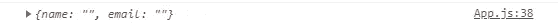
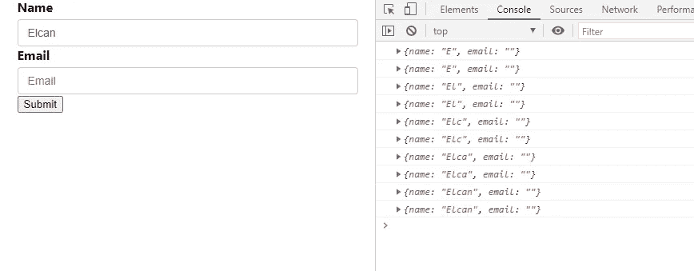
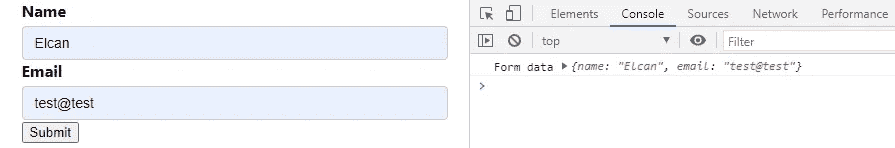
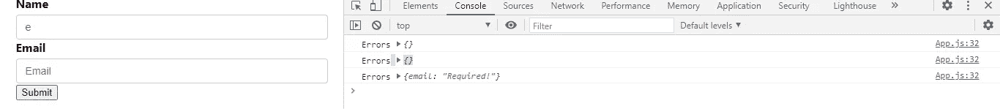
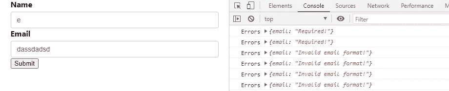

# React Formik 和简单表单验证。

> 原文：<https://levelup.gitconnected.com/react-formik-and-simple-form-validation-8fef0ccb54b>


让我们从在本地环境中创建 react 应用程序开始。为此，我们打开命令行，使用以下命令进入桌面文件夹:

```
cd Desktop/
```

创建 react 应用程序后，使用:

```
npx create-react-app testapp
```

在您的计算机上创建 React 项目后，用您使用的代码编辑器打开它，并打开 App.js 文件。清除 App.js 文件并复制它以便启动。

```
export default function App() { return ( <div className="App"> <form> <label htmlFor='name'>Name</label>
       <input id='name' type='text' placeholder='Name' /> <label htmlFor='email'>Email</label>
       <input id='email' type='email' placeholder='Email'/> <button type='submit'>Submit</button> </form> </div>);}
```

这是我们应用程序的基本形式。

让我们将 formik 包添加到我们的应用程序中。打开终端写:

```
npm i formik
```

现在我们将使用`useFormik()`自定义 react 钩子。在内部，Formik 使用`useFormik`来创建`<Formik>`组件(这将呈现一个 [React 上下文](https://reactjs.org/docs/context.html)提供者)。

使用以下内容将 useFormik 导入到我们的项目:

```
import { useFormik } from ‘formik’
```

让我们在组件中调用它

```
const formik = useFormik({})
```

在我们创建的表单中，我们有两个字段:姓名和电子邮件。对于管理表单状态，我们首先像这样声明输入字段的初始值。useFormik 挂钩中声明的初始值。

```
const formik = useFormik({
 initialValues:{
   name:'',
   email:''
  }
})
```

如果我们在控制台日志中记录 formik 元素的值，请写下这一行

```
console.log(formik.values);
```

你会看到



Formik 使用 onChange 函数检测输入元素的变化，并且我们使用 formik 声明输入的值。将 onChange 函数和值添加到如下所示的元素中。

```
*Name input*<input 
*id*=’name’ 
*type*=’text’ 
*placeholder*=’Name’ 
*onChange*={formik.handleChange} 
*value*={formik.values.name } 
/>*Email input*<input 
*id*='email' 
*type*='email' 
*placeholder*='Email' 
*onChange*={formik.handleChange} 
*value*={formik.values.email } />
```

让控制台再次登录，并在输入字段中键入一些内容



你看，我把我的名字写到输入中，然后`handleChange` 发现了。

我们编写 onChange 函数并检测输入字段的变化。

**让我们看看如何在提交时处理表单:**

🌓首先，将 onSubmit 函数添加到`<form/>`项，如下所示:

```
<form *onSubmit*={formik.handleSubmit}>
```

> `formik.handleChange`来自图书馆。

🌗其次，将 onSubmit 添加到 useFormik 挂钩中。这个 onSubmit 是对象，它接受箭头函数。在这个箭头功能控制台中记录输入值。

```
const formik = useFormik({
initialValues:{
 name:’’,
 email:’’
},
onSubmit:*values*=>{
  console.log(‘Form data’,*values*);
}})
```

让我们测试一下，在输入中写入任何内容，然后单击 submit 按钮。



如果你点击提交按钮，你会看到它会工作。

# 💛让我们为表单编写验证

为了验证，我们再次使用 useFormik。让我们看看如何

```
const formik = useFormik({
initialValues:{
 name:’’,
 email:’’
},
onSubmit:*values*=>{
  console.log(‘Form data’,*values*);
},
validate:values=>{
 let errors = {}; if(!values.name){
  errors.name = 'Required!'
 } if(!values.email){
  errors.email= 'Required!'
 }else if(!/^(([^<>()\[\]\\.,;:\s@"]+(\.[^<>()\[\]\\.,;:\s@"]+)*)|(".+"))@((\[[0-9]{1,3}\.[0-9]{1,3}\.[0-9]{1,3}\.[0-9]{1,3}])|(([a-zA-Z\-0-9]+\.)+[a-zA-Z]{2,}))$/i.test(values.email)){
errors.email = 'Invalid email format!'
} return errors;
}})
```

在验证对象内部，如果输入字段为空“必填”，我们使用 if 语句并查询名称或电子邮件部分是否为空错误被添加到错误对象。对于电子邮件查询，我们也使用正则表达式来表示电子邮件的正确格式。

电子邮件的正则表达式:`!/^(([^<>()\[\]\\.,;:\s@”]+(\.[^<>()\[\]\\.,;:\s@”]+)*)|(“.+”))@((\[[0–9]{1,3}\.[0–9]{1,3}\.[0–9]{1,3}\.[0–9]{1,3}])|(([a-zA-Z\-0–9]+\.)+[a-zA-Z]{2,}))$/i.test(values.email)`

如果我们像这样记录错误:`console.log(‘Errors’ , formik.errors);`我们会看到错误。



如果电子邮件部分不是空的，而是格式错误



# 🖥️:让我们在屏幕上显示错误

在

```
*For name *<label *htmlFor*='name'>Name &nbsp;
  {formik.errors.name && <div *className*="error">{formik.errors.name}       </div>}
</label>*For email*<label *htmlFor*='email'>Email&nbsp;
 {formik.errors.email&& <div *className*="error">{formik.errors.email}       
</div>}
</label>
```

你会在屏幕上看到一个错误

简单表单验证代码: [Github repo](https://github.com/Simuratli/simpleFormikValidation)

为了支持我:[帕特里翁](https://www.patreon.com/simuratli)