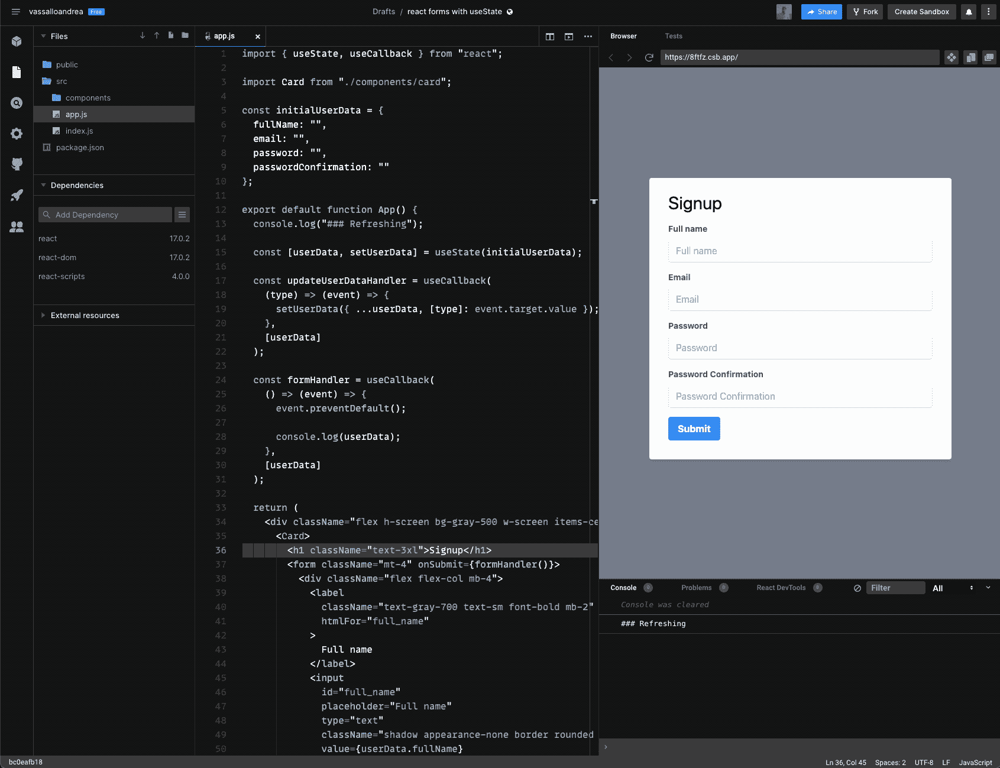

# 反应表单—使用状态与用户参考

> 原文：<https://levelup.gitconnected.com/react-forms-usestate-vs-useref-5cb584cc19fd>

## 根据您的需要选择实现 React 表单的正确方法

由 [Max Duzij](https://unsplash.com/@max_duz?utm_source=unsplash&utm_medium=referral&utm_content=creditCopyText) 在 [Unsplash](https://unsplash.com/s/photos/programming?utm_source=unsplash&utm_medium=referral&utm_content=creditCopyText) 上拍摄的照片

> 今天编写优化的、结构良好的应用程序将会让你明天节省大量的时间

在本文中，我想向您展示 React `useState`和`useRef`在没有第三方库的情况下实现表单的区别。

这两种方法都是有效的，我们应该根据我们的需要选择最合适的，这意味着我们可以在应用程序的不同地方使用这两种方法。

# 如何阅读博客文章

保持👀打开并检查**演示示例中的`### Refreshing`控制台日志。**

请阅读示例下的描述，深入了解不同之处。

如果您对 Codesandbox iframe 有任何问题，请检查您的浏览器设置，查看第三方 cookies 和站点数据。这里有一个[铬](https://www.chromium.org/for-testers/bug-reporting-guidelines/uncaught-securityerror-failed-to-read-the-localstorage-property-from-window-access-is-denied-for-this-document)的例子。

# 第一种方法:useRef

第一种方法是使用`React.useRef`钩子。它是最被低估的，但是如果你不需要特殊的控件，它将允许你优化表单。

`React.useRef`将允许您编写表单，而无需为每个用户输入重新呈现组件，以实时控制为代价优化应用程序，根据用户输入和预览启用/禁用表单提交按钮。

# 代码示例

# 演示

正如你从上面的例子中看到的，用`useRef`实现非常简单。我们没有使用组件状态，这意味着组件没有被刷新——事实上，控制台日志只打印一次`### Refreshing`字符串。

最大的限制是，我不能根据用户输入禁用/启用按钮，我们不能实时验证表单，但我们可以在提交时验证。

# 第二种方法:使用状态

第二种方法是使用`React.useState`钩子。这是最常用的，有时也是被滥用的，因为很多表单不需要实时验证。

对于不使用`useCallback`和/或`useMemo`钩子的人来说，这也是最大的问题，这些钩子对于编写一个优秀的应用程序来说是不可或缺的，因为组件会为每个用户输入重新加载，如果组件有很多未缓存的函数，你可能会大大降低应用程序的速度。

`React.useState`将允许你为每个用户输入重新渲染组件，以建立更复杂的实时控制形式，即

# 代码示例

# 演示

看起来`React.useState`的实现比`React.useRef`容易。我们使用组件状态，这意味着组件被刷新了很多次——事实上，控制台日志打印的`### Refreshing`字符串超过了 **60** 次。

如果你没有使用`useCallback`和`useMemo`就用其他嵌套组件编写了一个大组件，那么使用这种方式制作的表单并不是一个好方法。

# 结论

如果你想构建复杂的表单，使用`useState`，否则我建议你使用`useRef.` ***。在我看来，实时验证和这种 UI 改进并没有给 UX 增加很多东西，但一个快速简洁的应用程序就足够了。***

# 就这样

仅此而已！我希望这篇博文能帮助你理解一些小的 React 内部机制，从而改进你的应用程序。

你喜欢这篇文章吗？用掌声和评论让我知道🙏

ReactJS/NextJS 应用程序需要帮助吗？ [**联系我！**](mailto:andrea.vassallo.94@gmail.com)

你想加入星云实验室吗？ [**此处适用**](https://grnh.se/8df3c4f2teu) ！