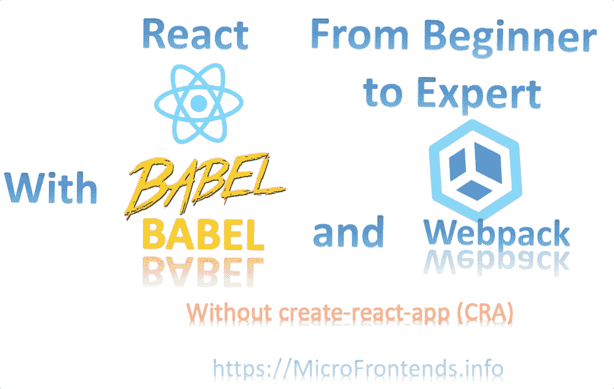
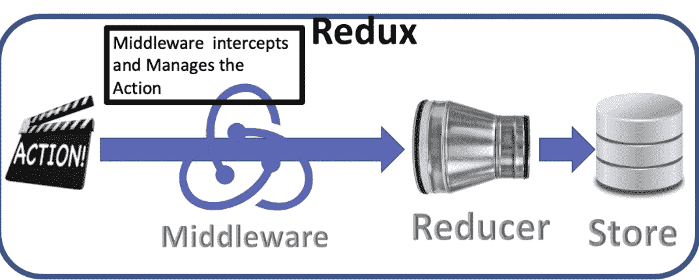
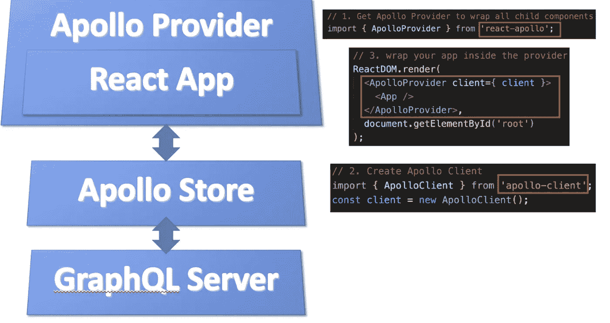

# 没有 CRA，从初学者到专家的反应

> 原文：<https://levelup.gitconnected.com/react-from-beginner-to-expert-without-cra-3d4dbdcfa722>



==================

# 目录

*   [为什么做出反应](#dc78)
*   [动手项目](#f95f)
*   [JSX 基础知识](#88cd)
*   [React 渲染和数据绑定](#4d81)
*   [Redux](#eebc)
*   [图表 QL](#2755)
*   [测试反应](#b7fa)
*   [获取数据](#8ccd)
*   [造型反应](#6ced)
*   [反应原生](#f466)

===================

# 为什么要反应

如果我们投资时间学习新的东西，我们需要了解这项投资的回报。以下是学习 React 优于其他框架的一些原因

1.  React 是一个库，而不是一个框架:为什么这很重要？我花了十年时间从遗留框架转向最新的框架。我告诉你；这是痛苦和非常昂贵的。我加入了一家公司，该公司大量采用 PHP 作为开发网站的方式。这是标准。我的第一个任务是迁移所有这些遗留代码以做出反应。另一家公司每次完成门户后，大部分时间都在从一个框架转移到另一个框架。他们从 PHP 和 WordPress 开始。然后他们决定在 Angular 1 刚发布的时候搬到它上面。在他们完成门户后，Angular 2 发布了一个完全不同的框架，要求他们重写网站。Angular 1 的支持度开始下降，他们被迫转向 Angular 2。之后，他们开始用 React 建立新的站点。React 的好处在于它是一个库，而不是一个框架。如果您不使用 create-react-app，您可以自由升级和更改构建应用程序的方式。你依赖的是一个库，而不是一个框架。您可以将这些库与其他适合您需求的框架一起使用，例如， [Gatsby](https://www.gatsbyjs.com/) 。Gatsby 是用 React for Static site generation 构建的，用来提升 SEO 评分。
2.  React 简单易学:由于 React 不是一个框架，所以很容易学习并快速创建网站。它使用“jsx”，这是著名的 Javascript，其中注入了 html。
3.  React Components:将代码构建成组件的想法使得构建独立的组件并将其合并到单页应用程序(SPA)中变得更加容易。
4.  React 性能:React 页面渲染速度很快，因为算法很快。此外，虚拟 Dom 只帮助您呈现更改的内容，而不是呈现整个页面。
5.  构建移动、Web 和桌面应用程序:通过学习 React.js，您可以轻松地应用您所学到的知识，使用 React Native 构建移动应用程序。

6.React 社区:

*   React 社区拥有大量开源的顶级专家，您能否通过大量的库快速获得帮助，从而帮助您专注于业务逻辑
*   成千上万的教程、视频和文章…
*   顶级公司在生产中使用 React，这使得学习它非常有价值。
*   像脸书这样的大公司支持它。
*   新公司正在转换以作出反应，找工作会更容易
*   Stack overflow 进行了一项调查，最受欢迎和喜爱的语言是 React。该调查将 React 与 Vue 和 Angular 进行了比较，React 目前是赢家。

==========================

# 动手项目

像往常一样，我将通过动手项目来完成学习。这将是一个文章的集合，不要为了你不需要的步骤而去读一篇冗长的文章。

## 1.创建一个没有创建反应应用程序的反应应用程序

以下文章将帮助您创建样板 React 应用程序

[](https://www.linkedin.com/pulse/create-react-app-without-create-react-app-cra-elhousieny-phd%25E1%25B4%25AC%25E1%25B4%25AE%25E1%25B4%25B0) [## 创建 react 应用程序而不创建 React 应用程序(CRA)

### 这篇文章将展示如何在不使用 create-react-app (CRA)的情况下创建 React 应用程序。有关我们为什么的更多详细信息…

www.linkedin.com](https://www.linkedin.com/pulse/create-react-app-without-create-react-app-cra-elhousieny-phd%25E1%25B4%25AC%25E1%25B4%25AE%25E1%25B4%25B0) 

样板代码可以在[这里找到](https://github.com/ranyelhousieny/new-react-app)进行克隆

```
git clone https://github.com/ranyelhousieny/new-react-app.git
```

========

# JSX 基础知识

[](https://www.linkedin.com/pulse/jsx-basics-rany-elhousieny-phd%25E1%25B4%25AC%25E1%25B4%25AE%25E1%25B4%25B0) [## JSX 基础知识

### 您可以克隆 Github 项目来跟进。git 克隆-单分支-分支 JSX-基础 https://github。

www.linkedin.com](https://www.linkedin.com/pulse/jsx-basics-rany-elhousieny-phd%25E1%25B4%25AC%25E1%25B4%25AE%25E1%25B4%25B0) 

===============

# React 渲染和数据绑定


下面的文章通过一个简单的例子解释了 React 如何渲染到浏览器。在转向 react 挂钩和 React 生命周期之前，理解这一点非常重要。

[](https://www.linkedin.com/pulse/how-does-rendering-work-react-rany-elhousieny-phd%25E1%25B4%25AC%25E1%25B4%25AE%25E1%25B4%25B0) [## React 中的渲染是如何工作的？

### 让我们从一个例子开始，如果你想继续，你可以克隆/下载下面的项目

www.linkedin.com](https://www.linkedin.com/pulse/how-does-rendering-work-react-rany-elhousieny-phd%25E1%25B4%25AC%25E1%25B4%25AE%25E1%25B4%25B0) 

=========================

# Redux

[](https://medium.com/swlh/what-is-redux-b16b42b33820) [## Redux 是什么？

### 你可能多次听到 Redux 这个词，你想知道 Redux 是什么？在下面的短片中，我将…

medium.com](https://medium.com/swlh/what-is-redux-b16b42b33820) 

===================

# GraphQL

[](https://medium.com/nerd-for-tech/graphql-apollo-client-in-react-build-an-app-step-by-step-2461574f16c8) [## React 中的 GraphQL Apollo 客户端:一步一步构建 App

### 在下面的文章中，我将一步一步地解释如何使用 Apollo 客户端最新版构建一个 GraphQL React 应用程序…

medium.com](https://medium.com/nerd-for-tech/graphql-apollo-client-in-react-build-an-app-step-by-step-2461574f16c8)  [## React 中的 GraphQL Apollo 客户端:步骤 1-设置基础项目

### 在这篇短文中，我将解释如何使用 Apollo 客户端与 React 中的 GraphQL API 进行交互。我将建立一个…

www.linkedin.com](https://www.linkedin.com/pulse/graphql-apollo-client-react-step1-setting-up-base-rany)  [## React 中的 GraphQL Apollo 客户端:步骤 2——使用 react-apollo 中的查询查询并显示数据

### 上一步(https://www.linkedin。

www.linkedin.com](https://www.linkedin.com/pulse/graphql-apollo-client-react-step-2-query-present-rany) [](https://www.linkedin.com/pulse/graphql-apollo-client-react-step-3-query-present-rany) [## React 中的 GraphQL Apollo 客户端:步骤 3 -使用 Query…查询并显示数据中的项目列表

### 在之前的文章中，我们创建了一个 react 应用程序，并从 GraphQL 中获取数据。我们只印了一个国家。

www.linkedin.com](https://www.linkedin.com/pulse/graphql-apollo-client-react-step-3-query-present-rany) [](https://www.linkedin.com/pulse/graphql-apollo-client-react-step-4-passing-rany-elhousieny-phd%E1%B4%AC%E1%B4%AE%E1%B4%B0) [## React 中的 GraphQL Apollo 客户端:步骤 4 -传递变量

### 这个很有意思。我们将传递 country_id，然后使用查询 GraphQL 来查找拥有这个国家的…

www.linkedin.com](https://www.linkedin.com/pulse/graphql-apollo-client-react-step-4-passing-rany-elhousieny-phd%E1%B4%AC%E1%B4%AE%E1%B4%B0) [](https://medium.com/nerd-for-tech/create-an-appsync-graphql-gateway-as-a-router-in-gateway-design-pattern-and-strangler-pattern-to-b92d2a2ad5b9) [## 创建一个 AppSync GraphQL 网关，作为网关设计模式和扼杀者模式中的路由器，以…

### 两个著名的微服务设计模式是“API 网关设计模式”和“扼杀者模式”。在这篇文章中，我…

medium.com](https://medium.com/nerd-for-tech/create-an-appsync-graphql-gateway-as-a-router-in-gateway-design-pattern-and-strangler-pattern-to-b92d2a2ad5b9) 

=================

# 测试反应

[](https://www.linkedin.com/pulse/testing-react-jest-enzyme-1-snapshot-rany-elhousieny-phd%E1%B4%AC%E1%B4%AE%E1%B4%B0) [## 测试反应与笑话和酶:1。快照测试

### 另一个测试框架？？？我知道..

www.linkedin.com](https://www.linkedin.com/pulse/testing-react-jest-enzyme-1-snapshot-rany-elhousieny-phd%E1%B4%AC%E1%B4%AE%E1%B4%B0) 

=============

# 获取数据

[](https://www.linkedin.com/pulse/creating-mock-rest-server-testing-using-json-server-rany) [## 使用 Json-Server 创建一个模拟 REST 端点，用于测试

### 当我们开发前端时，我们有时想尝试一些概念，而不是构建一个完整的后端。JSON-服务器…

www.linkedin.com](https://www.linkedin.com/pulse/creating-mock-rest-server-testing-using-json-server-rany) [](/fetch-data-with-redux-thunk-in-react-native-app-ee914438c92f) [## 在 React 本地应用程序中使用 Redux-Thunk 获取数据

### 在本文中，我们将开始使用一个名为 Thunk 的中间件来帮助我们从服务器异步获取数据。

levelup.gitconnected.com](/fetch-data-with-redux-thunk-in-react-native-app-ee914438c92f) 

============

# 造型反应

[](https://www.linkedin.com/pulse/card-styling-react-apps-bootstrap-rany-elhousieny-phd%E1%B4%AC%E1%B4%AE%E1%B4%B0) [## :使用 Bootstrap 设计 React 应用程序的样式

### https://github . com/ranyelhousieny/bootstrap/blob/master/react-with-bootstrap/src/components/my navbar。

www.linkedin.com](https://www.linkedin.com/pulse/card-styling-react-apps-bootstrap-rany-elhousieny-phd%E1%B4%AC%E1%B4%AE%E1%B4%B0) [](https://www.linkedin.com/pulse/navbar-styling-react-bootstrap-rany-elhousieny-phd%E1%B4%AC%E1%B4%AE%E1%B4%B0) [## 导航条:风格与引导反应

### “Navbar”是大多数 React 页面中的另一个重要组件。让我们从 react-bootstrap 这篇文章中了解更多…

www.linkedin.com](https://www.linkedin.com/pulse/navbar-styling-react-bootstrap-rany-elhousieny-phd%E1%B4%AC%E1%B4%AE%E1%B4%B0) [](https://www.linkedin.com/pulse/styling-react-withcss-modules-stylesheet-rany-elhousieny-phd%E1%B4%AC%E1%B4%AE%E1%B4%B0) [## 样式与 CSS 模块样式表反应

### 在本文中，我将解释我是如何设计 https://rany.elhousieny 上的出版物页面的。

www.linkedin.com](https://www.linkedin.com/pulse/styling-react-withcss-modules-stylesheet-rany-elhousieny-phd%E1%B4%AC%E1%B4%AE%E1%B4%B0) [](https://www.linkedin.com/pulse/animation-react-css-modules-rany-elhousieny-phd%E1%B4%AC%E1%B4%AE%E1%B4%B0) [## React CSS 模块中的动画

### 本文是上一篇文章的延续:最后一页在 https://rany.elhousieny。

www.linkedin.com](https://www.linkedin.com/pulse/animation-react-css-modules-rany-elhousieny-phd%E1%B4%AC%E1%B4%AE%E1%B4%B0) [](https://www.linkedin.com/pulse/what-sass-styling-react-css-rany-elhousieny-phd%E1%B4%AC%E1%B4%AE%E1%B4%B0) [## 什么是萨斯？使用 Sass CSS 进行样式反应

### Sass 代表“语法上令人敬畏的样式表”。它是 CSS 的扩展。

www.linkedin.com](https://www.linkedin.com/pulse/what-sass-styling-react-css-rany-elhousieny-phd%E1%B4%AC%E1%B4%AE%E1%B4%B0) [](https://www.linkedin.com/pulse/sass-burger-menu-react-rany-elhousieny-phd%E1%B4%AC%E1%B4%AE%E1%B4%B0) [## React 中的萨斯汉堡菜单

### 在这篇文章和短片中，我将解释如何在你的网站上创建著名的汉堡菜单。我会解释的…

www.linkedin.com](https://www.linkedin.com/pulse/sass-burger-menu-react-rany-elhousieny-phd%E1%B4%AC%E1%B4%AE%E1%B4%B0) 

============

# 反应自然

[](https://www.linkedin.com/pulse/react-native-create-list-items-component-rany-elhousieny-phd%E1%B4%AC%E1%B4%AE%E1%B4%B0) [## 反应本机:创建列表项组件

### 在这篇文章中，我将解释你会反复使用的最重要的组件之一。它是一个组件…

www.linkedin.com](https://www.linkedin.com/pulse/react-native-create-list-items-component-rany-elhousieny-phd%E1%B4%AC%E1%B4%AE%E1%B4%B0) [](https://medium.com/nerd-for-tech/redux-with-react-native-cdeeeeff68c9) [## Redux with React Native

### 在这篇文章中，我将通过一步一步地构建一个应用程序来解释 Redux 如何与 React Native 一起工作，并解释…

medium.com](https://medium.com/nerd-for-tech/redux-with-react-native-cdeeeeff68c9) 

============