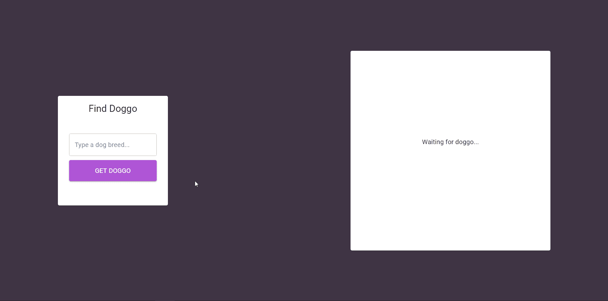

# React 功能组件:用 Redux 和 Hooks 管理状态

> 原文：<https://levelup.gitconnected.com/react-functional-components-managing-state-with-redux-and-hooks-a372b1a77514>

## 如何管理状态并通过 React 挂钩使用 Redux 存储


由 [Ferenc Almasi](https://unsplash.com/@flowforfrank?utm_source=unsplash&utm_medium=referral&utm_content=creditCopyText) 在 [Unsplash](https://unsplash.com/s/photos/react?utm_source=unsplash&utm_medium=referral&utm_content=creditCopyText) 上拍摄的照片

本文是我上一篇文章[如何用 TypeScript、Redux 和 Material-UI](/how-to-setup-a-react-spa-with-typescript-redux-and-material-ui-99a1e1ec7d54) 设置 React SPA 的第 2 部分。如果您还没有阅读，我建议您先阅读一下，因为这里显示的一些代码将在这里展开。这篇文章的所有代码都可以在 GitHub Repo 上找到。

在这个项目中，我们将创建一个包含两个主要组件的简单页面，并让它们通过 Redux Store 进行交互。对于本项目，我们将使用:

*   反应
*   反应路由器
*   以打字打的文件
*   材料-用户界面
*   Redux
*   还原-Thunk

在本系列的第一部分中，我们用这些工具为 React 应用程序创建了一个基本的启动环境。现在，下面是我们要编写的代码:

*   一个带有输入的卡片组件，输入的是狗的品种名称，还有一个确认按钮
*   另一个组件将向公众发出 GET 请求 [Dog API](https://dog.ceo/dog-api/)
*   该组件将显示该特定品种的狗的随机图像

我们需要做的第一件事是改变我们的`theme.tsx`,让我们的应用更符合我们的喜好:

这为应用程序定义了几个样式变量:`primary`、`secondary`、`error`和`background`颜色。这些变量现在可以被我们项目中任何地方的任何组件访问，您很快就会看到。

下一步是定义我们的**行动**。

# 行动

让我们来分析一下这里发生了什么:

*   我们首先定义可以发生在 redux store 上的**类型**，它们是`RANDOM_DOG`、`LOAD_DOG`和`ERROR`
*   接下来，我们使用 TypeScript 接口定义每个操作应该返回什么。注意，所有动作都必须有`type`属性。
*   在`RandomDogAction`动作中，我们使用 Redux-Thunk。这允许我们延迟动作的`dispatch`调用，直到我们对狗 API 的`fetch()`请求完成。需要注意的重要一点是，默认情况下`fetch()`不处理 HTTP 请求错误，所以我们需要通过检查响应状态来自己处理。
*   `LoadDogAction`动作更简单，因为我们只是立即返回`dispatch`调用，只考虑`shouldLoad`参数是真还是假。
*   `ErrorAction`动作甚至更简单，简单到我们都懒得用 ActionCreator 来包装它。它只在`RandomDogAction`动作的`catch`方法上被调用。

接下来要做的就是更新我们的`dogReducer`。

# 还原剂

在`dogReducer`文件中，我们首先定义商店在`IDogState`界面中的样子。我们接着在`initialDogState`对象中设置**初始状态**。

然后，我们定义缩减器本身，为我们的每个`DogActionTypes`命名`switch`用例。每个案例都将返回适当的有效载荷来更新我们的组件。

设置好我们的操作和减少器后，现在让我们更新我们的`store.ts`文件:

这样，我们就完成了 Redux。现在是时候创建我们的功能组件了。

# 简单卡组件

让我们一步一步地分解它。

*   首先，我们用 Material-UI 提供的`makeStyles()`函数设置我们的样式。
*   让我们在组件上使用我们的类。
*   `const dispatch = useDispatch()`通过`useDispatch()`钩子定义我们组件的`dispatch`功能。每当我们想要调度一个动作时，我们将使用这个函数。
*   `const [dogName, setDogName]= useState('')`为我们的功能组件的**内部状态**设置一个名为`dogName`的道具，并定义钩子`setDogName()`。我们使用这个挂钩是因为在商店里拿着`dogName`道具毫无意义，因为它不会在其他任何地方使用。当我们想要更新狗名道具时，我们调用`SetDogName('new value for dogName')`。在我们的例子中，我们将`DogName`绑定到`<TextField>`组件的`onChange`事件。
*   `const isLoading = useSelector((state: IAppState) => state.dogState.loading`使用`useSelector()`挂钩访问 redux 商店中的`loading`道具。这将允许两个组件在 API 请求仍在进行时做一些事情。b

```
const getDog = () => { dispatch(loadDogAction(true)); dispatch(RandomDogAction(dogName));}
```

这个小函数在我们的按钮被点击时被调用。我们之前定义的`dispatch()`函数在这里用来告诉我们的应用程序应该执行`LoadDogAction()`和`RandomDogAction()`动作。

# `The DogCard`组件

像前面的组件一样，我们利用`useSelector()`和`useDispatch()`钩子来分别监视某些商店道具和更新商店道具。需要注意的一点是，我们等待``元素的`onLoad`事件触发`dispatch()`调用，告诉我们的应用程序图像已经加载完毕。

对于这个项目，我们不需要使用`useEffect()`吊钩。但是，您应该仔细阅读 React 文档，了解这个钩子，因为它提供了一种访问大多数常见 React 生命周期方法的好方法。

# 收尾

组件完成后，我们现在需要做的就是创建一个**哑组件**，作为放置组件的表示页面。因此，创建一个`pages`文件夹，让我们创建`my-app/src/pages/HomePage.tsx`文件:

准备好`HomePage.tsx`文件后，我们可以在`App.tsx`文件中设置一个**路径**。毕竟这是一个温泉浴场。

我们完了。让我们来看看我们的应用程序:



它还活着！

现在，我们已经成功地创建了两个功能组件，它们可以使用 React 钩子与 redux store 进行交互。

# 后续步骤

*   设计。我们将深入研究 Material-UI 的功能，并为我们的应用程序创建一个漂亮的、反应灵敏的设计。
*   后端。为什么不扩展一下我们的小 app，让它和我们自己的 node.js Rest API 有一些互动呢？

我希望这篇文章对您有所帮助，请继续关注第 3 部分，在那里我们将触及上述主题。