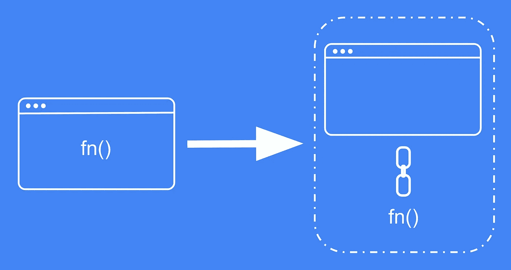

# 反应函数式编程:优雅地将视图与逻辑分离

> 原文：<https://levelup.gitconnected.com/react-functional-programming-separate-view-from-logic-gracefully-5280333676e1>

将视图与其逻辑分离

视图及其逻辑是组件的构建块。他们一起工作，必须共存。然而，混合这些代码会导致不必要的责任委派。

我们如何将它们分开，同时又能让它们一起工作？React 有 API 可以帮助我们吗？

我们将在这篇博客中回答这样的问题。

# 问题:从 JSX 分离钩子

我们举个例子。

BlogPage.tsx

**BlogPage** 组件是逻辑和视图结合的地方。正如我们所看到的，来自钩子的数据被传递给博客列表。但是这种执行和传递的责任应该由**博客**组件承担吗？

我觉得不是！

它应该属于自定义组件吗？

BlogPage.tsx(已重构)

BlogsList.tsx

太好了！我们解决了防止不必要的责任委派的问题。

然而！我们又回到了起点。

*   它把观点和逻辑结合起来。
*   重用卡组件时的代码冗余。
    例如:如果您想在 **BlogPage** 上添加另一个名为 **AuthorsList** 的列表，并使用来自不同 API 的数据呈现相同的列表，该怎么办？你必须用另一个钩子重复 JSX 样板。

没想到会这样！？

经典的先有鸡还是先有蛋的情况，不是吗？

那么我们能不能把它们进一步分开，把钩子从组件里移出来？

让我们来了解一下！

# 解决方案:自定义特设

我们使用一个特设来组合视图和它的逻辑，而不需要额外的组件，怎么样？

下面的 HOC 实现返回一个组件，该组件带有用 props 映射的钩子的结果。

wihtHookProps.tsx

最终的组件是可定制的，可以接受额外的道具。您也可以自定义“显示名称”。

现在，新的逻辑实现如下:

BlogsList.tsx

差不多就是这样

# 结论

创建和使用这样的特设可以是一种选择。它可能是增长代码库的合适解决方案。这是简化组件责任的方法之一。此外，它减少了一些样板文件，提高了可维护性。我希望这对你的用例有所帮助。

觉得有意思？请在评论区告诉我。

编码快乐！

Stackoverflow 工作板是一个神话！LOL。