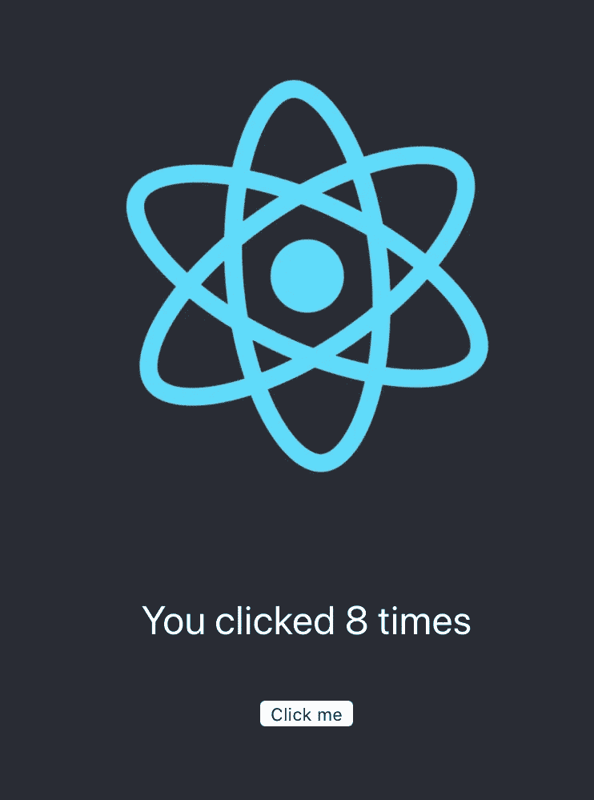
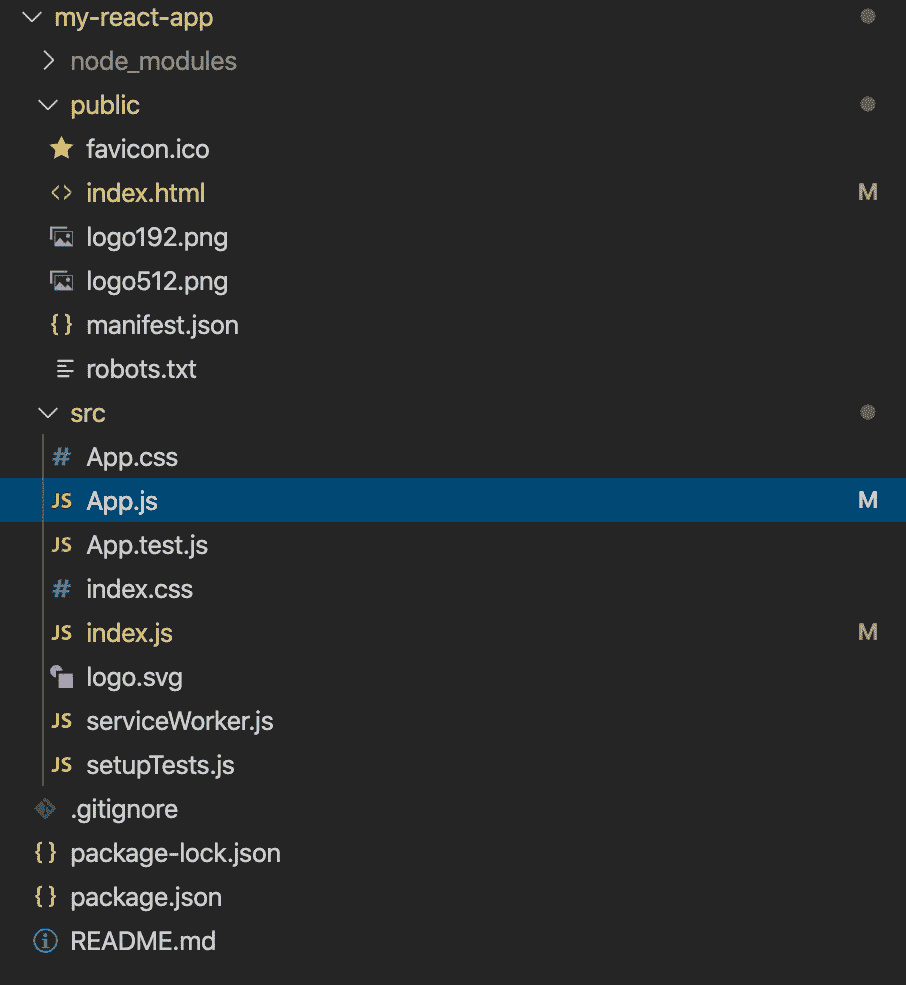

# react“Hello World”计数器(带详细解释)

> 原文：<https://levelup.gitconnected.com/react-hello-world-counter-for-beginners-with-detailed-explanations-b996034e054a>



我们将建立这个“点击我”的东西作为我们的“你好世界”教程

朋友们好，我最近决定开始学习 React(尝试)实现我毕生的梦想，即如何创建一个集成 ArtXTech 的平台。看似毫无关联，我知道。但是我的全球统治计划是这样的:学习反应->平台编码->全球统治(？).

所以…是的，第一步是学习如何在 React 中编写类似“hello world”的代码。

让我们开始吧。

设置然后使用 React 非常简单。他们的官方文件对事物的运作方式提供了相当详尽的解释。然而，我仍然想写这个教程，因为我必须问我的朋友几个问题，并浏览几个(好吧，更像是一个(但它是一个 [5 小时长的视频](https://www.youtube.com/watch?v=DLX62G4lc44))YouTube 视频，以弄清楚事情实际上是如何工作的。

## 最快的方法

最快的开始方式是:

```
Step 1: Add a DOM Container to the HTML
Step 2: Add the Script Tags
Step 3: Create a React Component
```

现在我直接从他们的网站上下载了这个，你可以参考[这一页](https://reactjs.org/docs/add-react-to-a-website.html)来快速简单地开始使用 React。我不会对此做进一步的阐述，因为这不是本文的重点。

## 使用工具链— [创建 React 应用程序](https://reactjs.org/docs/create-a-new-react-app.html#create-react-app)

第[页](https://reactjs.org/docs/create-a-new-react-app.html)概述了如何使用一些最流行的工具链来获得更好的用户和开发者体验。在本教程中，我将讨论 Create React 应用程序 one，并解释在创建的文件目录中的一些重要文件。假设您的机器上已经有了 [Node > = 8.10 和 npm > = 5.6](https://nodejs.org/en/) ，您可以运行这个来创建一个项目:

```
npx create-react-app my-react-app
cd my-react-app
npm start
```

my-react-app 只是您希望这个目录被称为的任何名称。我把我的叫做 my-react-app，但是你可以把它叫做 my-app 或者任何你想要的东西，只要它里面没有大写字母，因为——[这个原因](https://github.com/npm/npm/issues/3914#issuecomment-24878907)。

因此，无论您的“my-react-app”位于哪个目录，您都应该看到这样的项目结构:



运行上述命令后生成的目录

这里有三个文件非常重要(我的意思是，其他文件也很重要，但就像我们将要讨论的三个文件一样，对于理解如何进行更改非常重要)，它们是——****app . js******index . js***。如果你和我一样(在此之前，我大多只涉猎了普通的 js、HTML 和 css)，你会直接进入 HTML 文件，就像… **w0t** 为什么我们运行 [http://localhost:3000/](http://localhost:3000/) 时显示的内容与 index.html 中的内容如此不同？？*

*这是因为，在评论中(我决定不看，直到我的导师提醒我)，他们写道:*

```
*The build step will place the bundled scripts into the <body> tag.*
```

*基本上，当你运行`npm run build`(或者另一个命令)时，它会将 JSX 和其他代码转换成一个最终的包(可能通过一个叫做 webpack 的东西)，然后它会将脚本标签注入 html 文件(这是一个模板，而不是最终的 HTML 文件)。通过这种方式，您可以使用 JSX 和更新的 JS 特性(甚至是编译成 JS 的其他语言)，并应用其他构建步骤，例如缩小代码(这样它就不可读且更小)。所以你真正需要关心的一件事是(请不要恨我):*

```
*<div id="root"></div>*
```

*因为你的组件会进到*

*里面。

继续，让我们看看我们的 ***App.js 和 index.js.*** 对事情应该如何工作的高级解释是——你将 App 渲染到根，然后一切都是 App 的子。

在 index.js 中，您会看到这一行:

```
ReactDOM.render( <React.StrictMode> <App /> </React.StrictMode>, document.getElementById("root"));
```

这基本上是将 App 渲染到“root”，而“root”就是我们在上面(在 index.html 中)提到的内容。

最后说一下我们的 App.js。

在 App.js 中，我们有这样一行

```
export default App;
```

因此，我们可以从“”导入应用程序。/App "；Export default 用于导出单个类、函数或原语。把这当成是你需要写的东西，让 index.js“找到并使用”App。

在 App.js 中，尝试编辑

标签中的内容，并观察您的更改在本地主机中得到更新。

# **Hello World 练习**

我们通常在 React 中做的是，我们可以在 App.js 中使用它们来创建子组件。让我们尝试在 src 目录下创建一个名为“Example.js”的子组件。在 Example.js 中，添加以下几行:

示例. js

这个示例函数取自[这里的](https://reactjs.org/docs/hooks-intro.html)。useState 基本上是一个钩子，是 React 16.8 中新引入的，所以我们可以只写函数而不写类(这是他们推荐的，因为“从概念上讲，React 组件一直更接近函数。钩子包含功能，但不牺牲 React 的实用精神。).还有很多要谈的，但让我们回到我们的练习。

但是这个示例函数的作用是，当你点击“点击我”按钮时，它是一个不断增加的计数器。因此，为了确保我们的 App.js“知道”我们的“Example.js”脚本中的示例函数，请记住添加“import Example from”。/Example“；”在我们的 App.js 脚本中，如下所示:

App.js

参照上面的台词，<example>相当于 <example></example> 。因此，如果您检查您的本地主机(如果没有检查，则运行 npm start)，您将看到更新的更改:</example>


今天到此为止！我知道这本身并不完全是一个“hello world”教程，但是我希望我已经使它易于理解。<

快乐反应！:)*