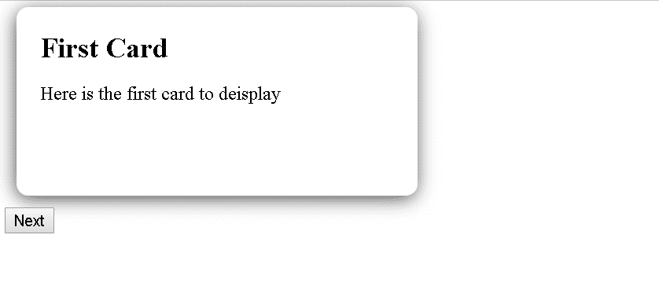
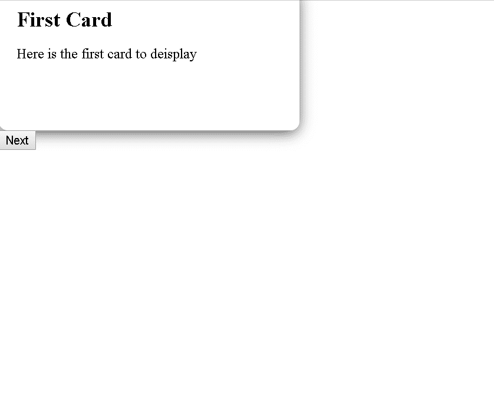
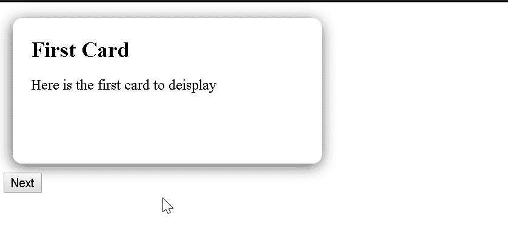

# 反应钩子和动画

> 原文：<https://levelup.gitconnected.com/react-hooks-and-animations-9bd4bd2a7f3a>

克里斯托夫·高尔在 [Unsplash](https://unsplash.com/s/photos/computer?utm_source=unsplash&utm_medium=referral&utm_content=creditCopyText) 上拍摄的照片

在这篇文章中，我们将通过构建一个基于函数的 React 组件，利用钩子创建一个可重用的组件来简化过渡动画。在这篇文章的最后，我们将有一个基本的组件，它将显示子对象变化的幻灯片过渡，如下所示:

完成动画组件的目标

我们将经历基本的应用程序设置和构建该组件的迭代过程；但是，如果您想跳到最终结果，请点击[这里](https://justsome.codes/simplifying-react-animations-with-hooks/#completed-component)。

# 基本应用程序

首先，让我们定义一个基本的 React 应用程序，它显示一张卡片，并允许用户通过单击 next 按钮来循环显示可用的卡片。

这个应用程序示例有两个基本组件，一个显示标题和文本的卡片，以及一个处理各个卡片的显示并基于按钮点击处理到下一个卡片的导航的容器。

基本应用程序

现在我们有了这个基本的应用程序示例，让我们看看它是什么样子的。

基本应用程序的代码

# 动画的目标

这个动画应该将下一张卡片从右手边滑到合适的位置，并将旧卡片滑到左边。虽然这是一个相当简单的动画，但我们希望对主要组件的改动尽可能小。为了做到这一点，并使逻辑模块化，这个实现将使用一个定制的钩子来处理渲染和动画控制。现在我们对这个钩子的目标有了一个基本的概念，让我们开始吧。

# 基本反应组件挂钩设计

为了正常工作，让我们首先创建一个基本的 react 组件，它将成为我们的动画容器。最基本的是，这将返回一个包含传递给它的子元素的 div。

基本动画组件

实现时，每次按下按钮，react 组件都会将下一张卡片发送到 AnimationContainer，它将呈现包含该卡片的基本 div。现在我们有了一个基本的容器，我们需要这个动画容器的内容在子变化时被动画化，这就是我们的定制钩子的用武之地。让我们快速概述一下这个钩子将做什么，以及什么时候需要动画。

*   动画将在传递给动画容器的子项发生变化时触发
*   动画过程需要显示先前的元素和新的元素
*   在动画周期完成后，我们需要从显示中完全删除之前的元素。

现在我们有了基本的需求，让我们开始编写和实现钩子。

连接定制挂钩

这个钩子现在监听子元素的变化，并将这个新项添加到所有过去项的数组中。我们的行为现在看起来像这样。

完成动画组件的第一步

此时，我们正确地监听了子变更事件，并显示了不止一个子元素，而没有对我们的核心组件进行任何更改。现在我们需要触发动画，并在动画完成后进行清理。

让我们从样式和动画开始。为这种情况制作过渡动画需要两个基本类和一个动画关键帧定义。让我们从让容器将卡片并排显示开始。

初始动画容器样式

接下来，我们需要为我们的前一个/离开元素添加 or 类和关键帧动画。

添加关键帧动画

现在，让我们更新我们的挂钩，以包括以下内容:

*   指定我们的新 css 类来制作前一个元素的动画
*   将动画结束事件添加到前一个元素
*   前一个元素动画完成后，从渲染中移除该项目

将动画逻辑添加到动画组件

有了这些基本的更新，我们开始得到一个平滑的动画，看起来像这样。

动画工作，但需要一些平滑

这看起来好多了，但是我们仍然可以向新元素添加一些额外的动画关键帧属性，以使入口动画更加平滑。

添加淡入关键帧

现在我们已经定义了淡入动画，让我们更新钩子以在新的项目中使用它。

向动画组件添加淡入动画

现在这两个元素都是动画了，让我们再来看看我们的过渡。

看起来更好，但动画需要更多的平滑

我们现在看到的一些问题，与入境元素削减和削减一些。此问题最可能的原因是由于 React 元素协调。基本上，在删除旧元素的渲染周期完成时，react 认为要显示的新数组与之前渲染的帧没有直接关联，这导致不必要的 DOM 元素卸载和安装，而不仅仅是更新项目。我们可以通过使用 React **key** 属性让 react now 元素关系来解决这个问题。为此，让我们首先在主组件中为每张卡添加一个键属性。

向基本组件添加键属性

接下来，我们需要更新钩子以确保我们的组件结构在渲染周期之间不会改变，并且我们基于这个卡键在每个动画 div 上实现一个键。

向动画组件添加其他关键属性

我们现在有了一个完整的幻灯片动画组件，可以处理变化之间的幻灯片过渡。你可以在 [Github repo](https://github.com/StMotorSpark/Hooks-Animation-Container) 下面的 Codepen 中看到示例动画和完整代码。

完整的动画

成品密码笔

*原载于 2019 年 12 月 22 日*[*https://just some . codes*](https://justsome.codes/simplifying-react-animations-with-hooks/)*。*