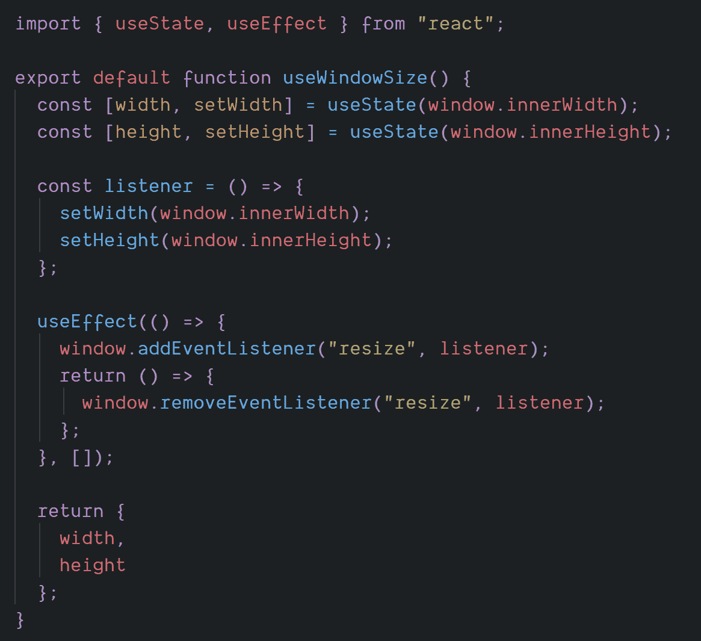

# 在 5 分钟内解释 React Hooks

> 原文：<https://levelup.gitconnected.com/react-hooks-cheat-sheet-part-1-ed02dd90be5a>

快速简单的挂钩指南


# 钩子是什么？

*   “挂钩”React 特性的功能
*   只能在函数组件中使用
*   您可以使用内置挂钩，也可以创建自己的挂钩

# 为什么要引入钩子？

## 不能在组件之间重用有状态逻辑

你可能对试图解决这个问题的渲染道具和 hoc 之类的模式很熟悉。

但是这些模式要求您重构组件

> 钩子允许你在不改变组件层次结构的情况下重用有状态逻辑。

## 生命周期很奇怪

相关的代码被分割开来，但是完全不相关的代码最终组合成一个生命周期方法

> 钩子可以让你把不相关的部分分开，把相关的部分组合在一个函数中

## 上课并不酷

*   代码太多，讨厌！
*   必须绑定事件处理程序
*   必须了解“这”是如何工作的

# React 中的内置挂钩

# 使用状态

## 它的作用

*   在组件中添加状态
*   在组件的重新呈现过程中保持状态

## 句法

```
const [ **value** , **function** ] = useState( initialValue );const [ count , setCount ] = useState( 0 );
```

useState 的唯一参数是初始状态值。

它返回一个包含两件事的数组:一个**值**和一个改变值的**函数。数组析构通常用于获取对。**

该函数类似于类组件中的 **this.setState()** ，只是它不合并新旧状态。它取而代之。

```
setCount(1)
```

## 更大的

您可以在一个组件中多次使用同一个钩子。

```
const [ name, setName ] = useState( null );const [ age, setAge ] = useState( null );setName( 'Rick' );setAge( 60 );
```

您的状态也可以是一个对象，但是如果您只想更改其中的某些属性，您必须手动合并它们。

```
const [ person, setPerson ] = useState( { name : null , age : null } );setPerson({ ...person, name : ‘Manan’ })
```

因此，如果您希望更改整个对象，而不仅仅是它的某些属性，建议只使用一个对象

# 使用效果

## 什么是“效果”？

我们将类似数据获取、订阅或手动更改 DOM 的操作称为“副作用”或“效果”，因为它会影响其他组件，并且在呈现期间无法完成。

有两种效果:

*   **那些不需要清理的**:网络请求、手动 DOM 突变、日志记录等
*   **那些确实需要清理的:**订阅外部数据

**什么是 useEffect** ？

> useEffect 是 componentDidMount，componentDidUpdate 和 componentWillUnmount 全部统一成一个 API。

## 句法

```
useEffect( () => { } );
```

*   useEffect 增加了从功能组件执行副作用的能力。
*   useEffect 将一个函数作为参数，称为'**效果**'
*   该效果可以访问属性和状态，因为它位于功能组件内部

## 清理功能

您可以选择通过返回一个函数来指定清理函数

```
useEffect(() => {// effectreturn **() => {}**   // clean up});
```

一个清理函数叫做-

*   当**组件卸下**时
*   在**重新运行**之前，由于另一个渲染，使用效果。

**更多**

在一个组件中可以使用多个 useEffect 挂钩。

```
useEffect(**effect1**)useEffect(**effect2**)
```

钩子可以让你把相关的东西组合成一个效果来组织副作用。

> 默认情况下，React 会在每次渲染后运行效果

> 等等，什么？它在每次渲染后运行效果？如果我不想在每次渲染后都运行它呢？

## 使用依赖关系优化效果

在某些情况下，在每次渲染后应用效果或清理可能会产生性能问题。useEffect 为此提供了内置功能，非正式地称为**依赖关系**

你可以告诉 React to *skip* 应用一个效果，如果某些值在重新渲染之间没有改变，来自道具、状态等的值。为此，**将一个数组作为可选的第二个参数传递给 useEffect** :

```
useEffect( effect, **[ value1, value2 ]** )
```

*   只有当数组中的任何一个值改变时，效果才会被应用
*   如果你使用这个优化，**确保数组包含了效果使用的所有值。**否则，效果将保持使用旧值。

## 仅运行一次效果

如果您希望只运行一次效果，即效果在装载时运行，而可选的清理功能在卸载时运行，则只运行一次。您可以**传递一个空数组[]作为第二个参数。**

```
useEffect( effect, **[ ]** )
```

这不是一个黑客或一些特殊情况下的使用效果。这只是告诉 React 你的效果不依赖于道具或状态的任何值，所以它不需要重新运行。

## 避免这些错误！

如果一个效果调用一个函数，在效果中定义它，然后添加该函数使用的值作为效果的依赖项

**这是错误的**

*   效果调用 foo
*   foo 是在效果之外定义的
*   foo 依赖于 x
*   x 不添加到依赖项中

```
foo() { // depends on x }useEffect( () => { 
  foo()
}, [] )
```

**这是对的**

*   效果调用 foo
*   foo 在 effect 内部定义
*   foo 依赖于 x
*   x 被添加到依赖关系中

```
useEffect( () => {
  foo() { // depends on x }
  foo()
}, [x] )
```

# 如果您不能在效果中移动功能

## 如果该函数没有依赖性

将函数移到函数组件之外，这样可以保证它没有使用任何属性或状态，因此它不需要在依赖列表中

```
foo() { }   // outside componentconst Comp = () => {
  useEffect( () => {
    foo()
  }, [] )return … }
```

## 如果该函数具有依赖性

如果您调用的函数是纯计算的，并且在渲染时调用是安全的，那么您可以在效果之外调用它，并在依赖项中添加返回值。

```
const Comp = () => {
  const **x = foo()**
  useEffect( () => {}, **[x]** )
  return …
}
```

## 最后一个选择

作为最后一招，如果以上都不适合你，就把函数添加到依赖项中。将其定义包装在 useCallback 挂钩中，并将其依赖项作为 useCallBack 的第二个参数。

```
foo = **useCallBack**( () => {}, [x] )useEffect( () => { foo() }, [foo] )
```

这样保证了效果只在 x 变化时运行，因为效果依赖于 foo，foo 依赖于 x。

# 钩子的规则

**只调用顶层的钩子**

不要在循环、条件或嵌套函数中调用钩子。这确保了每次组件呈现时钩子都以相同的顺序被调用，这是钩子工作所必需的。

**不要在正常函数中调用钩子**

*   从 React 函数组件调用钩子。
*   从自定义挂钩调用挂钩

使用 eslint-plugin-react-hooks 来执行这两条规则。

# 构建自定义挂钩

**自定义挂钩**

*   名称以“use”开头的函数
*   它可能会调用其他钩子
*   没有具体的签名
*   参数和返回值可以是任何东西

# 例子

## 使用窗口大小

返回一个包含窗口宽度和高度的对象

