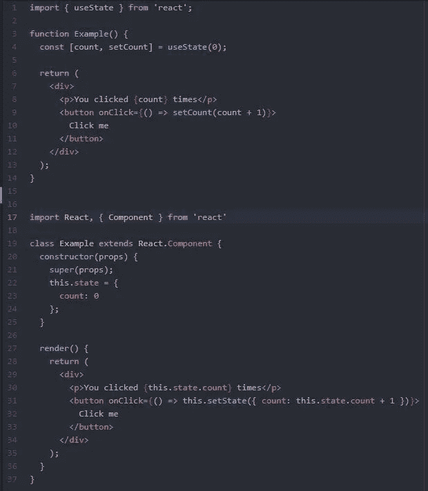
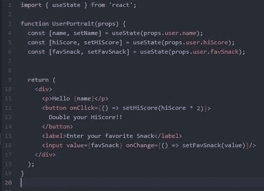
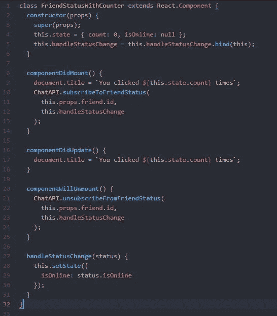
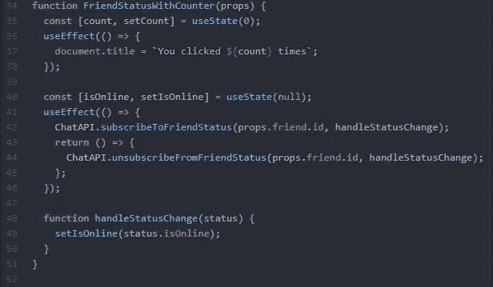
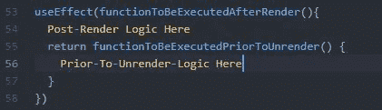

# React Hooks:初级开发人员的悬崖笔记

> 原文：<https://levelup.gitconnected.com/react-hooks-cliff-notes-for-the-junior-dev-c2027aaf58cc>

[React Hooks](https://reactjs.org/docs/hooks-intro.html) 是一个令人兴奋的功能，目前正在开发中，旨在减少开发和使用 React 应用程序所需的编码、规划和计算开销。

React 团队声称，他们对这种实现的意图包括将与组件的某些特性相关的所有逻辑聚集到一个地方，减少开发人员和浏览器对 Javascript 类的依赖，并简化开发人员在创建新组件或重组组件树时必须考虑的许多问题。

即使作为一名初级开发人员，我也曾多次不确定一个组件应该是功能组件还是类组件，即“无状态”还是“有状态”。设计一个功能组件，并需要实现一个需要状态的特性，这需要对整个类进行返工:这在开发时间上是一个巨大的损失。这就是为什么钩子值得庆祝的原因。对于门外汉来说，为了使我自己的理解具体化，我将把 Hooks 的提议浓缩成一个简短的总结:它们是什么，它们将如何使用，它们在类组件中的类似功能，以及它们对 React 未来的影响。

简单地说，钩子是 React API 的一个扩展，它允许一个功能组件(以前称为“无状态”组件)设置和使用状态。好消息是它的使用非常类似于类组件当前拥有的状态。如果您已经是一名熟练的 React 开发人员，那么在弄清楚如何使用它们方面不会有任何问题。下面是使用钩子(上)和使用类(下)制作的基本点击计数器组件的比较:

带挂钩的功能型(顶部)、“传统”型(底部)

请注意不同之处:

*   使用数组析构在顶部声明一个常数。使用数组析构并不是强制性的，但是它使数组看起来更清晰，更容易阅读和理解。格式是这样的: *const [stateVar，setStateVar]= setState(stateVarInitialValue)。这实际上等同于在类组件定义的顶部设置状态，或者在如下所示的构造函数中设置状态。它使用初始状态值运行一次，并可随时使用`setStateVar`功能进行修改。*
*   状态被不同地修改:功能组件使用`setStateVar`并为`stateVar`传入新值，而类组件使用`setState`，它接受一个对象并将其与当前状态合并。
*   组件内部的状态变量有不同的引用方式。由于如上所述的数组析构，功能组件中的状态变量可以简单地通过它们的名称来引用。在类组件中，同一个变量叫做`this.state.stateVar`，现在看起来相当笨拙。
*   你必须`import { useState } from ‘react’`才能使用“useState”钩子。

useState 挂钩允许功能组件“挂钩”到 React 的魔法中。请注意，虽然一个类中只出现一个“状态构造函数”，但是在一个功能组件定义中，您可以在一行中多次使用 *const [stateVar，setState var]= setState(stateVarInitialValue)*。

使用多个状态值和设置状态

另一个重要的钩子是 useEffect 钩子，它试图取代生命周期方法。它作为一种“一体化”的生命周期方法——当一个组件被装载、更新或卸载时,“效果”就会出现，这取决于您如何编写它。比较将再次显示其优势。下面是一个类组件，在这个组件被安装和卸载的过程中会发生一些事情。

注意，三种生命周期方法中有两个关注点:文档标题分配，以及与 API 的交互。这很烦人，因为与这些关注点之一相关的 bug 必须在代码的许多不同部分进行调查，并且使关注点的“添加”和“取消添加”发生可能需要一些人为的努力。此外，`componentDidMount`和`componentWillUnmount`函数经常在很多方面相互镜像。如果我们能像这样把我们的关注点分开，事情会变得更简单明了:

`useEffect`挂钩是`componentDidMount`、`componentDidUpdate`、`componentWillUnmount`三位一体！更好的是，我们可以在一个功能组件定义中多次调用它，允许我们分离特定的关注点，它们将由 React 放在一起。你可以看到我们所有的“计数”状态赋值和效果都彼此接近，而在线状态也是如此。

语法看起来令人困惑，但可以简单地分解，它允许我们推断一些关于 useEffect 钩子如何工作的基本规则。它是这样工作的:

useEffect 是一个函数，它在组件呈现后的每次更新时被调用。它将其参数发送到 ReactLand，以便在渲染完成时保存。我们必须为 useEffect 提供的参数是一个函数，这个函数是渲染发生后调用的实际函数。useEffect 参数的可选返回值是在组件卸载或取消呈现之前调用的*。在这里，我们将取消对状态的订阅，删除组件安装中设置的时间间隔，以及我们必须做的任何其他常规清理。同样，这很方便，因为“卸载”函数接近“装载”函数，但是它们也存在于彼此相同的词法范围内。*

**两条规则**

1.  你必须只在顶层调用钩子。
2.  您只能在 React 功能组件中调用钩子，除非您在自定义钩子中，我选择不讨论这一点。

**总结**

钩子实现后的所有组件都可以写成函数，这些函数可以使用钩子来访问状态和生命周期事件。

状态变量是单独赋值的，而不是在单个对象中，语法为 *const [stateVar，setStateVar]= setState(stateVarInitialValue)。*

一个单一的生命周期方法来管理它们，useEffect，作为放置逻辑的地方，该逻辑在组件呈现之后或取消呈现之前执行。useEffect 是这样使用的:

像 useState 一样，useEffect 可能会在一个功能组件中被调用多次，所有的效果都会被连接起来。

 [## 学习 React -最佳 React 教程(2019) | gitconnected

### 前 45 名 React 教程。课程由开发人员提交并投票，使您能够找到最好的 React 课程…

gitconnected.com](https://gitconnected.com/learn/react)