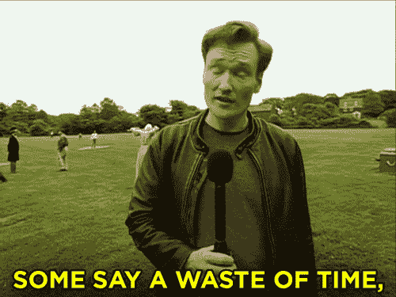

# React 钩子捕获:异步使用效果中的 setState

> 原文：<https://levelup.gitconnected.com/react-hooks-gotchas-setstate-in-async-effects-d2fd84b02305>

## 🧶

> 更新:这篇文章中提到的问题将在 React v18 中解决:[https://github.com/reactwg/react-18/discussions/21](https://github.com/reactwg/react-18/discussions/21)

面对现实吧，胡克已经游荡了一段时间了。然而我感觉每天都在发现新的东西*。今天，我想分享一个新的发现，因为它远非显而易见——至少可以这么说！*

**

*所以你认为你精通钩子…？*

# *小回顾:异步效果*

*异步效果是一种调用承诺并基于该承诺设置某种状态的效果。*

# *以获取用户为例*

## *第一种方法*

## *问题是*

**

*问题，什么问题？*

*使用这种方法，`<App />`组件将渲染 4 次:*

*   *渲染 1:初始挂载*
*   *渲染 2:`useEffect()`中的`setPending(true)`导致第二次渲染*
*   *渲染 3:`fetchUser().then()`中的`setPending(false)`*
*   *渲染 4:`fetchUser().then()`中的`setUser(fetchedUser)`*

*问题是:在`fetchedUser().then()`中，我们触发了两个`setState`，而不是像预期的那样有一个渲染，而是每个 `**setState**` **调用**都有一个渲染。*

> ***重要提示**:这种情况只发生在*异步动作的*(又名`useEffect`中的承诺)。当`useEffect()`没有触发任何异步动作时，`setState`被正确批处理。*

## *解决方案是:将状态组合在一起*

*为了减少渲染的数量，我们必须减少异步效果中的`setState`调用。一种解决方案是将逻辑上相互关联的状态分组。这里，`pending`和`user`状态。*

*现在好了，我们将有我们的 3 个预期的渲染。*

# *更进一步*

## *抽象定制钩子中的逻辑*

*让我们创建一个`usePromiseEffect`钩子*

*让我们在我们的`<App />`组件中使用它:*

*但是，等等，这是一个很大的变化…*

**

## *好吧，但所有这些都是为了保存… 1 渲染？！*

*在这个例子中，是的。但是在现实生活中，你经常会遇到更复杂的例子。通常，在初始化表单之前，你需要获取一大堆数据，在这里你可以保存大量的渲染。*

*综上所述，请记住，你的效果应该尽可能少地承担[责任](https://blog.cleancoder.com/uncle-bob/2014/05/08/SingleReponsibilityPrinciple.html)。*

*并且在编写自己的效果风格钩子时要记住这个问题。
现在代码安全🧑‍💻，四处看看😇*

*这里是 [codesandbox](https://codesandbox.io/s/async-use-state-disparities-demo-mk26n) 的完整演示，你可以用它玩 un⋅commenting 出来的特效等等……干杯！*

*玩得开心🤓*