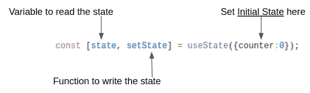
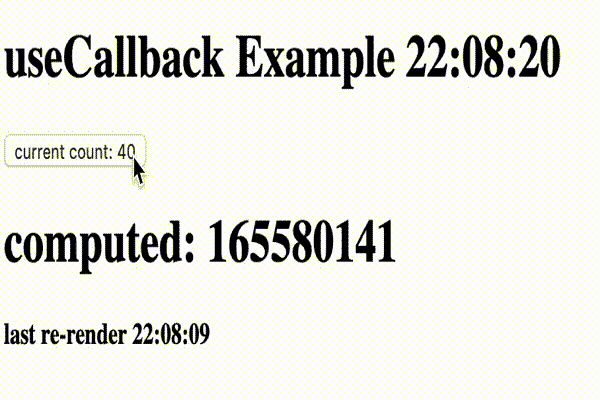
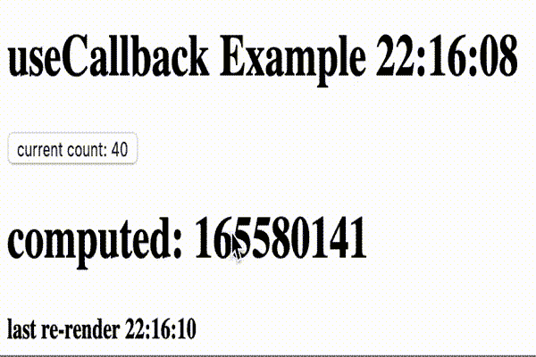
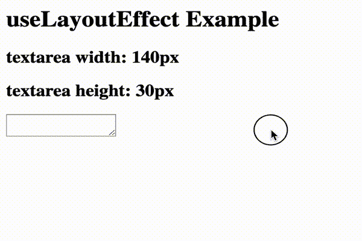

# 20 分钟后反应钩子

> 原文：<https://levelup.gitconnected.com/react-hooks-in-depth-eb0bed232c8e>

*钩子*是 React 16.8 中新增的。它们允许您使用状态和其他 React 特性，而无需编写类组件。


让我们在本文中深入探讨它们。

# 什么是钩子？

挂钩是让您从功能组件“挂钩”React 状态和生命周期特性的功能。钩子在类内部不起作用——它们让你在没有类的情况下使用 React。事实上，它们只能用于功能组件。

# 钩子背后的动机是什么？

*   很难在组件之间重用有状态逻辑。**钩子允许你在不改变组件层次的情况下重用有状态逻辑。**
*   复杂的组件变得难以理解。**钩子允许你根据相关的部分将一个组件分割成更小的功能(比如设置订阅或者获取数据)**，而不是根据生命周期方法强制分割。
*   类混淆了人和机器。**钩子让你不用类就能使用更多的 React 特性。**

钩子是 JavaScript 函数，但是它们强加了两个额外的规则:

*   只调用顶层的钩子**。不要在循环、条件或嵌套函数中调用钩子。**
*   仅从 React 函数组件调用钩子**。不要从常规的 JavaScript 函数或类组件中调用钩子。(只有一个地方可以调用钩子——你自己的定制钩子。稍后将详细介绍。)**

在我看来，以下 4 个 React 挂钩可以覆盖 99%的用例:

*   📌状态挂钩— `useState`
*   ⚡️效应挂钩— `useEffect`
*   ⭕️上下文挂钩— `useContext`
*   ☝️Ref 胡克— `useRef`

我将这些归类为深度挂钩:

*   `useReducer`
*   `useMemo` —性能优化
*   `useCallback` —性能优化
*   `useLayoutEffect`
*   `useImperativeHandle`


# 📌状态挂钩—使用状态

允许我们使我们的组件有状态。我们在函数组件内部调用它，为它添加一些本地状态。



以前使用状态需要使用类组件，而钩子给了我们只使用函数来编写状态的能力。它允许我们拥有更灵活的组件。

React 将在重新渲染之间保持这种状态。

*   `useState`钩子通过在新的 every 渲染中被馈送最新状态来维持状态。
*   `useState`返回一个元组对:*当前*状态值和一个让您更新状态的函数。
*   传递给`useState`的唯一参数是初始状态。与`this.state`不同，这里的状态不必是一个对象——尽管如果你愿意，它可以是。初始状态参数仅在第一次渲染时使用。
*   在一个函数中，你可以有尽可能多的钩子；所以多种状态都有自己的更新函数。


`useState`的例子——当你点击按钮时，它增加数值:

```
import React, { useState } from 'react';function Example() {
  // Declare a new state variable, which we'll call "count"
  const [count, setCount] = useState(0); return (
    <div>
      <p>You clicked {count} times</p>
      <button onClick={() => setCount(count + 1)}>
        Click me
      </button>
    </div>
  );
}
```

等价类示例—如果您以前使用过 React 类，这段代码应该看起来很熟悉:

```
class Example extends React.Component {
  constructor(props) {
    super(props);
    this.state = {
      count: 0
    };
  } render() {
    return (
      <div>
        <p>You clicked {this.state.count} times</p>
        <button onClick={() => this.setState({ count: this.state.count + 1 })}>
          Click me
        </button>
      </div>
    );
  }
} 
```

[](https://codesandbox.io/s/react-hooks-in-depth-usestate-qq0s5?fontsize=14) [## React Hooks 深入>使用状态-代码沙盒

### 为 web 应用程序定制的在线代码编辑器

codesandbox.io](https://codesandbox.io/s/react-hooks-in-depth-usestate-qq0s5?fontsize=14) 

您也可以在单个组件中多次使用`useState`:

```
function ExampleWithManyStates() {
  // Declare multiple state variables!
  const [age, setAge] = useState(42);
  const [fruit, setFruit] = useState('banana');
  const [todos, setTodos] = useState([{ text: 'Learn Hooks' }]);
  // ...
}
```

如果新的状态是用以前的状态计算出来的，你可以传递一个函数给`setState`。该函数将接收以前的值，并返回更新后的值。下面是一个使用两种形式的`setState`的计数器组件的例子:

```
function Counter({initialCount}) {
  const [count, setCount] = useState(initialCount);
  return (
    <>
      Count: {count}
      <button onClick={() => setCount(initialCount)}>Reset</button>
      <button onClick={() => setCount(prevCount => prevCount + 1)}>+</button>
      <button onClick={() => setCount(prevCount => prevCount - 1)}>-</button>
    </>
  );
}
```

与类组件中的`setState`函数不同，`useState`不会自动合并更新对象。您可以通过将函数更新器形式与对象扩展语法相结合来复制这种行为:

```
setState(prevState => {
  // Object.assign would also work
  return {...prevState, ...updatedValues};
});
```

惰性初始状态——`initialState`是初始渲染期间使用的状态，在后续渲染中，它被忽略。

如果初始状态是开销很大的计算结果，您可以提供一个函数来代替，该函数将仅在初始渲染时执行:

```
const [state, setState] = useState(() => {
  const initialState = someExpensiveComputation(props);
  return initialState;
});
```


# ⚡️效应挂钩——使用效应

您可能以前执行过数据获取、订阅或从 React 组件手动更改 DOM。我们称这些操作为“副作用”(或简称“效果”)，因为它们会影响其他组件，并且在渲染过程中无法完成。

效果挂钩`useEffect`，增加了从功能组件执行副作用的能力。它的作用与 React 类中的`componentDidMount`、`componentDidUpdate`和`componentWillUnmount`相同，但是统一到一个 API 中。

*   当您调用`useEffect`时，您是在告诉 React 在刷新对 DOM 的更改后运行您的“effect”函数。效果是在组件内部声明的，因此它们可以访问其属性和状态。默认情况下，React 在每次渲染后运行效果— *包括*第一次渲染。
*   React 一直在安排这个。
*   还可以使用第二个参数给它一个依赖项列表。作为第二个参数的空数组将运行一次`useEffect`函数。
*   效果也可以选择指定如何通过返回一个函数来“清理”它们。所以如果使用`setTimeout`返回`clearTimeout`。这是为了在卸载时 React 可以运行清理功能。所以对于 Ajax 请求，你可以取消一个请求。
*   依赖项数组不作为参数传递给效果函数。从概念上讲，这就是它们所代表的:effect 函数中引用的每个值也应该出现在 dependencies 数组中。

`useEffect`的例子—该组件在 React 更新 DOM 后设置文档标题:

```
import React, { useState, useEffect } from 'react';function Example() {
  const [count, setCount] = useState(0); // Similar to componentDidMount and componentDidUpdate:
  useEffect(() => {
    // Update the document title using the browser API
    document.title = `You clicked ${count} times`;
  }); return (
    <div>
      <p>You clicked {count} times</p>
      <button onClick={() => setCount(count + 1)}>
        Click me
      </button>
    </div>
  );
}
```

就像使用`useState`一样，您可以在一个组件中使用多个效果:

```
function FriendStatusWithCounter(props) {
  const [count, setCount] = useState(0);

  useEffect(() => {
    document.title = `You clicked ${count} times`;
  }); const [isOnline, setIsOnline] = useState(null);useEffect(() => {
    Cht.subscribeToStatus(props.friendId, handleStatusChange);return () => {
      Cht.unsubscribeFromStatus(props.friendId, handleStatusChange);
    };}); function handleStatusChange(status) {
    setIsOnline(status.isOnline);
  }
  // ...
```


# ⭕️上下文挂钩—使用上下文

Context 解决了“prop drilling”的问题，涵盖了 Redux 通常想要控制应用程序状态的内容。它允许你创造全球通用的价值。

*关于“prop drilling”的旁注—这是指当您有一个顶层组件和一个在层次结构中处于底层的子组件需要相同的数据时。对于每个中间组件，您可以将数据从父组件传递到子组件，但这很糟糕，因为现在组件层次结构中的每一层都必须知道被传递的对象，即使他们自己并不需要它，只是他们的子组件需要它。*

为了创建一个上下文，我们可以使用`createContext`函数——传递对象的形状和一个更新函数(从技术上讲，它叫做 identity 函数)。

我们将一个`Provider`放在顶层组件的顶部，并使用`useContext`来读取组件需要来自顶层组件的数据时的上下文。

基本上，上下文允许你创建一个东西进入的虫洞和一个子组件中的虫洞，同样的数据出来，中间的东西不知道它在那里。现在数据在`Provider`中的任何地方都是可用的。`useContext`当给定一个上下文对象作为参数时，只提取数据。我们不必一起使用`useState`和`useContext`(数据可以是任何形状，而不仅仅是`useState`形状)。

一般来说，上下文给应用程序增加了相当多的复杂性。一点道具钻是好的。

在钩子被引入之前，这是一个我们如何实现上下文的例子:

[](https://codesandbox.io/s/react-hooks-in-depth-reacts-context-api-q5ccq?fontsize=14) [## React 钩子深度> React 的上下文 API - CodeSandbox

### 请注意，版本是 16.3.0-alpha.0

codesandbox.io](https://codesandbox.io/s/react-hooks-in-depth-reacts-context-api-q5ccq?fontsize=14) 

用钩子，瞧！：

[](https://codesandbox.io/s/react-hooks-in-depth-usecontext-s7uh3?fontsize=14) [## React Hooks 深入>使用上下文代码沙盒

### 请注意，版本是 16.3.0-alpha.0

codesandbox.io](https://codesandbox.io/s/react-hooks-in-depth-usecontext-s7uh3?fontsize=14) 

# ☝️ref·胡克— `useRef`

这个和下面的钩子有点难理解，但是请耐心听我说。

```
const refContainer = useRef(initialValue);
```

`useRef`返回一个可变的 ref 对象，其`.current`属性被初始化为传递的参数(`initialValue`)。返回的对象将在组件的整个生存期内保持不变。

请看这个例子 CodeSandBox 来说明一个问题以及为什么 useRef 是方便的:

 [## React 钩子深度> useRef - CodeSandbox

### 为 web 应用程序定制的在线代码编辑器

codesandbox.io](https://codesandbox.io/s/react-hooks-in-depth-useref-v1cp1?fontsize=14) 

在我们的组件中，当用户单击“delay logging”按钮时，它会设置一个超时时间，在一秒钟后记录状态和 ref 的编号。需要记住的一点是**状态和裁判的号码总是相同的**。因为它们是同时更新的，所以永远不会步调不一致。

*然而*，由于我们将日志记录延迟了一秒钟，当它发出新值警报时，它将捕获我们第一次调用超时时的状态(因为它由闭包保存)，但它将始终记录当前值，因为该 ref 是在一个对象上，该对象始终如一地将相同的对象返回给您。因为它是同一个对象，并且数字是对象的一个属性，所以它总是最新的，不受闭包范围的限制。

当您有多个闭包问题，并且希望保持相同的状态时，Refs 非常有用。使用`useRef`来引用完全正确的一个，它可以在完全正确的上下文中被调用。

这为什么有用？这对于像保存 DOM 对象、`setInterval`和`setTimeout`id 这样的事情很有用，这样它们可以在以后被清除。或者 ***可以*** 改变的任何一点状态，但你不希望它在改变时导致重新呈现。

如果你在做一个类组件，你会在组件上使用一个实例变量，这就是你如何处理它。

给我们一个对象，这个对象上有一个东西叫做 T7。如果您尝试添加任何其他属性，它实际上会出错——字面意思是，通过密封对象来限制您只能使用电流。

本质上，`useRef`就像一个“盒子”,可以在它的`.current`属性中保存一个可变值。

请记住，当内容发生变化时，`useRef`不会通知您。

变异`.current`不会导致重新渲染。

# 用户教育

`useReducer`允许我们做 Redux 式的异径管，但是在钩子里面。

这里，我们没有用一堆函数来更新我们的各种属性，而是用一个 reducer 来处理基于动作类型的所有更新。如果您有复杂的状态更新，或者如果您有这样的情况，这是一个更好的方法:所有的状态更新都非常相似，所以将它们包含在一个函数中是有意义的。

顺便说一下，术语`reducer`是一个接受旧状态、采取某种行动并返回新状态的函数。

用`useReducer`你传递一个动作和初始状态。使用 Redux，您希望缩减器在第一次运行，但这并没有发生。它返回给我们两样东西:新的状态和一个调度函数，它允许我们将一个函数调度给 reducer。

```
const [state, dispatch] = useReducer(reducer, initialArg, init);
```

下面是上面`useState`中的反例，改写后使用了一个减速器:

[](https://codesandbox.io/s/react-hooks-in-depth-usereducer-trjer?fontsize=14) [## React Hooks 深入> useReducer - CodeSandbox

### 为 web 应用程序定制的在线代码编辑器

codesandbox.io](https://codesandbox.io/s/react-hooks-in-depth-usereducer-trjer?fontsize=14) 

# 使用备忘录

下面的`useMemo`和`useCallback`主要用于性能优化。

仅当您已经有性能问题时才使用它们，而不是预先使用它们。否则会增加不必要的复杂性。

`useMemo`记忆昂贵的函数调用，以便仅在需要时才重新评估它们。

React 的工作方式是，如果您重新渲染父组件，您也将重新渲染所有子组件。

使用`useMemo`,你给它一个关于如何计算的函数，你给它依赖关系，只有当依赖关系改变时，它才会重新计算。

```
const memoizedValue = useMemo(()=>computeExpensiveValue(a, b),[a,b])
```

传递一个“创建”函数和一组依赖项。`useMemo`仅当其中一个依赖关系发生变化时，才会重新计算记忆值。这种优化有助于避免每次渲染时进行昂贵的计算。

如果没有提供数组，每次渲染都会计算一个新值。

记住传递给`useMemo`的函数在渲染时运行。不要做任何渲染时通常不会做的事情。比如副作用属于`useEffect`，不属于`useMemo`。

让我们用这个代码沙箱来演示一下。

[](https://codesandbox.io/s/react-hooks-in-depth-usememo-ky6jz?fontsize=14) [## React Hooks 深入>使用 Memo - CodeSandbox

### 为 web 应用程序定制的在线代码编辑器

codesandbox.io](https://codesandbox.io/s/react-hooks-in-depth-usememo-ky6jz?fontsize=14) 

注意这个体验:


使用备忘录—快乐的例子

我们从一个昂贵的计算开始——Fibonacci(40)——在我们做任何事情之前，如果我们单击 **useMemo 示例**标题，我们可以看到标题文本颜色从绿色变为红色。

然而，当我们再次点击增量按钮时——斐波那契(41)——需要一段时间进行计算。计算完成后点击标题，颜色会立即改变。

如果我们交换，

```
const fib = useMemo(() => fibonacci(num), [num]);
```

随着

```
const fib = fibonacci(num)
```

我们会注意到用户体验差得多——点击标题文本不会像以前一样立即改变颜色——因为每次渲染都要进行昂贵的计算。


使用备忘录—悲伤的例子

# 使用回调

`useCallback`与`useMemo` 非常相似，实际上它是用与`useMemo`相同的机制实现的。

```
const memoizedCallback = useCallback(
  () => {
    doSomething(a, b);
  },
  [a, b],
);
```

传递内联回调和依赖项数组。`useCallback`将返回回调的记忆化版本，该版本仅在其中一个依赖关系发生变化时才会发生变化。这在向依赖引用相等的优化子组件传递回调以防止不必要的渲染时很有用(例如`shouldComponentUpdate`)。

`useCallback(fn, deps)`相当于`useMemo(() => fn, deps)`。

通常，每当 React 检测到应用程序上层发生变化时，它会重新呈现其下的所有内容。这通常没什么大不了的，因为在正常情况下，反应非常快。但是，有时您会遇到性能问题，因为有些组件不适合毫无理由地重新渲染。

让我们看看我们的代码沙箱。

[](https://codesandbox.io/s/react-hooks-in-depth-usecallback-b02xk?fontsize=14) [## React Hooks 深入>使用回调- CodeSandbox

### 为 web 应用程序定制的在线代码编辑器

codesandbox.io](https://codesandbox.io/s/react-hooks-in-depth-usecallback-b02xk?fontsize=14) 

我们正在使用 React 的一个叫做`React.memo`的新特性。这类似于`PureComponent`,一个组件会对它的道具做一个简单的检查，看看它们是否改变了，如果没有，它不会重新渲染这个组件(或者它的孩子，这会咬你一口。)`React.memo`为功能组件提供此功能。

鉴于此，我们需要确保给予`ExpensiveComputationComponent`的函数本身每次都是同一个函数。我们可以使用`useCallback`来确保 React 每次都将同一个斐波那契数列传递给`ExpensiveComputationComponent`，这样它每次都会通过`React.memo`检查。现在只有当`count`改变时，它才会真正重新渲染(时间证明了这一点。)

注意，React 的`memo`和`useMemo`是两码事。

`memo`的意思是，只要属性没有变化，就不要重新渲染。

使用`useCallback`,你给它一个函数以及你希望这个函数多久更新一次的依赖关系。

注意这个体验:



useCallback —快乐的例子

计时器开始计时，当我们单击按钮时，它会计算斐波那契数列，并更新计算值和上次重新渲染值。

然而，如果我们在代码沙箱中交换，

```
<ExpensiveComputationComponentcompute={useCallback(fibonacci, [])}count={count}/>
```

随着

```
<ExpensiveComputationComponent compute={fibonacci} count={count} />
```

我们会注意到，用户体验要差得多，因为所有渲染都要进行昂贵的计算。计时器不在计时，最后一次重新渲染滞后了。



useCallback — sad 示例

# useLayoutEffect

`useLayoutEffect`与`useEffect`几乎相同，除了它是同步渲染，而不是像`useEffect`那样按计划渲染。如果你从一个类组件迁移到一个使用钩子的函数组件，这也会很有帮助，因为`useLayoutEffect`与`componentDidMount`和`componentDidUpdate`同时运行，而`useEffect`被安排在之后。

你*应该*使用`useLayoutEffect`的唯一时间是测量 DOM 节点，比如动画。在这个例子中，我们在你每次点击它之后测量文本区域(onClick 是为了强制重新渲染。)这意味着您运行了两次 render，但也有必要能够捕捉正确的测量值。

只有当你需要测量 DOM 中的东西时，它才非常有用。与`useEffect`不同，它是同步的。

[](https://codesandbox.io/s/react-hooks-in-depth-uselayouteffect-k4l1z?fontsize=14) [## React 钩子深度> useLayoutEffect - CodeSandbox

### 为 web 应用程序定制的在线代码编辑器

codesandbox.io](https://codesandbox.io/s/react-hooks-in-depth-uselayouteffect-k4l1z?fontsize=14) 

useLayoutEffect 示例

如果你使用服务器渲染，记住在 JavaScript 下载完成之前*`useLayoutEffect`和`useEffect`都不能运行。这就是为什么 React 在服务器渲染的组件包含`useLayoutEffect`时会发出警告。要解决这个问题，要么将该逻辑移动到`useEffect`(如果第一次呈现不需要的话)，要么延迟显示该组件，直到客户端呈现之后(如果 HTML 在`useLayoutEffect`运行之前看起来不完整的话)。*

# *useImperativeHandle*

*最有可能永远不会用这个；可能只有库作者使用。*

```
*useImperativeHandle(ref, createHandle, [deps])*
```

*`useImperativeHandle`定制使用`ref`时暴露给父组件的实例值。和往常一样，在大多数情况下应该避免使用引用的命令式代码。*

*React 有自上而下的数据传递，但是`useImperativeHandle`颠倒了模型——你实际上可以让一个子节点控制父节点。*

*我们将它与另一个名为`forwardRef`的特性结合使用，同样，你可能不会使用它，但是库将会代表你使用它。让我们先用例子解释它做什么，然后我们再解释运动部件。*

 *[## React Hooks 深入> useImperativeHandle—code sandbox

### 为 web 应用程序定制的在线代码编辑器

codesandbox.io](https://codesandbox.io/s/angry-https-71482?fontsize=14)* **

*useImperativeHandle*

*在上面的例子中，每当你有一个*无效的*表单，它会立即聚焦第一个无效的字段。*

*如果你看一下代码，`ElaborateInput`是一个子元素，所以父组件不应该对组件中包含的输入有任何访问权。那些组件对他们的父母来说是黑盒。他们能做的就是传道具。那么我们如何完成它呢？*

*我们首先用的是`useImperativeHandle`。这允许我们在一个对象上定制方法，通过`useRef` API 提供给父对象。*

*在`ElaborateInput`中，我们有两个引用:一个是将由父节点提供的引用，通过将`ElaborateInput`组件包装在`forwardRef`调用中转发，该调用通常会在函数调用中提供第二个`ref`参数，然后是用于直接访问 DOM 的`inputRef`，这样我们就可以直接在 DOM 节点上调用`focus`。*

*从父节点，我们通过`useRef`给每个`ElaborateInput`分配一个 ref，然后通过`forwardRef`转发给每个。现在，在父组件中的这些引用上，我们有了在子组件中创建的那些方法，所以我们可以在需要时调用它们。在这种情况下，当父母知道孩子有错误时，我们调用焦点。*

*同样，你可能会直接使用它，但知道它的存在是件好事。通常情况下，最好不要使用这个钩子，尝试通过道具来完成同样的事情，但有时它可能会有用。*

*乡亲们！谢谢你一直陪着我。希望这能让你在 React Hooks 上有一个良好的基础。*

**

*你好👋我是 said ur Rahman——Atlassian Growth Team 的软件工程师。*

*在 Twitter 或 LinkedIn 上与我联系，讨论软件工程和增长黑客技术。*

*谢谢你花时间来看我的文章！如果你喜欢这篇文章，请把这篇文章推荐给你的朋友。我很想听听你的想法。*

*[](https://gitconnected.com/learn/react) [## 学习 React -最佳 React 教程(2019) | gitconnected

### 排名前 51 的 React 教程-免费学习 React。课程由开发人员提交并投票，使您能够…

gitconnected.com](https://gitconnected.com/learn/react)*