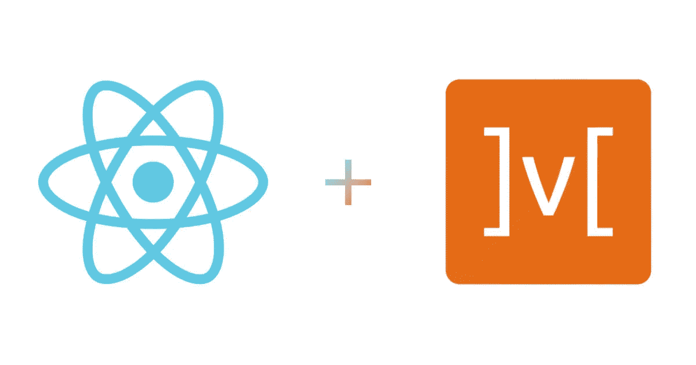

# React Hooks + MobX TodoList

> 原文：<https://levelup.gitconnected.com/react-hooks-mobx-todolist-c138eb4f3d04>



今天我们要用 React Hooks 和 MobX 写一个简单的待办事项列表。

我将为不熟悉这些库的人提供一个简短的介绍。如果你已经知道了，可以跳过这一节。

## [反应过来](https://reactjs.org/)

一个用于构建用户界面的 JavaScript 库，由脸书在 2013 年推出，用于创建 web 应用程序的 UI。与 Angular 和 Vue 不同，React 不是一个框架，只提供显示 UI 组件的工具。

## [反应钩](https://reactjs.org/docs/hooks-intro.html)

对于已经了解 React 的人来说，Hooks 是功能组件的增强，更多详细信息可以在链接中阅读。

## [**MobX**](https://mobx.js.org/)

MobX 是一个久经考验的库，它通过透明地应用函数式反应式编程(TFRP)使状态管理变得简单和可伸缩。MobX 背后的理念非常简单(来自文档)。

既然我们知道了要用什么，我们就可以开始这个项目了。

让我们打开一个新的 react 项目，有一个名为[**Create React App**](https://create-react-app.dev/docs/adding-typescript/)的大型启动项目，受社区支持，具有启动新 React App 所需的所有功能。(配置一个新的 React 项目可能需要时间，所以有这个样板文件很好)。我们也将为此使用 TypeScript:)

打开终端，写下以下命令:

*   用 typescript 安装 create-react-app
*   安装 typescript 所需的类型(在 devDependencies 下，因为我们在运行时不使用它们)
*   安装 mobx 及其连接进行反应

```
npx create-react-app my-app --template typescriptnpm install --save-dev typescript @types/node @types/react @types/react-dom @types/jestnpm i mobx mobx-react-lite
```

MobX 使用 decorators，所以我们需要在 tsconfig 中添加下一行`"experimentalDecorators": true`。

让我们建立我们的 mobx 商店，并将其连接到我们的 react 项目。我们的第一步是:

*   创建 TodoList 和 TodoItem
*   创建上下文并将我们的应用程序与其提供商包装在一起，以共享 mobx 商店
*   创建一种从上下文中获取存储的方法

```
export class TodoList {
    @***observable***.shallow list: TodoItem[] = [];

    constructor(todos: string[]) {
        todos.forEach(this.addTodo);
    }

    @action
    addTodo = (text: string) => {
        this.list.push(new TodoItem(text));
    }

    @action
    removeTodo = (todo: TodoItem) => {
        this.list.splice(this.list.indexOf(todo), 1);
    };

    @computed
    get finishedTodos(): TodoItem[] {
        return this.list.filter(todo => todo.isDone);
    }

    @computed
    get openTodos(): TodoItem[] {
        return this.list.filter(todo => !todo.isDone);
    }
}
```

我们创建了保存`TodoItem`的`@observable`数组的`TodoList`类。请注意，我们给它赋了一个初始值，并使可观察值变浅，这样它就不会自己包装数组中的值。我们让它接收一个字符串数组来初始化我们的列表，并添加两个简单的函数 add 和 remove，我们对动作使用箭头函数，因为我们依赖于`this`，我们不想在对 getter 函数执行动作`todos.forEach(this.addTodo)`时丢失上下文，我们不使用箭头函数，因为我们只将它用作 getter。

```
export default class TodoItem {
    id = ***Date***.now();

    @observable text: string = '';
    @observable isDone: boolean = false;

    constructor(text: string) {
        this.text = text;
    }

    @action
    toggleIsDone = () => {
        this.isDone = !this.isDone
    }

    @action
    updateText = (text: string) => {
        this.text = text;
    }
}
```

我们创建一个简单的`TodoItem`类，给它 2 个可观察的文本属性和`isDone`以及 2 个函数来切换它的状态和更新文本。

现在我们将使用[反应上下文](https://reactjs.org/docs/context.html#reactcreatecontext)。它允许我们在提供者内部的所有 React 组件之间共享数据，我们将使用 React 中的`createContext`创建上下文，并向其传递一个空对象的默认值，并为其分配我们的存储类型`TodoList`(通常在大型项目中，它可以是根存储)。

```
import { createContext } from 'react';
import {TodoList} from "../stores/todo-list";

export const ***StoreContext*** = createContext<TodoList>({} as TodoList);
export const ***StoreProvider*** = ***StoreContext***.Provider;
```

我们转到我们的`index.tsx`文件，创建我们的 todo 列表存储，并用从我们的上下文中获得的提供者包装 or `<App />`组件，并将 todo list 作为值传递给它。

```
const todoList = new TodoList([
    'Should Starting Writing in React',
    'Should Learn MobX',
    'Should Watch Once Piece :)'
]);

ReactDOM.***render***(
    <StoreProvider value={todoList}>
        <App/>
    </StoreProvider>
    , ***document***.getElementById('root'));
```

最后，我们添加了一个函数来帮助我们获取 React 函数中的存储。使用`useContext` React 提供给我们，我们将之前创建的上下文传递给它，并接收我们提供的值(todoList)。

```
export const useStore = (): TodoList => useContext(***StoreContext***);
```

现在我们可以开始编写我们的 react hooks 组件了🎆。我们将创建 3 个组件:

*   托多利斯特
*   托多伊泰姆
*   托多纽

我们将从`TodoList`开始:

```
export const TodoList = () => {
    const todoList = useStore();

    return useObserver(() => (
        <div className="todo-list">
            <div className="open-todos">
                <span>Open Todos</span>
                {todoList.openTodos.map(todo => <TodoItem key={`${todo.id}-${todo.text}`} todo={todo}/>)}
            </div>
            <div className="finished-todos">
                <span>Finished Todos</span>
                {todoList.finishedTodos.map(todo => <TodoItem key={`${todo.id}-${todo.text}`} todo={todo}/>)}
            </div>
        </div>
    ));
};
```

我们使用我们的助手函数`useStore`来检索 todoList，然后我们简单地从 todo 列表存储的计算值中返回两个已完成和未完成的 todo 列表。

重要的是使用这里的`useObserver` from `mobx-react-lite`来包装返回值，让 mobx 知道跟踪里面的可观察值。否则，如果你试图从外部更新列表，它将无法工作(你可以在这里阅读更多相关信息[https://mobx-react.js.org/observe-how](https://mobx-react.js.org/observe-how))。

```
export const TodoItem = ({todo}: Props) => {
    const todoList = useStore();
    const [newText, setText] = useState('');
    const [isEditing, setEdit] = useState(false);

    const saveText = () => {
      todo.updateText(newText);
      setEdit(false);
      setText('');
    };

    return (
        <div className="todo-item">
            {
                isEditing ?
                    <div>
                        <input type="text" onKeyDown={onEnterPress(saveText)} onChange={(e) => setText(e.target.value)}/>
                        <button onClick={saveText}>save</button>
                    </div>
                    :
                    <div>
                        <span>{todo.text}</span>
                        <input type="checkbox" onChange={todo.toggleIsDone} defaultChecked={todo.isDone}></input>
                        <button onClick={() => setEdit(true)}>edit</button>
                        <button onClick={() => todoList.removeTodo(todo)}>X</button>
                    </div>
            }
        </div>
    )
};
```

我们创建`TodoItem`，它接收 props 中 todo 的 mobx 类模型。我们为组件提供了编辑、删除和更新文本的基本功能。这里重要的事情是看我们如何让 todo 更新文本本身，并且不需要为此更新整个列表(我添加了一个`onEnterPress`帮助器函数来使输入键的检查更容易)，这里我们没有使用`useObserver`，因为在`TodoList`中已经观察到了`todo`。

您可以在 Github 库中看到的`TodoNew`组件。这里就不加了，因为概念和代码都一样。

Github 回购:[https://github.com/stolenng/react-hooks-mobx](https://github.com/stolenng/react-hooks-mobx)

总而言之，这个简单的指南展示了我们如何使用`mobx-react-lite`将`react`和`hooks`与`mobx`连接起来，我认为 React 函数组件(钩子)与 mobx 的这种结合产生了令人敬畏的代码，非常简单明了。你可以用它作为 mobx 的启动项目，并根据你的喜好进行调整。

***9/20 更新***

我发布了一个关于 MobX 的广泛课程，请在这里随意查看:

[](https://www.udemy.com/course/mobx-in-depth-with-react/?referralCode=B7FD24C7EB1A51684160) [## 使用 React 深入研究 MobX(Hooks+TypeScript)

### 高级软件开发人员-服务于以色列空军作为一个软件开发人员 3 年-工作作为一个…

www.udemy.com](https://www.udemy.com/course/mobx-in-depth-with-react/?referralCode=B7FD24C7EB1A51684160) 

如果任何人有问题或者只是想谈论这个话题，欢迎 PM 我:)

*   [https://reactjs.org/](https://reactjs.org/)
*   [https://mobx.js.org/](https://mobx.js.org/)
*   [https://reactjs.org/docs/hooks-intro.html](https://reactjs.org/docs/hooks-intro.html)
*   [https://github.com/mobxjs/mobx-react-lite](https://github.com/mobxjs/mobx-react-lite)
*   [https://reactjs.org/docs/context.html](https://reactjs.org/docs/context.html)
*   [https://mobx-react.js.org/observe-how](https://mobx-react.js.org/observe-how)