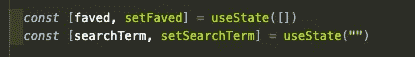
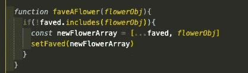
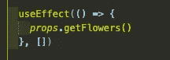
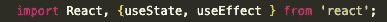

# React 挂钩，第 1 部分

> 原文：<https://levelup.gitconnected.com/react-hooks-part-1-304643294f5>

## 功能之旅


现在我已经引起你的注意了，让我们来学习钩子吧！[陈](https://unsplash.com/@chen93?utm_source=unsplash&utm_medium=referral&utm_content=creditCopyText)在 [Unsplash](https://unsplash.com/s/photos/hook?utm_source=unsplash&utm_medium=referral&utm_content=creditCopyText) 上拍照

我不知道你怎么想，但是我已经阅读了许多文章，试图理解 React 类组件中的绑定/调用/应用，但是这些信息还没有被理解。考虑到这一点，我真的很高兴知道 React 已经相当迅速地脱离了类组件，并且功能组件确实可以处理状态/有状态逻辑。输入钩子！根据 [React.js 文档](https://reactjs.org/docs/hooks-overview.html) : *“钩子是让你从函数组件中“挂钩”React 状态和生命周期特性的函数。”*

React Hooks 的核心概念是由 [Sophie Alpert](https://twitter.com/sophiebits) 和 [Dan Abramov](https://overreacted.io/) 在 2018 年 React Conf 上介绍的。Sophie Alpert(她当时是脸书 React 核心团队的经理)，*“…许多有经验的开发人员告诉我们，类中绑定和“this”工作的方式非常令人困惑…类对人类来说很难…类对机器来说也很难…很难在编译时准确地说出所有方法是如何组合在一起的…类使得编译器更难优化。所以不是只有我一个人过得不好！😅*

类组件目前还没有被正式否决，所以任何新的 React 开发人员都应该确保他们了解类组件概念的基础和附带的样板代码。根据 Dan Abramov 的说法，*“在脸书，我们有数以万计的班级组成部分，像你一样，我们不打算重写它们。”*话虽这么说，钩子也越来越普遍了，再加上真的很厉害，很好学。所以让我们开始吧！

## 使用状态

简而言之，`useState`旨在代替我们的初始状态声明/赋值，下面的`this.setState`是初始状态变量声明的典型示例，它在功能上相当于`state = {faved: [], searchTerm: “”}`。

我们使用 array[destructing](https://developer.mozilla.org/en-US/docs/Web/JavaScript/Reference/Operators/Destructuring_assignment)首先声明我们的状态变量的名称，之后“set < variable >”声明将更新该状态变量的 setter 函数。(这是惯例。)useState 后面的括号`()`用于使用变量的初始值/默认值调用 React 的 useState 函数:



实际使用状态

正如您在这里看到的，我们的状态被分解为单个的状态元素。这可以防止我们意外地覆盖整个状态对象。不错吧。您可以在一个组件中使用`useState`任意多次。您可以将该变量元素作为道具传递给子组件，就像在类组件中一样。与类组件不同，每个状态元素不必声明为对象文字，尽管它当然可以。

这里我们使用功能等同于`this.setState`。`faved`以一个空数组开始(如上图),经过下面的一点逻辑，我们`setFaved`到一个新的数组值。就是这样！



setFaved，相当于 this.setState

## 使用效果

`useEffect`是一个特别有效的(lol 看我在那里做了什么？)钩。根据需要，它允许 componentDidMount、componentDidUpdate 和 componentWillUnmount 的组合功能。就像这三种生命周期方法一样，它在组件的初始渲染之后才会发挥作用。

同样，根据 [React.js 文档](https://reactjs.org/docs/hooks-overview.html) : *“效果挂钩，* `*useEffect*` *”，增加了从一个函数组件执行副作用的能力……我们称这些操作为“副作用”(或简称为“效果”)，因为它们会影响其他组件，并且在渲染期间无法完成……通过使用该挂钩，您可以告诉 React，您的组件需要在渲染后做一些事情。”*

componentDidMount 的等价物很容易与`useEffect`一起使用。只需用一个箭头函数(考虑到动作的异步性质)传递它，并调用必要的函数。下面，`getFlowers`是一个简单的 GET fetch 函数，它是我从 redux“MDP”(mapDispatchToProps)中作为 props 传递的。



功能等同于 componentDidMount

对于 componentDidUpdate 功能:您可以传递一个空数组作为第二个参数，这将告诉 React 在重新呈现之前不要检查状态元素中的任何更改(或差异)。例如，如果我们有一个 likes 状态变量，并且你在上面传递的第二个参数中添加了`[likes]`，那么如果`likes`值没有改变，`useEffect`就会知道跳过重新渲染。

`useEffect`还允许我们选择通过传递第二个函数来告诉组件如何“清理”。(注意，传递的函数可以是命名函数，也可以是匿名箭头函数。两者都将在`useEffect`内部工作。)下面是 React.js 文档中一个有用的例子。

```
useEffect(() => {    ChatAPI.subscribeToFriendStatus(props.friend.id, handleStatusChange);

return () => {      ChatAPI.unsubscribeFromFriendStatus(props.friend.id, handleStatusChange);    
};  
});
```

在上面的例子中，API 在下一次重新渲染之前取消了好友状态，这很重要，因为每次重新渲染，我们都会体验到一个新的/不同的`useEffect`实例。如果在组件的下一次呈现中 friend.id 不同，我们会看到一个错误。

## 定制挂钩！

有大量的[规则](https://reactjs.org/docs/hooks-rules.html#gatsby-focus-wrapper)与学习挂钩。其中之一就是不要使用嵌套在函数中的钩子。然而，有一个很大的漏洞:自定义挂钩！你可以通过命名它为`use<SomeFunction>`来编写你自己的定制钩子。(React linter 将知道您正在编写自己的定制钩子，并且不会向您显示错误消息。)在这种情况下，您可以添加 useState、useEffect 或其他挂钩(我打算等我自己学会了它们就马上写出来！)并将它们组合在一个函数中。对于一个自定义钩子的有效例子(我还在学习，所以还没有在我自己的应用程序中实现)，去[这里](https://reactjs.org/docs/hooks-custom.html)。

## 重构

如果你决定尝试用钩子将一个类组件重构为一个功能组件，要知道你不必重构整个应用程序。使用钩子，React 应用程序可以很好地处理一些类组件和其他功能组件。



重要提示:你必须导入任何被利用的钩子，否则你的代码将会崩溃

注意:请记住，当将一个类组件重构为函数组件时，我们必须将 let、const(或 var)写回到我们声明的函数中。删除所有对此的引用并声明。如果我们要传递道具，请在功能组件中传递道具。(如果你愿意，可以随意破坏这些道具。)别忘了拆下`render() {}`！让任何 linter/浏览器错误信息引导您前进。

祝重构好运。让我知道进展如何！！

[](https://medium.com/@dan_abramov/making-sense-of-react-hooks-fdbde8803889) [## 理解 React 挂钩

### 本周，Sophie Alpert 和我在 React Conf 上提出了“Hooks”提案，随后是 Ryan 的深入探讨…

medium.com](https://medium.com/@dan_abramov/making-sense-of-react-hooks-fdbde8803889) [](https://reactjs.org/docs/hooks-faq.html) [## 挂钩常见问题解答-反应

### 钩子是 React 16.8 中的新增功能。它们允许您使用状态和其他 React 特性，而无需编写类。这个…

reactjs.org](https://reactjs.org/docs/hooks-faq.html)