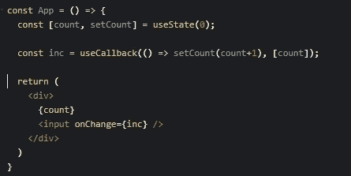

# React 挂钩规则用于更干净的代码

> 原文：<https://levelup.gitconnected.com/react-hooks-rules-for-cleaner-code-3bceb5decf7>

大家好，今天我们将讨论 React 钩子和一些简单的模式，它们可以让你的代码更加整洁，可读性更好，并且让你的日常工作更加有趣！:)

因此，一年零几个月前，React 团队[发布了钩子](https://reactjs.org/blog/2019/02/06/react-v16.8.0.html)的稳定版本，并逐渐推出了越来越多的开源库，公司和程序员开始慢慢地从类组件转向功能组件，也就是钩子。

乍一看，函数组件似乎很容易，因为它几乎像类组件，但没有类，只有呈现函数，对吗？但是慢慢地，人们会发现导致他们编写效率更低、可读性更差的 React 代码的细微差别和细节，所以让我们来看看这些陷阱，并学习如何避免它们。

所以让我们从最容易的开始，向前推进。

## **挂钩用法**

*   总是在函数的顶部初始化/调用钩子，人们会更容易理解你的组件状态是什么。
*   钩子依赖于你使用钩子的顺序，正因为如此，你不能把钩子放在条件句中。
*   你可以在 React docs-[https://reactjs.org/docs/hooks-rules.html#explanation](https://reactjs.org/docs/hooks-rules.html#explanation)了解更多

## 道具解构

可以的话尽量使用解构，它让功能组件可读性更强，人们马上就能明白你在组件里用的是什么。

功能组件解构

## 了解功能组件的生命周期

考虑这个问题最简单的方法是，函数组件只是类组件的呈现部分，除非使用钩子，否则每次重新呈现组件时，所有的变量、函数和数据都将被重新创建。

功能组件渲染示例

## 使用效果挂钩

顾名思义，这个钩子是用来产生效果的，比如 API 调用，日志记录，以及更多你想要的副作用。尽可能将副作用控制在`useEffect`内，每个副作用/顾虑用 1。

useEffect 的简单示例

## 使用回调挂钩

正如我们之前看到的，每个函数在每次渲染时都要重新创建一遍，那么如果我们想避免这种情况，我们该怎么做呢？`useCallback`。有了这个钩子，我们可以告诉我们的组件不要在每次渲染时都重新创建函数，这在我们希望函数只被创建一次时很有用，如果涉及到状态，我还看到一个小陷阱是`ReactMem`由于函数的引用总是被重新创建而无法工作。

使用回调示例

## useEffect/useCallback 依赖项数组

使用这两个钩子时需要考虑的重要事情是，它们都需要一个依赖数组作为第二个参数。

这是为什么呢？这是为了让 React 知道要跟踪哪些值，这样你就不会得到过时的数据，React 只会在依赖数组内部传递的值发生变化时触发这个钩子，如果你传递给`[]`数组，它只会运行一次。

在下面左边的例子中，没有将`count`传递给依赖关系数组，它将总是等于 0，不像右边的例子，我们传递了右边的依赖关系，我们得到了最新的值。

左侧示例—过时的依赖关系数组，右侧示例—正确的数组

## 在功能组件之外提取与反应无关的功能

这可能看起来很琐碎，但有时 react hooks 的新手并不完全知道他们是否可以提取组件外的一些函数，所以他们坚持将整堆函数放在函数组件内，我们得到了巨大的函数组件，这真的很难阅读！

一个简单的解决方案是提取所有与 React 无关的功能，这将有助于我们保持组件的精简和可读性，并且易于测试这些逻辑。

## 滥用用户权限

React 引入了`useRef`钩子，所以我们可以在函数组件中使用 refs，但也允许我们在组件的所有生命周期中在其上存储可变数据，所以有时人们倾向于避免使用`useState`或使用`useRef`保存所有数据(当然，data one 也有例外情况:)。我建议考虑一个更好的解决方案或不同的方法来解决你的问题，而不是马上跳到`useRef`。

React 团队所说的主要用法是(大多数时候应该用于-[https://reactjs.org/docs/refs-and-the-dom.html](https://reactjs.org/docs/refs-and-the-dom.html)):

> 何时使用参考文献
> 
> 有几个很好的参考用例:
> 
> 管理焦点、文本选择或媒体播放。
> 
> 触发命令式动画。
> 
> 与第三方 DOM 库集成。

综上所述，这些要点应该有助于你有一个更好的使用 react 钩子的体验，当然，所有这些都是高水平的，在每个主题上我们可以深入得多。我建议阅读 React 官方文件，可以在这里找到:[https://reactjs.org/docs/hooks-intro.html](https://reactjs.org/docs/hooks-intro.html)。

因为图像有时很难看到，而媒体内部的要点对我来说不适用，所以我创建了一个 repo 来更清楚地展示示例:

[https://github.com/stolenng/react-hooks-examples](https://github.com/stolenng/react-hooks-examples)