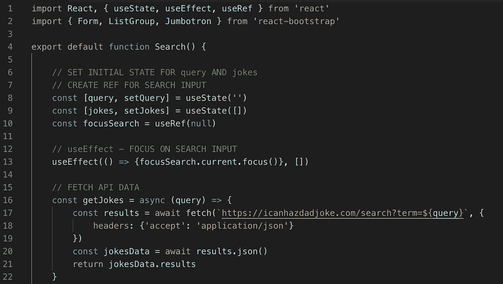
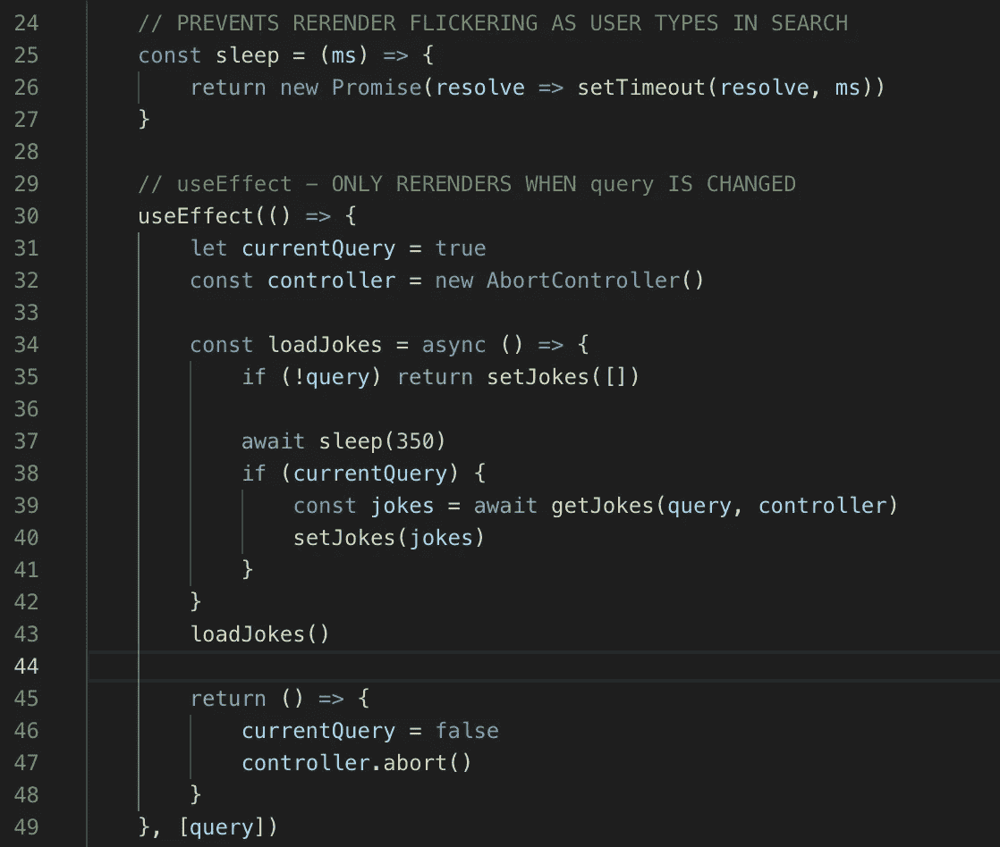
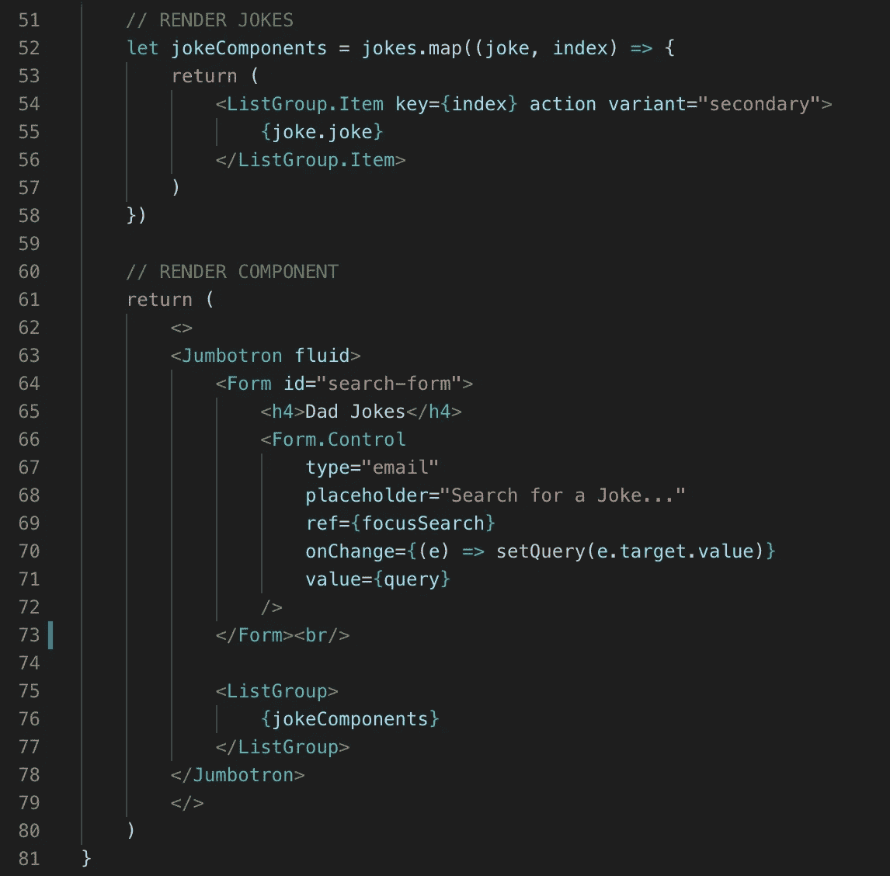
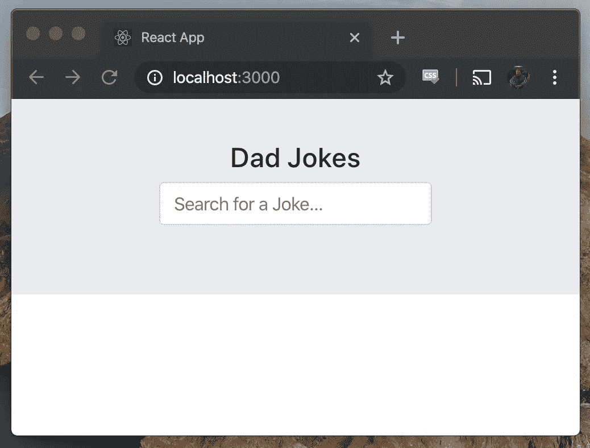
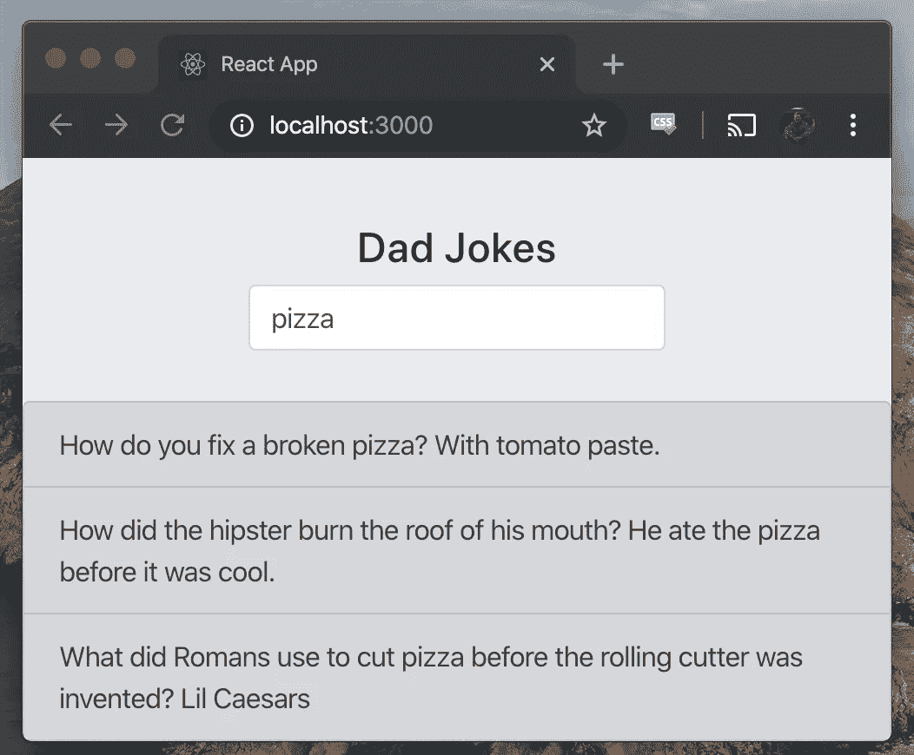

# React Hooks —搜索 API

> 原文：<https://levelup.gitconnected.com/react-hooks-search-an-api-ceb8b840b1ce>

在我之前的博文[中，我解释了如何用 React 钩子获取 API。今天，我们将介绍如何从一个爸爸笑话 API 中搜索并返回结果。我们将利用`useState`、`useEffect`和`useRef`来完成该功能，并从上到下解释代码。](/fetch-an-api-with-react-hooks-79d509a052a0)

我们从 React 库中导入 React 挂钩，并通过文件顶部的 React 引导库导入三个组件进行样式化。我们创建搜索词和一个函数来用`[query, setQuery]`更新这个变量，并将初始状态设置为一个空字符串。我们通过`useState([])`将`[jokes, setJokes]`设置为空数组，初始化另一个变量和函数对。

我们还用钩子`useRef(null)`为搜索输入字段做了一个`focusSearch`引用。然后我们运行`useEffect`钩子将用户的光标放到搜索输入中，这将只在初始呈现时运行，空数组作为第二个参数传递。接下来，我们定义一个异步函数`getJokes`从 API 获取数据。这个函数使用`query`接收搜索项，并返回包含搜索项的笑话。

`sleep`功能可防止用户在输入栏中键入新的搜索词时重新呈现器闪烁。该函数在下一个`useEffect`钩子中被调用。在这个副作用挂钩中，我们创建了一个`currentQuery`布尔和`controller`变量来防止承诺在输入字段中的每个字符变化时运行。

`loadJokes`异步函数监听`query`变量的变化，使用`sleep`函数等待 350 毫秒，然后函数传递搜索词，并解析从 API 获取数据的承诺。一旦`getJokes`运行，`setJokes`函数就用新的笑话数组更新`jokes`变量。从第 45 行开始，我们通过将`currentQuery`设置为 false 并中止`controller`来清理这个`useEffect`钩子。下面的 [React 文档](https://reactjs.org/docs/hooks-effect.html)解释了`useEffect`的清理过程。

**“为什么我们从我们的效果中返回一个函数？这是可选的效果清理机制。每个效果都可能返回一个在它之后清理的函数。这让我们可以将添加和删除订阅的逻辑放在一起。它们是同一个效果的一部分！**

【React 清理效果到底什么时候起作用？ React 在组件卸载时执行清理。然而，正如我们之前了解到的，效果会在每次渲染时运行，而不是只运行一次。这也是为什么 React *和*会在下次运行效果之前清除上一次渲染的效果。"

最后，这个`useEffect`钩子只在`query`变量改变时运行，因为我们在钩子的末尾传递了`query`作为参数。

在`jokeComponent`函数中，我们使用`jokes`变量来映射和显示包含`query`搜索词的笑话。然后，我们返回带有标题、搜索字段的组件，并调用`jokeComponents`来显示笑话列表。

在上面的两张截图中，我们可以看到搜索功能正在工作！要亲自试用这个组件，请查看这里的[库](https://github.com/PrestonElliott/React-Hooks)。请访问 [React 的文档](https://reactjs.org/docs/hooks-intro.html)以了解最佳实践并进一步理解所有可用的挂钩！

[来源](https://unsplash.com/photos/Clwh1mksdAM)