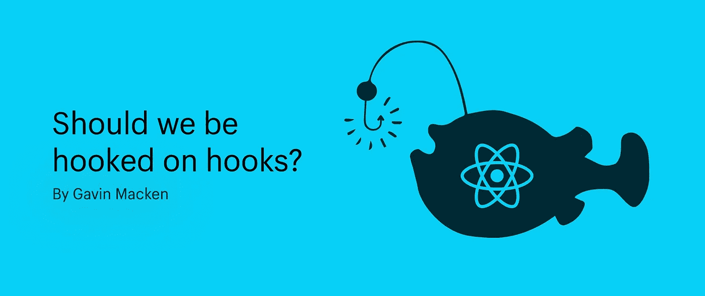
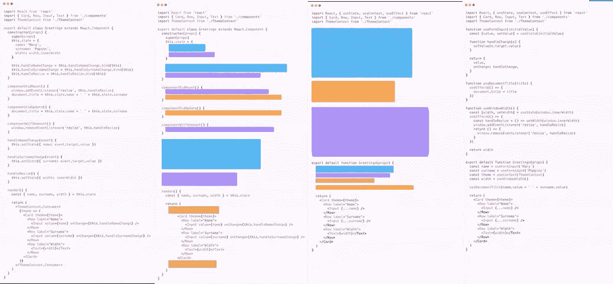

# 反应钩子——我们应该被钩子钩住吗？

> 原文：<https://levelup.gitconnected.com/react-hooks-should-we-be-hooked-on-hooks-8622f6cd6f7c>

## 钩子优点之我见



React 钩子是在 2019 年 2 月 16 日向公众发布的 React 16.8 中引入的。如果我们在 Reactjs.org 的文档中找到一行关于 React 钩子的解释，我们会看到:

> " React 钩子允许你使用状态和 React 生命周期特性，而不需要使用类和 React 组件生命周期方法."

但是，它们可以远不止这些…

它们允许我们考虑新的设计模式、更大的分离和功能性编程的新方法，让我们有机会编写更干净、更容易测试并且可以从不同角度处理问题的代码。

它与您现有的 React 代码一起工作非常愉快，并且适合逐渐引入一个平台或团队。钩子是完全可选的，普通的 JS 是完全向后兼容的。

然而，由于开发环境的本质，一旦您承诺引入它，其他开发人员可能会被迫在审查期间或重新访问代码时捡起它。

我个人认为…我是一个超级粉丝，没有新的概念需要学习，它只是想让我们更容易地接触到我们已经知道的概念(道具、状态、上下文、引用和生命周期)。

为什么？

Reacts 组件和自顶向下的数据流非常适合将大的 UI 分解成更小的可重用组件。然而，因为组件依赖于有状态的逻辑，而有状态的逻辑不能被提取出来以分离关注点，所以它可以创建具有重复逻辑的大型组件，使得事情更难测试。

# 我们如何改善这一点？



这是 React Conf 2018 上 Dan Abromovs 代码的一个例子

*   共享独立于组件实现的可重用行为(如[渲染道具模式](https://reactjs.org/docs/render-props.html))。
*   使用状态、挂钩和组件生命周期事件，而不使用类。
*   在组件的一个地方使用相关的逻辑，而不是在不同的生命周期方法之间分割。

让我们仔细看看上面的代码，特别是最左边的图像。它包含一个组件，处理具有各种状态和生命周期效果的输入字段。

如果我们想与另一个组件共享这里的逻辑呢？换句话说，如果我们想分离关注点。

也许我们可以有一个单独渲染的 JSX，然后使用渲染道具或更高阶的组件模式。这两种模式都工作得很好，但是都需要对代码进行大量的修改，并且并不总是最容易遵循或在组件之间共享的模式。

如果你现在把目光投向上图的最右边…

现在我们可以看到无需创建类就能使用状态和反应生命周期事件的能力。我们可以创建一种在组件之间重用有状态逻辑的通用方法。

它依赖于一些函数，当你仔细想想，这些函数是有意义的。多年来，函数一直是分离关注点和传递逻辑的完美机制。神奇的是，我们的函数现在也可以表现得像一个类，可以管理状态和生命周期事件。

让我们仔细看看两个不同的例子。

你可以在下面看到，我们有我们通常的反应组件。我们创建一个类，使用一个构造函数来创建我们的状态，添加一些 Reacts 多生命周期事件，并通过在构造函数中绑定我们的方法来管理`this`关键字。

```
import React, { Component } from 'react';
import { render } from 'react-dom';class App extends Component { 
 constructor() {
 super();
  this.buttonSubmit = React.createRef();
  this.state = {
   name: '',
   username: '',
   formSubmitted: false
  }; this.handleSubmit = this.handleSubmit.bind(this);
 this.handleChange = this.handleChange.bind(this);}componentDidMount(){
 this.buttonSubmit.current.addEventListener('click',    this.handleSubmit)
 console.log("component mounted")
}componentDidUpdate(){
 console.log("component updated")
}componentWillUnmount(){
 this.buttonSubmit.current.EventListener('click', this.handleSubmit)
 console.log("component unmounted")
}handleChange(e){
 const {name, value} = e.target
 this.setState({...this.state, [name]: value})
}handleSubmit(){
 this.setState({formSubmitted: true})
}render() {
 return (
  <div>
  {this.state.formSubmitted
  ? <h1> {this.state.username} has signed in </h1>
  : <div>
      <input type="text"
       name="name"
       id="name"
       placeholder="name"
       value={this.state.name}
       onChange={this.handleChange}
      />
    <div>
     <input type="text"
      name="username"
      id="username"
      placeholder="username"
      value={this.state.username}
      onChange={this.handleChange}
     />
    </div>
    <button ref={this.buttonSubmit}>Submit</button>
   </div>
  }
 </div>
 );
 }
}render(<Apps />, document.getElementById('root'));
```

下面的例子向我们展示了在我们添加了一些 React 钩子魔术之后，它会是什么样子。

你会注意到我们现在用 React 的一个名为`useState`的内置钩子来管理状态，并且我们用`useEffect`钩子简化了所有的`lifeCycle`事件。

```
import React, { Component, useState, useRef, useEffect} from 'react';
import { render } from 'react-dom';const useHandleForm = initialValue => {
 const [value, setValue] = useState(initialValue) const handleChange = (e) => {
  const { value } = e.target
  setValue(value)
 } return {
  value,
  onChange: handleChange
 }
}const App = () => {
 const name = useHandleForm('');
 const username = useHandleForm(''); const [formSubmitted, setFormSubmitted] = useState(false)
 const buttonSubmit = useRef() useEffect(() => {
  // This gets called after every render, by default
  // (the first one, and every one after that) buttonSubmit.current.addEventListener('click', handleSubmit) // If you want to implement componentWillUnmount,
  // return a function from here, and React will call
  // it prior to unmounting. return () => buttonSubmit.current.removeEventListener('click',   handleSubmit);}, [buttonSubmit])const handleSubmit = () => {
 setFormSubmitted(true);
}return (
  <div>
  {this.state.formSubmitted
  ? <h1> {name.value} has signed in </h1>
  : <div>
      <input type="text"
       name="name"
       id="name"
       placeholder="name"
       {...name}
      />
    <div>
     <input type="text"
      name="username"
      id="username"
      placeholder="username"
      {...username}
     />
    </div>
    <button ref={this.buttonSubmit}>Submit</button>
   </div>
  }
 </div>
 );
}render(<App />, document.getElementById('root'));
```

但是还有更多…

我们不局限于 React 提供的钩子，我们也可以构建自己的钩子，这就是钩子的价值开始为我所用的地方。

在这种情况下，我们能够分离处理表单输入的逻辑，我们现在可以跨平台使用它，而不需要依赖渲染属性或更高级的组件模式。

正如我们所说的，有一些库正在被创建和更新，其中有一些有用的钩子，我们可以在将来重用。nikgraf 收藏了大量藏品，非常值得一游。

不再有`this`。

构建类组件的另一个难点是我们必须管理`this`关键字。React 和 ES6 已经试图用多种方式来减轻这种负担，以应对无限的`this`。

箭头函数通过将`this`关键字绑定到词法范围而不是上下文减轻了负担，当前推荐的处理`this`的方法是在创建时将其绑定到构造函数中，如我们的示例所示。

但是多个解决方案会增加开发人员的复杂性。React 钩子允许我们减少对`this`的依赖，因为`useState`和`useEffect`钩子输出局部变量，消除了将`this` 绑定到类范围的需要。

# 最后的想法

在这里，我们仅仅触及了 React 挂钩的表面。还有许多值得发现的内置挂钩，值得下次讨论。

一个例子是`useContext`钩子，它可以减少对 Redux 库的依赖。但是我尝试做的是给你一个关于优势的高层次的观点。

我相信您已经阅读了网上的文章，并且您可能已经得出结论，React Hooks 的采用正在加快步伐，正如我所做的那样，React 背后的团队为此投入了大量资源。

至少，它为我们提供了新的工具和解决一些常见问题的方法。