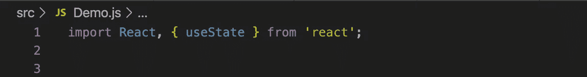
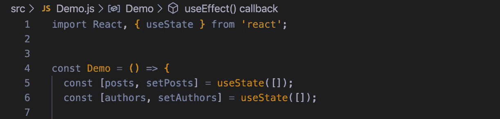
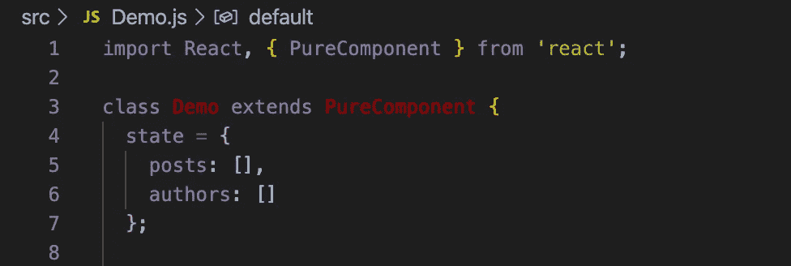
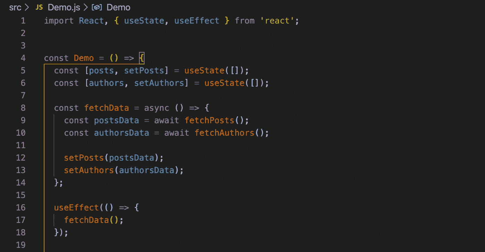
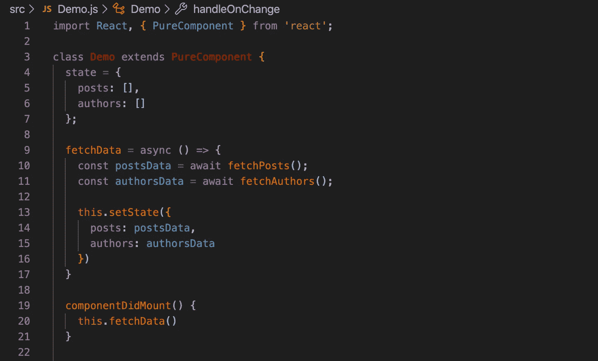
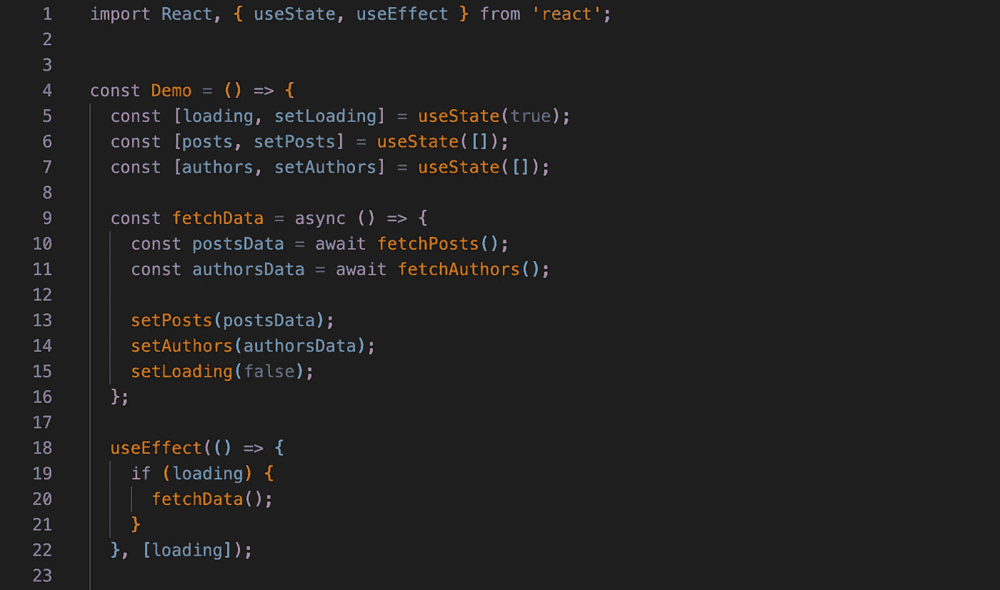
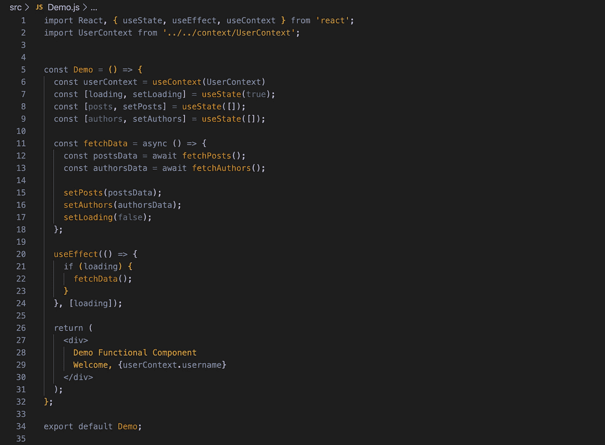
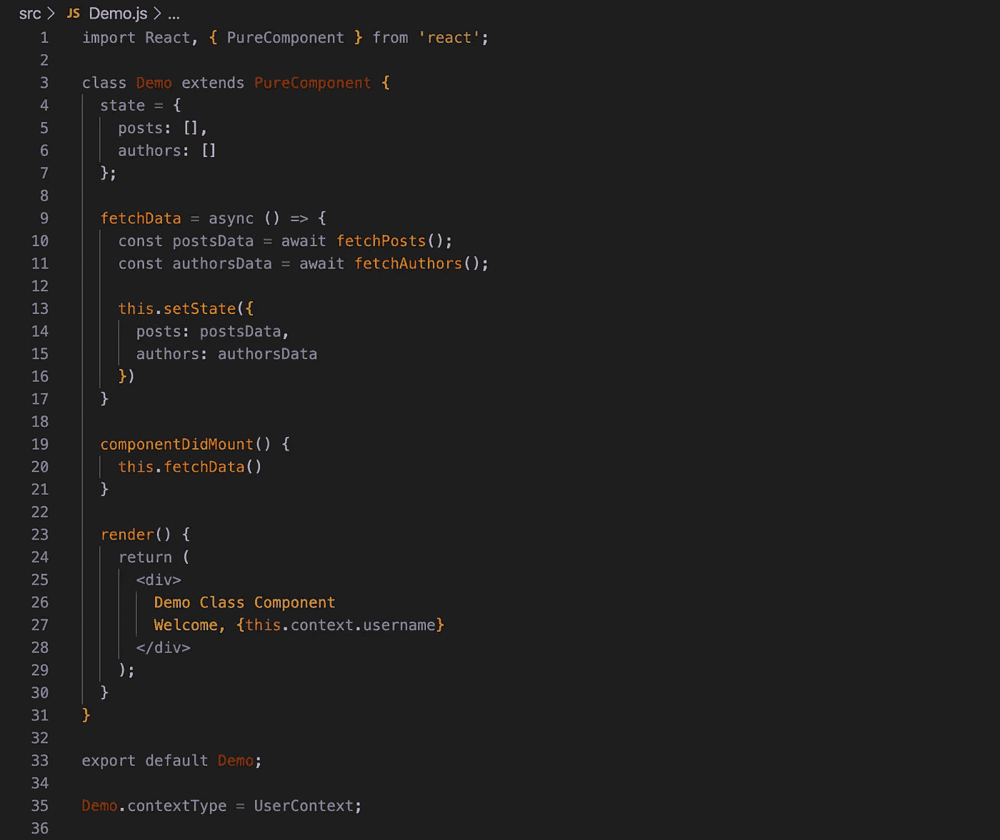

# React Hooks &为什么它们使(编码)生活变得如此容易

> 原文：<https://levelup.gitconnected.com/react-hooks-why-they-make-coding-life-so-much-easier-fe72f75b8e37>

来自[爆裂](https://burst.shopify.com/api-home-furniture?utm_campaign=photo_credit&utm_content=Browse+Free+HD+Images+of+Beautiful+Kitchen+Utensils+In+Bright+Wooden+Kitchen&utm_medium=referral&utm_source=credit)的[莎拉·普弗卢格](https://burst.shopify.com/@sarahpflugphoto?utm_campaign=photo_credit&utm_content=Browse+Free+HD+Images+of+Beautiful+Kitchen+Utensils+In+Bright+Wooden+Kitchen&utm_medium=referral&utm_source=credit)的照片

React 最棒的一点是，它很好地完成了对应用程序中的事件做出反应的任务。它提供了完整的工具来管理生命周期事件，例如当组件安装或更新时，允许您管理应用程序的状态，同时自动对状态中的任何变化做出反应，等等。

问题是，这些传统形式的工具只能在类组件中使用，而不是功能组件。假设，这应该没问题，对不对？如果需要访问状态和生命周期方法，只需使用类组件。这实际上被认为是 React 中的最佳实践，因为它很容易将无状态组件和有状态组件区分开来。

但是，当您使用第三方集成时，比如支付表单或登录流程，并且第三方代码*仅*在功能组件中工作，会发生什么呢？B.H .(在 Hooks 之前)，这可能很困难——当然，您可以通过创建不同的类和功能组件来解决它，然后导入并组织到一个更大的组件中，但这很快就会变得混乱，而且肯定不是最佳实践。

# 什么是 React 钩子？

React 挂钩在 React 16.8.0 和更高版本中得到支持，现在允许您在功能组件中使用状态、生命周期事件、上下文和其他 React 特性，这些特性以前只在类组件中可用。正如 React 文档所述:

> 挂钩是让您从功能组件“挂钩”React 状态和生命周期特性的功能。钩子在类内部不起作用——它们让你在没有类的情况下使用 React。

三个主要挂钩是:

1.  使用状态
2.  使用效果
3.  使用上下文

还有其他的，比如`useRef`和`useCallback`，我们不会在这里深入讨论，但是可以在 [React 文档](https://reactjs.org/docs/hooks-reference.html)中找到。

# 使用状态

我们将从州钩开始，它实际上只是伪装的好州。`useState`钩子允许你给一个功能组件添加本地状态。它在重新渲染之间保留本地状态，并且在设置状态时触发重新渲染。您不用在一个状态对象中管理所有状态并使用`setState`函数来更新状态的任何部分，而是使用单独的`setState`函数来定义单独的状态变量，这两个变量都可以像任何其他变量或函数一样被访问(即，不需要使用`this.state.variable`)。首先，进口`useState`同 React:

`useState`用于定义状态变量和`setState`函数，因为它基本上让应用程序知道这些变量应该被视为状态。以下面的例子为例，它将用于管理文章和作者的应用程序中:

上面的代码相当于一个类组件:

唯一的区别是，在类组件中你会使用`this.state.posts`和`setState`，而在函数组件中你只使用`posts`和`setPosts`。

# 使用效果

`useEffect`将是你对功能组件中生命周期方法的回答。React 文档说得好:

> 如果你熟悉 React 类生命周期方法，你可以把`useEffect`钩子看作是`componentDidMount`、`componentDidUpdate`和`componentWillUnmount`的组合。

快速提示——我经常在`useEffect`中调用其他函数，而不是直接在其中写太多代码，因为我更喜欢不能在`useEffect`上直接使用的`async/await`。

例如，如果您想在安装该组件时获取帖子和作者的列表，您应该编写如下内容:

这相当于:

不过需要注意的是，默认情况下，`useEffect`会在每次渲染后运行*。*换句话说，上面的例子实际上会让你陷入获取数据的无限循环中。那么，我们如何防止这种情况发生呢？

`useEffect`可以接受第二个参数——状态变量数组。通过后，`useEffect`将仅在检测到这些指定状态变量之一发生变化时*才会运行。我喜欢把这个和状态中的`loading`变量结合使用，就像这样:*

这做了两件事。首先，它只在组件处于加载状态时运行`fetchData`函数。由于在`fetchData`结束时我们有`setLoading(false)`，在这里设置状态后`useEffect` *将再次被调用*，但是由于加载现在为假，所以什么都不会运行，循环被打破。

第二，`useEffect`只会在`loading`状态对象被设置时运行。我们现在可以对我们状态中的文章和作者列表进行修改，而不需要再次运行`useEffect`和获取数据。

# 使用上下文

正如您可能已经猜到的，`useContext`允许您在功能组件中使用上下文。如果不熟悉 context，可以把它想成 Redux 的替代品。正如 React 文档所解释的:

> 接受一个上下文对象(从`React.createContext`返回的值)并返回该上下文的当前上下文值。

实际上`useContext`钩子看起来像这样，React 上下文对象被导入，*整个上下文对象*被传入`useContext,` *而不是*只有一个键。比如，你*不要*直接把`UserContext.username`传入`useContext`。

上面的例子相当于:

# 深入 React 钩子

就像我之前提到的，这只是提供的三个主要挂钩。React 提供了更多已经准备好并随时可以使用的钩子，以及一个非常酷的实际构建自己钩子的能力。您可以使用 [React 文档](https://reactjs.org/docs/hooks-overview.html)更深入地研究这些主题。