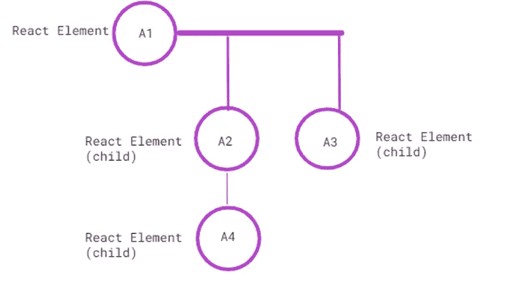
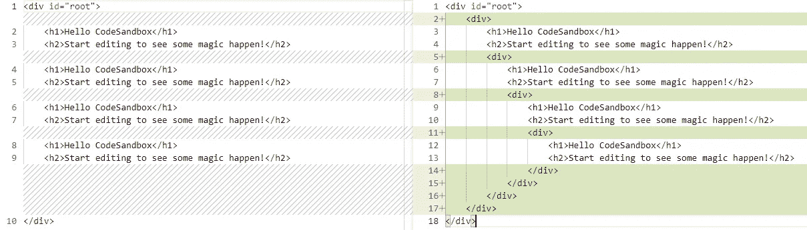

# React.js 性能优化技术

> 原文：<https://levelup.gitconnected.com/react-js-performance-optimization-techniques-39728d89e56e>

本文将介绍几种优化 React.js 应用程序性能的方法。React.js 帮助我们创建更快的 ui。但是，如果管理不当，它会降低应用程序的速度(例如，由于组件的不必要的重新渲染)。

为了提高任何应用程序的性能，我们首先需要测量和识别应用程序中比定义的阈值慢的地方。然后，我们必须进一步调查和缓解这些问题，并进行修复。

下面是我在职业生涯中用来衡量性能的一些资源，以及我用来优化 react 应用程序的一些技术。


[olia danilevich 拍摄的照片](https://www.pexels.com/photo/person-coding-on-a-macbook-pro-4974912/)

# React.js 中的性能测量技术

*   为 [Chrome](https://chrome.google.com/webstore/detail/react-developer-tools/fmkadmapgofadopljbjfkapdkoienihi?hl=en) 、 [Firefox、](https://addons.mozilla.org/en-GB/firefox/addon/react-devtools/)或 [React 的独立节点包](https://www.npmjs.com/package/react-devtools)安装 **React 开发者工具**。该工具帮助我们收集不同组件渲染的时间信息，并帮助我们确定它们是否是实际的性能瓶颈。
    ***参考:*** [*官方使用 React Profiler 的分步指南*](https://reactjs.org/blog/2018/09/10/introducing-the-react-profiler.html)
*   在 Chrome DevTools 中，使用**审计选项卡**生成报告，并分析各种指标和改进领域。
    ***参考:*** [*数字罗汉的博客衡量性能瓶颈*](https://www.digitalocean.com/community/tutorials/how-to-use-chrome-dev-tools-to-find-performance-bottlenecks)
*   在 Chrome DevTools 中，使用**性能选项卡**来记录、执行性能分析，并跟踪有问题的地方。
    ***参考:*** [*录制&查看一条表演轨迹*](https://calibreapp.com/blog/react-performance-profiling-optimization)
*   各种**库**也可以帮助追踪和识别改进的领域。几个例子——`[web-vitals](https://www.npmjs.com/package/web-vitals)`、`[react-addons-perf](https://www.npmjs.com/package/react-addons-perf)`。

> **快速提示**
> 
> **1。**我们必须进行多次读数，以确保结果真实可信，不受任何其他外部因素的影响。
> 
> **2。**我们可以密切关注 web 控制台以查看警告(在开发模式期间)。警告有时是有益的，可以帮助我们提高应用程序的整体质量。
> 
> **3。我们必须留意代价高昂的重建。在我们的代码中，很少有地方会引起组件不必要的重新呈现。**
> 
> React 内部是如何工作的？


[玛特制作的照片](https://www.pexels.com/photo/close-up-shot-of-a-person-using-a-laptop-7172094/)

# React.js 中的性能优化技术

**TLDR:** 我最初在[我们社区](https://wearecommunity.io/communities/india-united-ui-community/articles/1879)上发表了这些技巧的简短版本。

## **1。覆盖 shouldComponentUpdate 生命周期方法**

当`props`或`state`发生变化时，react 组件会进行渲染。覆盖`shouldComponentUpdate()`将帮助我们控制和避免任何不必要的重新渲染。

`[shouldComponentUpdate()](https://reactjs.org/docs/react-component.html#shouldcomponentupdate)`在重新渲染组件前触发。

我们将比较当前和下一个`props` & `state`。然后，如果我们要重新渲染，返回`true`；否则，返回`false`以避免重新渲染。

```
function shouldComponentUpdate(next_props, next_state) {
    return next_props.id !== this.props.id;
}
```

在更高级别的组件*(类似下图中的 A1)*中触发的任何更新也会触发其子组件的更新，从而导致性能下降。



嵌套组件结构

因此，在更高级别的组件上添加一个检查并覆盖`shouldComponentUpdate()`方法对于嵌套组件结构很有帮助，可以避免任何额外的重新呈现。

## 2.使用 React。纯组件

我们可以简单地创建一个从`[React.PureComponent](https://reactjs.org/docs/react-api.html#reactpurecomponent)`扩展而来的组件，而不是覆盖`shouldComponentUpdate()`方法。

```
class ListOfBooks extends React.PureComponent {
  render() {
    return <div>{this.props.books.join(',')}</div>;
  }
}
```

**劣势？** 它对当前和以前的*道具* & *状态*做了一个粗浅的比较，在处理更复杂的数据结构时会产生 bug，比如嵌套对象。

**例如:**

```
class ListOfBooks extends React.Component {
  constructor(props) {
    super(props);
    this.state = {
      books: ['rich dad poor dad']
    };
    this.handleClick = this.handleClick.bind(this);
  }

  handleClick() {
    **// This way is not recommended**
    const books = this.state.books;
    books.push('good to great');
    this.setState({books: books});
  }

  render() {
    return (
      <div>
        <button onClick={this.handleClick} />
        <ListOfBooks books={this.state.books} />
      </div>
    );
  }
}
```

问题是`PureComponent`会对`this.props.books`的旧&新值做一个简单的比较。

由于在`handleClick()`方法中，我们改变了`books`数组，因此`this.props.books`的新旧值将相等，即使数组中的实际字已经改变。

**如何避免这种情况？** 使用**不可变数据结构**以及使用`React.PureComponent`来自动检查复杂的状态变化。

上面的方法`handleClick()`可以改写成下面的任一种-

**使用** `**concat**` **语法**

```
handleClick() {
  this.setState(state => ({
    books: state.books.concat(['think and grow rich'])
  }));
}
```

**使用** `**spread**` **语法**

```
handleClick() {
  this.setState(state => ({
    books: [...state.books, 'think and grow rich'],
  }));
};
```

类似地，在`object`的情况下，我们可以使用`Object.assign()`或`spread`语法不改变对象。

```
**\\this is not recommended - this mutates**
function updateBookAuthorMap(bookAuthorMap) {
  bookAuthorMap.goodtogreat = 'James';
}**\\recommended way - without mutating**
function updateBookAuthorMap(bookAuthorMap) {
  return Object.assign({}, bookAuthorMap, {goodtogreat: 'James'});
}**\\recommended way - without mutating - object spread syntax**
function updateBookAuthorMap(bookAuthorMap) {
  return {...bookAuthorMap, goodtogreat: 'James'};
}
```

> **快速提示**
> 
> 在处理深度嵌套的对象时，以不可变的方式更新它们是非常具有挑战性的。
> 
> 对于这种情况，很少有库让我们编写一个可读性很高的代码而不失去其不变性的好处，比如— `[immer](https://github.com/immerjs/immer)`、`[immutability-helper](https://github.com/kolodny/immutability-helper)`、`[immutable.js](https://immutable-js.com/)`、`[seamless-immutable](https://www.npmjs.com/package/seamless-immutable)`、`[rect-copy-write](https://www.npmjs.com/package/react-copy-write)`。

## 3.使用 React 片段

`React.Fragments`帮助我们组织子组件列表，而无需在 DOM 中添加额外的节点。

在下图中，我们可以看到使用`React.fragments`和不使用`React.fragments`时节点数量的明显差异。



左侧:使用片段|右侧:不使用片段

```
**//Sample**
export default function App() {
  return (
    **<React.Fragment>**
      <h1>Hello Component App</h1>
      <h2>This is a sample component</h2>
   ** </React.Fragment>**
  );
}**//Alternatively, we can also use <> </> to denote fragments**
export default function App() {
  return (
    **<>**
      <h1>Hello Component App</h1>
      <h2>This is a sample component</h2>
    **</>**
  );
}
```

你可以分叉这个[代码沙箱](https://codesandbox.io/s/react-fragment-v-s-non-fragment-2jxwlu)自己测试。

## 4.节流和去抖动事件操作

*   在我们的代码中找出那些昂贵的或者多次执行的事件处理程序(例如——滚动、鼠标悬停、DOM 操作、处理大型列表等)。)
*   在这种情况下，**节流**和**去抖动**将是救命稻草，而无需对事件处理程序进行重大更改。
*   **节流—** 在指定时间过后执行任何函数，并帮助限制对函数的调用。
*   **去抖动—** 防止过于频繁地触发任何事件，也就是说，直到上次调用后经过了定义的持续时间，它才调用该函数。

我们可以使用`lodash`库及其助手函数— `throttle`和`debounce`。

**举例——**参考我的[CodeSandbox 举例](https://codesandbox.io/s/throttling-v-s-debounce-eu6wbt?file=/src/App.js)

## 5.记忆反应成分

我们可以使用 memoize 技术来存储任何昂贵的函数调用的结果，并返回缓存的结果。

每当发生相同的执行时，这种技术将帮助我们优化函数的速度(即，如果用与前一个函数相同的值调用一个函数，那么它将返回缓存的结果，而不是执行逻辑)。

**在 ReactJs -** 中，我们可以用以下方法来记忆

**5.1** [**Rect。备忘录**](https://reactjs.org/docs/react-api.html#reactmemo)反应过来。只要 *props* 保持不变，Memo 将一次记忆该组件，并且不会在下一次执行时呈现它。

```
const BookDetails = ({book_details}) =>{
    const {book_title, author_name, book_cover} = book_details;
    return (
        <div>
            
            <h4>{book_title}</h4>
            <p>{author_name}</p>
        </div>
    )
}**//memoize the component**
export const MemoizedBookDetails = React.memo(BookDetails)
**//React will call the MemoizedBookDetails in first render**
<MemoizedBookDetails
  book_title="rich dad poor dad"
  author_name="Robert"
/>**//React will not call MemoizedBookDetails on next render**
<MemoizedBookDetails
  book_title="rich dad poor dad"
  author_name="Robert"
/>
```

**5.2 React Hook**[**use memo**](https://reactjs.org/docs/hooks-reference.html#usememo)它有助于避免在一个组件中重复执行同样昂贵的函数。当我们将一个 *prop* 传递到一个数组或对象的子组件中时，这个钩子将会非常有用，然后 *useMemo* 将会记忆渲染之间的值。

**举例-**

```
import { useState, useMemo } from 'react';
export function CalculateBookPrice() {
  const [price, setPrice] = useState(1);
  const [increment, setIncrement] = useState(0);
  **const newPrice = useMemo(() => finalPrice(number), [number]);**

  const onChange = event => {
    setPrice(Number(event.target.value));
  };

  const onClick = () => setIncrement(i => i + 1);

  return (
    <div>
      New Price of Book
      <input type="number" value={price} onChange={onChange} />
      is {newPrice}
      <button onClick={onClick}>Re-render</button>
    </div>
  );
}
function finalPrice(n) {
  return n <= 0 ? 1 : n * finalPrice(n * 0.25);
}
```

**5.3**[**moize**](https://www.npmjs.com/package/moize)**库对任何纯方法进行内存化** 这是一个 JavaScript 的内存化库。

**举例-**

```
import moize from 'moize';const BookDetails = ({book_details}) =>{
    const {book_title, author_name, book_cover} = book_details;return (
        <div>
            
            <h4>{book_title}</h4>
            <p>{author_name}</p>
        </div>
    )
}**export default moize(BookDetails,{
    isReact: true
});**
```

## 6.使用 React 挂钩使用回调

*   在 React 中，当组件重新呈现时，每个方法都会再次生成。
*   `useCallback(function, dependencies)`可以帮助我们返回一个方法的记忆化实例，该实例随着**依赖**的改变而改变(即，不是在每次渲染中重新创建函数的实例，而是使用相同的实例)
*   **示例—** 一个很好的用例是当我们想要呈现一个内容丰富的项目列表时。

```
import { useCallback } from 'react';export function MyBook({ book }) {**const onItemClick = useCallback(event => {
    console.log('You clicked ', event.currentTarget);
  }, [book]);**return (
    <MyBookList
      book={book}
      onItemClick={onItemClick}
    />
  );
}
```

> **快速提示—** 我们需要确保只在相关情况下使用 React 挂钩`*useCallback*`，而不要在多个地方过度使用。
> **参考:** [不要过度使用 React UseCallback](https://dmitripavlutin.com/dont-overuse-react-usecallback/)

## 7.使用 Web Workers 处理 CPU 密集型任务

*   **Web Workers** 在**后台**运行脚本，与**主执行线程**分开。
*   这个后台线程将帮助主线程(UI)运行，而不会被阻塞或有任何延迟。
*   由于 JavaScript 是单线程的，我们需要使用下面的方法之一来并行计算开销很大的操作-
    **A.** 伪并行(使用`setTimeout` )
    **B.** Web Workers
*   下面是一个使用 Web Workers 的例子

```
**//component**
export default Books extends React.Component{constructor(props){
   super(books);
}state = {
   books: this.props.books
}componentDidMount() {
    **this.worker = new Worker('booksorter.worker.js');**

    this.worker.addEventListener('message', event => {
        const sortedBooks = event.data;
        this.setState({
           books: sortedBooks
        })
    });
}doSortingByReaders = () => {
   if(this.state.books && this.state.books.length){
       this.worker.postBookDetails(this.state.books);
   }
}render(){
        const books = this.state.books;
        return (
            <>
                <Button onClick={this.doSortingByReaders}>
                    Sort By Readers Count
                </Button>
                <BookList books={books}></BookList>
            </>
        )
    }
}**// booksorter.worker.js**
export default  function sort() {
    self.addEventListener('message', e =>{
        if (!e) return;
        let books = e.data;

        //sorting logic
        postBookDetails(books);
    });
}
```

在上面的代码中，我们在一个单独的线程中执行 sort 方法。这确保了我们不会阻塞主线程。

**网络工作者的使用案例** —图像处理、分类、过滤或任何大量的 CPU 任务。

***官方参考:*** [*使用网页工作者*](https://developer.mozilla.org/en-US/docs/Web/API/Web_Workers_API/Using_web_workers)

## 8.使用动态导入()进行代码拆分

*   当 react 应用程序在浏览器中呈现时，包含应用程序全部代码的**捆绑**文件将加载并提供给用户。
*   捆绑很有帮助，因为它减少了一个页面可以处理的服务器请求的数量。
*   react 文件的大小随着应用程序大小的增加而增加。因此，增加了束的尺寸。这种增加可能会降低页面的初始加载速度。
*   要将一个大的 bundle 文件分割成多个**块**，我们可以使用**动态** `**import()**` 以及使用`React.lazy`的**惰性加载技术**。

```
**//Normal way**
import Book from "./components/Book";
import BookDetails from "./components/BookDetails";**//React Lazy way**
const Book = React.lazy(() => import("./components/Book"));const BookDetails = React.lazy(() => import("./components/BookDetails"));import("./Book").then(book => {
  ...//logic
});
```

惰性组件必须在`[Suspense](https://reactjs.org/docs/code-splitting.html#reactlazy:~:text=The%20lazy%20component%20should%20then%20be%20rendered%20inside%20a%20Suspense%20component%2C%20which%20allows%20us%20to%20show%20some%20fallback%20content%20(such%20as%20a%20loading%20indicator)%20while%20we%E2%80%99re%20waiting%20for%20the%20lazy%20component%20to%20load.)`组件中呈现。当 React 等待在前端呈现组件时，`Suspense`将允许我们显示加载文本或任何指示器作为后备。

```
<React.Suspense fallback={<p>Loading page...</p>}>
  <Route path="/Book" exact>
    <Book/>
  </Route>
  <Route path="/BookDetails">
    <BookDetails/>
  </Route>
</React.Suspense>
```

## 9.虚拟化/窗口化长列表数据

*   要呈现大量数据列表，我们不能一次呈现整个列表。相反，在可见视口内一次只渲染列表的一小部分。
*   随着用户滚动呈现更多的数据，为了实现这一点，我们可以使用各种库，如`[react-window](https://www.npmjs.com/package/react-window)`、`[react-virtualized](https://www.npmjs.com/package/react-virtualized)`等。

## 10.React v 18 的新改进(2022 年 3 月发布)

React 18 于今年发布，通过最新更新的渲染引擎和更多功能来提高应用性能。

***参考:*** [*React 18 新特性*](https://www.freecodecamp.org/news/react-18-new-features/)

## **结论**

仅此而已。如果您喜欢这篇文章，或者您知道更多优化 React.js 应用程序性能的方法，请告诉我。

以上大部分例子来自我的实践经验，我希望这些对你有用。

[](https://www.buymeacoffee.com/mansimanhas)

感谢您的支持！

> **参考文献:**
> 
> [官方参考—优化性能](https://reactjs.org/docs/optimizing-performance.html)
> 
> [React 中的不变性:变异对象没有任何问题](https://blog.logrocket.com/immutability-in-react-ebe55253a1cc/)
> 
> 明智地使用 react . memo

# 分级编码

感谢您成为我们社区的一员！在你离开之前:

*   👏为故事鼓掌，跟着作者走👉
*   📰查看[升级编码出版物](https://levelup.gitconnected.com/?utm_source=pub&utm_medium=post)中的更多内容
*   🔔关注我们:[Twitter](https://twitter.com/gitconnected)|[LinkedIn](https://www.linkedin.com/company/gitconnected)|[时事通讯](https://newsletter.levelup.dev)

🚀👉 [**加入升级人才集体，找到一份惊艳的工作**](https://jobs.levelup.dev/talent/welcome?referral=true)