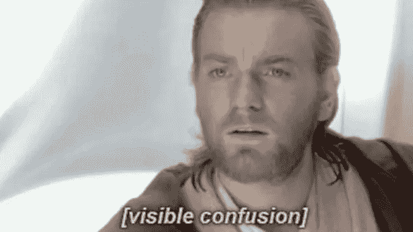
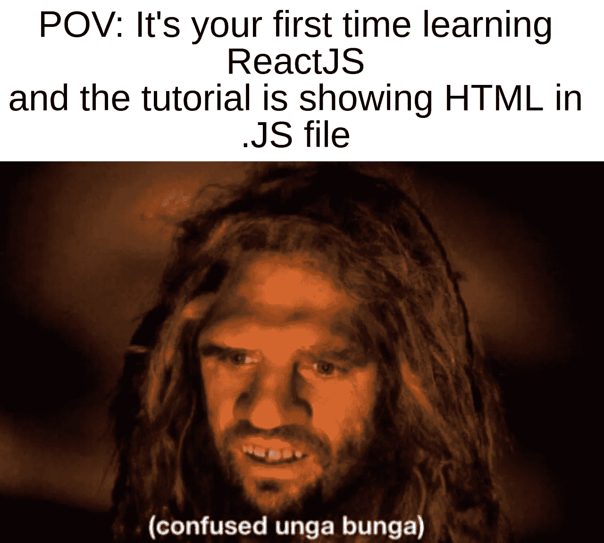

# React JS —令人困惑的部分

> 原文：<https://levelup.gitconnected.com/react-js-the-confusing-parts-4e9aea20c94c>

了解初学者容易遇到的 React 的常见混淆部分。


对 React JS 感到困惑

```
· [React JS](#6f16)
· [What's so confusing about React?](#87cd)
· [Not using the correct version](#1574)
· [Not Starting Components With A Capital Letter](#4b67)
· [Passing Numbers As Strings](#5ae1)
· [Confusing Parenthesis with Curly Brackets](#413d)
· [Getting Confused Between Functions And Classes](#4b66)
· [Conclusion](#1068)
```

# 反应 JS

React.js 现在变得越来越受欢迎，尤其是在投身前端 Web 开发的新手中。React 是由一位在脸书工作的名叫乔丹·沃克的软件工程师创造的。它的创建是为了让开发人员可以用不断变化的数据创建大规模的 web 应用程序，而无需重新加载页面。

# React 有什么好困惑的？

React 的某些部分可能会让开发人员感到困惑，原因有很多。对于初学者来说，他们可能比他们应该做的更早地进入 React，你会惊讶有多少新手在学习 JavaScript 或 3 周后就开始使用 React。当然，对于有更多经验的开发人员来说，这是不同的，可能是不同的编程语言或其他什么，他们对代码如何工作有很好的理解。

**这是针对那些刚刚开始学习 React 或者过一段时间又重新投入使用的开发人员或新手。**

你们中的一些人可能认为下面的观点可能是无用的，或者你不相信有人真的对此感到困惑。有些观点可能确实很容易掌握或理解，但不是每个人都以同样的方式学习和处理事情。我们都应该尽力帮助那些需要帮助的人。

# 没有使用正确的版本



欧比万的明显混乱

这种事情发生得太频繁了，当我开始编码的时候，我遇到过无数次这样的问题。这实际上可以应用于许多其他技术，而不仅仅是反应。

我们大多数人都是通过跟随 Youtube 教程或在线示例开始学习 React 的，但我们并不总是检查视频/示例在今天是否仍然相关，它可能是 5 或 6 年前发布的。因此，在没有检查的情况下，我们继续跟着教师编码，突然我们遇到了一个错误，但是当你看视频教程时，教师似乎没有任何问题，并继续。

这时，我们不得不停止视频，开始将控制台错误输入到谷歌，希望有一个解决方案或堆栈溢出的救星。

事实是，一些库和框架每天、每周、每月甚至一年更新一次。因此，如果你正在观看 2015 年制作的视频教程，它很可能会稍微过时或被弃用，你最终会花费数小时来寻找一个解决方案，使你的代码与视频完全一样。

幸运的是，有些人很善良，在视频上留了一张纸条，说视频中的版本已经过时了。一些遇到同样问题的开发人员会留下评论，解释如何继续学习视频教程。通常，它是一种方法或代码片段，可以用来替换视频中不推荐使用的代码。

# 不以大写字母开头的组件

React 组件的正确命名约定是它必须以大写字母开头。根据您使用的代码编辑器，它甚至可以让您知道在您编写代码时是否犯了这样的错误。

如果组件不是以大写字母开头，它将被视为内置元素，如`<button />`或`<div />`。

基本上，确保用大写字母命名组件，并且不要与上面提到的现有元素同名。当然，有一个名为 **Button** 的定制组件并带有大写字母也很好。

# 将数字作为字符串传递

当创建组件时，我们可以设置可以传递给它的道具，比如一个`value`或者一个`onChange`道具给一个输入组件，比如`<TextField />`。

现在，如果我们想知道你每天看到的迷因的数量会怎么样。我们可能希望将它存储为一个数字而不是一个字符串。

```
// Incorrect
<TextField value="420" />// Correct
<TextField value={420} />
```

使用花括号，我们可以传入一个数值，而不是一个字符串，如果我们继续把它当作一个数值来处理，可能会抛出错误。

如果需要，您甚至可以将三元运算传递到花括号中。



反应模因

# 混淆括号和花括号

考虑这两个 return 语句:

```
// Using curly brackets
return {
    getButton()
};&&// Using parenthesis
return (
    getButton()
);
```

使用花括号的 return 语句将失败，因为它试图返回一个对象，但是使用括号的语句将调用`getButton()`函数，并将返回该函数返回的任何内容；

现在使用箭头函数考虑这两个 React 组件:

```
// Using curly brackets
const PrimaryButton = (props) => {
    return <button onClick={props.onClick} />;
};&&// Using parenthesis
const PrimaryButton = (props) => (
    <button onClick={props.onClick} />
);
```

如果在呈现组件之前需要完成任何类型的逻辑，您可能会使用第一个带有花括号的示例，编写您的逻辑，完成后添加一个带有所需 JSX 的 return 语句。

如果你的组件不需要额外的逻辑，只是一些 JSX，你可以用括号代替，直接返回你的 JSX。

如果你的组件包含一个元素标签，你甚至可以像这样做一行:

```
const PrimaryButton = (props) => <button onClick={props.onClick} />;
```

> 对新手来说，简短的代码并不总是最好的代码，所以在某些情况下，仅仅因为你可以把它变成一行代码并不意味着你应该这样做。

# 混淆函数和类

使用 React 创建组件有两种方式，基于类的组件和功能组件。在基于类的基础上创建功能组件已经慢慢成为了这样做的正常方式。当然，这取决于您使用的 React 版本，使用 React 的早期版本很可能意味着您将拥有基于类的组件。

这就是上一点出现的地方，在跟随教程时使用了错误版本的 React。如果该教程在几年前发布，它可能会使用基于类的组件，而现在使用功能组件可能会更好或更有意义。

现在，你可以创建全功能的 React 应用程序，而不需要使用单一的基于类的组件，但对于新手来说，如果他们需要使用早期版本的 React 来开发应用程序，理解它们仍然很重要。

要更好地理解每种技术的区别和应用，一个很好的地方就是点击此链接的 React 官方文档。

[](https://reactjs.org/docs/components-and-props.html#function-and-class-components) [## 组件和道具-反应

### 组件可以让你将用户界面分割成独立的、可重用的部分，并独立地考虑每一部分。这一页…

reactjs.org](https://reactjs.org/docs/components-and-props.html#function-and-class-components) 

# 结论

与其他库和框架相比，React JS 是一个非常适合初学者的库。这并不意味着新手不会遇到上面提到的一些问题，一开始他们可能会感到困惑。

所以总结一下避免这样的问题:

*   在钻研教程和代码之前，至少要快速通读一下官方文档
*   总是检查教程的发布日期和他们使用的 React 版本
*   将你所学的付诸实践，或者记下你所面临的问题以及你是如何解决的
*   分享你能帮助别人的东西

作为一个新手，你可以在我的一个朋友写的这篇文章 [Tenish](https://medium.com/u/1c8632e9068e?source=post_page-----4e9aea20c94c--------------------------------) 中读到关于什么时候使用 React，关于使用 React vs Vanilla JS。

[](https://javascript.plainenglish.io/react-v-s-vanilla-js-when-to-use-what-22a29979997c) [## React v/s Vanilla JS —何时使用什么？

### Web 应用程序可能很复杂，可能需要很多动态功能。人们可以选择普通的 JS 来构建他们的…

javascript.plainenglish.io](https://javascript.plainenglish.io/react-v-s-vanilla-js-when-to-use-what-22a29979997c) 

如果您不是会员，请考虑通过以下链接注册帮助支持作者:

 [## 阅读 JrPotatoDev(以及媒体上成千上万的其他作家)的每一个故事

### 作为一个媒体会员，你的会员费的一部分会给你阅读的作家，你可以完全接触到每一个故事…

jrpotatodev.medium.com](https://jrpotatodev.medium.com/membership) 

其他一些内容如下:

[](/7-repos-to-help-you-master-javascript-c7d61792f59c) [## 7 个 Repos 帮助你掌握 JavaScript

### 帮助成为更好的 JavaScript 开发人员的资源列表。

levelup.gitconnected.com](/7-repos-to-help-you-master-javascript-c7d61792f59c) [](https://javascript.plainenglish.io/react-is-still-the-king-7e70f9db8288) [## 反应仍然是王道

### React 会长久保持王者地位吗？

javascript.plainenglish.io](https://javascript.plainenglish.io/react-is-still-the-king-7e70f9db8288) [](https://javascript.plainenglish.io/what-actually-counts-as-clean-code-cc5db5f74301) [## 什么才算是干净的代码

### 让开发人员定义干净的代码，他们都会告诉你一些不同的东西。

javascript.plainenglish.io](https://javascript.plainenglish.io/what-actually-counts-as-clean-code-cc5db5f74301)