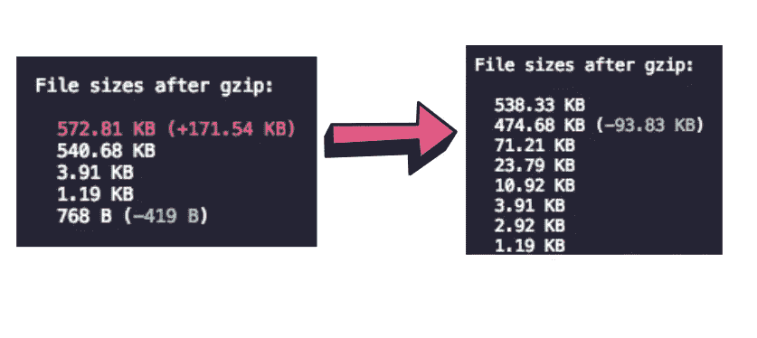
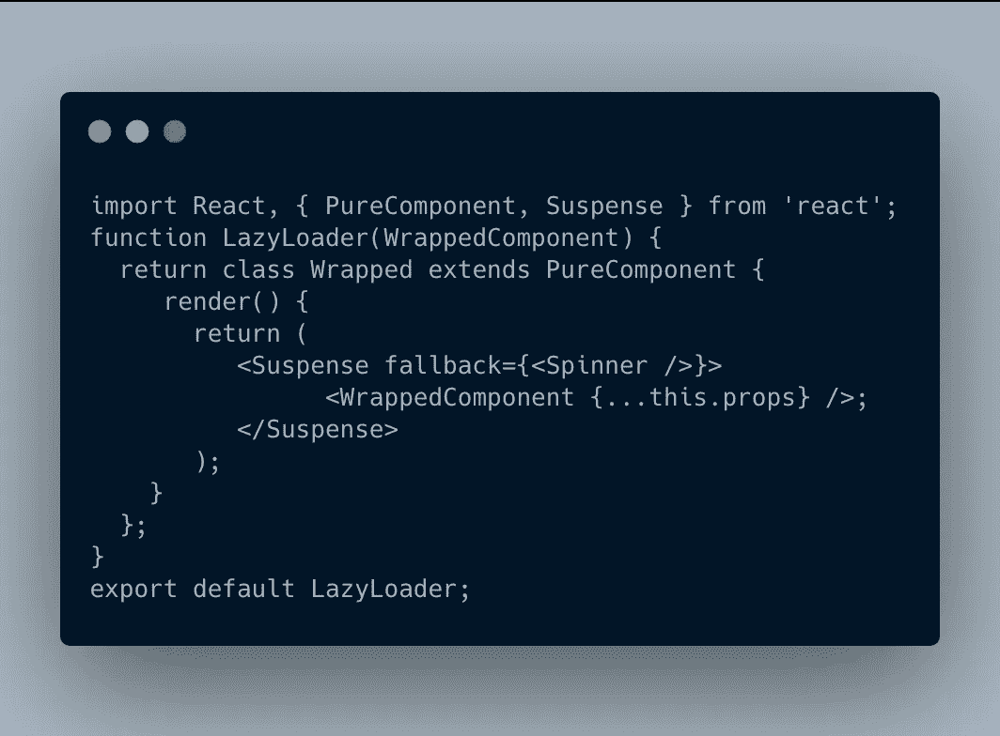
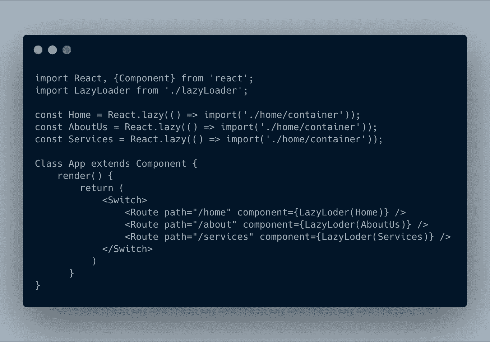

# 反应迟缓—优化包大小

> 原文：<https://levelup.gitconnected.com/react-lazy-optimizing-bundle-size-fd82f4de2382>

## 根据应用程序路由动态加载代码块，以减少包的大小并提高性能。

使用 React Lazy &悬念减少包的大小。

# 为什么

不断有新的页面被添加到你的应用程序中，这导致了代码库的新增加，如组件、容器等。随着越来越多的组件被添加到您的应用程序中，很明显，最终捆绑包的大小可能会增加，达到开始影响应用程序性能的程度。包越大，浏览器加载网页的时间就越长。因此，优化包的大小是一个重要的话题。

# 怎么做

React 懒惰和悬念是一个强大的工具，帮助您实现我们所要求的优化。它的工作原理是，当你的应用程序需要组件时，动态地获取组件，而不是在一开始就将它们添加到浏览器拉取的主包中。

> 文档链接:[https://reactjs.org/docs/code-splitting.html#reactlazy.](https://reactjs.org/docs/code-splitting.html#reactlazy)

决定什么应该动态加载，什么应该作为核心包的一部分，对于每个应用程序来说都是非常具体的。此外，在这种情况下，将应用程序分解为非常精细的粒度来动态加载很可能不是最佳解决方案，因为每次延迟加载都意味着浏览器调用获取所需的内容。

请记住，根据应用程序的路径划分代码块可能是一个有用的解决方案。让我们试一试。

## 基于路由动态加载内容

让我们以一个相当常见的应用程序设计为例，它包含以下页面:

主页|关于我们|服务

假设单独的容器负责处理这些路线是安全的。那么，当用户登陆“主页”时，我们为什么需要将特定于“服务”页面的内容添加到捆绑包中呢？因此，惰性加载路径可以产生一种非常有效的代码分割解决方案。

让我们为我们的应用程序实现 React Lazy 和悬念。

## LazyLoader.js

App.js

这将最终导致为每条路线创建单独的块，而不是有一个单一的沉重的捆绑文件，让您进一步提高应用程序的性能。