# 反应组件的生命周期方法

> 原文：<https://levelup.gitconnected.com/react-lifecycle-2c63aee11c09>

在我之前的[帖子](https://medium.com/@__jay__singh__/everything-about-react-10512639a01e)中，我们只讨论了 React 组件生命周期的基础。在这篇文章中，我将详细解释 React 组件以及组件的生命周期和阶段。**这些生命周期方法在 React v16.4+** 之后可用

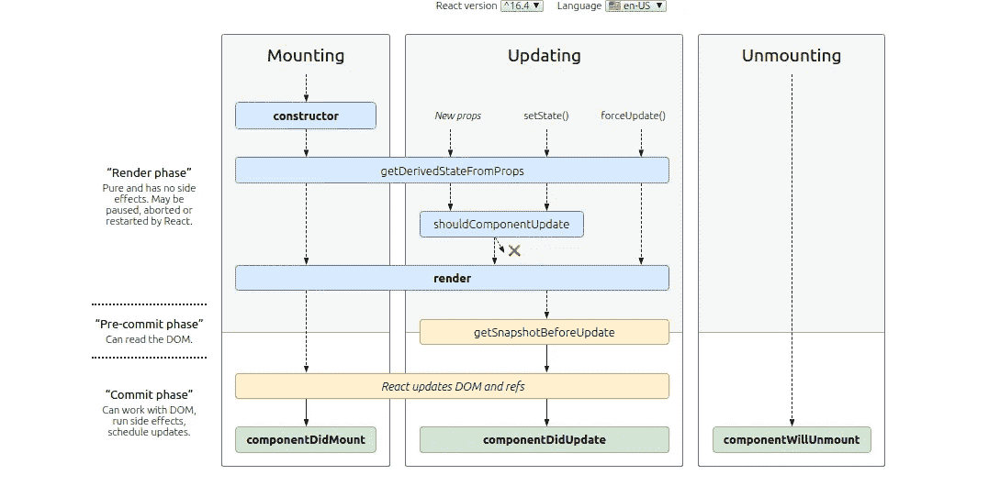

React 中的组件有一个生命周期，允许您在它经历三个主要阶段时执行功能:

*   **安装**
*   **更新**
*   **卸载**

# **安装**

在挂载阶段，状态被初始化，元素被添加到 DOM 中。React 有四种内置方法来处理组件安装:

1.  [建造师](#ce6c)
2.  [getDerivedStateFromProps](#b1e6)
3.  [渲染](#b04c)
4.  [组件安装](#b017)

## 构造器

调用`constructor(props)`方法时将`props`作为参数，您应该总是在调用其他任何方法之前先调用`super(props)`。这将启动父组件的构造方法，并允许组件从其父组件继承方法(`React.Component`)。

如果你没有初始化状态，也没有绑定方法，你不需要为你的 React 组件实现一个构造函数。

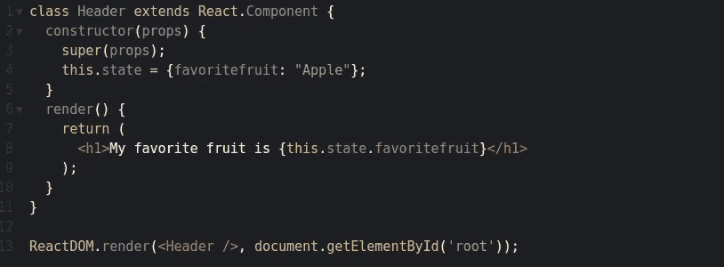

## getDerivedStateFromProps

这个方法在调用 render 方法之前被调用，无论是在初始挂载时还是在后续更新时。它应该返回一个对象来更新状态，或者返回 null 来不更新任何东西。

下面的例子以最喜欢的水果“苹果”开始，但是`getDerivedStateFromProps()`方法基于`favfruit`属性更新最喜欢的水果:

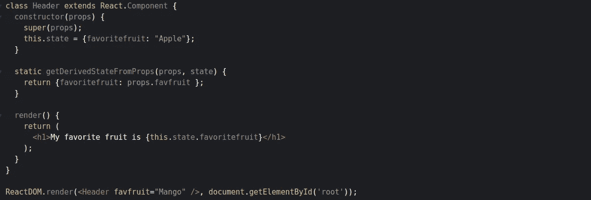

## 提供；给予

这是每个组件都需要的方法。每当`state`或`props` 改变*，*时，该方法被调用，并且它必须用新的改变将 HTML 重新呈现到 DOM。

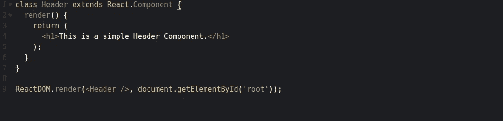

## 组件安装

`componentDidMount()`组件安装(插入到树中)后立即调用。需要 DOM 节点的初始化应该放在这里。如果需要从远程端点加载数据，这是实例化 API 请求的好地方。

*举例——起初我最喜欢的水果是“苹果”，但 1 秒钟后* `*setTimeout*` *，它被“芒果”* *代替:*

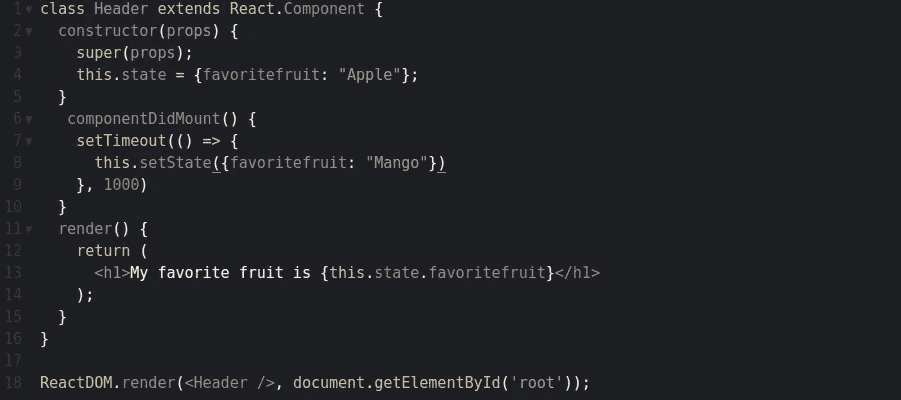

# **更新**

每当组件的`state`或`props`发生变化时，组件就会更新。React 有五个内置方法，当组件更新时，按以下顺序调用:

1.  [getDerivedStateFromProps](#9500)
2.  [shouldComponentUpdate](#278b)
3.  [渲染](#b04c)
4.  [getsnapshot before update](#7268)
5.  [组件更新](#050c)

## getDerivedStateFromProps

在更新过程中，会调用`[getDerivedStateFromProps](#9500)`方法。

下面的例子有一个按钮，它把最喜欢的水果变成蓝色，但是由于调用了`getDerivedStateFromProps()`方法，它用来自`favfruit`属性的水果更新状态。最喜欢的水果仍然呈现为黄色:

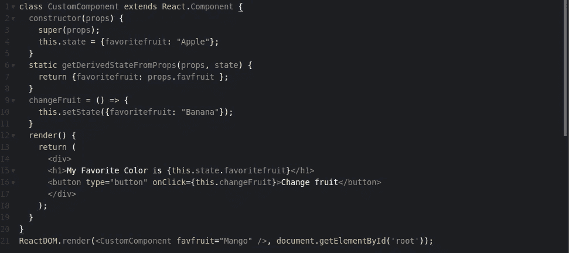

## shouldComponentUpdate

在`shouldComponentUpdate()`方法中，您可以返回一个布尔值，指定 React 是否应该继续渲染。在`PureComponent`中，默认情况下使用`state`和`props`与它们之前的值的浅层比较来处理`shouldComponentUpdate()`方法。

下面的例子显示了当`shouldComponentUpdate()`方法返回`false`时会发生什么。它阻止组件在更新阶段重新呈现。

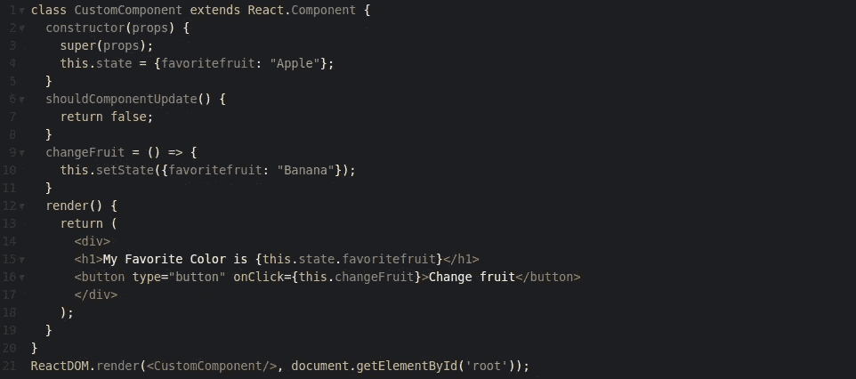

现在我们将运行与上面相同的例子，但是这次`shouldComponentUpdate()`方法返回`true`。它不会阻止组件在每次更新时进行渲染。

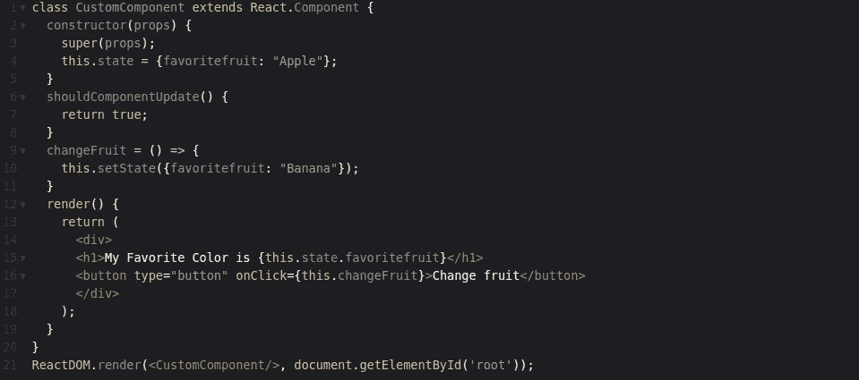

## getSnapshotBeforeUpdate

`getSnapshotBeforeUpdate()`在最近渲染的输出提交到 DOM 之前被调用。它使您的组件能够在 DOM 发生潜在变化之前捕获一些信息(例如滚动位置)。该生命周期返回的任何值都将作为参数传递给`componentDidUpdate()`。

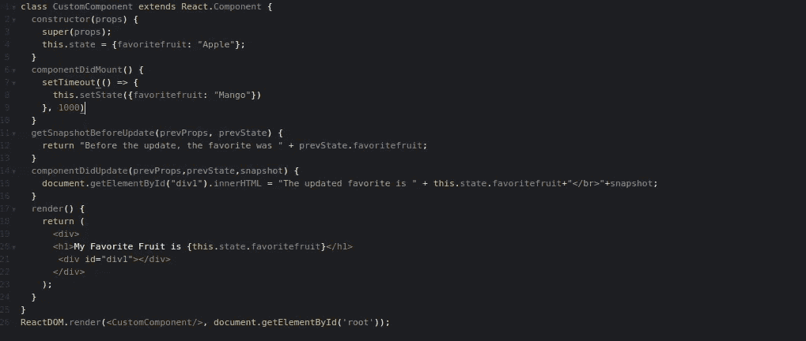

上例中，组件在*挂载*时，渲染的是喜欢的水果“苹果”。当组件已经挂载完毕，一个定时器改变状态，一秒钟后，喜欢的水果就变成了“芒果”。这个动作触发了*更新*阶段，由于这个组件有一个`getSnapshotBeforeUpdate()`方法，这个方法被执行并返回字符串。然后执行`componentDidUpdate()`方法，并在空的`div1`元素中写入一条消息。

## componentDidUpdate

`componentDidUpdate()`在更新发生后立即被调用。初始呈现时不调用此方法。您可以在`componentDidUpdate()`立即给`setState()`打电话。通常在`componentDidUpdate`中，你将逻辑包装在一个条件中，这样你就不会在每次`state`或`props`改变时执行它。

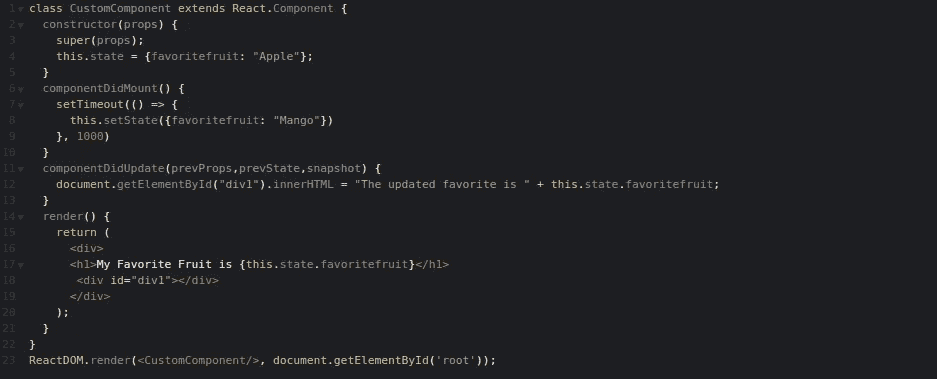

在上面的例子中，当组件被*挂载*时，它被渲染成最喜欢的水果“苹果”。当组件已经挂载*，*一个定时器改变状态，一秒钟后，喜欢的水果变成了“芒果”。这个动作触发了*更新*阶段，然后`componentDidUpdate()`方法被执行并在空的`div1`元素中写入一条消息。

# **卸载**

生命周期的下一个阶段是当一个组件从 DOM 中移除，或者*卸载*，正如它在 React 中被命名的那样。React 只有一个内置的方法，当组件被卸载时会调用这个方法。

## **组件将卸载**

`componentWillUnmount()`在组件被卸载和销毁之前立即被调用。在该方法中执行任何必要的清理，例如使计时器失效、取消网络请求或清理在`componentDidMount()`中创建的任何订阅。

你**不应该调用`componentWillUnmount()`中的** `**setState()**`，因为组件永远不会被重新渲染。

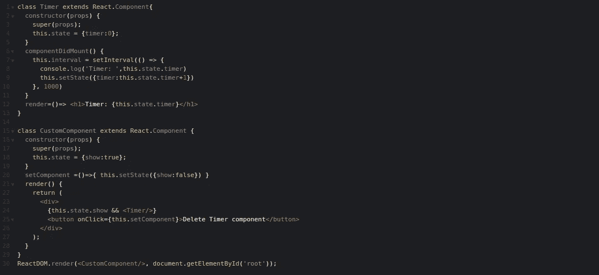

上面的例子有内存泄漏，因为即使组件被卸载，`setInterval`也将继续运行。我们需要清理一下。

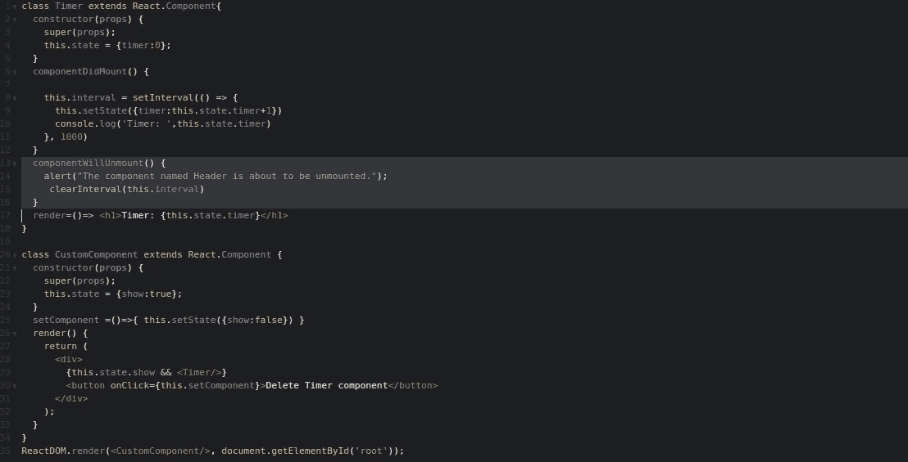

上面的例子在组件卸载时停止 interval 函数，因为我们在`componentWillUnmount`函数中调用了`clearInterval`，删除了计时器。

我希望这篇文章能帮助你学习 React 组件生命周期。