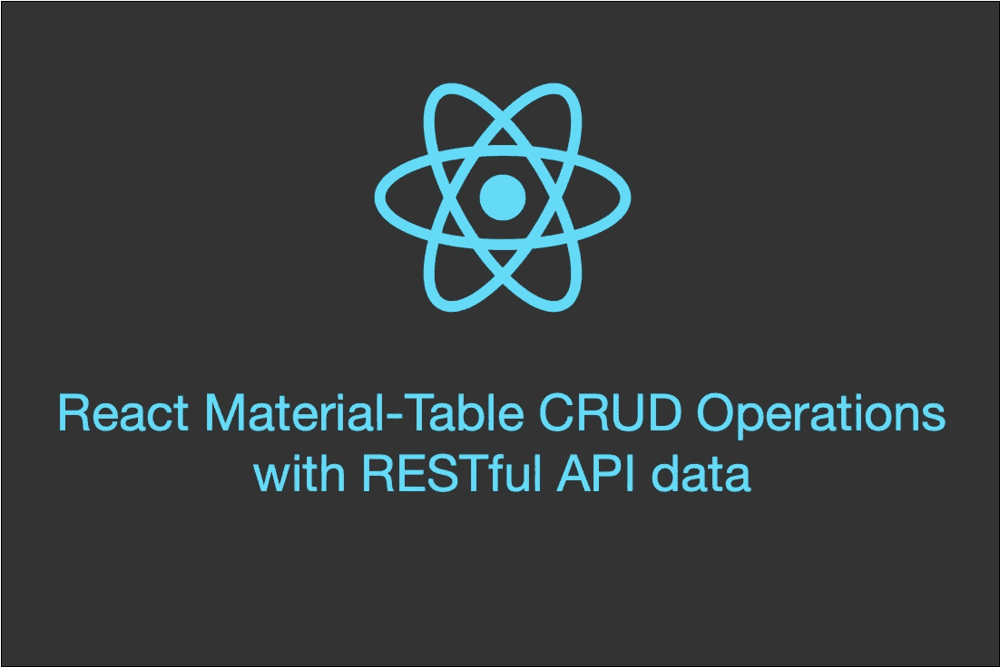
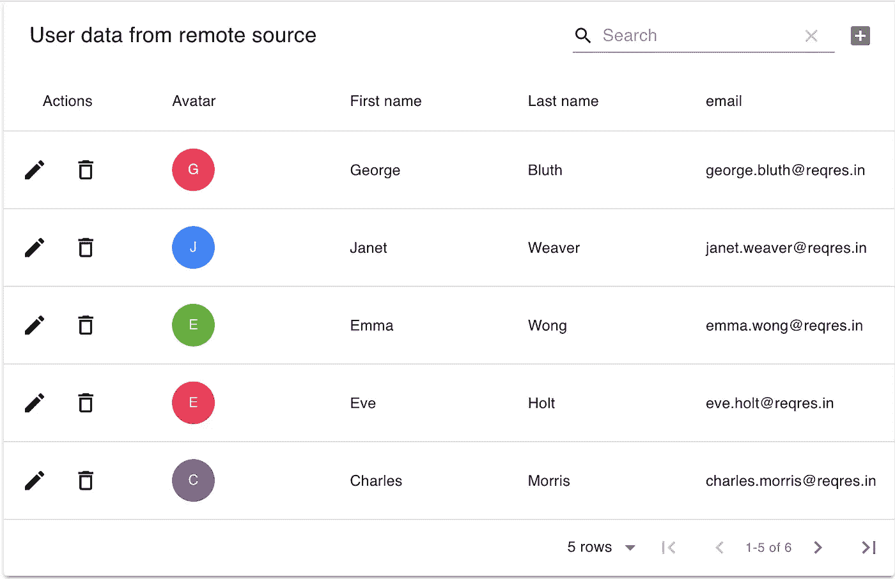

# 用 RESTful API 数据反应材料表 CRUD 操作

> 原文：<https://levelup.gitconnected.com/react-material-table-crud-operations-with-restful-api-data-ca1af738d3c5>

## 学习使用 Material-Table 在几行代码中执行 CRUD 操作



大家好，欢迎来到我的第一个 [react.js](https://reactjs.org/) 教程😊我将通过构建一个简单的用户管理 web 应用程序，向您展示如何在 React 中执行 CRUD 操作。我们将使用带有远程数据(即来自 RESTful API 的数据)的 [Material-table](https://material-table.com/) 包。

下面的视频展示了我们将要开发的应用程序。

Material-table 包扩展了 Material-ui 的默认表，提供了许多很酷的现成特性，如搜索栏、添加按钮、分页等。使用 Material 表提供了一种在 react.js 中执行 CRUD 操作的超级无缝的方法。相信我，在了解了使用这个令人敬畏的包是多么容易之后，您不会想要经历使用传统形式进行 CRUD 操作的压力。好了，说够了。让我们开始吧。

我将假设您对基本的 react 概念(比如状态)、Javascript 和 RESTful API 有点熟悉。此外，重要的 UI 知识也很重要，但不是必须的。

为了开始使用材料表，请确保按如下方式安装:

```
npm install material-table --save
npm install [@material](http://twitter.com/material)-ui/core --save
**or (if you using yarn)** yarn add material-table
yarn add [@material](http://twitter.com/material)-ui/core
```

材料表使用材料界面图标，因此请确保安装材料界面图标，如下所示:

```
npm install [@material](http://twitter.com/material)-ui/icons --save
yarn add [@material](http://twitter.com/material)-ui/icons
```

我还使用 Material-ui Alert 组件在出错时发出通知。我们需要使用下面的命令安装它:

```
npm install @material-ui/lab --save
yarn add @material-ui/lab
```

哦，差点忘了用来发起 API 请求的 [axois](https://www.npmjs.com/package/axios) 包。请按照以下方式安装软件包:

```
npm install axios --save
yarn add axios
```

现在我们已经安装了所需的包，让我们来看看源代码。[**github**](https://github.com/effiongcharles/material-ui-table-crud-restapi)上有完整的项目源代码供您下载试用。这里我将只关注相关的代码部分。

# 后端—远程数据源

这个应用程序依赖于一个免费的在线 REST API，以抽象出我们自己创建这样一个 API 的复杂性，因为这不是本教程的重点。为此，我们将使用[https://reqres.in/](https://reqres.in/)。它提供了 API 端点，允许我们发出(与用户相关的)API 请求，比如 POST(用于创建记录，在我们的例子中:创建新用户)、GET(用于获取记录)、PUT/PATCH(用于更新记录)、DELETE(顾名思义😏)等。我建议您访问该站点，熟悉各种可能的 API 调用。让我们转到事情的前端。

# 前端—反应、物料界面/表格

React [Material UI](https://material-ui.com/) 为我们提供了许多组件(Alert、Tables、Navbar 等),用于在 React 中创建出色的用户界面——无需编写一行 CSS 代码。另一个流行的 UI 框架是“react-bootstrap”(是的，这是为 react 重建的旧的 bootstrap 框架)。如前所述，Material-table 扩展了默认的 Material-UI 表，增加了一些很酷的特性。让我们从用户表开始。

表格通常有行和列。我们需要为表格定义列和行(数据),如下所示:

```
var columns = [{title: "id", field: "id", hidden: true},
{title: "Avatar", render: rowData => <Avatar maxInitials={1} size={40} round={true} name={rowData === undefined ? " " : rowData.first_name} />  },
{title: "First name", field: "first_name"},
{title: "Last name", field: "last_name"},
{title: "email", field: "email"}]const [data, setData] = useState([]); //table data//for error handling
const [iserror, setIserror] = useState(false)
const [errorMessages, setErrorMessages] = useState([])
```

根据上面的代码片段，我们的表将有 id、名字、姓氏、电子邮件和头像列。让我们看一个例子，我们将从 RESTful API 接收 JSON 数据。如下所示:

```
//JSON data from RESTful API
"user": 
 {
    "id": 2,
    "email": "janet.weaver@reqres.in",
    "first_name": "Janet",
    "last_name": "Weaver",
    "avatar": " "
 }
```

您是否注意到 JSON 数据键(id，email，…)与表列—字段属性(id，email，…)完全匹配？这非常重要，因为 Material-table 依赖于此来正确显示来自 API 的数据，即将 API 数据映射到表列。希望你明白了？

“data”变量将我们的表数据存储在一个状态变量中。当状态改变时(使用 set 方法，即我们示例中的 setData ), app(*react*语言中的组件)重新呈现(反应)。其他状态变量用于错误处理。我们稍后会谈到它们。

下一步是从 API 获取数据，以便数据变量可以保存用户记录，而不是一个空数组。这里，我们需要向我们的 API 发起一个 GET 请求，这样我们就可以从 API 接收用户列表作为响应。接下来让我们看看这是如何做到的

```
useEffect(() => {
  api.get("/users")
    .then(res => {
      setData(res.data.data)
    })
    .catch(error=>{
      setErrorMessage(["Cannot load user data"])
      setIserror(true)
    })
}, [])
```

我们在 useEffect react 挂钩中获取用户列表—useEffect 函数在每次呈现功能组件时运行，例如当页面刷新或状态数据更改时(在这种情况下，状态数据需要包含在 use effect 数组中)。API 用一个用户数据列表来响应我们发起的 GET 请求。然后，我们使用 setData 方法来更改数据对象的状态。现在，数据变量包含用户列表，而不是一个空数组。另一方面，如果出现错误，我们会提醒用户。很简单，对吧？😊

我们有了数据，现在是时候把它们展示在桌面上了。

```
<MaterialTable
  title="User list from API"
  columns={columns}
  data={data}
  icons={tableIcons}
  editable={{
    **onRowUpdate**: (newData, oldData) =>
      new Promise((resolve) => {
        handleRowUpdate(newData, oldData, resolve);
  }),
  **onRowAdd**: (newData) =>
    new Promise((resolve) => {
      handleRowAdd(newData, resolve)
    }),
  **onRowDelete**: (oldData) =>
    new Promise((resolve) => {
      handleRowDelete(oldData, resolve)
    }),
  }}
/>
```

上面的代码片段负责显示表格。它使用“材料表”组件。我们指定标题、列和数据(用户列表)。我们还包括组件所需的图标列表。这些图标包括箭头(用于分页)、搜索、编辑、删除图标等。如果我们运行该应用程序，将显示下面的屏幕截图。



这就解决了在 T2 和 UD 运营中的第一个问题。让我们继续进行**C**create 操作，即添加一个新用户。请注意，上面的代码包括用于执行其他 CRUD 操作(创建、更新和删除)的“道具”。“onRowAdd”属性创建一个新的“promise”对象(Promise 返回一个未来值。这允许处理异步事件— [在这里阅读更多](https://developer.mozilla.org/en-US/docs/Web/JavaScript/Reference/Global_Objects/Promise)。)promise 对象调用“handleRowAdd()”函数。下面的代码片段提供了函数实现。

```
const handleRowAdd = (newData, resolve) => {
  //validation
  let errorList = []
  if(newData.first_name === undefined){
    errorList.push("Please enter first name")
  } if(newData.last_name === undefined){
    errorList.push("Please enter last name")
  } if(newData.email === undefined || validateEmail(newData.email) === false){
    errorList.push("Please enter a valid email")
  } if(errorList.length < 1){ //no error
    api.post("/users", newData)
      .then(res => {
        let dataToAdd = [...data];
        dataToAdd.push(newData);
        setData(dataToAdd);
        resolve()
        setErrorMessages([])
        setIserror(false)
     })
     .catch(error => {
        setErrorMessages(["Cannot add data. Server error!"])
        setIserror(true)
        resolve()
      })
  }else{
    setErrorMessages(errorList)
    setIserror(true)
    resolve()
  }
}
```

这个功能看起来很简单。首先，我们做一些验证，以确保用户已经完成所有必填字段。接下来，我们发送一个 POST 请求，其中包含我们想要添加的数据(即“newData”)。然后，我们可以继续做别的事情(是的，这就是“Promise”的用武之地——想想多线程),直到我们收到来自服务器(API)的响应。如果 POST 请求成功，那么我们使用 setData()函数更新状态数据，并将“Promise”标记为 resolved(参见“then”函数)。否则，我们会提醒用户一个错误。

现在让我们看看如何更新表中的给定行。为此，我们调用“handleRowUpdate(…)”函数。下面给出了它的实现。

```
const handleRowUpdate = (newData, oldData, resolve) => { //validation
  .....
  if(errorList.length < 1){
    api.patch("/users/"+newData.id, newData)
      .then(res => {
        const dataUpdate = [...data];
        const index = oldData.tableData.id;
        dataUpdate[index] = newData;
        setData([...dataUpdate]);
        resolve()
        setIserror(false)
        setErrorMessages([])
      })
      .catch(error => {
        setErrorMessages(["Update failed! Server error"])
        setIserror(true)
        resolve()
    })
  }else{
    setErrorMessages(errorList)
    setIserror(true)
    resolve()
  }
}
```

我很确定你能弄清楚这个函数是干什么的。我们发起一个补丁请求，这是更新数据的 API 调用。注意，我们在请求 URL 中传递了 **id** (在我们的例子中是用户 id)，这样 API 就知道要更新哪个记录。如果服务器能够成功地批准我们的请求，我们就会收到一个响应。然后，我们更新我们的状态。否则，我们会提醒用户出现错误。跳过表单验证，因为它与前一种情况相似。

所以，这就是我们的**C**create**R**EAD**U**pdate 操作。我们现在只剩下删除操作了。接下来让我们来看看。

```
const handleRowDelete = (oldData, resolve) => {
  api.delete("/users/"+oldData.id)
    .then(res => {
      const dataDelete = [...data];
      const index = oldData.tableData.id;
      dataDelete.splice(index, 1);
      setData([...dataDelete]);
      resolve()
    })
    .catch(error => {
      setErrorMessages(["Delete failed! Server error"])
      setIserror(true)
      resolve()
    })
}
```

上面的代码片段提供了处理删除操作的函数。这个方法和前面的(补丁)很像。这里的区别是我们发起一个删除请求。

# 摘要

在本教程中，您已经学习了如何使用流行的 React 材料表和 RESTful API 中的数据在 React 中执行 CRUD 操作。

Material-table 很棒，我喜欢它提供的开箱即用的特性，例如(易于创建、更新、删除记录或行)。我个人曾将这个包用于生产级代码。该软件包的另一个有趣的特性是它非常容易定制。您可以用材质-UI 日期时间选择器替换这些列，或者更改图标(删除、编辑、搜索)。也就是说，Material-table 特别适合显示表格数据。

我希望你在这篇教程中学到了一些东西。

随意在 Github 上[下载/克隆项目源代码。](https://github.com/effiongcharles/material-ui-table-crud-restapi)

如果你是 haven't☺️人，可以看看我的其他关于 Python 中的[网络编程的教程](/program-your-first-multiple-user-network-game-in-python-9f4cc3650de2?source=friends_link&sk=312059e7967875fdbf4c7b67520bbdc9)

祝你好运！