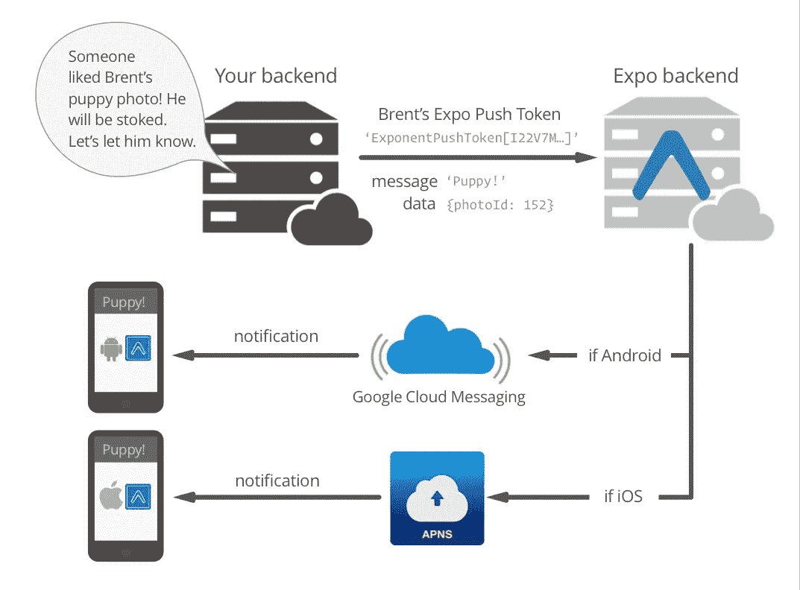
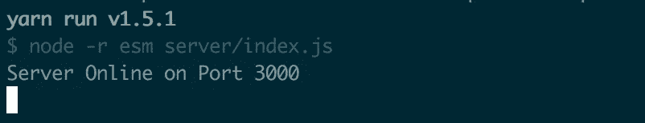
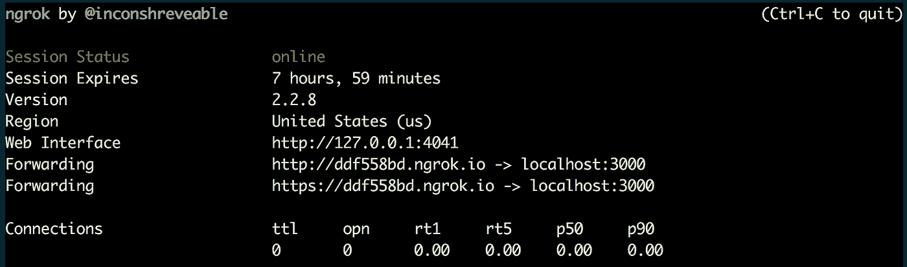
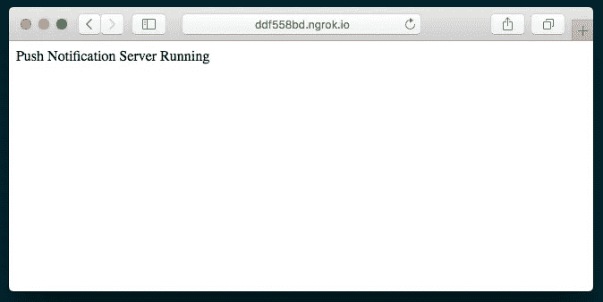
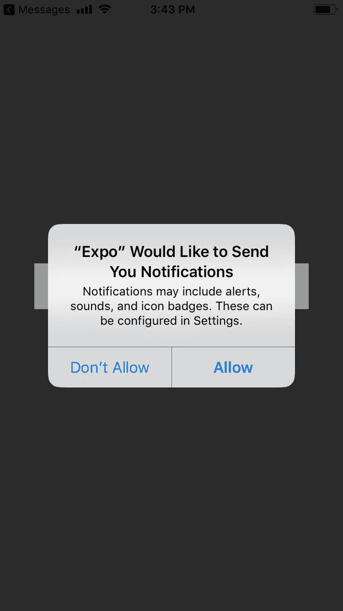
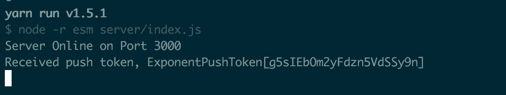
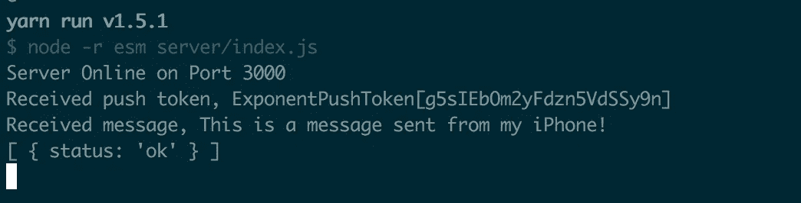
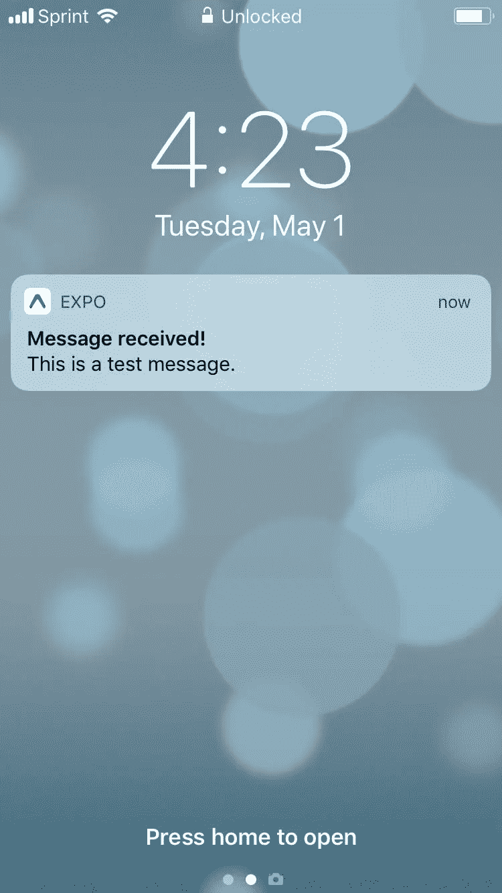

# React Native:通过 Expo 向您的应用程序添加推送通知

> 原文：<https://levelup.gitconnected.com/react-native-adding-push-notifications-to-your-app-with-expo-8e4b659ddbfb>


由[乔安娜·科辛斯卡](https://unsplash.com/@joannakosinska)拍摄。来源:https://unsplash.com/photos/LbMy35NyCNg

这是我的书《反应本地烹饪书》的摘录，第二版，由 Packt 出版社出版，将于今年冬天出版。

推送通知是一种很好的方式，通过不断提供与用户相关的应用特定数据，在应用和用户之间提供持续的反馈循环。当新消息到达时，消息应用程序会发送通知。提醒应用程序会显示一个通知，提醒用户在特定时间或位置的任务。播客应用程序可以使用通知来通知用户新的剧集已经发布。购物应用程序可以使用通知来提醒用户结算限时交易。

推送通知是一种行之有效的增加用户互动和保留的方式。如果你的应用程序使用时间敏感或基于事件的数据，推送通知可能是一个有价值的资产。在本教程中，我们将使用 Expo 的推送通知实现，它简化了普通 React 本地项目所需的一些设置。如果需求或者你的 app 要求非世博项目，我会推荐考虑[https://github.com/zo0r/react-native-push-notification](https://github.com/zo0r/react-native-push-notification)的`react-native-push-notification`套餐。

在本教程中，我们将制作一个非常简单的带有推送通知的消息应用程序。我们将请求适当的权限，然后向我们将要构建的 Express 服务器注册推送通知令牌。我们还将呈现一个`TextInput`,供用户输入消息。当按下**发送**按钮时，消息将被发送到我们的服务器，服务器将通过 Expo 的推送通知服务器向所有在我们的 Express 服务器上注册了令牌的设备发送推送通知，以及来自应用程序的消息。

由于 Expo 内置的推送通知服务，为每个本地设备创建通知的复杂工作被卸载到 Expo 托管的后端。我们在本教程中构建的 Express 服务器将把每个推送通知的 JSON 对象传递给 Expo 后端，剩下的就交给它了。下图来自 Expo 文档，展示了推送通知的生命周期。



来源:[https://docs . Expo . io/versions/latest/guides/push-notifications](https://docs.expo.io/versions/latest/guides/push-notifications)

虽然使用 Expo 实现推送通知的设置工作比其他方式要少，但是技术的需求仍然意味着我们需要运行一个服务器来处理注册和发送通知，这意味着本教程将比大多数教程稍长一些。我们开始吧！

# 做好准备

在这个应用程序中，我们需要做的第一件事就是请求设备允许我们使用推送通知。不幸的是，推送通知权限在模拟器中无法正常工作，所以需要一个真实的设备来测试这个应用程序。

我们还需要能够从本地主机之外的地址访问推送通知服务器。在现实世界的设置中，推送通知服务器已经有了一个公共 url，但是在开发环境中，最简单的解决方案是创建一个隧道，将开发推送通知服务器暴露给互联网。为此，我们将使用 ngrok 工具，因为它是一个成熟的、健壮的、非常易于使用的解决方案。你可以在 https://ngrok.com 了解更多关于这个软件的信息。

首先使用以下命令通过 npm 全局安装 ngrok:

```
npm i -g ngrok
```

安装完成后，您可以通过使用 https 参数执行 ngrok 来创建一个从 internet 到本地计算机端口的隧道:

```
ngrok https [port-to-expose]
```

我们将在教程的后面使用这个命令来公开开发服务器。

让我们使用 Expo 为这个教程创建一个新的应用程序。我们就叫它`push-notifications`。对于本教程，我们需要三个额外的 npm 包:`express`用于推送通知服务器，`esm`用于在服务器上使用 ES6 语法支持，`expo-server-sdk`用于处理推送通知。用纱线安装它们:

```
yarn add express esm expo-server-sdk
```

或 npm:

```
npm install express esm expo-server-sdk --save
```

# 如何

1.让我们从构建应用程序开始。我们将开始向`App.js`添加我们需要的依赖项。

```
import React from 'react';
import {
  StyleSheet,
  Text,
  View,
  TextInput,
  Modal,
  TouchableOpacity
} from 'react-native';
import { Permissions, Notifications } from 'expo';
```

2.我们将为服务器上的 API 端点声明两个常量，但是 url 将在我们稍后运行服务器时由 ngrok 生成，所以我们将在那时更新这些常量的值。

```
const PUSH_REGISTRATION_ENDPOINT = 'http://**generated-ngrok-url**/token';
const MESSAGE_ENPOINT = 'http://**generated-ngrok-url**/message';
```

3.让我们创建`App`组件并初始化`state`对象。我们需要一个通知属性来保存由`Notifications`监听器接收的`notifications`，我们将在后面的步骤中定义它。

```
export default class App extends React.Component {
  state = {
    notification: null,
    messageText: ''
  } // Defined in following steps
}
```

4.让我们定义将处理向服务器注册推送通知令牌的方法。我们将通过`Permissions`组件上的`askAsync`方法向用户请求通知权限。如果许可被授予，从设备的`Notifications`组件的`getExpoPushTokenAsync`方法获取令牌。

```
registerForPushNotificationsAsync = async () => {
    const { status } = await Permissions.askAsync(Permissions.NOTIFICATIONS);
    if (status !== 'granted') {
      return;
    }
    let token = await Notifications.getExpoPushTokenAsync(); // Defined in following steps
  }
```

5.一旦我们有了合适的令牌，我们将把它发送到推送通知服务器进行注册。然后，我们将向`PUSH_REGISTRATION_ENDPOINT`发出 POST 请求，在请求体中发送一个`token`对象和`user`对象。我已经对用户对象中的值进行了硬编码，但是在真正的应用程序中，这将是您为当前用户存储的元数据。

```
registerForPushNotificationsAsync = async () => {
    // Defined in above step **return fetch(PUSH_REGISTRATION_ENDPOINT, {**
 **method: 'POST',**
 **headers: {**
 **'Accept': 'application/json',**
 **'Content-Type': 'application/json',**
 **},**
 **body: JSON.stringify({**
 **token: {**
 **value: token,**
 **},**
 **user: {**
 **username: 'warly',**
 **name: 'Dan Ward'**
 **},**
 **}),**
 **});** // Defined in next step
  }
```

6.注册令牌后，我们将设置一个事件监听器来监听应用程序打开和前景化时发生的任何通知。在某些情况下，我们将需要手动处理显示来自传入推送通知的信息。查看本教程末尾的*工作原理*部分，了解为什么这是必要的以及如何利用它。我们将在下一步定义处理程序。

```
**registerForPushNotificationsAsync = async () => {**
    // Defined in above steps this.notificationSubscription = Notifications.addListener(this.handleNotification);
 **}**
```

7.每当接收到新的通知，就会运行`handleNotification`方法。我们将把传递给这个回调函数的新通知存储在`state`对象上，供以后在`render`函数中使用。

```
handleNotification = (notification) => {
    this.setState({ notification });
  }
```

8.我们希望我们的应用程序请求使用推送通知的权限，并在应用程序启动时注册推送通知令牌。我们将利用`componentDidMount`生命周期挂钩来运行我们的`registerForPushNotificationsAsync`方法。

```
componentDidMount() {
    this.registerForPushNotificationsAsync();
  }
```

9.为了保持教程的简单，用户界面将会非常简洁。它由一个用于消息文本的`TextInput`、一个用于发送消息的 **Send** 按钮和一个用于显示通知监听器所听到的任何通知的`View`组成。

```
render() {
    return (
      <View style={styles.container}>
        <TextInput
          value={this.state.messageText}
          onChangeText={this.handleChangeText}
          style={styles.textInput}
        />
        <TouchableOpacity
          style={styles.button}
          onPress={this.sendMessage}
        >
          <Text style={styles.buttonText}>Send</Text>
        </TouchableOpacity>
        {this.state.notification ?
          this.renderNotification()
        : null}
      </View>
    );
  }
```

10.上一步中定义的`TextInput`组件缺少其`onChangeText`属性所需的方法。接下来让我们创建这个方法。它只是将用户输入的文本保存到`this.state.messageText`中，这样它就可以被`value`道具和其他地方使用。

```
handleChangeText = (text) => {
    this.setState({ messageText: text });
  }
```

11.当用户按下按钮时，`TouchableOpacity`组件的`onPress`属性正在调用`sendMessage`方法来发送消息文本。在这个函数中，我们将获取消息文本并将其发布到我们的推送通知服务器上的`MESSAGE_ENDPOINT`。服务器将从那里处理事情。一旦消息发出，我们将清除`state`上的`messageText`属性。

```
sendMessage = async () => {
    fetch(MESSAGE_ENPOINT, {
      method: 'POST',
      headers: {
        Accept: 'application/json',
        'Content-Type': 'application/json',
      },
      body: JSON.stringify({
        message: this.state.messageText,
      }),
    });
    this.setState({ messageText: '' });
  }
```

12.我们为`App`需要的最后一件东西是款式。由于本教程是关于通知，而不是对 React 本机应用程序进行样式化，所以我们不会深入研究样式和布局，尽管这里没有发生非常复杂的事情。你可以在[文档中阅读更多关于 React Native 的`StyleSheet`组件，以及在](https://facebook.github.io/react-native/docs/stylesheet)[文档](https://facebook.github.io/react-native/docs/flexbox)中阅读 flexbox 如何在 React Native 中工作。

```
const styles = StyleSheet.create({
  container: {
    flex: 1,
    backgroundColor: '#474747',
    alignItems: 'center',
    justifyContent: 'center',
  },
  textInput: {
    height: 50,
    width: 300,
    borderColor: '#f6f6f6',
    borderWidth: 1,
    backgroundColor: '#fff',
    padding: 10
  },
  button: {
    padding: 10
  },
  buttonText: {
    fontSize: 18,
    color: '#fff'
  },
  label: {
    fontSize: 18
  }
});
```

13.React 本机应用程序部分已经完成，让我们来看看服务器部分。首先，我们将在项目的根目录下创建一个新的`server`文件夹，其中包含一个`index.js`文件。让我们首先导入`express`来运行服务器，导入`expo-server-sdk`来处理注册和发送推送通知。我们将创建一个 express server 应用程序并存储在 const `app`中，并将 expo server SDK 的新实例存储在 const `expo`中。我们还将添加一个`savedPushTokens`数组，用于存储向 React 本机应用程序注册的任何令牌，以及一个`PORT_NUMBER`常量，用于我们希望运行服务器的端口。

```
import express from 'express';
import Expo from 'expo-server-sdk';const app = express();
const expo = new Expo();let savedPushTokens = [];
const PORT_NUMBER = 3000;
```

14.我们的服务器将需要公开两个端点(一个用于注册令牌，一个用于接受来自 React 本机应用程序的消息)，因此我们将创建两个函数，当这些路由被命中时将执行这两个函数。我们将首先定义`saveToken`函数。它只是获取一个令牌，检查它是否存储在`savedPushTokens`数组中，如果它不存在，就把它推到数组中。

```
const saveToken = (token) => {
  if (savedPushTokens.indexOf(token === -1)) {
    savedPushTokens.push(token);
  }
}
```

15.我们的服务器需要的另一个功能是一个处理程序，用于在从 React 本地应用程序收到消息时发送推送通知。我们将遍历所有保存到`savedPushTokens`数组的令牌，并为每个令牌创建一个消息对象。每个消息对象都有一个标题“消息已收到！”这将在推送通知中以粗体显示，消息文本作为通知的正文。

```
const handlePushTokens = (message) => {
  let notifications = [];
  for (let pushToken of savedPushTokens) {
    if (!Expo.isExpoPushToken(pushToken)) {
      console.error(`Push token ${pushToken} is not a valid Expo push token`);
      continue;
    }
    notifications.push({
      to: pushToken,
      sound: 'default',
      title: 'Message received!',
      body: message,
      data: { message }
    })
  } // Defined in following step
}
```

16.一旦我们有了一组消息，我们就可以把它们发送到 Expo 的服务器上，然后服务器会把推送通知发送到所有注册的设备上。我们将通过 expo 服务器的`chunkPushNotifications`和`sendPushNotificationsAsync`方法发送消息数组，并通过`console.log`向服务器控制台发送适当的成功回执或错误。在本教程末尾的*工作原理*部分有更多关于这种工作原理的内容。

```
const handlePushTokens = (message) => {
  // Defined in previous step **let chunks = expo.chunkPushNotifications(notifications);** **(async () => {**
 **for (let chunk of chunks) {**
 **try {**
 **let receipts = await expo.sendPushNotificationsAsync(chunk);**
 **console.log(receipts);**
 **} catch (error) {**
 **console.error(error);**
 **}**
 **}**
 **})();**
}
```

17.现在我们已经定义了处理推送通知和消息的函数，让我们通过创建 API 端点来公开这些函数。如果您不熟悉 Express，它是一个强大且易于使用的框架，用于在 Node 中运行 web 服务器。在[https://expressjs.com/en/starter/basic-routing.html](https://expressjs.com/en/starter/basic-routing.html)你可以通过基本路线文件快速掌握路线的基本知识。
我们将使用 JSON 数据，所以第一步将通过调用`express.json()`来应用 JSON 解析器中间件。

```
app.use(express.json());
```

18.即使我们不会真正使用服务器的根路径(`/`)，定义一个也是很好的做法。我们将只回复一条服务器正在运行的消息。

```
app.get('/', (req, res) => {
  res.send('Push Notification Server Running');
});
```

19.首先，让我们实现保存推送通知令牌的端点。当 POST 请求被发送到`/token`端点时，我们将把令牌值传递给 saveToken 函数，并返回一个响应，声明令牌已被接收。

```
app.post('/token', (req, res) => {
  saveToken(req.body.token.value);
  console.log(`Received push token, ${req.body.token.value}`);
  res.send(`Received push token, ${req.body.token.value}`);
});
```

20.同样,`/message`端点将从请求体中获取`message`,并将其传递给`handlePushTokens`函数进行处理。然后，我们将发回一个消息已收到的响应。

```
app.post('/message', (req, res) => {
  handlePushTokens(req.body.message);
  console.log(`Received message, ${req.body.message}`);
  res.send(`Received message, ${req.body.message}`);
});
```

21.服务器的最后一部分是在服务器实例上调用 Express 的`listen`方法，这将启动服务器。

```
app.listen(PORT_NUMBER, () => {
  console.log('Server Online on Port ${PORT_NUMBER}');
});
```

22.我们需要一种启动服务器的方法，所以我们将向名为 serve 的`package.json`文件添加一个自定义脚本。打开`package.json`文件，用一个新的`serve`脚本更新它。有了这个，我们可以通过`yarn run serve`命令用 yarn 运行服务器，或者通过`npm run serve`命令用 npm 运行服务器。

```
{
  "main": "node_modules/expo/AppEntry.js",
  "private": true,
  "dependencies": {
    "esm": "^3.0.28",
    "expo": "^27.0.1",
    "expo-server-sdk": "^2.3.3",
    "express": "^4.16.3",
    "react": "16.3.1",
    "react-native": "https://github.com/expo/react-native/archive/sdk-27.0.0.tar.gz"
  },
 **"scripts": {**
 **"serve": "node -r esm server/index.js"**
 **}**
}
```

23.我们已经准备好了所有的代码，让我们开始使用吧！如前所述，推送通知权限在模拟器上无法正常工作，因此需要一个真实的设备来测试推送通知功能。首先，我们将通过运行`yarn run serve`或`npm run serve`来启动我们新创建的服务器。您应该会看到我们在第 21 步的`listen`方法调用中定义的“服务器在线”消息。



24.接下来，我们需要运行 ngrok 将我们的服务器暴露给互联网。打开一个新的终端窗口，用命令`ngrok http 3000`创建一个 ngrok 隧道。您应该在终端中看到 ngrok 界面。这将显示 ngrok 生成的 URL。在这种情况下，ngrok 将我位于`http://localhost:3000`的服务器转发到 url `http://ddf558bd.ngrok.io`。让我们复制那个 url。



25.您可以通过在浏览器中访问生成的 URL 来测试服务器是否正在运行以及是否可以从 internet 访问。直接导航到这个 url 的行为与导航到`http://localhost:300`完全相同，这意味着我们在步骤中定义的 GET 端点应该运行。该函数返回字符串“推送通知服务器正在运行”，并且应该显示在您的浏览器中。



26.现在我们已经确认了服务器正在运行，让我们更新 React 本机应用程序以使用正确的服务器 URL。在步骤 2 中，我们添加了用于保存 API 端点的常量，但是我们还没有正确的 URL。让我们更新这些 url，以反映 ngrok 生成的隧道 URL。

```
const PUSH_REGISTRATION_ENDPOINT = 'http://ddf558bd.ngrok.io/token';
const MESSAGE_ENPOINT = 'http://ddf558bd.ngrok.io/message';
```

27.如前所述，您需要在真实设备上运行此应用程序，权限请求才能正常工作。一旦打开应用程序，设备就会提示您，询问您是否允许应用程序发送通知。



28.一旦选择了**允许**，推送通知令牌将被发送到服务器的`/token`端点进行保存。这还应该在服务器终端中打印相关的 console.log 语句和保存的令牌。在这种情况下，我的 iPhone 的推送令牌是字符串`ExponentPushToken[g5sIEbOm2yFdzn5VdSSy9n]`。



29.此时，如果您有第二台 Android 或 iOS 设备，也可以在这台设备上打开 React Native 应用程序。如果没有，也不用担心。还有另一种简单的方法来测试我们的推送通知功能是否正常工作，而不需要使用第二个设备。

30.使用 React 本机应用程序发送消息。如果你有第二台设备已经向服务器注册了一个令牌，它应该会收到与新发送的消息相对应的推送通知！您还应该在服务器中看到两个新的`console.log`:一个显示收到的消息，另一个显示从 Expo 服务器收到的“receipts”数组。如果操作成功，数组中的每个收据对象都有一个值为`‘ok’`的`status`属性。



31.如果你没有第二个设备来测试，你可以使用博览会的推送通知工具，托管在[https://expo.io/dashboard/notifications](https://expo.io/dashboard/notifications)。只需从服务器终端复制推送令牌，并将其粘贴到标记为“EXPO PUSH TOKEN(来自您的应用程序)”的输入中要模拟从 React 本地应用程序发送的消息，请将消息标题设置为“消息已收到！”，消息正文，并勾选**播放声音**复选框。如果您愿意，您还可以通过添加一个 JSON 对象来模拟`data`对象，该对象带有一个消息键和一个消息文本值，即`{ “message”: “This is a test message.” }`。



# 它是如何工作的

我们在这里构建的应用程序有点做作，但请求权限、注册令牌、接受应用程序数据和发送推送通知以响应应用程序数据所需的核心概念都在那里。

在第 4 步中，我们定义了`registerForPushNotificationsAsync`函数的第一部分。我们首先请求用户允许通过`Permissions.askAsync`方法从我们的应用程序向他们发送通知，并传入推送通知权限的 enum，`Permissions.NOTIFICATIONS`。然后，我们保存了已解析的返回对象的 status 属性，如果用户授予了权限，该属性将具有值`‘granted’`。如果我们没有获得许可，我们马上`return`，否则我们通过调用`getExpoPushTokenAsync`从 Expo 的`Notifications`组件获得令牌。此函数返回一个令牌字符串，其格式如下:

```
ExponentPushToken[xxxxxxxxxxxxxxxxxxxxxx]
```

在第 5 步中，我们定义了对服务器注册端点的 POST 调用(`/token`)。这个函数在请求体中发送令牌，然后使用步骤 14 中定义的`saveToken`函数将令牌保存在服务器上。

在步骤 6 中，我们创建一个事件监听器，它将监听任何新的传入推送通知。这是通过调用`Notifications.addListener`并传递一个回调函数来完成的，该函数将在每次收到新通知时执行。在 iOS 设备上，系统被设计为仅在发送推送通知的应用程序未打开且未被前景化的情况下产生推送通知。这意味着，如果你试图在用户正在使用你的应用时向他们发送推送通知，他们将永远不会收到。

为了解决这个问题，Expo 建议在你的应用中手动显示推送通知数据。这个`Notifications.addListener`方法就是为了满足这种需求而创建。当接收到推送通知时，传递给`addListener`的回调将被执行，并将接收新的通知对象作为参数。在第 7 步中，我们将这个通知保存到`state`，以便相应地重新呈现 UI。在本教程中，我们只在一个`Text`组件中显示消息文本，但是您也可以创建一个更像通知的模型。

在步骤 11 中，我们创建了 sendMessage 函数，它将存储在`state`上的消息文本发送到服务器的`/message`端点。这将执行步骤 15 中定义的服务器功能`handlePushToken`。

在第 13 步中，我们开始在服务器上工作，它利用了 Express 和 Expo server SDK。通过直接调用`express()`创建一个新的服务器，作为一个本地常量，通常按照惯例命名为`app`。我们能够用`new Expo()`创建一个新的 Expo server SDK 实例，并将其存储在 const `expo`中。我们稍后使用 Expo server SDK 通过`expo`发送推送通知，在步骤 17–20 中使用`app`定义路线，并在步骤 22 中通过调用`app.listen()`启动服务器。

在步骤 14 中，我们定义了`saveToken`函数，当 React 本地应用程序使用`/token`端点注册令牌时，将执行该函数。这个函数将传入的令牌保存到`savedPushTokens`数组中，供以后用户发送消息时使用。在真实的应用程序中，这是您可能希望将令牌保存到某种持久数据库的地方，比如 SQL、MongoDB 或 Firebase 数据库。

在第 15 步中，我们开始定义当 React 本地应用程序使用`/message`端点时运行的`handlePushTokens`函数。该函数循环遍历`savedPushTokens`数组进行处理。使用 Expo server SDK 方法`isExpoPushToken`检查每个令牌的有效性，该方法接收一个令牌，如果令牌有效，则返回`true`。如果无效，我们会在服务器控制台记录一个错误。如果它是有效的，我们将一个新的`notification`对象推送到本地通知数组，用于下一步的批处理。每个通知对象都需要一个`to`属性，该属性的值被设置为有效的 Expo push 令牌。所有其他属性都是可选的。我们设置的可选属性是:

*   声音—可以是“默认”播放默认通知声音，也可以是`null`不播放声音。
*   标题—推送通知的标题，通常以粗体显示。
*   正文—推送通知的正文。
*   数据—自定义数据 JSON 对象。

在步骤 16 中，我们使用 Expo server SDK 实例方法`chunkPushNotifications`来创建一个数据块数组，这些数据块经过优化后发送到 Expo 的推送通知服务器。然后我们循环这些块，并通过`expo.sendPushNotificationsAsync`方法将每个块发送到 Expo 的推送通知服务器。它返回一个承诺，该承诺解析为每个推送通知的收据数组。如果流程成功，数组中的每个通知都将有一个对象`{ status: ‘ok’ }`。

这个端点的行为可能比真实的服务器更简单，因为大多数消息应用程序处理消息的方式更复杂。至少可能会有接收者列表，该列表将指示哪些注册的设备将依次接收特定的推送通知。为了描述基本流程，逻辑有意保持简单。

在步骤 18 中，我们定义了服务器上第一个可访问的路由，即根(/)路径。Express 提供了`get`和`post`助手方法，分别为 GET 和 POST 请求创建 API 端点。回调函数接收请求对象和响应对象作为参数。所有服务器 URL 都需要响应请求，否则请求会超时。响应通过响应对象上的`send`方法发送。这个路由不处理任何数据，所以我们只是返回表明我们的服务器正在运行的字符串。

在步骤 19 和 20 中，我们为`/token`和`/message`定义了 POST 端点，它们将分别执行`saveToken`和`handlePushTokens`。为了便于开发，我们还为每个语句添加了`console.log`语句，以便将令牌和消息记录到服务器终端。

在步骤 21 中，我们在 Express 服务器上定义了`listen`方法，它启动服务器。第一个参数是监听请求的端口号，第二个参数是一个回调函数，通常用于`console.log`向服务器终端发送一条消息，表明服务器已经启动。

在步骤 22 中，我们向项目的`package.json`文件添加了一个定制脚本。可以在终端中运行的任何命令都可以成为自定义 npm 脚本，方法是向设置为对象的`package.json`文件添加一个`scripts`键，该对象的键是自定义脚本的名称，其值是在运行自定义脚本时应该执行的命令。在本教程中，我们定义了一个名为`serve`的自定义脚本来运行命令`node -r esm server/index.js`。这个命令使用我们在本教程开始时安装的`esm` npm 包运行我们的服务器文件(`server/index.js`)和 Node。可以使用 npm 执行自定义脚本:

```
npm run [custom-script-name]
```

或纱线:

```
yarn run [custom-script-name]
```

推送通知可能很复杂，但值得庆幸的是，Expo 在很多方面简化了这个过程。有很多关于世博会推送通知服务的文档，涵盖了通知定时的细节、其他语言的世博会服务器 SDK，以及如何通过 HTTP/2 实现通知。我鼓励你在[https://docs . Expo . io/versions/latest/guides/push-notifications](https://docs.expo.io/versions/latest/guides/push-notifications)上阅读更多内容。

你也可以在 GitHub 上的[https://GitHub . com/warly ware/react-native-cookbook/tree/master/chapter-5/push-notifications](https://github.com/warlyware/react-native-cookbook/tree/master/chapter-5/push-notifications)看一下这个教程的源代码。

*如果您觉得本文有帮助，请点击👏！您还可以* [*关注我*](https://medium.com/@warlyware) *获取更多关于 React Native、Vue 和 JavaScript 开发的文章。*

[](http://levelup.gitconnected.com)[](https://gitconnected.com/learn/react-native) [## 学习 React Native -最佳 React Native 教程(2019) | gitconnected

### 10 大 React 原生教程。课程由开发者提交并投票，使您能够找到最好的…

gitconnected.com](https://gitconnected.com/learn/react-native)