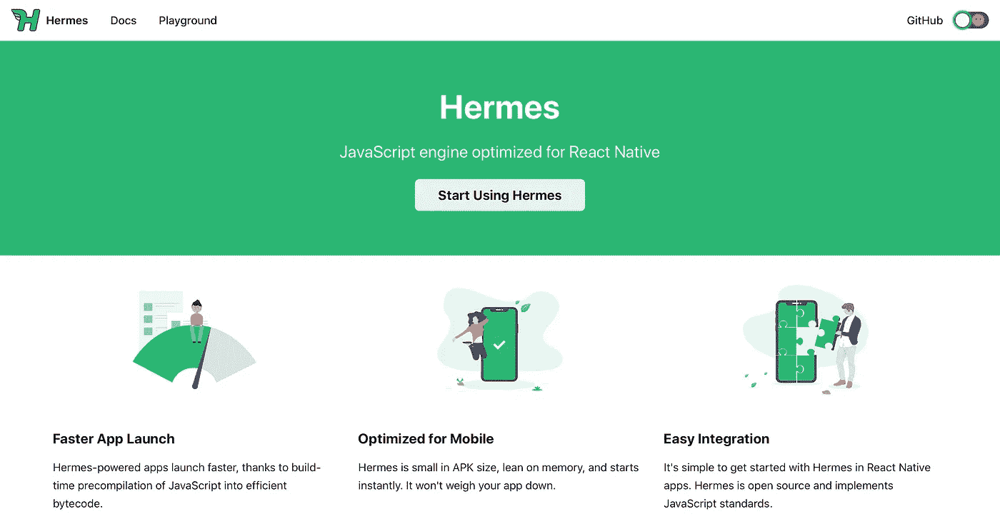

# React Native 成为 2021 年新的发展趋势

> 原文：<https://levelup.gitconnected.com/react-native-as-a-new-development-trend-in-2021-9297567e0502>

React Native 正在飞速发展。这个平台是关于好的工具和更快的开发。每个企业主都想要惊人的性能、更快的开发和快速的发布。

Android 和 IOS 两大平台，开发者要在用户体验和开发速度之间做出选择。为了克服这一点，有几个框架。但最突出的还是 React Native。由于它的高级特性，它可以帮助您构建一个具有惊人用户体验的混合应用程序。

React Native 由脸书在 2015 年推出。从那以后，它一直是最流行的框架。在这篇客座博文中，我们将讨论 React Native 将在 2021 年和 2022 年成为首选工具的原因。但我们将从 2020 年这个框架的总结开始。

# 总结-2020 年

React Native 是最受开发者喜爱的框架之一。它是开发时间和用户体验之间的桥梁。RN 正在快速增长，这种增长令人难以置信。在所有调查中，它都名列前茅。从专业人士到用户，人人都爱。在最近的一次更新中，React Native 0.64 发布。它于 2021 年 3 月中旬发布，性能有所提高，并修复了一些关键的错误。以下是 RN 0.64 的一些重要特征。

## 赫尔墨斯适用于木卫一

Hermes 是一个开源的 JavaScript 引擎，有助于在多种平台上本地工作。Hermes 的主要关注点是降低内存利用率，减少应用程序的大小，减少交互时间。这有助于提高应用程序的性能。在脸书发布 RN0.64 之前，IOS 开发者必须面对几个挑战。IOS 包含了 Hermes，这使得它变得轻量级，并且它将提供最好的结果。

## 将旧项目切换到爱马仕

现在，您可以将现有项目切换到 Hermes。但是在这样做之前，您必须确保项目已经升级。由于赫尔墨斯对 IOS 来说还是新的，因此你不能期望它是完美的。在接下来的时间里，可能会有一些小故障可以修复。

## 查看爱马仕痕迹

脸书正在非常努力地工作。它在 Chrome DevTools 中包含了 performance 标签，可以让你看到 Hermes 的性能。这是一个有用的特性，但并不新鲜。您可以通过运行命令将 Hermes 个人资料转换为 google 个人资料。

## 代理支持

RN 0.64 启用了对 Hermes 的代理支持。这使得它与几个社区项目兼容。据信，Hermes 可以成为 JavaScript 更新的永久引擎。

## 默认情况下，内联要求启用

metro 配置选项“Inline Require”可以帮助您加快应用程序的启动时间。它通过延迟 JavaScript 模块的执行来做到这一点。它以前是一种可选配置，但现在默认启用。这确保了更好的性能。

# 2021 年 React Native 趋势的原因

您可以在此 [**了解更多**](https://www.aistechnolabs.com/react-native-development-company/) 顶级 React 原生开发服务**。现在我们将讨论 React Native 如此成功的原因。**

## 节省时间和金钱

您可以使用 React Native 将代码从一个平台转移到另一个平台。这意味着你可以在 Android 应用程序的帮助下轻松制作一个 IOS 应用程序。你只需要做一些改变。这将减少开发时间，因为单个代码库可以用于多个平台。你可以重用 Android 和 IOS 之间的大部分代码。由于开发时间减少，将直接影响成本。现在用更少的时间，你将不得不花更少的钱在应用程序开发上。

## 易于维护

API 和框架一起成长。以前，如果你想使用最新的工具，你必须定期更新 Android 应用程序。这会花费你很多时间。构建在本地框架上的应用程序可能会耗费您的时间。但是 React Native 使这一开发过程变得没有任何麻烦。您可以节省时间、金钱，并将获得最佳性能。

## 可重用组件

不容易因为品牌而忽略一个 app 的平台。这个在 Native 就更难了。但是到了反应的时候，就让这个过程变得简单了。React Native 编译为 Native，因此感觉保持不变。但是您可以改变任何特性或设计，使其适合任何平台。用于 IOS 和 Android 的组件也可以在 React 原生框架中使用。这将有助于您创建一个不变的外观，无论您在哪个平台上工作。热门库也可以根据平台调整。它使开发过程完美无瑕。这为你提供了多种选择，你可以为你的目标受众选择最好的。

## 第三方集成

React Native 提供了简单的第三方集成。它可以与本机模块集成，以便轻松集成应用程序功能。这是借助框架完成的。这是可能的，因为内部编程。你不必做任何整合工作，因此它节省时间。这些特性是 JavaScript 库附带的。

## 重装功能

热重装是为了更好的开发者体验。它允许整个团队高效工作，快速完成项目。通过热模块替换，您可以立即对任何代码进行更改，并立即得到结果。这些更改将自动重新加载。这使得应用程序开发人员可以忽略任何重新编译。类似于 Native 上的网站开发。这将促进开发过程。为了获得更好的调试体验，您可以将它与 Flipper 和 Reactotron 等工具集成在一起。

## 更好的用户体验

React Native 可以用来创建一个完美的、吸引人的界面。它还将有预构建的声明性组件，如选择器、按钮、滑块、开关等等。如果您想要定制组件，那么可以使用各种工具来创建它们。IOS 和 Android 有几个组件可以让运行更加流畅。

*   [git connected 上的最佳反应原生教程](https://gitconnected.com/learn/react-native)
*   【2021 年最佳 JavaScript 框架
*   【2021 年最佳 JavaScript 工具

*原载于*[*https://www.webdatarocks.com*](https://www.webdatarocks.com/blog/what-makes-react-native-set-a-new-development-trend-in-2021-2022/)*。*