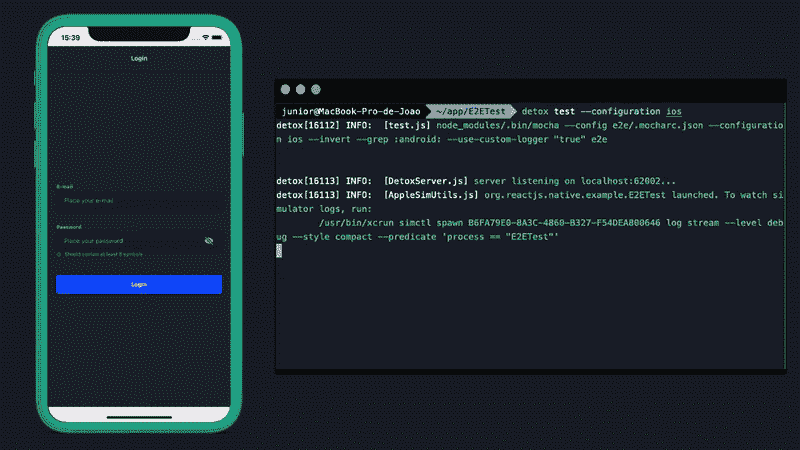

# 用排毒和摩卡对 E2E 本土测试做出反应——快速简单

> 原文：<https://levelup.gitconnected.com/react-native-e2e-tests-with-detox-and-mocha-fast-and-simple-81a6c23c6e8c>



React 本机应用程序运行端对端测试，使用 Detox。

很长一段时间，我认为自动化测试是不必要的，花在实现自动化测试上的时间可以投资在新功能上，这可以为用户带来更好的体验。

这种思维方式甚至可能在一段时间内有效，然而，当以下单词开始以某种频率发音时，噩梦就开始了:**音阶**。

应用程序永远不会达到完成的*状态*，我们能得出的结论是需求。app 一直在进化，换句话说就是“变胖”。

保留六个屏幕和组件很简单，但是当您跳到 80 或 100 个项目时，在屏幕和组件之间，并且在两个或更多开发人员之间划分活动，该怎么办呢？

***注* :** *项目资源库的链接在本文末尾。*

# 忏悔的时刻

正是在这一点上，你后悔没有开始包括自动化测试在内的项目，并认为一切都失去了。

好消息是，在大多数情况下，仍然有可能包含测试，而不需要对代码进行非常重大的更改。


# E2E 用排毒和摩卡测试反应原生

Detox 是一个用于移动应用程序的测试和自动化库，可以在模拟器/仿真器或物理设备上运行。

如果在你读这篇文章的时候有些事情已经改变了，安装和配置排毒的更新说明可以从[链接](https://github.com/wix/Detox)获得。

1.  **全局安装排毒命令行工具:**

```
npm install -g detox-cli
```

**2)安装特定于平台的依赖项。(在本例中使用 ios):**

*   安装 Xcode 命令行工具

```
xcode-select --install
```

*   使用 [Brew](https://brew.sh/) 软件包管理器安装 [AppleSimulatorUtils](https://github.com/wix/AppleSimulatorUtils) (模拟器的实用程序集合)。

```
brew tap wix/brew
brew install applesimutils
```

在你的 React 本地项目中包含排毒:

*   将 Detox 作为开发者依赖项进行安装:

```
yarn add detox -D
```

*   安装测试转轮摩卡。

```
yarn add mocha -D
```

*   用 mocha 构建测试环境

```
detox init -r mocha
```

现在， **e2e** 目录和配置文件将在项目的根目录下创建。

```
Created a file at path: e2e/.mocharc.json
Created a file at path: e2e/init.js
Created a file at path: e2e/firstTest.spec.js
Created a file at path: .detoxrc.json
```

**4)配置摩卡转轮:**

现在让我们编辑在项目根目录下创建的 **.detoxrc.json** 文件。

**注意:**注意，在这个例子中，. detoxrc.json 文件有我的项目的名字， **E2ETest.app** 。您所要做的就是用您的项目名称替换名称 E2ETest。

```
**{** "testRunner": "mocha",
  "runnerConfig": "e2e/.mocharc.json",
  "configurations": **{** "ios": **{** "type": "ios.simulator",
      "name": "iPhone 11",
      "binaryPath": "ios/Build/Products/Debug-iphonesimulator/E2ETest.app",
      "build": "xcodebuild -project ios/E2ETest.app.xcworkspace -scheme E2ETest.app -configuration Debug -sdk iphonesimulator -derivedDataPath ios/Build"
    **}**,
    "android": **{** "type": "android.emulator",
      "binaryPath": "SPECIFY_PATH_TO_YOUR_APP_BINARY",
      "device": **{** "avdName": "Pixel_2_API_29"
       **}
     }
   }
}**
```

**5)定义待测元素的标识符:**

为了引用代码中存在的元素，排毒使用区分每个元素的方法，这些方法被称为 [**匹配器**](https://github.com/wix/Detox/blob/master/docs/APIRef.Matchers.md) 。

有几种方法(匹配器)可用于引用元素，但是，在下面的示例中，使用的匹配器是 by.id (id)，其标识符可以由 React Native 中的 testID，property 定义。

```
**<**Input
  testID="loginInput"
  value=**{**email**}** label="E-mail"
  placeholder="Place your e-mail"
  onChangeText=**{(**nextValue**)** => setEmail**(**nextValue**)}** style=**{{** paddingBottom: 30 **}}** /**>**
```

**提示:**我习惯了将道具设置为“驼峰”模式，经常会搞混，把 **testId** 而不是 **testID** (大写 D)。如果您的测试显示类似于“*错误:测试失败:没有找到匹配器(标识符: (..)*”，有可能是道具名称不对。

**6)编写测试文件:**

当我们在步骤 3 中启动 Detox 时，在项目的根目录下生成了一个名为“[**【e2e**](https://github.com/Jojr/e2e-tests-detox-react-native/tree/master/e2e)”的文件夹，在它里面，生成了一个名为“[**first test . spec . js**](https://github.com/Jojr/e2e-tests-detox-react-native/blob/master/e2e/firstTest.spec.js)”的文件。

我们将编辑这个文件来实现我们的测试目标。

**下面你有一个测试文件的模型:**

```
describe**(**'Login flow', **()** => **{** it**(**'should fill the e-mail', **async** **()** => **{
    await** element**(**by.id**(**'loginInput'**))**.typeText**(**'me@joao.belem.br'**)**;
  **})**;
**})**;
```

在这一行中，我们说"*转到 testID 属性与 loginInput 相同的元素。然后键入文本 me@joao.belem.br* "。

为了使测试更加完整，我在 [firstTest.spe c .js](https://github.com/Jojr/e2e-tests-detox-react-native/blob/master/e2e/firstTest.spec.js) 文件中添加了一些元素:

```
describe**(**'Login flow', **()** => **{** it**(**'should fill the e-mail', **async** **()** => **{
    await** element**(**by.id**(**'loginInput'**))**.typeText**(**'me@joao.belem.br'**)**;
  **})**;it**(**'should fill the password', **async** **()** => **{
    await** element**(**by.id**(**'passwordInput'**))**.typeText**(**'myawesomepassword'**)**;
    **await** element**(**by.id**(**'toggleSecureEntry'**))**.tap**()**;
  **})**;it**(**'should tap login button', **async** **()** => **{
    await** element**(**by.id**(**'submitButton'**))**.tap**()**;
  **})**;
**})**;
```

**7)运行测试:**

在项目的根文件夹中打开一个终端，并运行以下命令:

```
detox test --configuration ios
```

**注意:**因为我这篇文章的方法只基于 IOS 平台，所以添加了标志**“–配置 ios** ”，从而将测试仅限于模拟器。

**测试结果:**


运行 E2E 测试

# 已完成的工作！

这是开始 E2E 测试的基础，我建议你阅读[排毒文档](https://github.com/wix/Detox/blob/master/docs/README.md)并跟随库的发展，因为当你阅读这篇文章时，事情可能已经改变了。

**链接到 GitHub 上的资源库:**
[https://github.com/Jojr/e2e-tests-detox-react-native/](https://github.com/Jojr/e2e-tests-detox-react-native/)