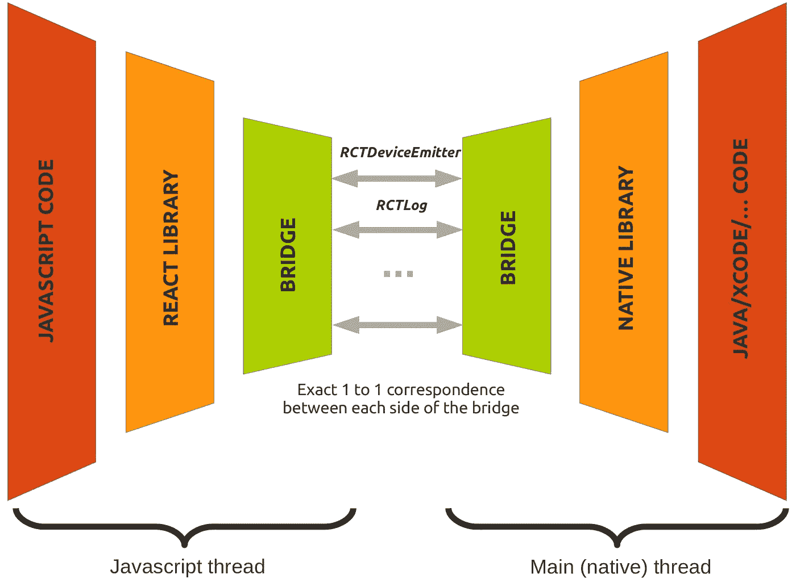

# 以血淋淋的细节反应本地事件:在听众面前发生了什么

> 原文：<https://levelup.gitconnected.com/react-native-events-in-gory-details-what-happens-on-the-way-to-listeners-2cee6c55940c>

## 在那里我们了解了 React 本机桥，并意识到 React 的中央事件处理系统经常被绕过…

反应本土:都是桥的问题。

继[我上一篇关于 React 和 React Native 中事件处理的文章](/how-exactly-does-react-handles-events-71e8b5e359f2)之后，我有一些关于如何在 React Native 中发出自定义事件的问题。在 React Native 中编程意味着你不再在 DOM 中，像`document.createEvent('myCustomEvent')`这样的工具是不可用的。

那么，你如何设法达到类似的结果呢？

让我们来解决这个问题:-)

# 为什么事件在 React native 中很重要？

从本质上讲，React Native 只是一个 Javascript-Java-Xcode 翻译器。不多不少。这种关系允许我们在本机代码之上添加 Javascript 层——React——并随后(几乎)编写任何东西，而不用担心本机细节。

就像在现实生活中翻译语言一样——在我们的例子中，在运行时将指令从一种编程语言传递到另一种编程语言——可能具有挑战性。将指令从一种编程语言传递到另一种编程语言工具是事件。事件相当容易概括，并且与语言无关。这使我们能够在各种情况下进行交流:

*   从本机到 Javascript
*   从 Javascript 到原生*
*   从 Javascript 到 Javascript(有何不可！)

高级的 [React 原生文档](https://facebook.github.io/react-native/docs/native-modules-android.html#sending-events-to-javascript)中描述了利用这一强大工具的方法……但是该文档没有告诉您幕后发生了什么。

**通过生命周期事件，这将不在本文中讨论。更多关于他们的信息可以在* [*这里*](https://facebook.github.io/react-native/docs/native-modules-android.html#listening-to-lifecycle-events) *找到。*

# 全能设备事件发射器

我们将从最常见的将事件从本机传递到 Javascript 的方式开始探索，即`DeviceEventEmitter`。但是*那个`DeviceEventEmitter`到底是什么*？

顾名思义，`DeviceEventEmitter`是一个简单、无聊的事件发射器。你可以用 Javascript 或者任何你喜欢的语言来实现它。对于那些不熟悉什么是事件发射器的人，你可以看看这篇博客文章或者官方文档中的标准实现。简而言之，事件发射器是一个实现以下功能的对象:

*   一个包含监听器数组的`listenerStore`对象，这些函数将在匹配的事件类型被调度时被调用。每个数组都与一个`eventName`键名相关联，该键名表示要匹配的事件类型。
*   将`listener`推到`listenerStore[eventName]`的`addListener(eventName, listener)`方法。
*   一个`emit(eventName[,data)`方法，它将遍历`listenerStore[eventName]`数组，并使用`data`参数调用每个`listener`。

通常`listenerStore`是一个特定事件发射器的属性。这意味着如果您有两个事件发射器，`emitterA`和`emitterB`，那么在`emitterA`上注册的`myEvent`的监听器将不会在`emitterB.emit('myEvent')`上被调用。这有点问题，因为 React Native *需要*才能在全球共享`listenerStore`。如果它不能全局共享存储，在应用程序中任意位置触发的事件将无法到达适当的侦听器。

让我们花一分钟来考虑一个事件必须传播的典型路径，从它的起源开始，到它的最终收听者结束。应用程序生命周期中发生的大多数事件(如触摸或滚动事件)都是在设备本身的本机代码中产生的。然而，在 Javascript 空间中，事件处理程序分散在应用程序的 React 部分。一个事件首先需要离开它在“Javascript 世界”中的发源地，并以某种方式在整个 Javascript 代码库中回响，以便侦听器能够捕捉到它，而不管侦听器在哪里。这在技术上怎么可能？

对于下一步，想法相当简单:与您可以`import from ‘react-native’`的大多数模块不同，`**DeviceEventEmitter**` **不是一个类，而是一个实例**(一个对象，如果您愿意的话)。因此，每次导入实际上都为您提供了一个指向同一个对象的指针，这就很容易理解为什么订阅会自然地在所有 Javascript 代码中共享。更难弄清楚的是`DeviceEventEmitter`如何与代码的本机部分进行交互。

我们已经知道，一旦事件到达`DeviceEventEmitter`，就可以很容易地将它们分派到 Javascript 代码中的任何地方。然而，首先事件仍然需要能够到达那个`DeviceEventEmitter`——一个基本的 *Javascript 对象，而不是一个类* —。这意味着本机代码也需要对它的引用。事实上,`DeviceEventEmitter`是一个独特的冷冻物体，正是这一事实使得这一壮举成为可能。要理解为什么，我们需要仔细看看 React Native 的核心:*桥。*

# 如果 React Native 是一个群岛…

如果 React native 是一个地理区域，它可能是由两座桥连接的三个岛屿组成的一个小群岛。

——作者克莱尔·库夫拉特，经许可使用

中央(也是最大的)岛是 **JS 岛**。JS 岛有两座桥，连接着**爪哇岛**和 **Xcode 岛**。根据日期(或运行 React Native 的设备)，在给定时间只能使用其中一个桥，即使两个桥都存在。

所有的岛屿都有自己复杂的高速公路系统。更糟糕的是，这些岛屿的居民甚至不在路的同一边开车！在建桥之前，岛上的人们在三件事上达成了一致:

*   这两座桥将有数量有限的车道(平心而论，这与其说是政治协议，不如说是物理约束…)，
*   为了避免混乱，禁止在一座桥上变换车道。如果你从一个岛上的 A 道开始，你必须在另一个岛上的 A 道结束
*   为了让来自 JS 岛的游客更容易参观邻近的岛屿，**两座桥将有完全相同数量的车道，这些车道将有相同的名字**——至少在 JS 岛上是这样。

经过长时间的谈判，最终给每座桥的车道起了名字:`RCTDeviceEventEmitter`、`RCTEventEmitter`、`RCTLog`、`Systrace`，每座桥总共 11 条车道。

反应当地人的桥梁

事实上，React Native 中的桥接稍微复杂一些，通道的数量并不总是固定的。然而，这种类比仍然适用，因为每当 React Native 编排本机代码和 Javascript 代码之间的通信时，这正是幕后发生的事情。对于一个给定的桥(比如在 Android 设备中的 Java 和 Javascript 之间)，**一个通道从一个模块指向另一端的严格对等模块**。相同的名字，相同的方法，这就是为什么我们的 `**DeviceEventEmitter**` **必须是一个唯一的对象而不是一个类。**这样就可以从*Javascript 和 native 调用它，native 发出的类型为`myEvent`的事件将被正确转发给所有在 Javascript 端监听`myEvent`的人。*

# 代码示例

为了保持这篇文章的合理长度，我将只列出亮点和主要步骤。工作示例可在[资源库](https://github.com/nicolascouvrat/EventExample)中找到。你也可以直接跳到[结论](#aa38)然后再回到这些。

## 从本机到 Javascript

***注*** *:因此我将用 Java 给出例子，因为我用它的经验比用 Xcode 多，但更多可以在* [*官方 Xcode 网页*](https://facebook.github.io/react-native/docs/native-modules-ios.html) *上找到。原则是一样的。*

您首先需要定义您的本机组件。因为我们的目的是展示一种简单的方式来发出事件，这将不是一个 UI 组件，而是一个本机模块(是的，它们是不同的)，因此将是一个扩展`ReactContextBaseJavaModule`的类。这迫使您实现一个`getName()`和一个构造函数方法。要向 Javascript 公开一个方法，需要用`@ReactMethod`修饰它，它必须返回`void`。`@ReactMethod`装饰器基本上创建了另一个方法，返回描述函数签名(名称、参数和参数类型)的数组。该签名然后被传递到桥的另一端(在这种情况下是 Javascript)。

为了向 Javascript 发送事件，您需要引用`DeviceEventEmitter`。这可以通过获取桥所链接的当前上下文，然后获得正确的 Javascript 模块来实现

最后，为您的模块创建一个`ReactPackage`，并在`MainApplication.java`中引用它。这基本上是样板文件。

通过上面的代码，我们已经将一个事件直接发送给了`DeviceEventEmitter`。因此，Javascript 组件中唯一需要做的事情就是导入它并添加正确的事件监听器:

## 从 Javascript 到 Javascript

这里没有问题，唯一需要做的是导入`DeviceEventEmitter`并相应地使用`emit()`和`addListener()`。

注意，尽管完全可以直接使用`DeviceEventEmitter`，但在代码中它被声明为不推荐使用。相反，您应该使用`NativeEventEmitter`类作为基本模式，并在需要时扩展它。

等等，我们不是说过只有一个对象——而不是一个类——才能让整个系统工作吗？不要担心:*每个`NativeEventEmitter`的*实例都通过引用存储在`DeviceEventEmitter`中的侦听器数组进行初始化，因此在`NativeEventEmitter`的一个实例上发出的事件可以被任何其他实例的*捕获，并且一切都按照预期工作。*

# 等等，我的事件在哪里冒泡？

到目前为止，我们发现所有的事件发射器——无论是唯一的`DeviceEventEmitter`还是我们的多个`NativeEventEmitter`实例——都共享同一个订户列表。虽然提供了难以置信的灵活性(您不需要显式引用目标)，但重要的是要记住，如果您决定在 React native 中使用 events，那么在任何 `**NativeEventEmitter**` **实例或** `**DeviceEventEmitter**` **上发出的**事件** `**someEvent**` **将被转发给*所有*** `**someEvent**` **的监听器，无论这些监听器被添加到哪里！**考虑下面的例子，其中`MyEmitter`和`MyListener`分别发出和监听`someEvent`，每个都有自己的`NativeEventEmitter`实例:**

每次一个`MyEmitter`发出一个事件，两个`MyListener`都会捕捉到，即使他们之间没有父子关系！小心不必要的触发因素…

此时，你自己可能已经得出结论:**与** `**DeviceEventEmitter**` **，不存在事件冒泡**之类的事情。没错，在那篇关于 React 的统一事件系统的伟大之处的[长篇文章](/how-exactly-does-react-handles-events-71e8b5e359f2)之后，我们今天发现的是，在 native 和 Javascript 之间，甚至从 Javascript 到 Javascript 之间转发事件的最主流方式……根本不使用冒泡。

*但是 React 的冒泡系统很棒！我不能找到使用它的方法吗？*可以，可以。有一种方法——尽管很不容易。如果你想了解它的全部，那么你必须等待这篇文章的第二部分，即将发布的**！**

# 最后一件事——你可能根本不需要事件

事件是 React Native 本身的重要组成部分。但是说实话，就标准应用程序而言，您要寻找的可能只是回调。React 是围绕回调构建的——用`props`从父节点传递给子节点，这是在 Javascript 端模仿类似事件行为的最简单、最安全的方式。使用事件的最大缺点之一是，一旦发出了事件，您就不知道谁在监听——这意味着您可能会触发不必要的操作，并且您的代码变得相当难以维护。然而，有了回调，这个问题就消失了，你可以完全控制正在发生的事情。

也就是说，有些时候可以认为事件更好:当你有一个组件埋得很深，以至于一直连接回调会很麻烦，或者当你需要在子树 b 中调用子树 A 中的组件时。

无论如何，这篇文章的目的是向你展示*可以*在 React Native 中使用事件发射。我会让你决定什么时候去 T4。

我希望你和我一起享受这次新的旅行，这次是在事物的反应方面！像往常一样，还可以添加更多的细节，尤其是大桥背后的技术细节，但我在这里避免了这些，以集中讨论事件的主题。

下一次，我们将回到我们亲爱的事件系统，并编写我们自己的事件插件！敬请关注…