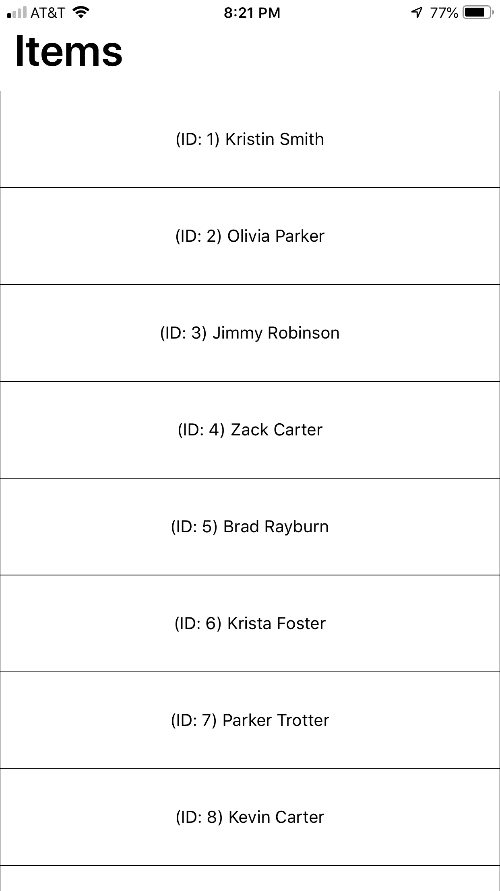

# 使用 React Native+Firebase Cloud Firestore 实现 FlatList 的无限滚动(延迟加载)

> 原文：<https://levelup.gitconnected.com/react-native-firebase-cloud-firestore-implementing-infinite-scroll-lazy-loading-with-flatlist-a9e942cf66c6>


**备注:**

*   本指南假设您了解 React Native 和 Firebase Cloud Firestore。
*   本指南还假设您知道如何将 JSON 数据导入 Firebase Cloud Firestore。如果你想学习如何，请查看我的 [**JSON To Firestore 指南**](/firebase-import-json-to-firestore-ed6a4adc2b57) **。**
*   **Github Repo:**[https://Github . com/jefelewis/react-native-infinite-scroll-demo](https://github.com/jefelewis/react-native-infinite-scroll-demo)

# 1.什么是无限滚动(惰性加载)

无限滚动允许您的应用程序根据需要查询/检索数据。这意味着当用户向下滚动到列表底部时，会进行额外的查询并追加数据。

没有“加载更多”或“下一页”按钮**，查询是在后台自动进行的**，这就是无限滚动这个名字的由来。用户可以毫不费力地无限滚动(假设有足够的数据可以无限滚动)。当它们到达页面上的某一点时，它就会加载它们，这就是“惰性加载”这个术语的由来——它只在你需要的时候才加载。

# 2.为什么使用无限卷轴

Instagram、脸书、Twitter、YouTube、Pinterest 和 Medium 等应用程序都使用 infinite scroll，那么为什么它会被大型科技公司使用呢？这是一个很好的用户体验，它只高效地查询必要的数据，并节省了数据成本。在我们的例子中，我们将使用 Firebase Cloud Firestore，因此无限卷轴将节省 [Firebase 读取成本](https://medium.com/@jeffrey.allen.lewis/firebase-cloud-firestore-data-types-costs-query-examples-65e5b402c55e)。

例如，假设您有一个 100 个用户的数据集，但我们的应用程序一次只能显示 9 个用户。如果您的用户从未滚动超过前 9 个用户，那么查询 100 个用户的云 Firestore 将是低效的。无限滚动通过按需查询使您的应用程序运行更加高效。由于没有页码和按钮来查询更多数据，因此需要的步骤更少，因此用户只需付出最少的努力。

这不仅在 Firebase 读取成本和用户体验方面效率低下，而且在速度方面效率低下，因为它只是向你的应用程序发送必要的数据。

# 3.示例应用+代码

**Github 回购:**【https://github.com/jefelewis/】T2[react-native-infinite-scroll-test](https://github.com/jefelewis/react-native-infinite-scroll-test)

## A.应用概述

该应用程序将只有一个屏幕(InfiniteScroll.js)，它将从 Firebase Cloud Firestore 查询，限制为 9 个用户。一旦您滚动到列表的末尾，将会加载另外 9 个用户(总共 20 个用户)。

所有的数据将在 [**React Native FlatList 组件**](https://facebook.github.io/react-native/docs/flatlist) 中呈现。

## B.App 截图



InfiniteScroll.js

## C.应用程序文件结构

本例将使用 4 个文件:

1.  data.json(示例数据)
2.  config.js (Firebase 配置)
3.  App.js (React 原生应用)
4.  InfiniteScroll.js(无限滚动屏幕)

## D.应用程序文件

下面将提供一个示例 data.json 文件。这个 data.json 需要导入到 Firebase Cloud Firestore。

如果您不确定如何将 JSON 数据导入 Firebase Cloud Firestore，请查看导入 [JSON 到 Firestore 指南](/firebase-import-json-to-firestore-ed6a4adc2b57)。

**data.json**

```
{
  "users": [
    {
      "id": 1,
      "first_name": "Kristin",
      "last_name": "Smith"
    },
    {
      "id": 2,
      "first_name": "Olivia",
      "last_name": "Parker"
    },
    {
      "id": 3,
      "first_name": "Jimmy",
      "last_name": "Robinson"
    },
    {
      "id": 4,
      "first_name": "Zack",
      "last_name": "Carter"
    },
    {
      "id": 5,
      "first_name": "Brad",
      "last_name": "Rayburn"
    },
    {
      "id": 6,
      "first_name": "Krista",
      "last_name": "Foster"
    },
    {
      "id": 7,
      "first_name": "Parker",
      "last_name": "Trotter"
    },
    {
      "id": 8,
      "first_name": "Kevin",
      "last_name": "Carter"
    },
    {
      "id": 9,
      "first_name": "Fred",
      "last_name": "Klein"
    },
    {
      "id": 10,
      "first_name": "Thomas",
      "last_name": "Manchin"
    },
    {
      "id": 11,
      "first_name": "Taylor",
      "last_name": "Welch"
    },
    {
      "id": 12,
      "first_name": "Sam",
      "last_name": "Goldberg"
    },
    {
      "id": 13,
      "first_name": "John",
      "last_name": "Russell"
    },
    {
      "id": 14,
      "first_name": "Steve",
      "last_name": "Bell"
    },
    {
      "id": 15,
      "first_name": "Kelly",
      "last_name": "Black"
    },
    {
      "id": 16,
      "first_name": "Lena",
      "last_name": "Hunt"
    },
    {
      "id": 17,
      "first_name": "Jessica",
      "last_name": "Moore"
    },
    {
      "id": 18,
      "first_name": "Pete",
      "last_name": "Wong"
    },
    {
      "id": 19,
      "first_name": "Harry",
      "last_name": "Fordham"
    },
    {
      "id": 20,
      "first_name": "Ashley",
      "last_name": "Blake"
    }
  ]
}
```

**config.js**

```
// Firebase Config
const firebaseConfig = {
  apiKey: '**API_KEY_HERE'**,
  authDomain: '**AUTH_DOMAIN_HERE'**,
  databaseURL: '**DATABASE_URL_HERE'**,
  projectId: '**PROJECT_ID_HERE'**,
  storageBucket: '**STORAGE_BUCKET_HERE'**,
  messagingSenderId: '**MESSAGING_ID_HERE',**
};// Exports
module.exports = firebaseConfig;
```

**App.js**

```
*// Imports: Dependencies* import React from 'react';
import * as firebase from 'firebase';
import 'firebase/firestore';
import firebaseConfig from './config/config';*// Imports: Screens* **import InfiniteScroll from './screens/InfiniteScroll';**// Firebase: Initialize
firebase.initializeApp({
  apiKey: firebaseConfig.apiKey,
  authDomain: firebaseConfig.authDomain,
  databaseURL: firebaseConfig.databaseURL,
  projectId: firebaseConfig.projectId,
  storageBucket: firebaseConfig.storageBucket,
  messagingSenderId: firebaseConfig.messagingSenderId,
});// Firebase: Cloud Firestore
export const database = firebase.firestore();*// React Native: App* export default function App() {
  return (
 **<InfiniteScroll />**
  );
}
```

**InfiniteScroll.js**

```
*// Imports: Dependencies* import React, { Component } from 'react';
import { ActivityIndicator, Dimensions, FlatList, SafeAreaView, StyleSheet, Text, View } from 'react-native';
import { database } from '../App';*// Screen Dimensions* const { height, width } = Dimensions.get('window');*// Screen: Infinite Scroll* export default class InfiniteScroll extends React.Component {
  constructor(props) {
    super(props); this.state = {
 **documentData: [],
      limit: 9,
      lastVisible: null,
      loading: false,
      refreshing: false,**
    };
  } *// Component Did Mount* componentDidMount = () => {
    try {
      *// Cloud Firestore: Initial Query
***this.retrieveData();
**    }
    catch (error) {
      console.log(error);
    }
  }; *// Retrieve Data***retrieveData = async () => {
**    try {
      *// Set State: Loading
***this.setState({
        loading: true,
      });**
      console.log('Retrieving Data'); *// Cloud Firestore: Query***let initialQuery = await database.collection('users')
        .where('id', '<=', 20)
        .orderBy('id')
        .limit(this.state.limit)** *// Cloud Firestore: Query Snapshot***let documentSnapshots = await initialQuery.get();** *// Cloud Firestore: Document Data***let documentData = documentSnapshots.docs.map(document => document.data());** *// Cloud Firestore: Last Visible Document (Document ID To Start From For Proceeding Queries)***let lastVisible = documentData[documentData.length - 1].id;** *// Set State***this.setState({
        documentData: documentData,
        lastVisible: lastVisible,
        loading: false,
      });**
    }
    catch (error) {
      console.log(error);
    }
 **};** *// Retrieve More***retrieveMore = async () => {**
    try {
      *// Set State: Refreshing
***this.setState({
        refreshing: true,
      });**
      console.log('Retrieving additional Data'); *// Cloud Firestore: Query (Additional Query)***let additionalQuery = await database.collection('users')
        .where('id', '<=', 20)
        .orderBy('id')
        .startAfter(this.state.lastVisible)
        .limit(this.state.limit)** *// Cloud Firestore: Query Snapshot***let documentSnapshots = await additionalQuery.get();** *// Cloud Firestore: Document Data***let documentData = documentSnapshots.docs.map(document => document.data());** *// Cloud Firestore: Last Visible Document (Document ID To Start From For Proceeding Queries)***let lastVisible = documentData[documentData.length - 1].id;** *// Set State***this.setState({
        documentData: [...this.state.documentData, ...documentData],
        lastVisible: lastVisible,
        refreshing: false,
      });**
    }
    catch (error) {
      console.log(error);
    }
 **};** *// Render Header***renderHeader = () => {
**    try {
      return (
        <Text style={styles.headerText}>Items</Text>
      )
    }
    catch (error) {
      console.log(error);
    }
 **};** *// Render Footer***renderFooter = () => {
**    try {
      *// Check If Loading* if (this.state.loading) {
        return (
          <ActivityIndicator />
        )
      }
      else {
        return null;
      }
    }
    catch (error) {
      console.log(error);
    }
 **};** render() {
    return (
      <SafeAreaView style={styles.container}>
 **<FlatList**          /*/ Data
  ***data={this.state.documentData}
  **        *// Render Items
  ***renderItem={({ item }) => (
            <View style={styles.itemContainer}>
              <Text>(ID: {item.id}) {item.first_name} {item.last_name}</Text>
            </View>**
          )}
          *// Item Key
  ***keyExtractor={(item, index) => String(index)}** *// Header (Title)
  ***ListHeaderComponent={this.renderHeader}** *// Footer (Activity Indicator)
  ***ListFooterComponent={this.renderFooter}** *// On End Reached (Takes a function)
  ***onEndReached={this.retrieveMore}** *// How Close To The End Of List Until Next Data Request Is Made
 ***onEndReachedThreshold={0}** *// Refreshing (Set To True When End Reached)
***refreshing={this.state.refreshing}
        />
**      </SafeAreaView>
    )
  }
}*// Styles* const styles = StyleSheet.create({
  container: {
    height: height,
    width: width,
  },
  headerText: {
    fontFamily: 'System',
    fontSize: 36,
    fontWeight: '600',
    color: '#000',
    marginLeft: 12,
    marginBottom: 12,
  },
  itemContainer: {
    height: 80,
    width: width,
    borderWidth: .2,
    borderColor: '#000',
    justifyContent: 'center',
    alignItems: 'center',
  },
  text: {
    fontFamily: 'System',
    fontSize: 16,
    fontWeight: '400',
    color: '#000',
  },
});
```

# 向外滚动

就是这样！现在，您已经使用 Firebase Cloud Firestore 在 React 本机应用程序中实现了无限滚动，节省了＄＄＄的读取成本并提高了 UX。

没有人是完美的。如果您发现了任何错误，想要提出改进建议，或者扩展某个主题，请随时给我发消息。我一定会包括任何改进或纠正任何问题。