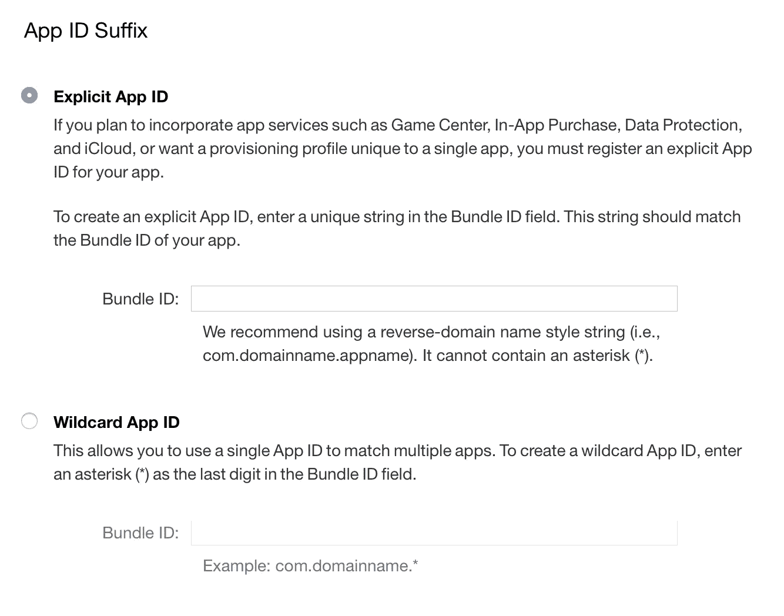
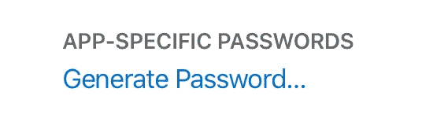
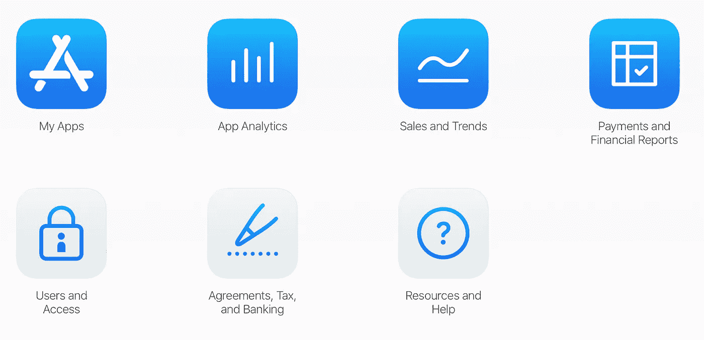

# React Native:如何发布 Expo App 进行 TestFlight +调试常见错误

> 原文：<https://levelup.gitconnected.com/react-native-how-to-publish-an-expo-app-to-testflight-debug-common-errors-90e427b4b5ea>

## 杰夫·刘易斯

有没有 **React 本土世博 App** ？是否要发布到 **TestFlight** 进行测试？那么这本指南是给你的。

**注意:**本指南假设你有一个 [**苹果开发者账号**](https://developer.apple.com/account) ，并且通过 NPM 安装了 [**Expo CLI**](https://www.npmjs.com/package/expo-cli) 。要做到这一点，你需要两者。


# 1.为构建准备项目

## A.App.json

在项目文件夹的根目录中，应该已经有一个 app.json 文件。

**注:**`privacy`可以列为“公开”、“私有”或“未公开”。"

```
{
  "expo": {
    "name": **"YOUR_NAME_HERE"**,
    "slug": **"YOUR_SLUG_HERE"**,
    **"privacy": "unlisted",**
    "sdkVersion": "32.0.0",
    "platforms": [
       "ios",
       "android"
     ],
     "version": "1.0.0",
     "orientation": "portrait",
     "icon": "./assets/icon.png",
       "splash": {
         "image": "./assets/splash.png",
         "resizeMode": "contain",
         "backgroundColor": "#ffffff"
       },
     "updates": {
       "fallbackToCacheTimeout": 0
     },
     "assetBundlePatterns": [
       "**/*"
     ],
     "ios": {
       "supportsTablet": true,
       "bundleIdentifier": **"YOUR_BUNDLE_IDENTIFIER_HERE"**
     }
   }
}
```

## B.添加应用程序图标

如果没有为您的项目添加图标，您将看到以下错误:

```
Your application icon can't have transparency if you wish to upload your app to Apple Store.
```

要解决这个问题，你需要在 Photoshop、Illustrator、Affinity 等软件中制作一个 1024x1024 的图标。理想的图标尺寸是 1024x1024，当我们构建应用程序时，Expo 将生成必要的较小图标尺寸。

现在你已经制作好了 1024x1024 的图标，我们将把它添加到资产文件夹中，并修改`app.json`中`icon`的路径。

```
"icon": "./assets/icon.png",
```

## C.捆绑包标识符([苹果开发者](https://developer.apple.com/account/))

您的 React Native Expo 应用程序最后还需要一个包标识符。

**注:**如前所述，本指南假设你有一个 [**苹果开发者账号**](https://developer.apple.com/account) **。**没有它，您将无法创建包标识符。如果您的项目缺少包标识符，您将得到以下错误:

```
Your project must have a bundleIdentifier set in app.json.
```

要解决此问题，请导航并单击**证书、标识符、&配置文件。**


然后点击**应用程序 id。**


点击 **+** 按钮**。**


然后选择你的 **App ID 后缀**。推荐的后缀是 **com.domainname.appname**



## D.捆绑标识符(项目)

现在 Bundler 标识符已经通过您的 Apple 开发人员帐户创建，您需要将其添加到您的 app.json 中。

```
"ios": {
  "supportsTablet": true,
  "bundleIdentifier": "**YOUR_BUNDLE_IDENTIFIER_HERE**"
}
```

# 2.构建应用程序(。国际音标)

## A.构建命令

我们的应用程序现在准备使用 Expo 构建一个 iOS IPA 文件。我们将从运行以下命令开始:

```
expo build:ios
```

## B.苹果开发者证书+优化图像

在终端中，您将被要求使用您的 Apple 开发者凭据登录。

然后会要求您生成凭证和/或优化图像。我保留这些默认值，让它们生成凭证并优化图像。

您的 React Native Expo 应用程序构建现在已经完成，并且是 IPA 格式的。

## C.下载应用程序版本(。国际音标)

一旦您的应用程序完成构建，您应该会收到以下消息。通过这个 url，我们可以下载我们构建的应用程序(。ipa)。

```
✔ Build finished.
Successfully built standalone app: **YOUR_APP_URL**
```

# 3.将 Expo 版本添加到 Xcode

## A.应用程序加载器(Xcode)

在 Xcode 中，选择`Xcode`菜单，选择`Open Developer Tool`选项，然后选择`Application Loader`。在这里你可以导入&上传你的。ipa 文件到 iTunesConnect。

应用程序加载器启动后，会要求您输入 Apple ID +密码。但是，这不是您的普通 I cloud/开发者帐户密码。您需要生成一个特定于应用程序的密码，否则会出现以下错误:

```
Sign in with the app-specific password you generated. If you forgot the app-specific password or need to create a new one, go to [appleid.apple.com](https://appleid.apple.com)
```

## B.生成 App 专用密码( [Apple ID](http://appleid.apple.com)

您可以通过您的 [**Apple ID**](http://appleid.apple.com) **，**输入您的凭证，点击**生成密码，生成 App 特定密码。**



然后会要求您创建一个**密码标签**(昵称)，然后会生成一个特定于应用程序的密码。


## C.添加捆绑包 ID ( [应用商店连接](https://appstoreconnect.apple.com))

如果您没有在 App Store connect 中设置捆绑 ID，您将会收到以下错误:

```
No suitable application records were found. Verify your bundle identifier '**YOUR_BUNDLE_PROFILER_HERE**' is correct.
```

要解决这个问题，你必须导航到[**App Store Connect**](https://appstoreconnect.apple.com)**，**在那里你会被再次要求输入你的 Apple ID 用户名和密码(不是应用程序特定的密码)。

点击**我的应用程序。**



点击 **+符号**，创建一个**新 App。**


您现在必须输入以下信息，并添加正确的**包 ID** 。


## D.交付您的应用程序(Xcode)

你现在可以把你新建的。ipa 文件，从 Xcode 的应用程序加载器中选择它，并输入您的 Apple ID 和应用程序特定的密码。


# 4.发送试飞邀请(App Store Connect)

仍然在 [**应用商店中连接**](https://appstoreconnect.apple.com) **，**点击您的应用并导航至**测试飞行**标签。


点击侧边栏，选择是否要添加**外部** **测试员**或**内部测试员**。


要添加测试者，点击+号并输入测试者的信息和电子邮件地址。


**注:**邮件过了很久我才收到(小时)。我花了相当多的时间在堆栈溢出上，试图找出我的项目有什么问题，但这真的花了很长时间。

就是这样！测试你的应用的邀请将很快(这可能需要几个小时)通过电子邮件发送给测试人员，以赎回应用。

# 5.其他常见的 Expo & Xcode 错误

## A.Expo 错误:

```
Cannot start a new build, as there is already an in-progress build.
```

导航到[https://expo.io/builds](https://expo.io/builds)，输入您的凭证，并取消正在进行的构建。

## B.Expo 错误:

```
connect ECONNREFUSED 127.0.0.1:19001
```

在您的终端中，输入`expo start`，然后输入`expo build:ios`。

## C.Expo 错误:

```
No suitable application records were found. Verify your bundle identifier '**YOUR_BUNDLE_PROFILER_HERE**' is correct.
```

在第 **3 节中修复了该错误。添加 Expo Build 到 Xcode，** part **C .添加 Bundle ID(**[**App Store Connect**](https://appstoreconnect.apple.com)**)。**

## D.Expo 错误

```
Reason: No cert available to make provision profile against, raw: "Make sure you were able to make a certificate prior to this step"
```

## E.Expo 错误

```
Missing Push Notification Entitlement - Your app appears to register with the Apple Push Notification service, but the app signature’s entitlements do not include the “aps-environment” entitlement. If your app uses the Apple Push Notification service, make sure your App ID is enabled for Push Notification in the Provisioning Portal, and resubmit after signing your app with a Distribution provisioning profile that includes the “aps-environment” entitlement.
```

要解决这个问题，您必须运行以下命令来构建一个新版本。

**注意:**如果这是你第二次构建你的应用程序并提交给 Apple 进行试飞，你必须更新 app.json 中的版本。

```
expo build:ios --clear-provisioning-profile
```

## F.Expo 错误

```
Multiple profiles found with the name 'com.appName.appName AppStore'.  Please remove the duplicate profiles and try again."
```

要解决这个问题，请移除/撤销您的 [Apple 开发者帐户](https://developer.apple.com/account/)中所有现有的**密钥**和**预置描述文件**。


然后重新运行`expo build:ios — clear-provisioning-profile`，让 Expo 在构建. ipa 时生成所有必要的文件

## G.Xcode 错误(App.json)

```
ERROR ITMS-90189: "Redundant Binary Upload. You've already uploaded a build with build number '1' for version number '1.0.0'. Make sure you increment the build string before you upload your app to App Store Connect. Learn more in Xcode Help ([http://help.apple.com/xcode/mac/current/#/devba7f53ad4](http://help.apple.com/xcode/mac/current/#/devba7f53ad4))."
```

要解决这个问题，进入您的 app.json 文件并增加版本号，如下所示:

```
"version": "1.0.1",
```