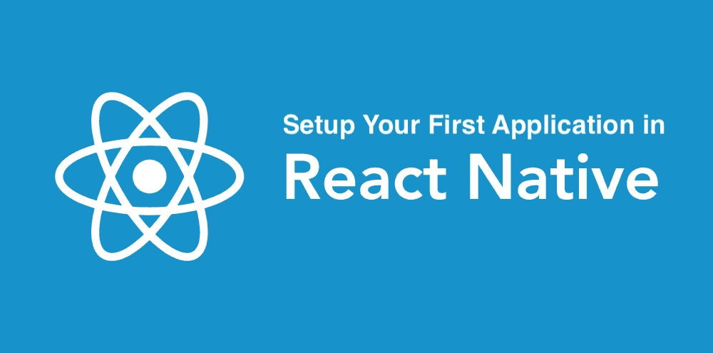
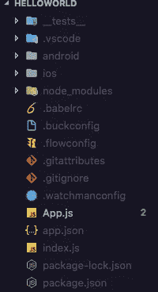
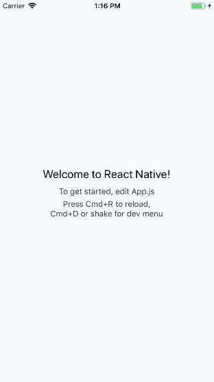
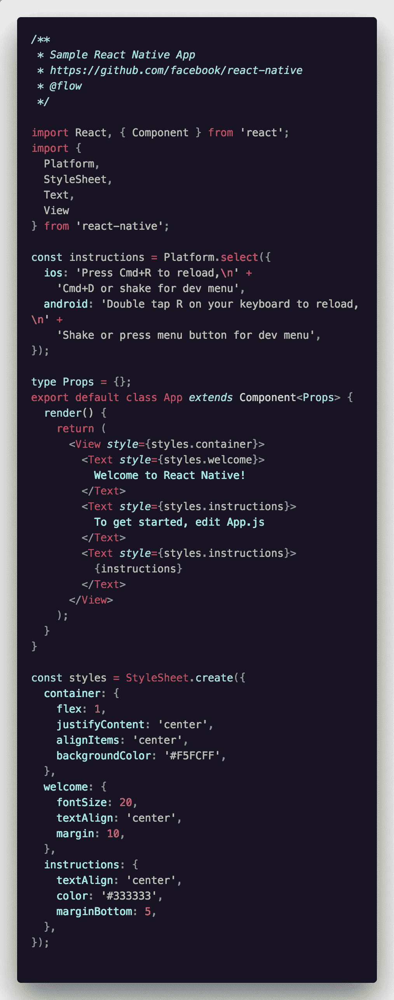
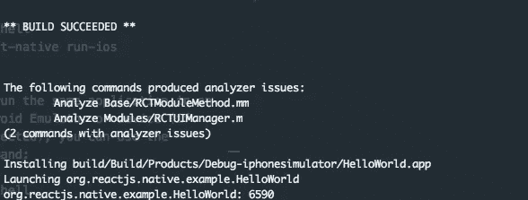
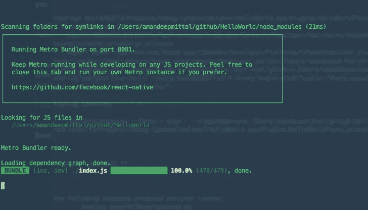
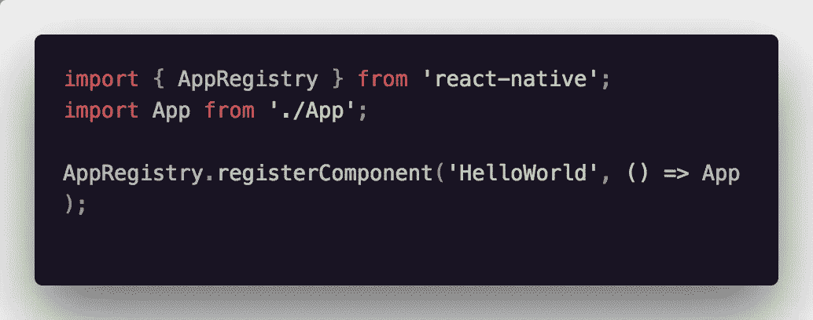

# React Native:如何设置你的第一个应用程序

> 原文：<https://levelup.gitconnected.com/react-native-how-to-setup-your-first-app-a36c450a8a2f>

**请注意**

【2019 年初，我更新了这篇文章，并在这里重写👇

 [## 2019 年 React Native 入门:打造你的第一款应用

### 了解如何使用重要的基本概念构建您的第一个 React 原生应用程序，并从这里开始学习！

levelup.gitconnected.com](/getting-started-with-react-native-in-2019-build-your-first-app-a41ebc0617e2) 

*更加深入，几乎涵盖了 React 本地生态系统的每个基本方面。通过阅读这篇新帖，你还将构建一个典型的“hello world”应用程序的更高级版本。*

React Native 是一个用 JavaScript 构建移动应用程序并利用 ReactJS 的框架。它使用本地 UI 组件。如果你熟悉 React 或者有前端开发背景，React 使用一个虚拟 DOM 作为真实 DOM 的影子。当一个元素发生变化时，虚拟 DOM 使用对应于每个元素的节点将这种变化反映在真实 DOM 上。然而，在 React Native 中，除了 iOS 和 Android 等平台提供的原生组件之外，没有 DOM。此处没有 web 视图。

React Native 有一个 [JavaScriptCore](https://facebook.github.io/react-native/docs/javascript-environment.html) 的实例，在应用启动时执行 JS 代码。React Native 使用 RCTBridgeModule 在本机代码和 JavaScript 代码之间建立连接。假设您更多地使用 React Native 进行开发，您可能会遇到针对特定移动平台使用第三方 SDK 的情况。这种沟通会很有帮助。

# React Native 和 Reactjs 之间的区别

React Native 在原生组件周围有自己的包装器，并且不利用每一个 HTML 元素。比如被认为类似于 HTML 的`div`的`<View>`。这是 React Native 和 Reactjs 之间的主要区别。这也意味着你不能重用每一个呈现 HTML 并可用于 Reactjs 的库。它有自己的导航模块。

# 平台特定设计

用同一套代码为多个平台设计一个移动应用程序可能有点让人不知所措。在这种情况下，开发人员或开发团队有两种选择。要么他们想出一个通用于他们应用程序的用户界面。这意味着应用程序的用户界面在每个平台上都是一样的。然而，并不是你开发的每个应用程序都是如此。React Native 可以检测您正在运行的平台，并且可以使用条件来应用样式。

深入研究本文的桥接部分或平台特定设计部分超出了本文的范围。写这篇文章是为了让你熟悉 React Native 的基本生态系统，但我想简单地讨论一下这些主题，以便让你了解你正在进入的领域。

# React Native 的开发人员环境

这些都是在您的机器上设置本地环境以及开发任何类型的应用程序所必需的依赖项。

所需的依赖关系:

注意:请注意，您有 Node.js 版本`>=4.0`来继续。

要为特定平台设置本机 SDK:

*   **iOS** (安装/拥有 Xcode，是免费的，很可能是预装的)
*   Android (我建议你按照这里的说明)

最后一步是使用以下命令安装 React Native CLI:

如果您需要在应用程序中构建本机代码，或者希望在现有的应用程序中集成 React Native，那么上述指令最适用。如果您想要快速原型化应用程序，您可以使用 [*创建 React 本机应用程序*](https://facebook.github.io/react-native/docs/getting-started.html) 模块，该模块与创建 React 应用程序非常相似。对于 *Create React Native App* 你不需要安装上述依赖项(当然你需要 Node.js 用于 *npm* 模块)和特定于平台的 SDK。脸书自己推荐使用手机上的 [Expo](https://expo.io/) 客户端来观看应用程序的运行。为了本文主题的简洁，我将使用`react-native-cli`。

# 你好世界与反应原生

要搭建应用程序，请使用我们在上一步中刚刚安装的 React 本机命令行界面。

如果你偷偷查看一下目录内部的结构，你会看到一个类似的:

让我们尝试运行应用程序，然后再做任何更改。因为我在 mac 上，所以我将使用命令:

要在 Android 模拟器或设备(如果已连接)中运行相同的应用程序，您可以使用以下命令:

由于您是第一次运行上述任何命令，应用程序需要几分钟时间才能在模拟器中显示出来。不要担心，如果一切运行成功，它会出现。

您在上面运行的代码可以在`App.js`中找到:

如果你熟悉 Reactjs，你可以很容易理解这段代码。`<View>`代表 HTML 中的`div`等包装元素，`<Text>`代表 HTML 中的`
`。

系统将提示您一条成功消息，并在新的终端窗口中， *Metro Bundler(由脸书开发)*将一直运行，直到应用程序关闭。

呈现这个`App`组件的文件是根目录下的`index.js`。您将看到以下代码:

你注意到什么了吗？没有`react-dom`，因为 React Native 中没有 DOM。`AppRegistery`是运行 React 本地应用程序的入口点。应用程序中的`App`组件或任何其他根组件都应该使用`AppRegistry.registerComponent`进行注册，这样本地系统就可以加载应用程序的捆绑包，并通过启动`AppRegistry.runApplication`运行应用程序。

你可以在这里阅读更多关于`AppRegistery` [的内容。](https://facebook.github.io/react-native/docs/appregistry.html)

您已经成功设置了第一个 React 本机应用程序。你可以阅读我在 React Native 上的其他文章:

 [## 用 React Native 和 Expo 构建极简气象应用

### React Native 是为 iOS 和 Android 平台开发跨平台移动应用程序的一个很好的框架。在…

blog.expo.io](https://blog.expo.io/building-a-minimalist-weather-app-with-react-native-and-expo-fe7066e02c09) 

链接到这个项目的 [**Github Repo**](https://github.com/amandeepmittal/rn-HelloWorld) 如果你仍然好奇，也可以看看这个项目的结构是怎样的，而不是自己去尝试。

# 2019 年反应原生

*在 2019 年初，我更新了这篇文章，并在这里重写👇*

 [## 2019 年 React Native 入门:打造你的第一款应用

### 了解如何使用重要的基本概念构建您的第一个 React 原生应用程序，并从这里开始学习！

levelup.gitconnected.com](/getting-started-with-react-native-in-2019-build-your-first-app-a41ebc0617e2) 

它更深入，几乎涵盖了反应原生生态系统的每个基本方面。

*🙏更多问题，请在*[***Twitter***](https://twitter.com/amanhimself)*联系我，或在我的* [***网站***](https://amanhimself.dev/blog) *阅读更多关于我的内容。*