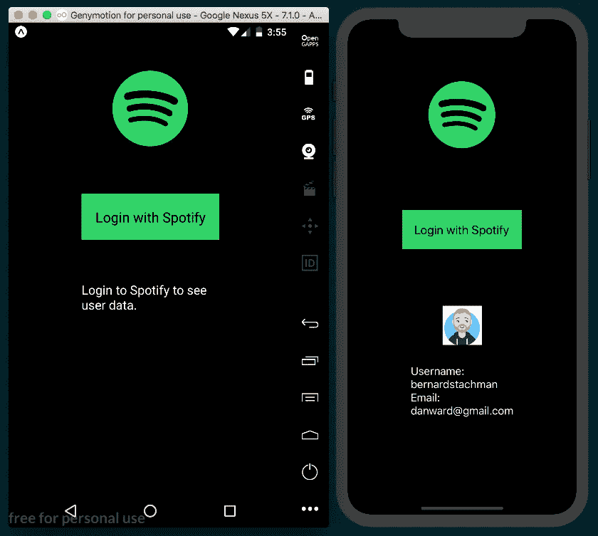

# React Native:使用 Expo 的 AuthSession 组件实现基于浏览器的认证

> 原文：<https://levelup.gitconnected.com/react-native-implementing-browser-based-authentication-using-expos-authsession-component-ffee25b50ae8>


这是我的书《反应本地烹饪书》的摘录，第二版，由 Packt 出版社出版，将于今年冬天出版。

本教程将介绍如何使用 Expo 的`AuthSession`组件在 React 本地应用中实现身份验证。有关如何使用 Expo 开发应用程序的更多信息，您可以阅读我以前的文章， [Expo vs React Native CLI:引导新 React Native 应用程序的指南](/expo-vs-react-native-cli-a-guide-to-bootstrapping-new-react-native-apps-6f0fcafee58f)。

`AuthSession`建立在 Expo 的`WebBrowser`组件之上，该组件可用于通过嵌入在应用程序中的浏览器打开网站。典型的登录工作流包括四个步骤:

1.  用户发起
2.  Web 浏览器打开登录页面
3.  身份验证提供程序在成功登录时提供重定向
4.  React 本机应用程序处理重定向

在这个应用程序中，我们将使用 Spotify API 通过用户登录获取我们应用程序的 Spotify 帐户信息。前往[https://beta.developer.spotify.com/dashboard/applications](https://beta.developer.spotify.com/dashboard/applications)创建一个新的 Spotify 开发帐户(如果你还没有的话)并创建一个新的 Spotify 应用程序。你可以给这个应用起任何你喜欢的名字。一旦用 Spotify 创建了应用程序，您将会在应用程序的信息中看到一个**客户端 ID** 字符串。在构建 React 本机应用程序时，我们将需要这个 ID。

# 做好准备

我们将通过在 Expo 中创建一个新的应用程序来开始构建这个项目。我将为我的应用程序使用名称`browser-based-auth`。

重定向 URI 也需要在我们上面创建的 Spotify 应用程序白名单。重定向的 url 应该是[https://auth.expo.io/@YOUR_EXPO_USERNAME/YOUR_APP_SLUG.](https://auth.expo.io/@YOUR_EXPO_USERNAME/YOUR_APP_SLUG.)的形式，因为我的 Expo 用户名是`warlyware`，并且因为我们正在构建的这个 React 原生应用程序被命名为`browser-based-auth`，所以我的重定向 URI 是[https://auth.expo.io/@warlyware/browser-based-auth.](https://auth.expo.io/@warlyware/browser-based-auth.)请务必将其添加到 Spotify 应用程序设置中的重定向 URIs 列表。

[](https://gitconnected.com)

# 怎么做

1.我们将从打开 React 本地项目根目录中的`App.js`文件开始。让我们删除所有的样板代码，以便我们可以一起从头开始。第一步是导入我们将使用的依赖项。

```
import React, { Component } from 'react';
import { TouchableOpacity, StyleSheet, Text, View } from 'react-native';
import { AuthSession } from 'expo';
import { FontAwesome } from '@expo/vector-icons';
```

2.让我们也将客户机 ID 声明为一个常量，供以后使用。复制我们之前创建的 Spotify 应用程序的客户端 ID，以便我们可以将其保存在 CLIENT_ID 常量中。

```
const CLIENT_ID = Your-Spotify-App-Client-ID;
```

3.让我们创建 App 类和初始的`state`。`userInfo`属性将保存我们从 Spotify API 收到的用户信息，`didError`是一个布尔值，用于跟踪登录期间是否发生了错误。

```
export default class App extends React.Component {
  state = {
    userInfo: null,
    didError: false
  }; // Defined in following steps
}
```

4.接下来，让我们定义用户登录 Spotify 的方法。`AuthSession`组件的`getRedirectUrl`方法提供了登录后返回 React 原生应用所需的重定向 URL，这与我们在 Spotify 应用的*准备就绪*部分保存的重定向 URI 相同。然后，我们将在登录请求中使用重定向，我们将使用`AuthSession.startAsync`方法启动该请求，向 Spotify 端点传递一个属性设置为`authUrl`的 options 对象，以便通过应用程序授权用户数据。在本教程末尾的*部分有更多关于这个网址的信息。*

```
handleSpotifyLogin = async () => {
  let redirectUrl = AuthSession.getRedirectUrl();
  let results = await AuthSession.startAsync({
    authUrl:
    `[https://accounts.spotify.com/authorize?client_id=${CLIENT_ID](https://accounts.spotify.com/authorize?client_id=${CLIENT_ID)}
    &redirect_uri=${encodeURIComponent(redirectUrl)}
    &scope=user-read-email&response_type=token`
  });// Defined in next step
};
```

5.我们将点击 Spotify 端点进行用户认证的结果保存在本地变量`results`中。如果 results 对象的 type 属性返回除了`‘success’`之外的任何内容，那么就会发生错误，所以我们将相应地更新 state 的`didError`属性。否则，我们将使用从 authorization 获得的访问令牌来访问`/me`端点，以获取用户信息，我们将把这些信息保存到`this.state.userInfo`。

```
handleSpotifyLogin = async () => {
  if (results.type !== 'success') {
    this.setState({ didError: true });
  } else {
    const userInfo = await axios.get(`[https://api.spotify.com/v1/me`](https://api.spotify.com/v1/me`), {
      headers: {
        "Authorization": `Bearer ${results.params.access_token}`
      }
    });
    this.setState({ userInfo: userInfo.data });
  }
};
```

6.既然已经定义了 auth 相关的方法，让我们创建`render`函数。我们将使用`FontAwesome` Expo 图标库来显示 Spotify 徽标，添加一个允许用户登录的按钮，并添加根据`this.state.didError`的值呈现错误或用户信息的方法。一旦在`state`的`userInfo`属性中保存了数据，我们还将禁用登录按钮。

```
render() {
  return (
    <View style={styles.container}>
      <FontAwesome
        name="spotify"
        color="#2FD566"
        size={128}
      />
      <TouchableOpacity
        style={styles.button}
        onPress={this.handleSpotifyLogin}
        disabled={this.state.userInfo ? true : false}
      >
        <Text style={styles.buttonText}>
          Login with Spotify
        </Text>
      </TouchableOpacity>
      {this.state.didError ?
        this.displayError() :
        this.displayResults()
      }
    </View>
  );
}
```

7.接下来，让我们定义处理错误的 JSX。该模板只是显示一条一般性的错误消息，指示用户应该再试一次。

```
displayError = () => {
  return (
    <View style={styles.userInfo}>
      <Text style={styles.errorText}>
        There was an error, please try again.
      </Text>
    </View>
  );
}
```

8.`displayResults`函数将是一个`View`组件，如果有 userInfo 保存到 state，它将显示用户的图像、用户名和电子邮件地址，否则将提示用户登录。

```
displayResults = () => {
  { return this.state.userInfo ? (
    <View style={styles.userInfo}>
      <Image
        style={styles.profileImage}
        source={ {'uri': this.state.userInfo.images[0].url} }
      />
      <View>
        <Text style={styles.userInfoText}>
          Username:
        </Text>
        <Text style={styles.userInfoText}>
          {this.state.userInfo.id}
        </Text>
        <Text style={styles.userInfoText}>
          Email:
        </Text>
        <Text style={styles.userInfoText}>
          {this.state.userInfo.email}
        </Text>
      </View>
    </View>
  ) : (
    <View style={styles.userInfo}>
      <Text style={styles.userInfoText}>
        Login to Spotify to see user data.
      </Text>
    </View>
  )}
}
```

9.这个食谱的样式很简单。它使用了灵活的分栏布局，应用了 Spotify 的黑色和绿色配色方案，并增加了字体大小和边距。

```
const styles = StyleSheet.create({
  container: {
    flexDirection: 'column',
    backgroundColor: '#000',
    flex: 1,
    alignItems: 'center',
    justifyContent: 'space-evenly',
  },
  button: {
    backgroundColor: '#2FD566',
    padding: 20
  },
  buttonText: {
    color: '#000',
    fontSize: 20
  },
  userInfo: {
    height: 250,
    width: 200,
    alignItems: 'center',
  },
  userInfoText: {
    color: '#fff',
    fontSize: 18
  },
  errorText: {
    color: '#fff',
    fontSize: 18
  },
  profileImage: {
    height: 64,
    width: 64,
    marginBottom: 32
  }
});
```

10.现在，如果我们运行该应用程序，我们应该能够登录 Spotify，并看到用于登录的帐户的相关图像、用户名和电子邮件地址！



# 它是如何工作的

在第 4 步中，我们创建了处理 Spotify 登录过程的方法。`AuthSession.startAsync`方法只需要一个由 Spotify 开发者文档提供的`authUrl`。所需的四个部分是客户端 ID、用于处理来自 Spotify 的响应的重定向 URI、指示应用程序请求的用户信息范围的范围参数，以及`token`的`response_type`参数。我们只需要来自用户的基本信息，所以我们请求了一个范围类型`user-read-email`。有关所有可用范围的信息，请查看位于[https://beta . developer . Spotify . com/documentation/general/guides/scopes/](https://beta.developer.spotify.com/documentation/general/guides/scopes/)的文档。

在步骤 5 中，我们完成了 Spotify 登录处理程序。如果登录不成功，我们相应地更新`didError` on 状态。如果成功了，我们就使用这个响应来访问 Spotify API 端点以获取用户数据[[https://api.spotify.com/v1/me](https://api.spotify.com/v1/me)]。根据 Spotify 的文档，我们用`Bearer ${results.params.access_token}`定义了 get 请求的授权头来验证请求。当这个请求成功时，我们将返回的用户数据存储在`userInfo`状态对象中，该对象将重新呈现 UI 并显示用户的信息。

要深入了解 Spotify 的认证流程，您可以在[https://beta . developer . Spotify . com/documentation/general/guides/authorization-guide/](https://beta.developer.spotify.com/documentation/general/guides/authorization-guide/)找到该指南。

你也可以在[https://GitHub . com/warlyware/react-native-cookbook/tree/master/chapter-5/browser-based-auth](https://github.com/warlyware/react-native-cookbook/tree/master/chapter-5/browser-based-auth)的 GitHub 上看看这个教程的源代码。

*如果您觉得这篇文章有帮助，请花点时间👏 👏 👏。你也可以* [*关注我*](https://medium.com/@warlyware) *获取更多关于 React Native、Vue、JavaScript 开发的文章。*

[](http://levelup.gitconnected.com)[](https://gitconnected.com/learn/react-native) [## 学习 React Native -最佳 React Native 教程(2019) | gitconnected

### 10 大 React 原生教程。课程由开发者提交并投票，使您能够找到最好的…

gitconnected.com](https://gitconnected.com/learn/react-native)