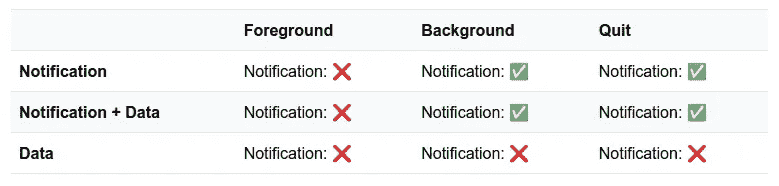
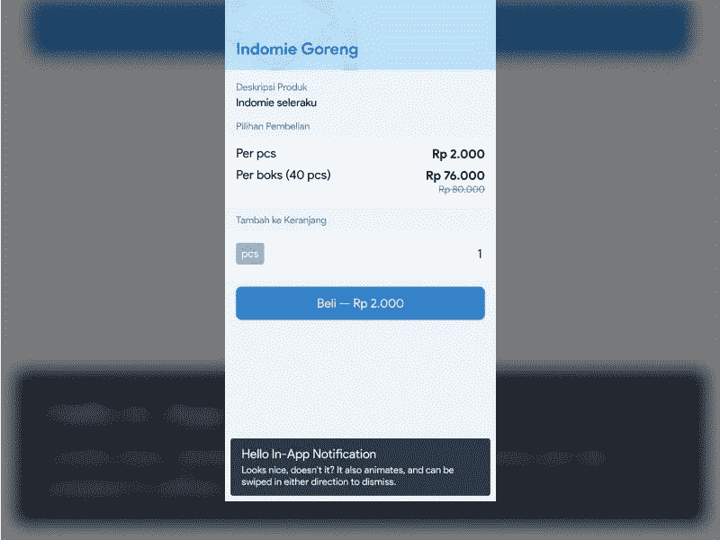

# 反应原生应用内远程通知用户界面

> 原文：<https://levelup.gitconnected.com/react-native-in-app-remote-notification-ui-8e367fcbe96b>

在 React 本地应用中创建交互式远程通知横幅 UI 的快速方法，具有动画和交互性。

约纳斯·勒普在 [Unsplash](https://unsplash.com/s/photos/notifications?utm_source=unsplash&utm_medium=referral&utm_content=creditCopyText) 上拍摄的照片

远程通知是许多类型的应用程序及其用例的重要组成部分。从营销到交易目的，它们是系统向用户个人(使用设备令牌)、特定目标群体(使用主题)或整体传达时间敏感信息的首选方式。为了做到这一点，React 原生开发人员通常会求助于 Invertase 一直很受欢迎的 [RNFirebase](https://rnfirebase.io/https://rnfirebase.io/) 包，该包为 Android 和 iOS 提供了原生 Firebase SDK 的包装，并利用[消息传递](https://rnfirebase.io/messaging/usage)模块来侦听从 Firebase Cloud Messaging (FCM)发送的传入远程消息。

# 为什么？

有人可能会问，为什么需要定制的通知用户界面？远程通知不会自动显示在通知阴影中吗？查看文档，很明显，当应用程序在前台时(当用户正在使用应用程序时)，通知无法显示——见下表。

RNFirebase 中的通知显示支持—链接[此处](https://rnfirebase.io/messaging/usage#notifications)

如果应用程序状态为后台或退出/终止，通知将仅显示在通知阴影中。因此，需要某种形式的应用内 UI 在用户收到通知时向用户显示通知。

# 我看起来怎么样？

看起来很简单，对吧？

因为它是完全定制的，所以可以定制通知 UI 设计和交互性，以匹配应用程序的整体外观和感觉。下面的风格是我更喜欢自己做的。

## 通知组件

创建一个新的独立组件来处理所有应用程序内的通知逻辑是关键，因为 UI 需要能够在应用程序的所有部分中显示并与之交互。然后，它可以被附加到根组件(或者附近的某个地方)。

*注意打字稿:)*

## 基本用户界面

现在，让我们做一个显示通知标题和正文的基本设计。这里我使用 [TailwindRN](https://github.com/vadimdemedes/tailwind-rn) 来处理样式(因为为什么不)。老实说，我喜欢在网络上使用 [TailwindCSS](https://tailwindcss.com/) ，我也很感激我能在 React Native 中获得类似的体验。如果你没有尝试过，我强烈建议你试一试。

现在我们有进展了。

在这个例子中，组件基本上显示了一个深灰色的可触摸的横幅，带有白色的标题和正文，位于一个`absolute`位置的容器内(在这个例子中，锚定在屏幕的底部)。banner 使用了一个可触摸的组件来处理按压动作(后面会详细介绍)。

# 做一个好的倾听者

接下来，组件需要监听(订阅)传入的远程消息，并将其存储在 state 中。为此，它需要通过调用消息传递模块的`onMessage`方法在 mount 上创建一个监听器。它还需要确保远程消息确实是一个“通知”(有标题和正文)。显示之前制作的`Text`组件里面的标题和正文。

来吧，试试看！发送到设备的消息应该自动在横幅中显示其内容。5 秒后也应该会自行消失。

# 给他们看看你的动作！

现在有趣的部分来了——动画！但不要太得意忘形，这只是一个通知横幅，至少对我来说，在 UI 中的移动应该保持最小化和不分散注意力。向组件添加微妙的进入和退出过渡动画有点像这样。

1.  定义一个`transition`动画值，从`0`开始。该值的范围从`300`(隐藏)到`0`(显示)，用作容器的`translateY`值。**注:** `300`只是一个方便值，可以跳过测量实际横幅高度。
2.  定义“退出”过渡动画，该动画应将过渡值从`0`更改为`300`。
3.  定义“进入”过渡动画，它类似于“退出”动画，但正好相反。
4.  当一个新的远程消息进来时，启动“输入”动画。
5.  在消息传入 5 秒钟后启动“退出”动画(稍微修改上一步中的流程)。
6.  将容器`View`组件更改为`Animated.View`组件，并从`transition`动画值中设置其`translateY`值。

变态动作！看起来很漂亮，是吧？更重要的是，它将自己限制在仅仅增加一种互动和自然运动的感觉，而不是太分散注意力或太浮华。

# 让开！

我们经常看到的通知的另一个基本特征是它能够被解除。在 Android 通知阴影上，这通常通过向左或向右滑动来完成。让我们看看 React Native 在这方面能做些什么。

React Native 提供了一种简单的方法来使用组件的`PanResponder` API 处理组件上的手势。为了处理滑动，组件的平移处理程序需要响应水平移动，并将其转换为容器的`translateX`值。该移动值也可以插值为不透明度值，以在消除时给它一个“渐隐”效果。按顺序，它是这样的。

1.  定义一个`swipe`动画值。该值将映射到平移响应器的水平移动。
2.  定义一个`resetSwipe`动画，如果水平移动不够快，不足以作为解散动作，将容器重置到其原始位置。
3.  定义左右`swipeOut`动画，如果水平移动符合解散动作，将容器完全移出屏幕。
4.  定义一个`panResponder`来附加到可触摸组件上，并处理作用于其上的手势。将`onPanResponderMove`事件的`dx`(水平移动)映射到`swipe`动画值。
5.  将`panResponder`的`panHandlers`连接到可触摸组件上。
6.  向容器组件添加一个`translateX`值，以对`swipe`动画值做出反应。
7.  将`opacity`值定义为`swipe`动画值的插值。
8.  将`opacity`值添加到容器组件中。

现在，通过足够快地向左或向右滑动，我们可以将通知放到一边。整洁！

就像这样，应用程序现在有能力显示(动画)和消除应用程序内的远程通知。活着是多么美好的时光。

远程消息的另一个优点是，它们可以包含数据(除了标题和正文)，我们可以在应用程序中获取和使用这些数据。几个常见的使用案例是:

1.  设置当用户按下通知时应用程序要导航到的路由/deeplink URL。这可以通过与 [React 导航](https://reactnavigation.org/)的结合来实现——敬请关注这方面的文章！
2.  设置指定的键以刷新/重新验证服务器中的数据。这可以和 [SWR](https://swr.vercel.app/) 一起完成——另外，敬请关注！

还可以看看如何在 React Native 中制作另一个常用的移动应用程序 UI，即[底部可滑动模态](https://medium.com/@ndyhrdy/making-the-bottom-sheet-modal-using-react-native-e226a30bed13)。

React Native with Firebase 能够让越来越多的开发者在如此短的时间内轻松创建和发布高质量的应用，这令人惊叹。我希望这篇文章的食谱能对每个花时间阅读的人有所帮助。一如既往地感谢您的阅读，它对我来说意味着整个世界。如果你愿意，请留下回复。我总是喜欢结交新朋友，不管你是谁。更多信息请到 endyhardy.co[找我。](https://endyhardy.co)

祝你愉快，注意安全，戴上口罩，洗手，继续创作！