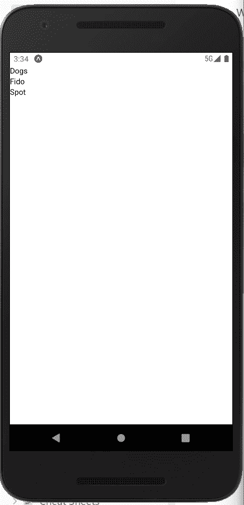
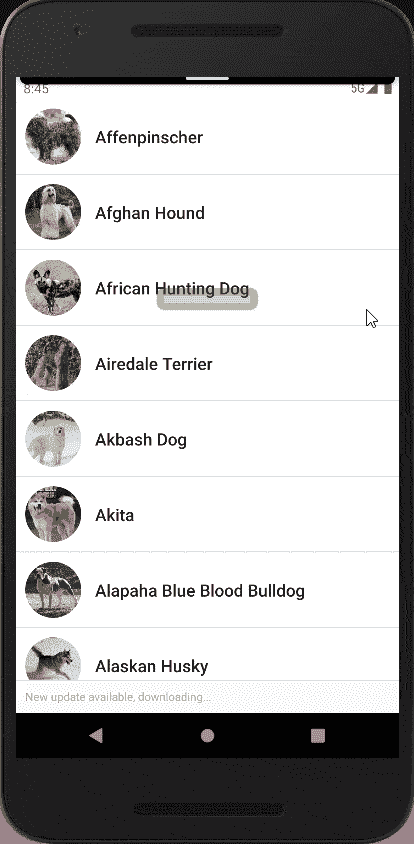
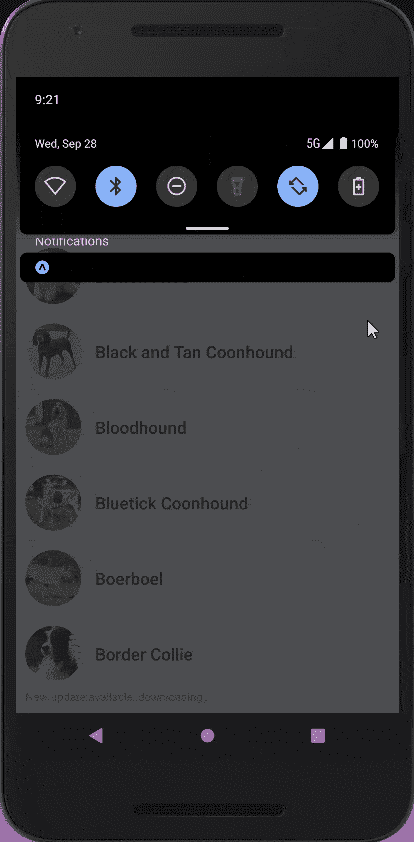

# 使用 React 查询反应本机无限滚动

> 原文：<https://levelup.gitconnected.com/react-native-infinite-scrolling-with-react-query-3c2cc69790be>


[媒体修改器高清照片](https://unsplash.com/photos/FjMfPpcyIbw)

无限滚动是一种在用户向下滚动页面时不断加载数据的技术，不需要分页。

本教程将使用 React Native 创建无限滚动和 FlashList 来呈现数据。我们将使用 [Dogs API](https://docs.thedogapi.com/) 来检索关于 Dogs 的数据，并且我们将利用 [React Query](https://tanstack.com/query/v4) 来处理数据。

# 为什么选择 FlashList？

FlashList 提供了更快的速度，让你的列表没有空白单元格。它“回收引擎盖下的组件，以最大限度地提高性能。”访问他们的[网站](https://shopify.github.io/flash-list/)了解更多信息。

# 初始化 React 本机项目

我们将使用 Expo 创建一个新的应用程序。因此，请确保您的开发机器上安装了 Expo CLI，您的 iOS 或 Android 物理设备或仿真器上安装了 Expo Go 应用程序。如果您还没有，请查看他们的[安装指南](https://docs.expo.dev/get-started/installation/)。

在项目目录中运行以下命令

```
npx expo init
```

会提示您一些选项

1.  您希望为您的应用程序命名什么？输入您想要的任何名称。我会选择`rn-infinite-scroll`
2.  选择模板选择空白

现在，等到安装完依赖项，导航到目录并启动应用程序。

```
cd rn-infinite-scroll
yarn start
```

# 安装依赖项

停止应用程序并安装以下依赖项。

```
yarn add @tanstack/react-query 
npx expo install @shopify/flash-list react-native-safe-area-context
```

使用`yarn start`再次启动应用程序

# 设置反应查询

我们需要用 react query 的提供者来包装应用程序，以便访问客户端

打开`App.js`文件，修改如下

```
import { QueryClient, QueryClientProvider } from "@tanstack/react-query";
import { StatusBar } from "expo-status-bar";
import { StyleSheet, Text, View } from "react-native";// react query client instance
const queryClient = new QueryClient();export default function App() {
  return (
		// react query provider
    <QueryClientProvider client={queryClient}>
      <View style={styles.container}>
        <Text>Open up App.js to start working on your app!</Text>
        <StatusBar style="auto" />
      </View>
    </QueryClientProvider>
  );
}const styles = StyleSheet.create({
  container: {
    flex: 1,
    backgroundColor: "#fff",
  },
});
```

# 创建屏幕

# DogCard 组件

让我们从创建主屏幕开始。在项目目录下，新建一个名为`components`的文件夹，并新建一个名为`DogCard.js`的文件，即`/components/DogCard.js`。向其中添加以下代码。

```
import React from "react";
import { Image, StyleSheet, Text, View } from "react-native";const DogCard = ({ dog }) => {
  return (
    <View>
      <View style={styles.row}>
        <Image source={{ uri: dog.image.url }} style={styles.pic} />
        <View style={styles.nameContainer}>
          <Text style={styles.nameTxt}>{dog.name}</Text>
        </View>
      </View>
    </View>
  );
};const styles = StyleSheet.create({
  row: {
    flexDirection: "row",
    alignItems: "center",
    borderColor: "#DCDCDC",
    backgroundColor: "#fff",
    borderBottomWidth: 1,
    padding: 10,
  },
  pic: {
    borderRadius: 30,
    width: 60,
    height: 60,
  },
  nameContainer: {
    flexDirection: "row",
    justifyContent: "space-between",
  },
  nameTxt: {
    marginLeft: 15,
    fontWeight: "600",
    color: "#222",
    fontSize: 18,
  },
});export default DogCard;
```

在这里，我们将渲染狗的品种名称和形象。

# 家用部件

接下来，我们在根目录下创建另一个名为`screens`的文件夹和一个名为`Home.js`的新文件。添加以下内容。

```
import { FlashList } from "@shopify/flash-list";
import React from "react";
import { Text, View } from "react-native";
import { SafeAreaView } from "react-native-safe-area-context";const Home = () => {
  return (
    <SafeAreaView>
      <FlashList
	data={[{ name: "Dogs" }, { name: "Fido" }, { name: "Spot"}]}
	renderItem={({ item }) => <Text>{item.name}</Text>}
	estimatedItemSize={100}
      />
    </SafeAreaView>
  );
};export default Home;
```

目前，我们使用硬编码数据来呈现列表。

这是您的屏幕现在应该显示的内容



# 获取数据

接下来，我们将处理从 Dogs API 获取数据。在根目录下新建一个名为`hooks`即`/hooks`的文件夹和一个名为`useFetchDogs`即`/hooks/useFetchDogs`的文件。这将是一个自定义挂钩来获取我们的数据。用以下内容填充该文件

```
import { useQuery } from "@tanstack/react-query";export default function useFetchDogs() {
  const getDogs = async () => {
    const res = await (
      await fetch(`https://api.thedogapi.com/v1/breeds`)
    ).json(); return res;
  }; return useQuery(["dogs"], getDogs);
}
```

`useFetchDogs`是一个定制的挂钩。我们创建了`getDogs`函数来获取所有数据，还没有分页。然后将`useQuery`的结果返回给钩子，钩子从 react-query 导入以获取数据。这个钩子至少有两个参数:

*   查询的唯一键在内部用于在整个应用程序中检索、缓存和共享查询。在我们的例子中，关键是`dogs`。
*   一个返回承诺的函数，在我们的例子中是`getDogs`函数。

现在，让我们修改`Home.js`屏幕来显示我们从 API 获得的数据。

```
// previous code here
import DogCard from "../components/DogCard";
import useFetchDogs from "../hooks/useFetchDogs";const Home = () => {
  const { data, isLoading, isError } = useFetchDogs(); if (isLoading) return <Text>Loading...</Text>; if (isError) return <Text>An error occurred while fetching data</Text>; return (
    <SafeAreaView style={{ flex: 1, backgroundColor: "#fff" }}>
      <FlashList
        keyExtractor={(item) => item.id}
        data={data}
        renderItem={({ item }) => <DogCard dog={item} />}
        estimatedItemSize={100}
      />
    </SafeAreaView>
  );
};// remaining code here
```

我们导入了我们的自定义钩子，并将其命名为。钩子返回一个对象，并通过析构提取我们将使用的数据。`data`包含了我们需要渲染的数据。`isLoading`表示正在获取数据，返回一个布尔值。而`isError`指示是否有错误，并返回一个布尔值。

当`isLoading`为真时，我们返回一个文本让用户知道，当`isError`为真时，我们让用户知道有一个错误。

另外，请注意我们现在使用的是`DogCard`组件。



使用 useQuery 获取的数据

# 用`useInfiniteQuery`分页

现在，我们正在一次获取所有数据。这不是我们想要的。我们希望为每页获取 10 个数据。

为此，我们需要使用一个名为`useInfiniteQuery.`的`useQuery`版本，我们将首先修改我们的定制钩子，如下所示

```
import { useInfiniteQuery } from "@tanstack/react-query";export default function useFetchDogs() {
  const getDogs = async ({ pageParam = 0 }) => {
    const res = await (
      await fetch(
        `https://api.thedogapi.com/v1/breeds?limit=10&page=${pageParam}`
      )
    ).json(); return {
      data: res,
      nextPage: pageParam + 1,
    };
  }; return useInfiniteQuery(["dogs"], getDogs, {
    getNextPageParam: (lastPage) => {
			if (lastPage.data.length < 10) return undefined; return lastPage.nextPage;
    },
  });
}
```

我们现在用`useInfiniteQuery`代替`useQuery`。

`getDogs`函数有一个参数`pageParam`，默认为 0。这意味着我们想从第一页开始获取。我们在 API URL 后面添加了`?limit=10&page={pageParam}`,以便从每个页面获取 10 个条目。我们现在也返回修改过的数据，一个有两个键的对象，`data`和`nextPage`。在每一次成功的 API 调用之后，我们递增`nextPage`。`useInfiniteQuery`需要这种格式的数据。

对于某些 API，我们不必这样做，因为它们已经以类似的格式返回了数据。但是对于 Dogs API，我们需要自己为`useInfiniteQuery`返回结构中的数据。

接下来是返回的`useInfiniteQuery`。就像`useQuery`一样，但是第三个参数是一个带有各种可选键的对象。我们添加了`getNextPageParam`选项来确定是否有更多的数据要加载和信息要获取。

`getNextPageParam`接受参数`lastPage`，该参数包含我们从`getDogs`函数返回的响应，并返回下一页。我们还添加了一个条件来检查我们是否到达了最后一页。

# 呈现无限滚动的数据

首先，让我们检查一下`useInfiniteQuery`返回的数据格式。`data`现在是一个带有两个键的对象:

*   `pageParams` -页码的数组
*   `pages` -每页的数据数组

我们需要将页面扁平化，将每个页面的数据连接成一个数组，以映射并呈现它们。我们可以利用 JavaScript `flatMap`

```
const flattenData = data.pages.flatMap((page) => page.data)
```

让我们修改列表组件来呈现扁平数据。打开`Home.js`

```
const Home = () => {
  // previous code here const flattenData = data.pages.flatMap((page) => page.data); return (
    <SafeAreaView style={{ flex: 1, backgroundColor: "#fff" }}>
      <FlashList
        keyExtractor={(item) => item.id}
        data={flattenData}
        renderItem={({ item }) => <DogCard dog={item} />}
        estimatedItemSize={100}
      />
    </SafeAreaView>
  );
};export default Home;
```

# 带 FlashList 的无限滚动

当滚动位置达到某个阈值时，我们需要加载额外的数据。当达到阈值时，我们调用一个函数来加载更多的数据。React Native 中的阈值介于 0 和 1 之间，默认值为 0.5。也就是说，只要内容的结尾在列表长度的一半以内，就会调用获取新数据的函数。

`useInfiniteQuery`从它被调用时的结果中为我们提供了一些其他的函数。`fetchNextPage`和`hasNextPage`现已上市。让我们创建加载下一页数据的函数。

```
const loadNextPageData = () => {
    if (hasNextPage) {
      fetchNextPage();
    }
  };
```

我们添加了一个新的道具`FlashList`来在滚动位置到达呈现内容的`onEndReachedThreshold`内时调用该函数。

```
<FlashList
  keyExtractor={(item) => item.id}
  data={flattenData}
  renderItem={({ item }) => <DogCard dog={item} />}
  onEndReached={loadNextPageData}
/>
```

`Home.js`应该是这样的:

```
import { FlashList } from "@shopify/flash-list";
import React from "react";
import { Text, View } from "react-native";
import { SafeAreaView } from "react-native-safe-area-context";
import DogCard from "../components/DogCard";
import useFetchDogs from "../hooks/useFetchDogs";const Home = () => {
  const { data, isLoading, isError, hasNextPage, fetchNextPage } =
    useFetchDogs(); if (isLoading) return <Text>Loading...</Text>; if (isError) return <Text>An error occurred while fetching data</Text>; const flattenData = data.pages.flatMap((page) => page.data); const loadNext = () => {
    if (hasNextPage) {
      fetchNextPage();
    }
  }; return (
    <SafeAreaView style={{ flex: 1, backgroundColor: "#fff" }}>
      <FlashList
        keyExtractor={(item) => item.id}
        data={flattenData}
        renderItem={({ item }) => <DogCard dog={item} />}
        onEndReached={loadNext}
	estimatedItemSize={100}
      />
    </SafeAreaView>
  );
};export default Home;
```

请记住，阈值可以在 0 和 1 之间。将 it 从默认值(0.5)更改为 0.2

```
<FlashList
  keyExtractor={(item) => item.id}
  data={flattenData}
  renderItem={({ item }) => (
    <Text style={{ height: 50 }}>{item.name}</Text>
  )}
  onEndReached={loadNext}
  onEndReachedThreshold={0.2}
estimatedItemSize={100}
/>
```



使用 useInfiniteQuery 进行无限滚动

# 结论

我们用 React Native、React Query 的`useInfiniteQuery`和 FlashList 实现无限滚动，消耗来自 Dogs API 的数据。

GitHub 代码[此处](https://github.com/dhatGuy/react-native-infinite-scroll)。

# 亲自尝试

*   在获取数据时显示加载微调器
*   实施拉取刷新

# 分级编码

感谢您成为我们社区的一员！在你离开之前:

*   👏为故事鼓掌，跟着作者走👉
*   📰查看[升级编码出版物](https://levelup.gitconnected.com/?utm_source=pub&utm_medium=post)中的更多内容
*   🔔关注我们:[Twitter](https://twitter.com/gitconnected)|[LinkedIn](https://www.linkedin.com/company/gitconnected)|[时事通讯](https://newsletter.levelup.dev)

🚀👉 [**将像你这样的开发人员安置在顶级创业公司和科技公司**](https://jobs.levelup.dev/talent/welcome?referral=true)