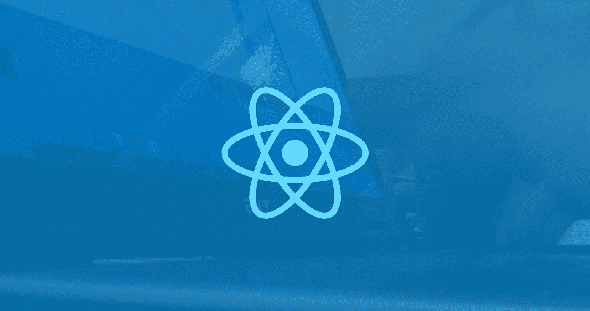

# 反应本机布局动画

> 原文：<https://levelup.gitconnected.com/react-native-layoutanimation-267489b67a20>

## 非官方文件



捕捉人们兴趣的高分辨率图像

# 介绍

在我写这篇文章的时候，2018 年 8 月，[layout animation](https://facebook.github.io/react-native/docs/layoutanimation)的文档很少——它可能需要一些工作。这很不幸，因为`LayoutAnimation`非常有用和强大。

我查看了源代码内部，并在此报告我的发现。这篇文章将涵盖我在别处很难找到的关于`LayoutAnimation`的细节，以及一些例子。

[我还用一些例子做了一个演示项目。](https://github.com/philipshen/layout-animation-ex)

# 概观

什么是`LayoutAnimation`？来自官方文件:

> 当下一个布局发生时，自动将视图移动到新位置。

差不多就是这样。在下一个应用程序布局之前——在大多数情况下，在调用`setState({})`或调度 Redux 动作之前——您可以使用`LayoutAnimation`来处理组件的行为，因为它们的布局被更新了，所以它们会弹出、滑动或淡入 UI 上的下一个位置。

需要注意的是`LayoutAnimation`做的和`Animated`做的不一样。`Animated`将变换应用于屏幕上的组件，而不改变组件在屏幕上的实际布局。换句话说，设置一个组件的动画不会影响其他组件，因为被设置动画的组件的帧实际上并没有改变。`LayoutAnimation`指定如果组件的框架确实发生变化——它们的高度增加，它们向左移动 10px，等等——组件应该执行的动画。

我试着用一个例子来解释这个。假设您想要将一个组件添加到屏幕上，并且您想要将它的入口制作成动画。为此，您可以使用`Animated`让组件优雅地从屏幕上的其他组件上方、下方和中间通过，然后到达它的目的地。

但是，如果您希望在绘制新组件时动画显示所有其他组件的重新排列，该怎么办呢？嗯，为此你想要`LayoutAnimation`。通过使用`LayoutAnimation`，你可以让所有东西在被新添加的组件推到一边时，不会立即传送到屏幕上的新位置，而是滑动、放松或跳跃到新位置。

# 方法

## configureNext(config，onAnimationDidEnd)

这就是`LayoutAnimation`发生的原因；基于传递给它的`config`，这个方法将决定下一个布局的行为。您还可以选择提供一个在动画结束时触发的回调。

## 创建(持续时间:数字，类型:类型，创建提示:属性)

这只是一个创建定制`LayoutAnimation`配置的辅助函数。看起来是这样的:

至于“类型”、“属性”和“配置”是什么，我现在将会谈到。

# 类型/枚举

## LayoutAnimation。配置

配置就是动画的配置。它决定了它做什么。

自然，这与`create()`方法的返回值相匹配。

此外，正如您可能猜到的，三个属性“创建”、“更新”和“删除”中的每一个都控制着动画在其进展的不同阶段的行为。

## LayoutAnimation。动漫

“Anim”，它保存动画在创建、更新或删除过程中的行为属性。让我们来看看:

我要在这里指出的是，我所涉及的这些细节对于开始使用`LayoutAnimation`来说是绝对不必要的。如果这就是你想要做的，那就去看看底部的**示例**部分，开始吧；这很容易，你会马上学会的。我只是想彻底了解一下。

也就是说，看看“动画”你会再次发现它相当简单。以下是一些需要注意的事项:

*   `springDamping`是一个在[0，1]范围内的值

其实就是这样。关于 LayoutAnimation，我很遗憾地报告，没有太多神奇的魔法可以被发现。

让我们通过查看这些类型和属性来结束这一部分。

## LayoutAnimation。类型

此枚举包含您可以选择的不同动画类型。目前有 6 种不同的值:

前 5 个是不言自明的，但是键盘到底是什么？？

键盘将使您的布局动画与键盘的出现/消失相匹配。动画将忽略您在配置中设置的任何“持续时间”,从键盘开始升起时开始，到键盘完全按下屏幕时结束。它也不能在 Android 上运行，会让你的应用崩溃，所以要小心。

## LayoutAnimation。性能

这些属性允许您通过制作不透明度或比例变化以及帧变化的动画，为动画赋予一些更特殊的行为。换句话说，如果下一个布局涉及到组件的不透明度、高度或宽度的一些变化，您将希望在这里指定这些变化，以便将这些变化制作成动画。

# 表演

我没有科学和量化地研究 LayoutAnimation 的表现，但下面是我的发现:

## ios

在 iOS 上，LayoutAnimation 用原生的 iOS 动画处理一切，所以唯一过桥的是动画的配置。非常好。

请注意，尽管“键盘”动画类型*确实需要*在每一帧上做一些计算。不管是不是主线程，这都可能有点昂贵，如果不小心的话，还会导致一些性能问题。

*来源:React-native/React/Modules/rctlayoutanimation . m*

## 机器人

Android 对 LayoutAnimation 的支持还很年轻。脸书称之为“实验性的”。为了确保理解，您需要在文件的顶部指定这一点，这样它才能在 Android 上工作:

```
UIManager.setLayoutAnimationEnabledExperimental && UIManager.setLayoutAnimationEnabledExperimental(true);
```

Android 还不支持键盘动画，这没什么，因为谁需要它。

无论如何，关于性能的底线是 Android 的 LayoutAnimation 也是由原生模块驱动的，这很好。

*来源:react-native/react Android/src/main/Java/com/Facebook/react/ui manager/layout animation/**

# 快速示例

我将从我制作的小演示中复制并粘贴不同动画的代码。你可以在这里查看整个 file +实现。

# 结论

所以是的。这就是 LayoutAnimation。在使用和实现上都非常简单。