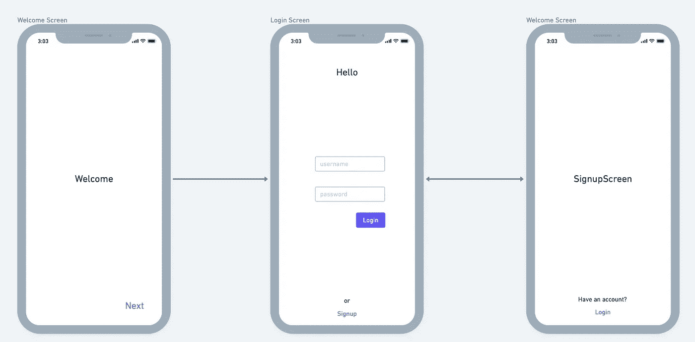
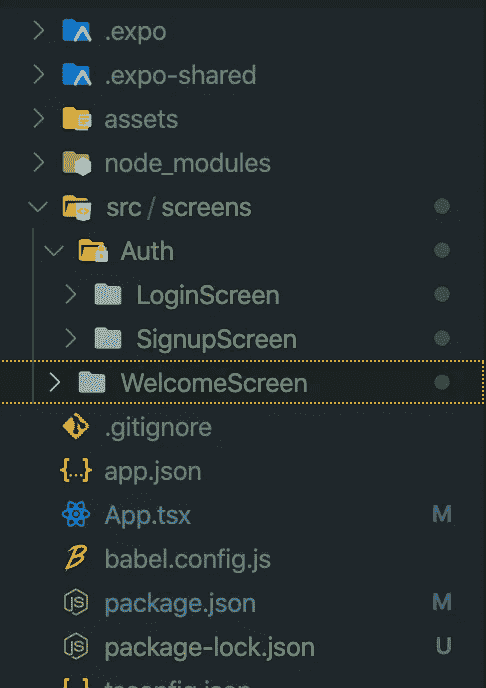
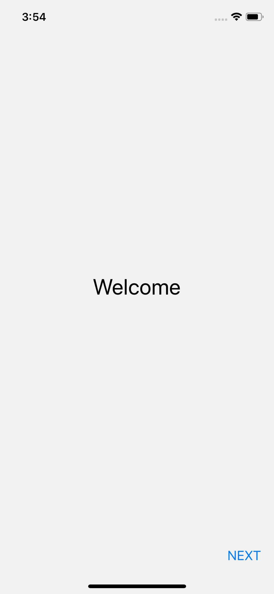
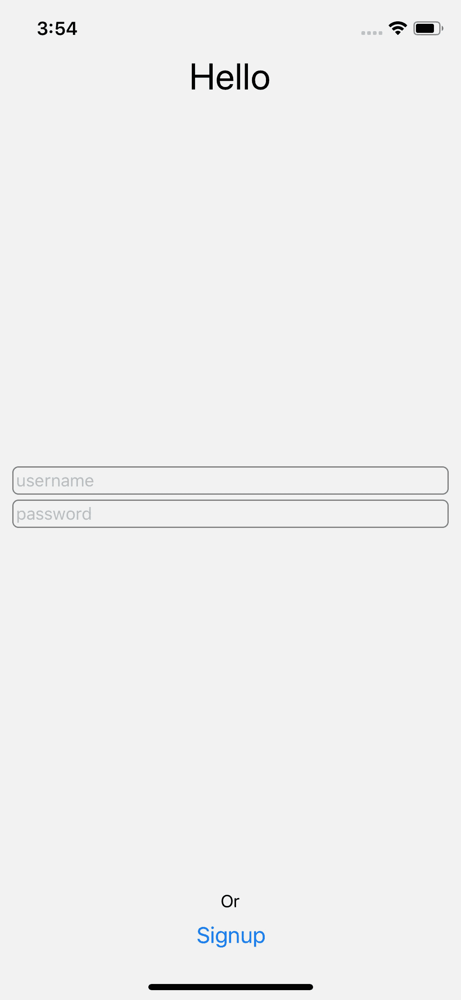
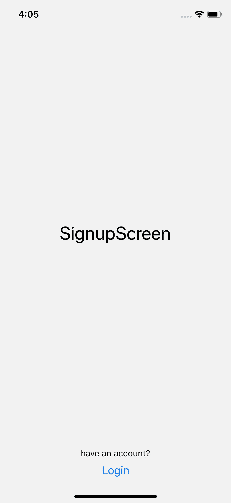
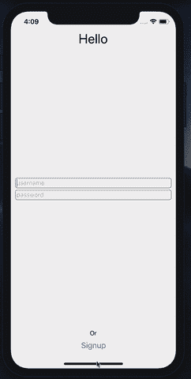

# 反应本地-反应导航

> 原文：<https://levelup.gitconnected.com/react-native-react-navigation-b27ab272e09b>

## 堆栈导航器


伊娃·拉乔维奇在 [Unsplash](https://unsplash.com/s/photos/stack-navigation?utm_source=unsplash&utm_medium=referral&utm_content=creditCopyText) 上拍摄的照片

使用移动应用程序时，在屏幕上导航至关重要。 [React Navigation](https://reactnavigation.org) 是一个很棒的库，允许你在 React 本地项目中创建不同类型的导航体验。

当我第一次开始使用 React Native 时，我认为如何在屏幕上导航有点令人困惑。这甚至更复杂，因为我想使用**类型脚本**，而大多数在线示例都是用 Javascript 编写的。

我现在的目的是向你展示我在使用 **Typescript** 构建几种类型的导航器时所学到的东西，这样你就不会像我一开始那样痛苦了。

因此，让我们开始配置一个基本的**堆栈导航器**，它将允许您在欢迎登录和注册屏幕之间导航，如下图所示。



堆栈导航示例线框

## 设置您的项目和反应导航

让我们从创建一个基于世博会的项目开始。请务必在您的计算机上安装 expo。如果您还没有安装它，您可以通过运行:

```
npm install -g expo-cli
```

安装完成后，让我们通过运行以下命令创建一个项目，

```
expo init StackNavigatorExample
```

一旦 expo 完成了项目的初始化，你就必须安装 React Navigation 和所有需要的依赖项。让我们做好所有准备工作:

1.  通过运行`cd StackNavigatorExample`将`cd`导入到您的项目中

2.安装 React 导航，

```
npm i @react-navigation/native
```

3.安装对等依赖项

```
expo install react-native-gesture-handler react-native-reanimated react-native-screens react-native-safe-area-context [@react](http://twitter.com/react)-native-community/masked-view
```

4.从 React 导航安装堆栈导航器

```
npm install @react-navigation/stack
```

5.开始编码！

## 创建项目结构和导航器

现在您已经设置了我们的项目，您可以继续创建将由导航器处理的所有屏幕。让我们从创建项目的结构开始。

让我们添加以下目录来存储每个屏幕:

*   `src/screens/Auth/LoginScreen`
*   `src/screens/Auth/SignupScreen`
*   `src/screens/WelcomeScreen`

您的项目应该如下所示:



现在您已经有了这个基本的项目结构，让我们创建导航器。为了模块化项目，我将为我在`src/navigators/AuthFlowNavigator/index.tsx`中的所有导航器创建一个单独的目录。

`index.tsx`文件应该是这样的:

```
import React from 'react';
import { createStackNavigator } from '[@react](http://twitter.com/react)-navigation/stack';
import WelcomeScreen from '../../screens/WelcomeScreen';
import LoginScreen from '../../screens/Auth/LoginScreen';
import SignupScreen, { SignupParams } from '../../screens/Auth/SignupScreen';export enum AppScreens {
    Welcome = 'Welcome',
    Login = 'Login',
    Signup = 'Signup'
}export type AuthStackParamList = {
    Login: undefined;
    Signup: SignupParams;
    Welcome: undefined;
};const AuthStack = createStackNavigator<AuthStackParamList>();const AuthFlowNavigator: React.FunctionComponent = () => {
    return (
        <AuthStack.Navigator headerMode="none">
            <AuthStack.Screen name={AppScreens.Welcome} component={WelcomeScreen} />
            <AuthStack.Screen name={AppScreens.Login} component={LoginScreen} />
            <AuthStack.Screen name={AppScreens.Signup} component={SignupScreen} />
        </AuthStack.Navigator>
    );
};export default AuthFlowNavigator;
```

😮你现在可能想知道这些代码在做什么。但这很简单。我会一步一步解释，

1.  用应用程序中所有屏幕的名称定义一个枚举。这将允许您在它们之间导航，而无需在屏幕中添加硬编码的名称，这样更不容易出错，因为它将在代码中的任何地方使用相关的名称

```
export enum AppScreens {
    Welcome = 'Welcome',
    Login = 'Login',
    Signup = 'Signup'
}
```

2.定义哪些参数可以传递到导航器的每个屏幕，

```
export type AuthStackParamList = {
    Login: undefined;
    Signup: SignupParams;
    Welcome: undefined;
};
```

正如我们在这种情况下看到的，唯一接收到某个东西的屏幕是`SignupScreen`，我们一会儿将得到它的参数的定义。

3.最后，我们必须创建我们的导航器并将其导出，以便我们可以在我们的`App.tsx`上使用它，因为它是我们应用程序的入口点。

```
const AuthStack = createStackNavigator<AuthStackParamList>();const AuthFlowNavigator: React.FunctionComponent = () => {
    return (
        <AuthStack.Navigator headerMode="none">
            <AuthStack.Screen name={AppScreens.Welcome} component={WelcomeScreen} />
            <AuthStack.Screen name={AppScreens.Login} component={LoginScreen} />
            <AuthStack.Screen name={AppScreens.Signup} component={SignupScreen} />
        </AuthStack.Navigator>
    );
};export default AuthFlowNavigator;
```

正如你所看到的，我已经将`headerMode="none"`道具添加到了导航器中。基本上，这样做的目的是隐藏默认的****标题**和默认的`back`按钮，这是堆栈导航器中的默认按钮。**

**在上面的代码中要考虑的另一件事是，我们用下面的代码添加了所有我们想放在堆栈中的屏幕，**

```
<AuthStack.Screen name={AppScreens.Welcome} component={WelcomeScreen} />
```

**在我们的示例中，我们只添加了 3 个屏幕，一个用于欢迎屏幕，另一个用于登录屏幕，第三个用于注册屏幕。**

**4.更新你的`App.tsx`文件，如下所示:**

```
import React from 'react';
import { NavigationContainer } from '[@react](http://twitter.com/react)-navigation/native';
import AuthFlowNavigator from './src/navigators/AuthFlowNavigator';export default function App() {
    return (
        <NavigationContainer>
            <AuthFlowNavigator />
        </NavigationContainer>
    );
}
```

**通过这样做，我们的 AuthFlowNavigator 将能够显示我们上面定义的屏幕。**

## **欢迎屏幕**

**现在我们已经设置好了导航器，让我们向初始屏幕添加一些代码(`src/screens/WelcomeScreen/index.tsx`)，**

```
import React from 'react';
import { SafeAreaView, StyleSheet, Text, View, Button } from 'react-native';
import { StackNavigationProp } from '[@react](http://twitter.com/react)-navigation/stack';
import { AuthStackParamList, AppScreens } from '../../navigators/AuthFlowNavigator';type WelcomeScreenNavigationProps = StackNavigationProp<AuthStackParamList, AppScreens.Welcome>;interface WelcomeScreenProps {
    navigation: WelcomeScreenNavigationProps;
}const styles = StyleSheet.create({
    btnNextContainer: {
        alignSelf: 'flex-end'
    },
    container: {
        flex: 1,
        alignItems: 'center',
        justifyContent: 'space-between',
        margin: 10
    },
    welcome: {
        fontSize: 30
    },
    welcomeContainer: {
        alignItems: 'center',
        justifyContent: 'center',
        flex: 1,
        width: '100%'
    }
});const WelcomeScreen: React.FunctionComponent<WelcomeScreenProps> = (props) => {
    const { navigation } = props;return (
        <SafeAreaView style={styles.container}>
            <View style={styles.welcomeContainer}>
                <Text style={styles.welcome}>Welcome</Text>
            </View>
            <View style={styles.btnNextContainer}>
                <Button title="NEXT" onPress={() => navigation.navigate(AppScreens.Login)} />
            </View>
        </SafeAreaView>
    );
};export default WelcomeScreen;
```

**这应该会得到以下结果:**

****

**欢迎屏幕**

**正如您在下面的代码中看到的，**

```
<Button title="NEXT" onPress={() => navigation.navigate(AppScreens.Login)} />
```

**我们正在显示一个按钮，允许我们导航到堆栈上的下一个屏幕。看看我们如何使用`AppScreens.Login`，这是我们之前定义的枚举，它帮助我们知道他在我们的应用程序上有哪些屏幕，并防止我们键入错误的屏幕名称。**

## **登录屏幕**

**现在让我们为`src/screens/auth/LoginScreen/index.tsx`内部的`LoginScreen`添加代码。它应该是这样的:**

```
import React, { useState } from 'react';
import { SafeAreaView, StyleSheet, Text, TextInput, Button, View } from 'react-native';
import { AppScreens, AuthStackParamList } from '../../../navigators/AuthFlowNavigator';
import { StackNavigationProp } from '[@react](http://twitter.com/react)-navigation/stack';type LoginScreenNavigationProps = StackNavigationProp<AuthStackParamList, AppScreens.Login>;interface LoginScreenProps {
    navigation: LoginScreenNavigationProps;
}const styles = StyleSheet.create({
    btnSignupContainer: {
        alignItems: 'center'
    },
    container: {
        flex: 1,
        alignItems: 'center',
        justifyContent: 'space-between',
        margin: 10
    },
    textInput: {
        borderRadius: 5,
        borderWidth: 1,
        borderColor: 'grey',
        marginTop: 4,
        padding: 2,
        width: '100%'
    },
    textInputContainer: {
        width: '100%'
    },
    txtHello: {
        fontSize: 30
    }
});const LoginScreen: React.FunctionComponent<LoginScreenProps> = (props) => {
    const { navigation } = props;
    const [username, setUsername] = useState<string>('');return (
        <SafeAreaView style={styles.container}>
            <Text style={styles.txtHello}>Hello</Text>
            <View style={styles.textInputContainer}>
                <TextInput
                    value={username}
                    placeholder="username"
                    style={styles.textInput}
                    onChangeText={(text) => setUsername(text)}
                />
                <TextInput placeholder="password" secureTextEntry={true} style={styles.textInput} />
            </View>
            <View style={styles.btnSignupContainer}>
                <Text>Or</Text>
                <Button title="Signup" onPress={() => navigation.navigate(AppScreens.Signup, { username })} />
            </View>
        </SafeAreaView>
    );
};export default LoginScreen;
```

**它应该会给出以下结果:**

****

**登录屏幕**

**如你所见，与`WelcomeScreen`相比，与导航相关的代码基本相同。唯一的主要区别是，我们将`username`值传递给了`SignupScreen`，作为第二个参数传递给了`navigate()`一个对象，该对象包含了我们想要发送到下一个屏幕的所有信息:**

```
<Button title="Signup" onPress={() => navigation.navigate(AppScreens.Signup, { username })} />
```

## **注册屏幕**

**最后，在`src/screens/auth/SignupScreen/index.tsx`将下面的代码添加到我们的`SignupScreen`中，**

```
import React from 'react';
import { SafeAreaView, StyleSheet, Text, TextInput, Button, View } from 'react-native';
import { AppScreens, AuthStackParamList } from '../../../navigators/AuthFlowNavigator';
import { StackNavigationProp } from '[@react](http://twitter.com/react)-navigation/stack';type SignupScreenNavigationProps = StackNavigationProp<AuthStackParamList, AppScreens.Signup>;export type SignupParams = {
    username: string;
};interface SignupScreenProps {
    route: { params: SignupParams };
    navigation: SignupScreenNavigationProps;
}const styles = StyleSheet.create({
    btnLoginContainer: {
        alignSelf: 'center'
    },
    container: {
        flex: 1,
        alignItems: 'center',
        justifyContent: 'space-between',
        margin: 10
    },
    txtSignupScreen: {
        fontSize: 30
    },
    txtSignupScreenContainer: {
        flex: 1,
        alignItems: 'center',
        justifyContent: 'center'
    },
    txtUsername: {
        fontSize: 25,
        color: 'grey'
    }
});const SignupScreen: React.FunctionComponent<SignupScreenProps> = (props) => {
    const { navigation, route } = props;
    const { params } = route;
    const { username } = params;return (
        <SafeAreaView style={styles.container}>
            <View style={styles.txtSignupScreenContainer}>
                <Text style={styles.txtSignupScreen}>SignupScreen</Text>
                <Text style={styles.txtUsername}>{username}</Text>
            </View>
            <View style={styles.btnLoginContainer}>
                <Text>have an account?</Text>
                <Button title="Login" onPress={() => navigation.pop()} />
            </View>
        </SafeAreaView>
    );
};export default SignupScreen;
```

**在这个屏幕中，您会注意到与上一个屏幕相比有一些变化。这里我们必须让屏幕知道它接收了哪些参数。我们将在本节中讨论这一点，**

```
export type SignupParams = {
    username: string;
};interface SignupScreenProps {
    route: { params: SignupParams };
    navigation: SignupScreenNavigationProps;
}
```

**上面的代码应该给我们以下结果，**

****

**注册屏幕**

**您会注意到，由于我们已经完成的设置，我们能够传递`username`值。您可以在文本`username text field`上键入一些内容，然后点击`signup`按钮，您将看到注册屏幕上显示的值:**

****

**航行**

# **结论**

**如你所见，使用 [**React Navigation**](https://reactnavigation.org/docs/getting-started) 设置导航器非常简单。如果你已经知道了一些 [**Typescript**](https://www.typescriptlang.org/docs/home.html) 的概念，我们所经历的代码对你来说应该很熟悉。如果您在项目中使用 Javascript，设置导航器的工作方式是相同的，只需删除所有类型和接口，它应该工作正常。**

**创建其他类型的导航器也非常简单。一旦熟悉了 React 导航，您会发现向项目添加新屏幕是多么容易！**

**我已经将回购上传到我的 GitHub 账户，以防你想克隆它并马上使用它😃**

**[https://github.com/gmotzespina/StackNavigatorExample](https://github.com/gmotzespina/StackNavigatorExample)**