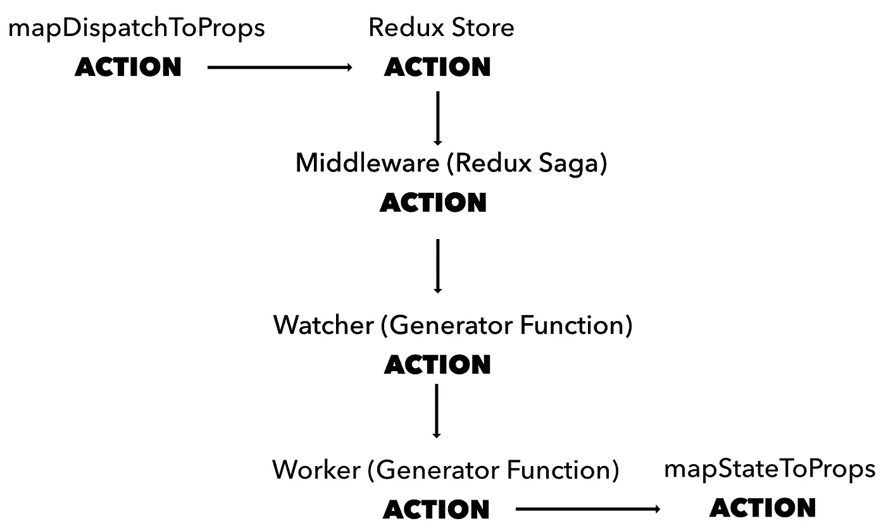
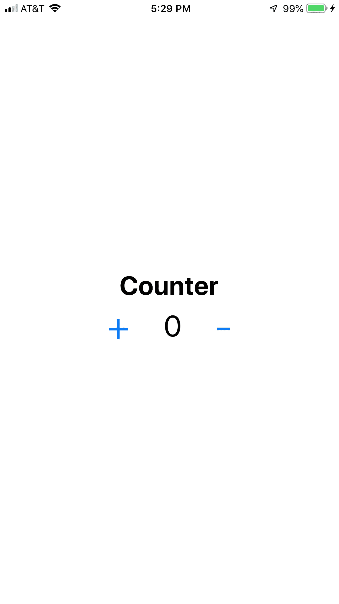

# React Native + Redux:为异步流实现 Redux Saga

> 原文：<https://levelup.gitconnected.com/react-native-redux-implementing-redux-saga-for-an-asynchronous-flow-90a0e9d7d8e8>

## 作者:杰夫·刘易斯


**备注:**

*   本指南假设你知道一些**反应原生**和**还原。**
*   **Github 回购:**[https://github.com/jefelewis/redux-saga-demo](https://github.com/jefelewis/redux-saga-demo)

# Redux Saga 是什么？

Redux Saga 是一个用作 Redux 中间件的库。Redux 中间件是通过`dispatch()`方法拦截进入商店的动作的代码，并且可以根据接收到的动作执行任务**。** Sagas 监视商店分派的所有行动(观察者/监视者)。在动作被传递给`props`之前，另一个函数(worker)将在异步流中处理如何处理动作。

**Redux Saga 使用了一个名为** [**生成器**](https://developer.mozilla.org/en-US/docs/Web/JavaScript/Reference/Global_Objects/Generator) **的 ES6 特性，可以让你编写异步代码。了解 Redux 传奇的流程是如何工作的很重要，特别是传奇发生了什么[(生成器功能)](https://developer.mozilla.org/en-US/docs/Web/JavaScript/Reference/Global_Objects/Generator)。**生成器功能允许使用** `**yield**` **进行排队操作，使其异步。****



# 为什么要用 Redux Saga？

Redux Saga 帮助 Redux 管理应用程序副作用。这使得您的代码更有效地执行，更容易测试，并允许更好的错误处理。

## 1.**更好地处理动作和异步操作**

生成器异步排队，这在处理 API 请求/响应、与 Firebase 通信或对时间敏感的流程时非常重要。

## **2。更容易阅读，没有回调地狱**

Redux Saga 使用生成器对任务进行排队，这消除了使用 Promises 时 Redux-Thunk 带来的回调问题。

## 3.更好的错误处理

Redux Saga 需要 2 个 Saga(生成器函数)用于每个状态:工人和观察者。管理流程的 saga 负责处理错误，因此 Redux 存储状态的每个部分都有自己的错误。

## 4.管理复杂的流程

Redux Saga 作为一个中间件，允许我们在动作被`mapStateToProps`传递给组件之前拦截它们。Sagas(生成器函数)协同工作，以模块化方式异步执行。

## 5.声明效果

Redux Saga Watchers 用户[声明效果](https://redux-saga.js.org/docs/basics/DeclarativeEffects.html) ( `takeEvery`、`takeLatest`、`takeLeading`等)。)，它允许控制请求的数量。例如，一个用户正在尝试登录，并且一直在按登录按钮。每次发出请求时都会发送一个请求。

我们可以使用声明性效果，比如`takeLatest`，只接受最后一个请求。

## 6.易于测试

使用 ES6 发生器和[宣告效果](https://redux-saga.js.org/docs/basics/DeclarativeEffects.html) ( `takeEvery`、`takeLatest`、`takeLeading`等。)，构建测试要容易得多，也干净得多。

# 示例应用+代码

**Github 回购:**[https://github.com/jefelewis/redux-saga-test](https://github.com/jefelewis/redux-saga-test)

## A.应用概述

App 会有一个减速器:`counterReducer`。在我们的`store.js`文件中，我们将导入 root reducer 和 root saga，并用`[applyMiddleware](https://redux.js.org/api/applymiddleware)()` **将它们集成到我们的 Redux 存储中。**

为了测试 Redux Saga 是否在我们的应用程序中工作，我们可以按下**“-”按钮(减少)**任意多次，我们的计数将会减少。我们的**“+”按钮(增加)**不同，因为我们有 4 秒的异步延迟。由于 Sagas，我们的增加和减少功能都是异步的，但是 4 秒的延迟是为了演示的目的。

另外，我们在**`watchIncreaseCounter`**中使用了`[takeLatest](https://redux-saga.js.org/docs/api/)`，所以只使用最后一个动作。您可以点击**“+”按钮(增加)**任意多次，但只有在最后一次点击按钮后 4 秒钟，计数器才会增加 1。****

## ****B.App 截图****

********

****Counter.js****

## ****C.应用程序文件结构****

****本例将使用 7 个文件:****

1.  ****App.js (React 原生应用)****
2.  ****Counter.js(计数器屏幕)****
3.  ****store.js (Redux 商店)****
4.  ****index.js (Redux Root Reducer)****
5.  ****counterReducer.js (Redux 计数器 Reducer)****
6.  ****index.js (Redux 根传奇)****
7.  ****反萨加****

## ****D.应用程序文件****

******App.js******

```
***// Imports: Dependencies* import React from 'react';
import { Provider } from 'react-redux';*// Imports: Screens* import Counter from './screens/Counter';*// Imports: Redux Store* import { store } from './store/store';*// React Native App* export default function App() {
  return (
    *// Redux: Global Store* <Provider store={store}>
      <Counter />
    </Provider>
  );
}**
```

******Counter.js******

```
***// Imports: Dependencies* import React, { Component } from 'react';import { Button, Dimensions, SafeAreaView, StyleSheet, Text, TouchableOpacity, View } from 'react-native';
import { connect } from 'react-redux';*// Screen Dimensions* const { height, width } = Dimensions.get('window');*// Screen: Counter* class Counter extends React.Component {
  render() {
    return (
      <SafeAreaView style={styles.container}>
        <Text style={styles.counterTitle}>Counter</Text> <View style={styles.counterContainer}>
          <TouchableOpacity onPress={this.props.reduxIncreaseCounter}>
            <Text style={styles.buttonText}>+</Text
          </TouchableOpacity> <Text style={styles.counterText}>{this.props.counter}</Text> <TouchableOpacity onPress={this.props.reduxDecreaseCounter}>
            <Text style={styles.buttonText}>-</Text
          </TouchableOpacity>
        </View>
      </SafeAreaView>
    )
  }
}*// Styles* const styles = StyleSheet.create({
  container: {
    flex: 1,
    justifyContent: 'center',
    alignItems: 'center',
  },
  counterContainer: {
    display: 'flex',
    flexDirection: 'row',
    justifyContent: 'center',
    alignItems: 'center',
  },
  counterTitle: {
    fontFamily: 'System',
    fontSize: 32,
    fontWeight: '700',
    color: '#000',
  },
  counterText: {
    fontFamily: 'System',
    fontSize: 36,
    fontWeight: '400',
    color: '#000',
  },
  buttonText: {
    fontFamily: 'System',
    fontSize: 50,
    fontWeight: '300',
    color: '#007AFF',
    marginLeft: 40,
    marginRight: 40,
  },
});*// Map State To Props (Redux Store Passes State To Component)* const mapStateToProps = (state) => {
  console.log('State:');
  console.log(state); *// Redux Store --> Component* return {
    counter: state.counter.counter,
  };
};*// Map Dispatch To Props (Dispatch Actions To Reducers. Reducers Then Modify The Data And Assign It To Your Props)* const mapDispatchToProps = (dispatch) => {
  *// Action* return {
    *// Increase Counter* reduxIncreaseCounter: () => dispatch({
      type: 'INCREASE_COUNTER',
      value: 1,
    }),
    *// Decrease Counter* reduxDecreaseCounter: () => dispatch({
      type: 'DECREASE_COUNTER',
      value: 1,
    }),
  };
};*// Exports* export default connect(mapStateToProps, mapDispatchToProps)(Counter);**
```

******store.js******

```
***// Imports: Dependencies* import { createStore, applyMiddleware } from 'redux';
import { createLogger } from 'redux-logger';
**import createSagaMiddleware from 'redux-saga';***// Imports: Redux Root Reducer* import rootReducer from '../reducers/index';*// Imports: Redux Root Saga* **import { rootSaga } from '../sagas/index';***// Middleware: Redux Saga* **const sagaMiddleware = createSagaMiddleware();***// Redux: Store* const store = createStore(
  rootReducer,
  applyMiddleware(
 **sagaMiddleware,**    createLogger(),
  ),
);*// Middleware: Redux Saga* **sagaMiddleware.run(rootSaga);***// Exports* export {
  store,
}**
```

******index.js (Root Reducer)******

```
***// Imports: Dependencies* import { combineReducers } from 'redux';*// Imports: Reducers* import counterReducer from './counterReducer';*// Redux: Root Reducer* const rootReducer = combineReducers({
  counter: counterReducer,
});*// Exports* export default rootReducer;**
```

******counterReducer.js******

```
***// Initial State* const initialState = {
  counter: 0,
};*// Redux: Counter Reducer* const counterReducer = (state = initialState, action) => {
  switch (action.type) {
    case 'INCREASE_COUNTER_ASYNC': {
      return {
        ...state,
        counter: state.counter + action.value,
      };
    } case 'DECREASE_COUNTER': {
      return {
        ...state,
        counter: state.counter - action.value,
      };
    } default: {
      return state;
    }
  }
};*// Exports* export default counterReducer;**
```

******index.js(根传奇)******

```
***// Imports: Dependencies* **import { all, fork} from 'redux-saga/effects';***// Imports: Redux Sagas* **import { watchIncreaseCounter, watchDecreaseCounter } from './counterSaga';***// Redux Saga: Root Saga* **export function* rootSaga () {
  yield all([
    fork(watchIncreaseCounter),
    fork(watchDecreaseCounter),
  ]);
};****
```

******counterSaga.js******

```
***// Imports: Dependencies* **import { delay, takeEvery, takeLatest, put } from 'redux-saga/effects';***// Worker: Increase Counter Async (Delayed By 4 Seconds)* **function* increaseCounterAsync() {
**  try {    *// Delay 4 Seconds
***yield delay(4000);** *// Dispatch Action To Redux Store***yield put({
      type: 'INCREASE_COUNTER_ASYNC',
      value: 1,
    });
**  }
  catch (error) {
console.log(error);
  } **};***// Watcher: Increase Counter Async* **export function* watchIncreaseCounter() {
**  *// Take Last Action Only
***yield takeLatest('INCREASE_COUNTER', increaseCounterAsync);
};***// Worker: Decrease Counter* **function* decreaseCounter() {
**  try {    *// Dispatch Action To Redux Store
***yield put({
      type: 'DECREASE_COUNTER_ASYNC',
      value: 1,
    });
**  }
  catch (error) {
    console.log(error);
  } **};***// Watcher: Decrease Counter* **export function* watchDecreaseCounter() {
**  *// Take Last Action Only
***yield takeLatest('DECREASE_COUNTER', decreaseCounter);
};****
```

# ****传奇仍在继续****

****就是这样！Redux Saga 现在可以在您的应用程序中工作，您的 Redux 商店现在是异步的。****

****没有人是完美的。如果您发现了任何错误，想要提出改进建议，或者扩展某个主题，请随时给我发消息。我一定会包括任何改进或纠正任何问题。****