# React Native、TypeScript 和 React Native Web——这是一个艰难但值得的旅程

> 原文：<https://levelup.gitconnected.com/react-native-typescript-and-react-native-web-an-arduous-but-rewarding-journey-8f46090ca56b>

在向现有的 React Native/Typescript 应用程序添加 web 部分时，我偶然发现了 [react-native-web](https://github.com/necolas/react-native-web) 。这可能是一见钟情吗——简单地添加 npm 包、react-scripts，我们就有了一个可以工作的网络？我迫不及待地把它安装好，并启动了我的新的——可能有问题的——网络应用程序...至少我是这么认为的。**没有**，构建*拒绝*编译，大多数构建问题都存在于外部依赖中，这是我在到达应许之地之前经历的一系列问题中的第一个。今天，我将分享这段旅程，强调主要问题和每个障碍的解决方案。我们开始吧！

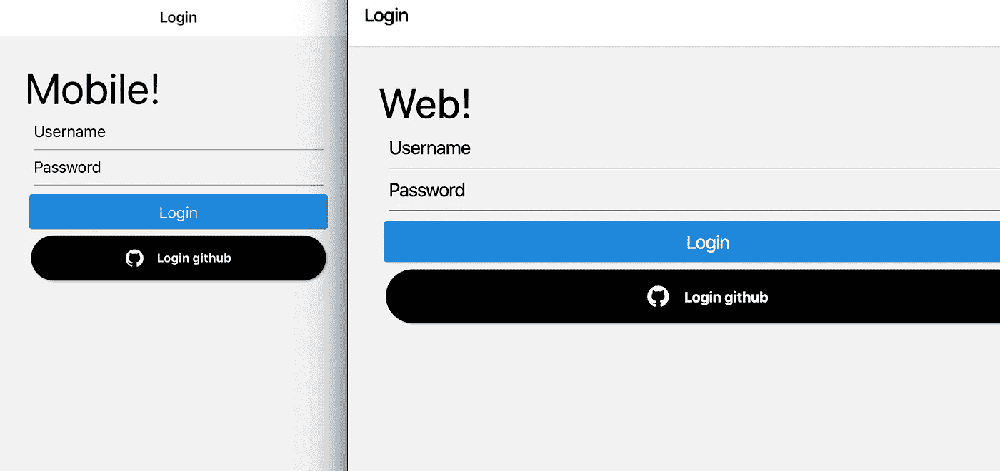

好的，我们将从这个[简单的回购开始](https://github.com/jgking2/react-native-web-demo)，我们希望给它添加网络功能！除了使用[反应导航](https://github.com/react-navigation/react-navigation)的基本导航外，它一无所有。

让我们设置它，使其行为类似于标准的 create-react-app，如 react-native-web 的[文档中所述。我们已经有一个模板，但我们可以在事后添加它，让我们安装我们为此需要的依赖关系。](https://necolas.github.io/react-native-web/docs/?path=/docs/overview-getting-started--page)

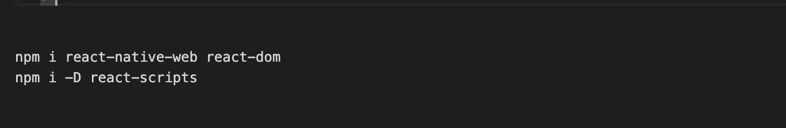

太棒了，所以让我们更新我们的脚本，让我们像这样运行 web。

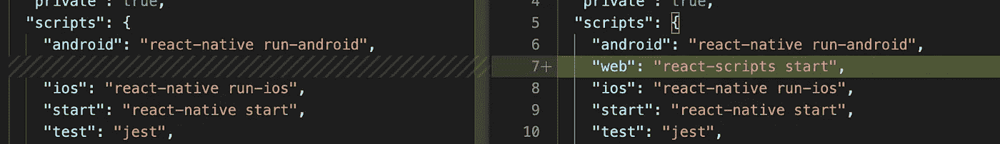

让我们创建两个文件作为 web 应用程序的入口点:

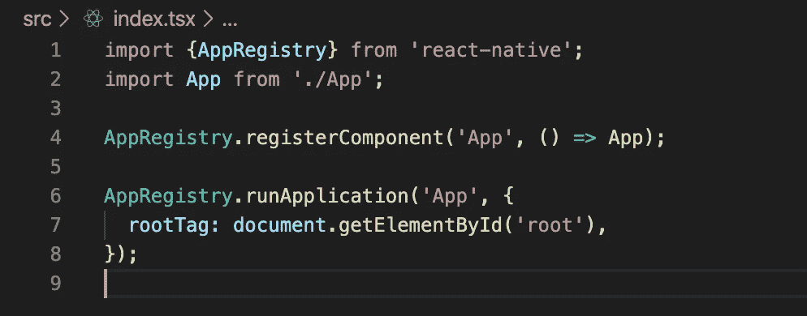

[src/index.tsx](https://github.com/jgking2/react-native-web-demo/blob/initial-approach/src/index.tsx)

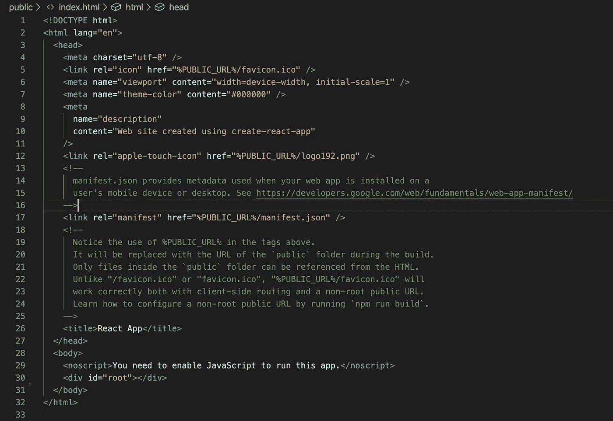

[public/index.html](https://github.com/jgking2/react-native-web-demo/blob/initial-approach/public/index.html)

好的，让我们用 **npm run web** 开始吧。

我们有一个情况…🚑 🚒 🚓

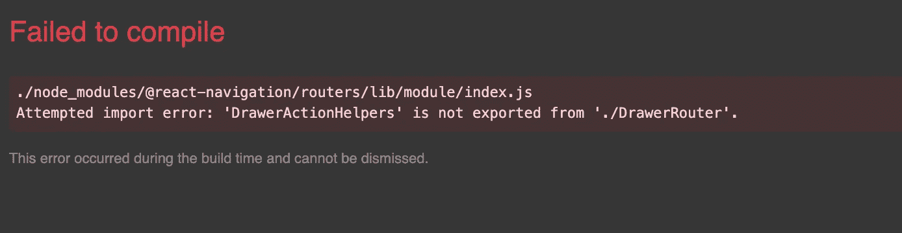

可怕的尝试导入错误:“DrawerActionType”未从导出。/DrawerRouter '

这是一个[已知问题](https://github.com/react-navigation/react-navigation/issues/6757#issuecomment-577636392)，如果你打开控制台，你会注意到这是 20 多个错误之一，都与构建有关。这有点让人不知所措，虽然发现这个问题很简单，但在没有*太多攻击的情况下解决这个问题比我想象的要困难。在搜索了谷歌，并查阅了一些有用的[安装指南](https://react-native-elements.github.io/react-native-elements/docs/web_usage.html)之后，它终于点击了——我们能不能只覆盖 react-scripts 构建的一部分，以使用 react-native 使用的相同的 babel 构建？*

插入 [react-app-rewired](https://github.com/timarney/react-app-rewired) —这个工具带我们向正确的方向迈进了一步。它允许我们将配置覆盖注入到 react-scripts 构建过程中。这看起来很有希望，我们可以保留 react-scripts 的便利性，但是覆盖构建以使用我们的 babel.config.js！让我们来了解一下！

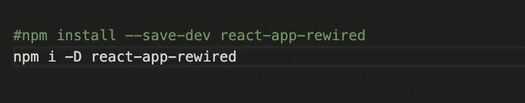

npm i -D react-app-rewired

让我们修改我们的脚本，调用这个而不是 react-scripts。

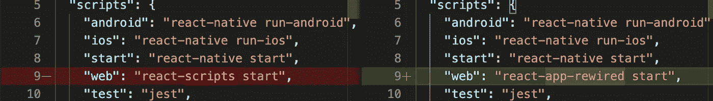

最后，让我们在项目的根目录中添加一个新文件`config-overrides.js`，并使用下面的覆盖。

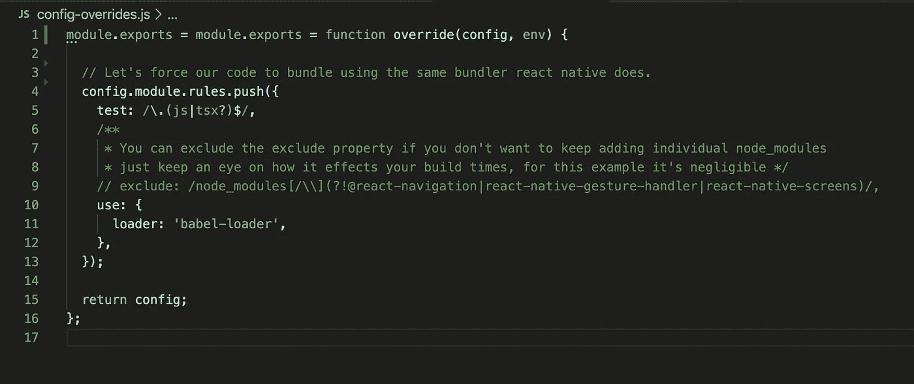

排除可能有助于没有出现的原因，我不是网络包专家！

我们正在推行一个新规则，获取任何 js、ts 或 tsx 文件，并使用 babel-loader 进行构建。这很自然地在项目的根处拾取了我们的 react-native babel.config.js！让我们试着再次启动网络！我们得到一个成功的构建🎊🎊🎊… *但是等一下* …

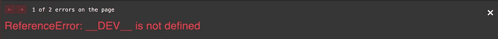

`ReferenceError: __DEV__ is not defined`

好吧，好消息是 [webpack 提供了一个插件](https://webpack.js.org/plugins/define-plugin/)来注入随机全局变量，就像这样！让我们修改 config-overrides.js 来绕过它！

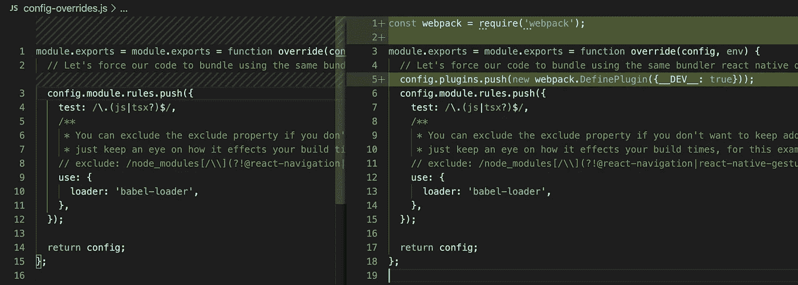

[config-overrides.js](https://github.com/jgking2/react-native-web-demo/blob/successful-build/config-overrides.js)

再次尝试， **npm 运行 web** …。没有错误？…空白页？哦，如果我们深入结构，就有希望了！有些东西在#root 元素下被渲染，但是高度为零！

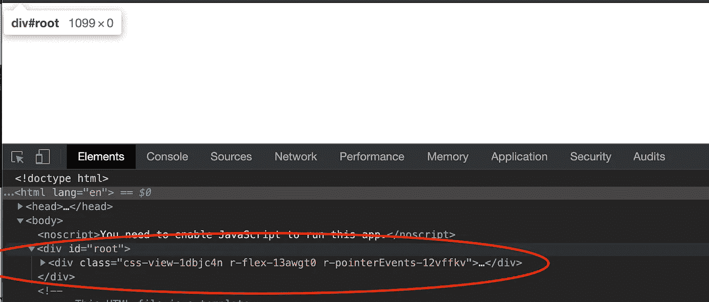

好了，让我们更新 public/index.html 来实际显示内容。这就是这里使用的技术。

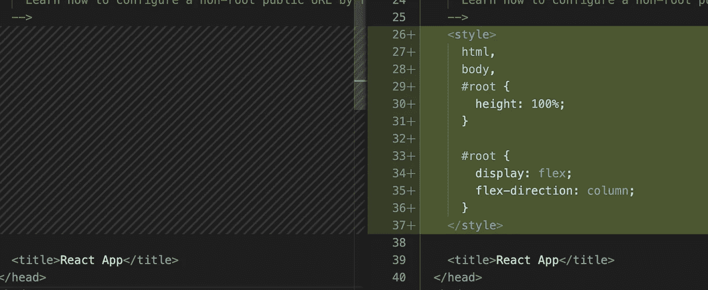

第一千次，让我们用 **npm 跑网**发动它，看看这一次出了什么问题…

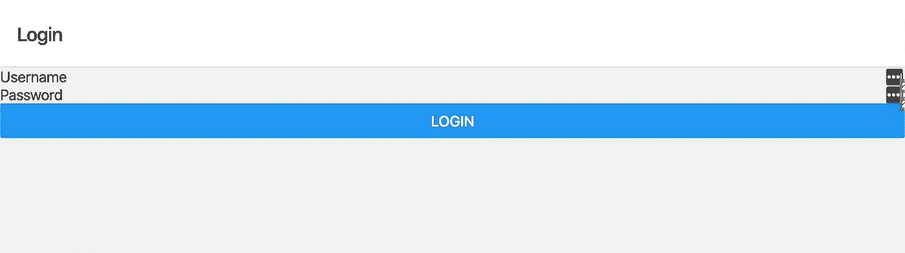

哇…它**起作用了**！！！现在我们*终于*有了一个可以跨网络、ios 和 android 工作的应用程序！👏👏👏

现在，我们有了一个跨平台的工作应用程序，但仍然有一些地雷可能会突然出现，所以让我们继续向前推进，并添加 [react-native-elements](https://react-native-elements.github.io/react-native-elements/docs/web_usage.html) 进行造型，添加 [react-vector-icons](https://github.com/oblador/react-native-vector-icons) 进行一些图标美化！

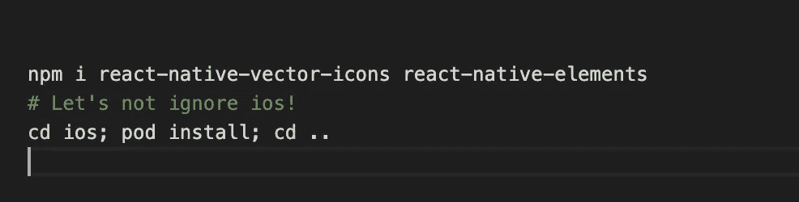

好了，现在让我们更新我们的 LoginScreen.tsx，使用一些新的表单元素和图标。

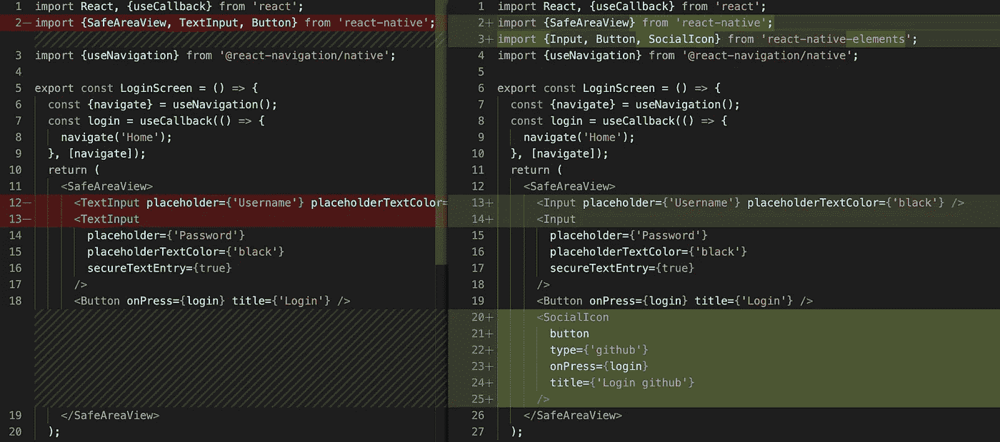

让我们 **npm 再次运行 web**……*是的，它现在是一个动词。*

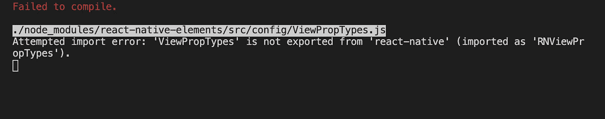

尝试导入错误:“ViewPropTypes”不是从“react-native”导出的

又来了，不过还是往前推吧！这个错误是有意义的，它不再由 react-native-web 导出，经过一点挖掘，它只用于 react-native-elements 中的 prop-type。所以，如果我们能把它导出**就够了！**

**让我们添加一个别名，并有效地剔除这些项目。React-scripts 已经默认捆绑了几个别名，包括现成的别名 react-native → react-native-web。我们需要做的是调整别名，这样我们就可以剔除失败的导出。**

**首先，让我们创建一个文件来处理对导入 react-native 的调用，在 src 中创建以下文件夹。*注意:加载源文件夹外的文件时出现问题，我只是照办了。***

**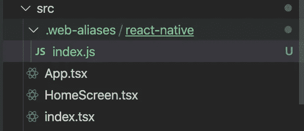**

**命名惯例由你决定，这正是我想要的**

**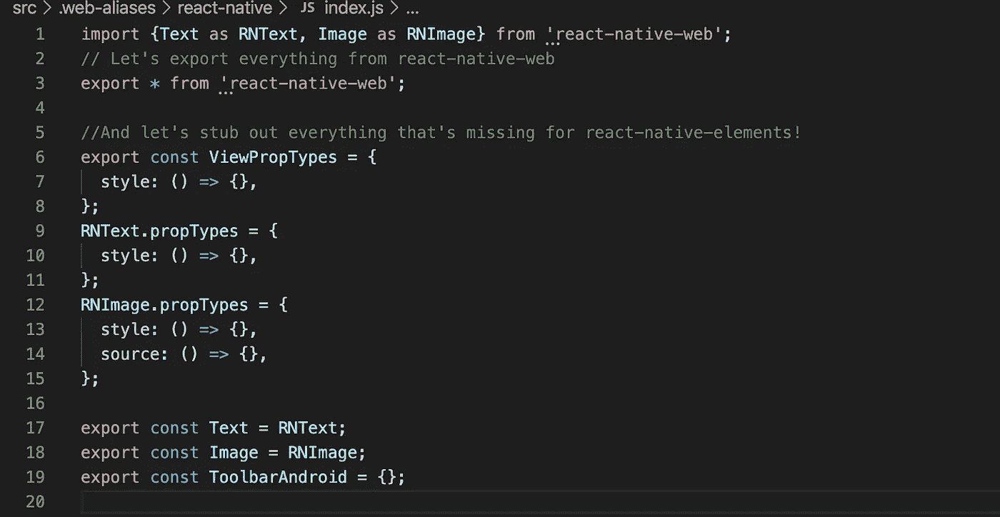**

**src/。we B- aliases/react-native/index . js——不知何故这就完成了任务！**

**好了，现在我们需要让我们的 web 构建知道使用这个别名。让我们修改 config-overrides.js 来扩展当前的构建别名。**

**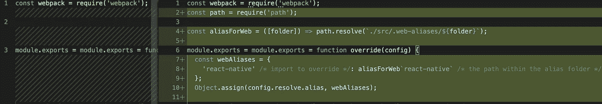**

**[config-overrides.js](https://github.com/jgking2/react-native-web-demo/blob/full-showcase/config-overrides.js)**

**你猜对了！再来一次 **npm 跑 web** ！**

****

**很确定 github 的标志不是一个普通的正方形…**

**好吧，所以它在很大程度上起了作用，但显然我们的标志不起作用。所以让我们来解决这个问题，谢天谢地这是[记录的](https://react-native-elements.github.io/react-native-elements/docs/web_usage.html)！让我们简单地更新一下我们的 src/index.tsx，这样我们就可以在 web 上使用这些字体了。**

**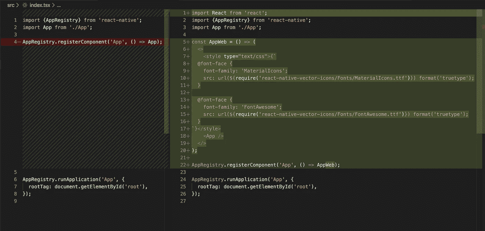**

**[src/index.tsx](https://github.com/jgking2/react-native-web-demo/blob/full-showcase/src/index.tsx)**

**好了，最后一次， **npm 跑网**！**

**你有它！我希望读到这里，你已经学会了如何解决在 react-native 中添加 web 时可能会遇到的问题，并且只用了我战斗的一小部分时间。从这里开始，有了一个工作构建，您可以使用[相同的多平台技术](https://reactnative.dev/docs/platform-specific-code)，并且[将它扩展到 web](https://necolas.github.io/react-native-web/docs/?path=/docs/guides-multi-platform--page#web-specific-code) 用于您可能遇到的许多其他情况！到目前为止，我还没有遇到任何我无法用这些解决方案解决的库或情况。完整的代码库[在这里](https://github.com/jgking2/react-native-web-demo/tree/full-showcase)，还有一些多平台技术的例子！请分享你可能发现的任何有效的技术，这样我们就可以一起学习了！**