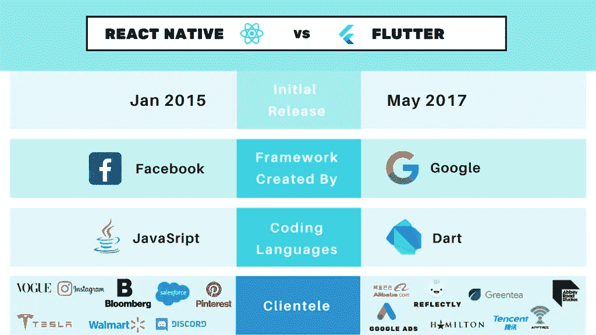

# 对自然和颤动作出反应

> 原文：<https://levelup.gitconnected.com/react-native-vs-flutter-b24f6491af60>

## 大辩论

图片来自 [Neova 解决方案](https://www.neovasolutions.com/2020/03/17/react-native-vs-flutter-an-evaluation-for-your-app-development/)

如果你是我的读者已经有一段时间了(甚至是最近)，你可能会说我对所有事物的反应都有广泛的了解。我喜欢自然的反应。我真的爱他们，并且已经爱了他们 4 年了。

然而，在过去的几个月里，我一直在和 Flutter 一起工作，我不得不说:

我真的，*真的*喜欢旋舞。

在这篇文章中，我将分析两种框架的不同优势，并在最后给出我更喜欢的框架。让我们投入进去吧！

# 摆动

我对 Flutter 比对 Native 的反应更陌生，我不得不说，当我兴奋地学习新东西时，我怀疑我是否会喜欢它。

我不怕承认我错了。

我认为 Flutter 比 React Native 有优势。

*   **轻量级**

我的项目没有变得过于臃肿(React 应用和 React 原生应用有时会变得臃肿)，虽然有可能让你的应用因依赖而过载，但我还没有在 Flutter 中遇到这个问题。这使得我的构建和编译速度(以及应用程序本身的速度)变得高效。这就引出了我的下一个观点。

*   **速度**

我发现 flutter 跑得特别快。运行和构建应用程序本身比 React 或 React Native 花费的时间更少。在我的 Mac 上，它的编译速度肯定比 React native 快。一个显著的不同之处在于框架各自的 create-app 命令。我们正在谈论几秒钟来创建一个 Flutter 应用程序样板，以及几秒钟来启动和运行应用程序。React 和 React Native 的 create 命令以耗时著称。

*   **应用速度**

除了快速创建和运行应用程序之外，我还注意到我的 Flutter 应用程序在我的设备和模拟器上比我的 React 本地应用程序更快，特别是在我更新或刷新它们的时候。这不是一个疯狂的速度差异，但认为这是值得一提的。

*   **设置**

我记得为 React Native 的工作设置我的新笔记本电脑，这有点乏味，即使有 Node.js 等。已经安装。我发现 Flutter 非常容易安装，只花了很少的时间就让我的环境和第一个应用程序运行起来。

*   **固有类型**

Flutter 利用了谷歌发布的一种叫做 Dart 的编程语言。我发现 Dart 是一种令人愉快的编程语言，因为它本身就是类型化的，所以不需要加入 Typescript 或其他类型化库。

我喜欢 Typescript，不要误会我的意思，但是让你的移动框架具有固有的类型不仅可以节省依赖，还可以节省框架本身的购买。我的意思是，你除了已经在学习的框架/库之外，不需要再学习一门新的/相邻的编程语言。

# 反应自然

尽管 Flutter 为自己做了一个很好的案例，但我认为 React Native 在一些有趣的领域有优势。

*   **文件**

React 已经存在了大约 9 年，React Native 存在了大约 6 年。Flutter 自 2015 年以来一直处于测试阶段，但正式推出是在 2018 年。绝对不缺少堆栈溢出问题、GitHub 问题、文档等等。对于反应原生。我觉得既然它已经存在了很长时间，而且被广泛使用，那么任何人都很难声称缺乏资源是 React Native 的一个缺点。

*   **JavaScript**

我碰巧认为 JavaScript 对于前端开发和其他领域来说是一种非常健壮的语言。它从 90 年代中期就存在了，而且没有被淘汰的迹象。事实上，它一直是 React Native 之外的许多框架和库的主干。

*   【React 开发人员更容易过渡

这是一个简单的论点，但是如果你是一个 React 开发人员(考虑到你已经在这篇文章中写了这么多，可以说你可能是),希望开始使用一个移动框架，如果这个框架和你当前的框架是相同的语言和根库，那么它会有所帮助。

尽管我很喜欢 Flutter，但学习 React Native 肯定比学习 Flutter 更容易。不要让那件事阻止你学习！相信我，这很棒。但是，如果你时间紧迫，需要快速掌握一个移动框架，我会给 edge 提供本地反应。

# 掷硬币

我已经提到了 Flutter 的优势和 React Native edges，但是有两个方面我认为这两个移动框架有点相似。

*   **网**

React 无疑是比 Flutter 更受欢迎的 web 框架，所以它对 React Native 的赞美是不错的。如果你有一个使用 React for web 的 SaaS，那么拥有一个使用 React Native 的移动应用是有意义的。React 在网络上也有一套很棒的开发者工具。然而，我要说的是，如果不先安装另一个名为`[react-native-web](https://www.npmjs.com/package/react-native-web)`的包，React 原生应用程序本身无法在浏览器中运行或测试。

Flutter 应用程序可以开箱即用。

虽然 React 是更好的 web 框架，React Native 是 React 的扩展，但事实上，您可以在同一应用程序和命令行中，在移动设备、Xcode 和 Android 模拟器以及浏览器上运行和测试 Flutter 应用程序，这非常方便。

我可能不得不把这个优势给 Flutter，因为我们应该比较移动框架，而 React 是一个 web 框架。

*   **挂钩**

你可能已经知道我有多爱反应钩。它们重量轻、干净并且易于实现。我都不记得上次在 React app 里用`setState`是什么时候了，更别说 React 原生 app 了。事实上，钩子的概念非常受欢迎，以至于 Flutter 开发出了他们自己的 [Flutter 钩子](https://iteo.com/blog/post/flutter-hooks-and-how-to-hook-them-up)。Flutter 钩子的工作方式与 React 钩子相似(当然语法不同)。

尽管 React Native 首先使用了钩子，但 Flutter 钩子是一种改进，它帮助您管理状态，而不依赖于有状态小部件。Flutter 钩子的一个小缺点是它是一个独立的依赖项。React 挂钩可以简单地从 React 库本身导入，不需要单独安装(只要您使用 React v.16.8 或更高版本)。

在这个问题上，我可能不得不稍微突出一点反应，但是已经非常非常接近了。

# 摘要

Flutter 更年轻，所以它解释了为什么没有如此广泛的覆盖面和资源，但我还没有遇到过我找不到资源的 Flutter 问题。也许这可能只是比调试一个 React 原生问题需要多一点时间，但我没有注意到。

React 也是一个比 Flutter web 更受欢迎的 Web 框架，所以它与 React Native 的集成很好。Flutter 可以在 web 上使用 JS，但我个人没有在 web 应用程序上使用过 Flutter，就像我没有在 web 应用程序上使用 React Native 一样。

总而言之，我真的很喜欢使用 Flutter，虽然我仍然会使用 React Native，因为它仍然有很高的需求(我确实仍然喜欢它)，但我认为在不久的将来(或者就我而言，现在)，Flutter 将开始成为一个更加流行和有竞争力的移动框架。

有不同意见？在评论里点亮吧！

[***升级您的免费 Medium 会员资格***](https://matt-croak.medium.com/membership) *并接收各种出版物上数千名作家的无限量、无广告的故事。这是一个附属链接，你的会员资格的一部分帮助我为我创造的内容获得奖励。*

*您也可以通过电子邮件* [***订阅***](https://matt-croak.medium.com/subscribe) *，每当我发布新内容时，您都会收到通知！*

谢谢你！

# 参考

 [## 反应本地与颤动| Neova 解决方案

### React Native 和 Flutter 是跨平台框架中的两个主要市场参与者。我们看到一种强烈的…

www.neovasolutions.com](https://www.neovasolutions.com/2020/03/17/react-native-vs-flutter-an-evaluation-for-your-app-development/)  [## Dart 编程语言

### Dart 2.15 已经发布，具有快速并发性、构造函数撕裂、改进的枚举等等。了解更多，与…一起发展

dart.dev](https://dart.dev/)  [## 提高生产力的十大 React 开发工具-一站式开发商店

### 每周，围绕 JavaScript 都会产生大量的工具和框架。React 是这些框架之一，React…

www.onestopdevshop.io](https://www.onestopdevshop.io/react-developer-tools-for-increasing-productivity/)  [## 颤动的钩子以及如何钩住它们

### Flutter Hooks 是 React hooks 的一个实现，它提供了一种健壮而简单的方法来管理小部件的生命周期，通过…

iteo.com](https://iteo.com/blog/post/flutter-hooks-and-how-to-hook-them-up)  [## 反应-本地-网络

### 对 Web 作出本地反应。最新版本:0.17.5，最后发布时间:5 个月前。开始使用 react-native-web 在您的…

www.npmjs.com](https://www.npmjs.com/package/react-native-web)