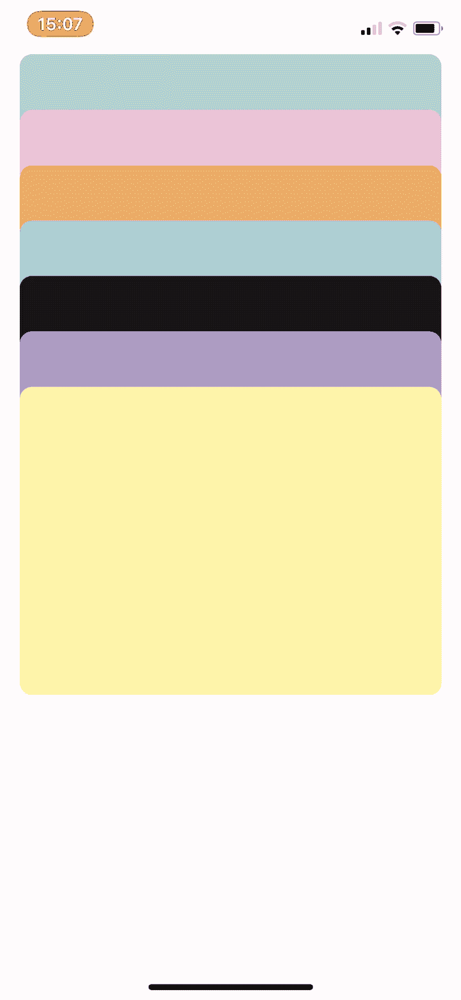
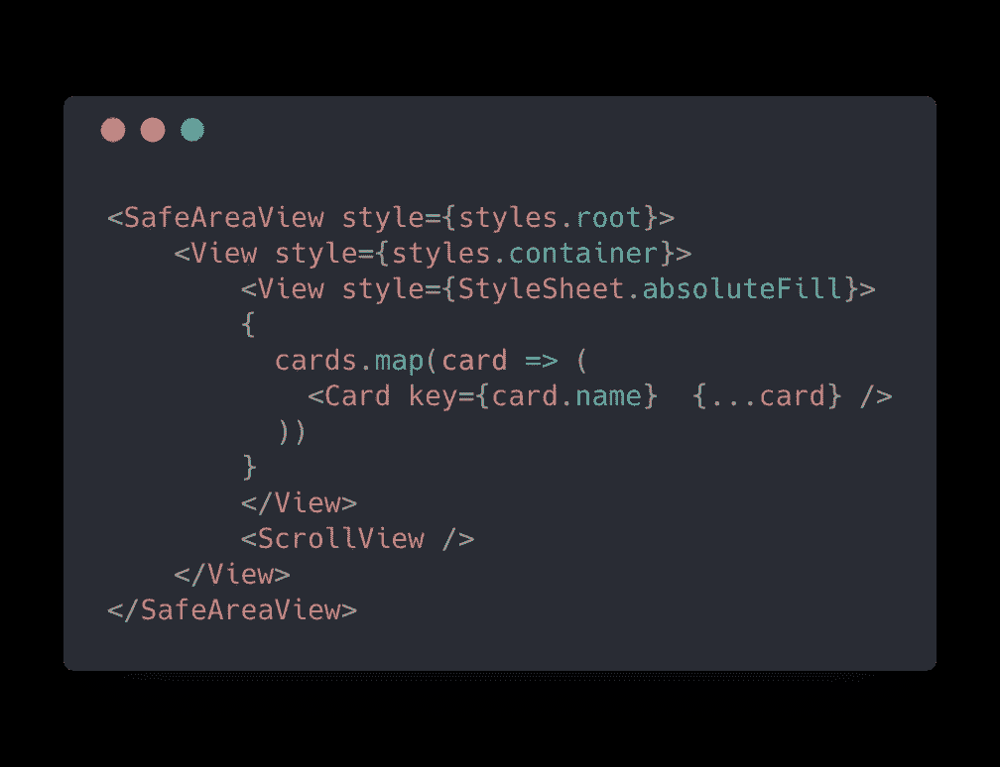
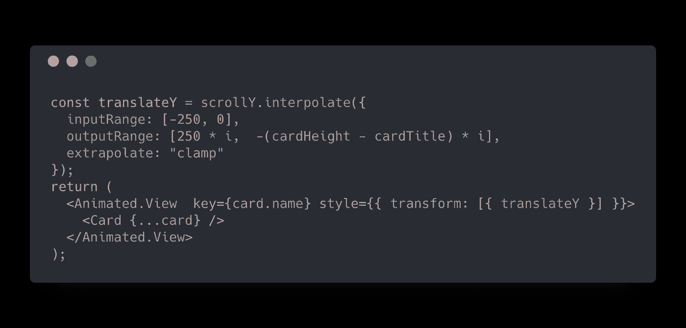
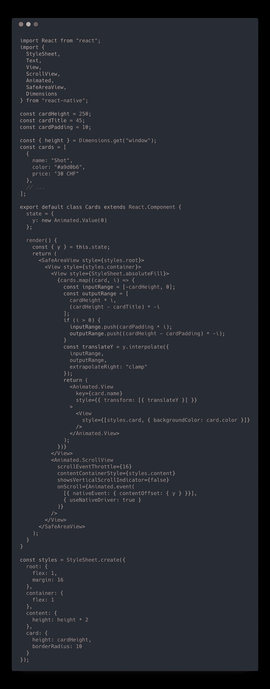

# React 本机钱包动画

> 原文：<https://levelup.gitconnected.com/react-native-wallet-animation-7647e68b46e1>

今年夏天，我大部分的早餐都是在乔果汁 T2 吃的。我注意到他们的忠诚度应用程序有一个非常棒的钱包卡动画。在这个故事中，我们在 React Native 中克隆了这个动画。剧透警告，下面演示的完整代码可在[这里](https://gist.github.com/wcandillon/288e994cda3216d1dbef9482a9322804)获得。

左边是 Joe & Juice 应用，右边是我们小小的 React 原生应用。

我不知道如何开始，动画确实包含一个清晰的反弹，似乎与使用`<ScrollView>`组件一致。然而，我没有使用卡片动画是如何组织的。当我在寻找灵感时，我在谷歌上搜索了“React Native Wallet Animation”，至于我的许多以“React Native”开头的查询，解决方案是由 [Brent Vatne](https://github.com/brentvatne) 在[apple-Wallet-cards-example](https://github.com/brentvatne/apple-wallet-cards-example)中提供的。这让我很好地理解了如何构建组件:将卡片放在一个容器中，并在其上覆盖一个 ScrollView。然后我们可以使用滚动动画值来驱动每张卡片的平移。

组件的基本布局。我们将卡片放在一个容器中，并在上面显示一个滚动视图

然后我们听录音，以便相应地翻译卡片。下面是基本插值的样子:

基于来自 ScrollView 的 onScroll 动画值的基本卡片翻译。

这样，结果已经非常接近原来的应用程序了。然而，在 Joe & Juice 应用程序中，有两个可能的滚动位置，而在我们的小演示中，只有一个。为了达到相同的效果，我们需要将 ScrollView 放大(两倍大小)，并为正滚动值添加插值。下面是完整的组件实现。

# 那都是乡亲们！

希望你喜欢这个故事。期待阅读您对此的看法。如果你想开始一个很酷的 React 原生项目，别忘了看看最全面的 React 原生初学者工具包 [React 原生草图元素](https://react-native.shop/elements)。

 [## 反应原生草图元素

### 经过两个月的制作，React 本地草图元素终于出现了。反应原生元素涵盖了广泛的…

hackernoon.com](https://hackernoon.com/react-native-sketch-elements-889f010f9626)