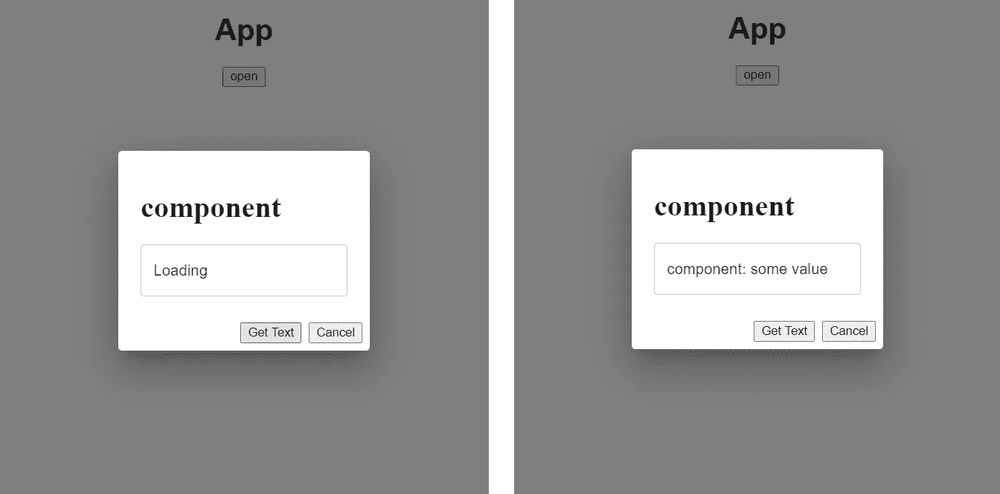
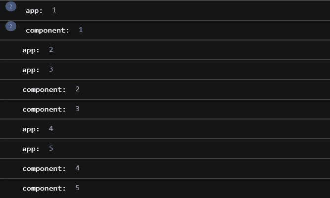

# React useEffect 数据获取模式我希望我能早点知道

> 原文：<https://levelup.gitconnected.com/react-pattern-i-wish-i-knew-sooner-7dbccb3a8b62>


# 目标

我在开发一个[对话框组件](https://mui.com/material-ui/react-dialog/)时遇到了一个小问题，每次打开它时，它都会从一个 API 端点异步获取一些数据，这在我的例子中是生成一个新代码。

我花了一些时间思考的问题是，由于它的实现方式，正在发生的重新渲染的数量。这是我想要实现的目标的一个最小的可重复的例子:

MyDialog.tsx:

```
interface MyDialogProps {
  open: boolean;
  name: string;
  onClose: () => void;
}const MyDialog: FC<MyDialogProps> = ({ name, open, onClose }) => {
  const [text, setText] = useState<string>(""); const fetchText = async () => {
    *//fetching some data asynchronously* setTimeout(() => setText(name + ": some value"), 5000);
  }; const getText = () => {
    setText("Loading");
    fetchText();
  }; return (
    <>
      <RenderCounter name={name} />
      <Dialog open={open} onClose={onClose}>
        <DialogContent>
        <h1>{name}</h1>
        <TextField value={text} contentEditable={false} />
      </DialogContent>
      <DialogActions>
        <button onClick={getText}>Get Text</button>
        <button onClick={onClose}>Cancel</button>
      </DialogActions>
      </Dialog>
    </>
  );
};export default MyDialog;
```

App.tsx:

```
export default function App() { const [open, setOpen] = useState<boolean>(false); return (
    <div className="App">
      <h1>App</h1>
      <button onClick={() => setOpen(true)}>open</button>
      <RenderCounter name="app" />
      <MyDialog
        name="component"
        open={open}
        onClose={() => setOpen(false)}
      />
    </div>
  );
};
```

我从 [Felix Gerschau](https://felixgerschau.com/) 那里借来的`RenderComponent`(查看他关于 [React 渲染](https://felixgerschau.com/react-rerender-components/)的文章)。这个组件是跟踪一个组件渲染了多少次的好方法。).

RenderComponent.tsx:

```
interface RenderCounterProps {
  name: string;
}const RenderCounter: FC<RenderCounterProps> = ({ name }) => {
  const rerenderCounter = React.useRef(0);
  rerenderCounter.current += 1;
  console.log(name + ":", rerenderCounter.current);
  return <></>;
};export default RenderCounter;
```

这是我试图实现的一个简化版本，即允许用户在单击按钮时打开一个对话框并获取一些数据:



单击该按钮时，数据会在 5 秒钟后加载

# 问题是

这样做的问题是，数据不是每次都被重新获取，如果我关闭并重新打开对话框，获取的值仍然存在。

如果这是一个用于生成折扣代码、密钥或任何动态内容的对话框，许多教程指出的一个常见解决方法是将`open`道具放入`useEffect`中，并在对话框**改变状态**打开时擦除文本值，如下所示:

MyDialog.tsx:

```
const MyDialog: FC<MyDialogProps> = ({ name, open, onClose }) => {
  const [text, setText] = useState<string>(""); useEffect(() => {
    if (open) {
      setText("");
    }
  }, [open]); ...
  // skipped for brevity
};
```

这种方法的问题在于，`useEffect`是在组件渲染之后被调用的，因为它在组件内部调用了`setText`，所以会导致第二次渲染。

通过点击按钮打开和关闭对话框，我们看到`App`组件以与`MyDialog`组件相同的速率被重新渲染。如果`App`组件包含一堆其他组件，当用户打开和关闭对话框时，这些组件会被不必要地重新呈现，这就不好了。



这种方法另一个困扰我的地方是`useEffect`钩子的用法。在本例中，观察`open`道具的变化感觉是多余的**，因为道具的变化会导致组件的重新渲染！**

# 解决方案:容器模式

[容器模式](https://medium.com/@learnreact/container-components-c0e67432e005)是这个问题的绝佳解决方案，因为:

> 我们已经分离了我们的**数据获取**和**渲染**关注点。

通过将更新状态的代码放在定义状态的同一个地方，我们可以省去一个麻烦！代码如下:

MyCoolDialog.tsx:

```
interface MyCoolDialogProps {
  open: boolean;
  name: string;
  onClose: () => void;
  text: string;
  getText: () => void;
}const MyCoolDialog: FC<MyCoolDialogProps> = ({
  name,
  open,
  onClose,
  text,
  getText
}) => {
  return (
    <>
      <RenderCounter name={name} />
      <Dialog open={open} onClose={onClose}>
        <DialogContent>
          <h1>{name}</h1>
          <TextField value={text} contentEditable={false} />
        </DialogContent>
        <DialogActions>
          <button onClick={getText}>Get Text</button>
          <button onClick={onClose}>Cancel</button>
        </DialogActions>
      </Dialog>
    </>
  );
};export default MyCoolDialog;
```

DialogContainer.tsx:

```
interface DialogContainerProps {
  name: string;
}const DialogContainer: FC<DialogContainerProps> = ({ name }) => {
  const [open, setOpen] = useState<boolean>(false);
  const [text, setText] = useState<string>(""); const handleToggle = () => {
    if (!open) {
      setText("");
    }
    setOpen((o) => !o);
  }; const fetchText = async () => {
    //some async function
    setTimeout(() => setText(name + ": some value"), 5000);
  }; const getText = () => {
    setText("Loading");
    fetchText();
  }; return (
    <div>
      <button onClick={handleToggle}>open</button>
      <MyCoolDialog
        open={open}
        name={name}
        onClose={() => setOpen(false)}
        text={text}
        getText={getText}
      />
    </div>
  );
};export default DialogContainer;
```

App.tsx:

```
export default function App() {
  return (
    <div className="App">
      <h1>App</h1>
      <RenderCounter name="app" />
      <DialogContainer name="container" />
    </div>
  );
}
```

## 论证

通过消除对`useEffect`的需求，我们提高了对话框组件的性能。

通过将状态放在容器组件中，我们避免了更新父组件`App`的状态，这将**导致其所有子组件不必要地重新呈现。在这个特殊的例子中，`App`组件只有子组件，所以这不是问题。然而，如果有许多子组件，这很容易成为一个问题。**

我觉得这个看起来很整齐，而且让`MyCoolDialog` **感觉功能性强了很多。**

## 边注

我认为在一个`useEffect`的依赖数组中观看`props`应该谨慎，**但有时它就是有意义。**

**在这种特殊情况下，**对话框依赖于按钮，由于按钮的状态作为`open`道具传递给对话框组件，**观察对话框组件内按钮状态的变化是没有意义的。我没有在`useEffect`内部做任何**异步**的事情，并且钩子对于**基于`props`的变化更新内部**状态是不必要的。迈克尔·兰迪斯有一篇关于这方面的精彩文章。**

然而，假设你想让**执行异步**操作，而**依赖于一个被传递的属性**，就像你想获取用户输入的位置的天气。

您可以有一个组件接收`location`作为一个属性，并将它放在`useEffect`的依赖数组中，它将执行异步搜索。

在这种情况下，**有意义的原因是**异步操作完全依赖于作为道具传递的用户输入。在我看来，类似这样的事情是有道理的:****

```
interface WeatherDisplayProps {
  location: string;
}const WeatherDisplay: FC<WeatherDisplayProps> = ({ location }) => {
  const [weather, setWeather] = useState<number>(); useEffect(() => {
    const fetchWeather = async () => {
      const response = await WeatherAPI.getWeather(location);
      setWeather(response.celsius);
    }; fetchWeather();
  }, [location]);return (
    <div>
      <h1>Weather</h1>
      <p>
        Today weather in {location} is {weather} celsius{" "}
      </p>
    </div>
  );
};export default WeatherDisplay;
```

[丹·阿布拉莫夫](https://medium.com/@dan_abramov)注意到[这不再是绝对必要的](https://medium.com/@dan_abramov/smart-and-dumb-components-7ca2f9a7c7d0)，但是如果它可以方便的话。

# 结论

是一个很棒的钩子，但有时会很混乱。它可以用于预期目的之外的许多事情，但这并不意味着它应该如此。

我犯了一个不必要的错误，使用它导致了性能的下降，但幸运的是，我找到了一个非常优雅的解决方案，并希望与每个遇到相同问题的人分享。

引用:

[1] MUI 对话框组件:[https://mui.com/material-ui/react-dialog/](https://mui.com/material-ui/react-dialog/)

[2]费利克斯·格绍:[https://felixgerschau.com/](https://felixgerschau.com/)

[3]Felix Gerschau*React 何时重新渲染组件？*:[https://felixgerschau.com/react-rerender-components/](https://felixgerschau.com/react-rerender-components/)

[4]容器组件:[https://medium . com/@ learn react/Container-Components-c0e 67432 e 005](https://medium.com/@learnreact/container-components-c0e67432e005)

[5]迈克尔·兰迪斯:[https://michaellandis.medium.com/](https://michaellandis.medium.com/)

[6]迈克尔·兰迪斯*用 React 钩子从属性更新状态*:[https://better programming . pub/Updating-State-From-Properties-With-React-Hooks-5d 48693 a4 af 8](https://betterprogramming.pub/updating-state-from-properties-with-react-hooks-5d48693a4af8)

[7]丹·阿布拉莫夫:[https://medium.com/@dan_abramov](https://medium.com/@dan_abramov)

[8] Dan Abramov *表象与容器组件*s:[https://medium . com/@ Dan _ abra mov/smart-and-dumb-components-7 ca 2 f 9 a 7 c7d 0](https://medium.com/@dan_abramov/smart-and-dumb-components-7ca2f9a7c7d0)