# React 门户:它们是什么，我们为什么要使用它们？

> 原文：<https://levelup.gitconnected.com/react-portals-what-are-they-and-why-should-we-use-them-7c082a62e8fa>

克里斯托弗·伯恩斯在 [Unsplash](https://unsplash.com?utm_source=medium&utm_medium=referral) 上拍摄的照片

众所周知，开发者喜欢在他们的 web 应用上使用 React。它快速、可扩展且简单，允许开发人员创建大规模的应用程序，而无需重新加载页面。作为构建这个大型 web 应用程序的一部分，在很多情况下，您希望在应用程序中的某个位置呈现一个组件，而这个位置可能与原始组件所在的位置完全不同。

让我们以一个在线购物网站为例。你正在浏览衬衫，决定将两件放入购物车。当你点击“添加到购物车”时，你会看到衬衫呈现在你的应用程序的右侧，远离你选择它们的中心容器。看起来是这样的:

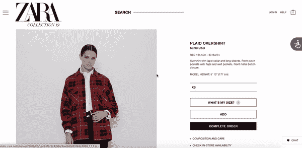

您添加的衬衫出现在另一个组件中。

这些信息是如何独立于我们的主页弹出的？有几种方法可以实现这一点。一种方法是将选定的信息从一个组件向上传递到父容器，然后再向下传递到 props 中的目标组件，告诉它呈现我们传递给它的某些信息。对于较小的应用程序来说，这相对简单，但对于像 Zara、脸书或 Instagram 这样的大规模网络应用程序来说，这可能会变得相当复杂！进入 [**门户**](https://reactjs.org/docs/portals.html) 。

# 什么是门户网站？

门户提供了一种快速无缝的方式来"*将子组件呈现到父组件的 DOM 层次结构之外的 DOM 节点中，* " ( [React 文档](https://reactjs.org/docs/portals.html))。

这是什么意思？在 React 中，默认行为是在单个 DOM 节点下呈现整个应用程序——应用程序`root`。通常，在单个节点下渲染我们的应用程序是可以的。但是如果您想在`root` DOM 节点之外呈现子节点呢？这样做的两个常见例子是，当父元素有样式时(比如一个`z-index`把它推到页面的前面，或者一个`overflow: hidden`)，但是你希望子元素在视觉上出现在它的容器的顶部。

让我们来分析一下这是如何工作的。

GIF 来自 giphy.com

# 它们是如何工作的？

## 设置门户

当你使用`create-react-app`启动一个 React 应用程序时，你的`index.js`文件将会有一行类似这样的代码:

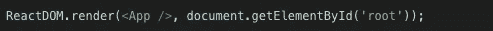

当您创建一个新的 React 应用程序时，index.js 文件中包含什么。

这意味着我们的应用程序组件呈现在主`root` div 中的 DOM 上，这是在我们的`index.html`文件中制作应用程序时为我们创建的。

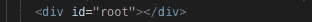

在我们 index.html 档案的主体里。

因为我们的目标是在应用程序`root`的之外呈现一个元素*，我们想在 HTML 文件中创建一个*单独的* `div`。为了清楚起见，我将把这个`div` **门户称为**。现在我们的`index.html`应该是这样的:*

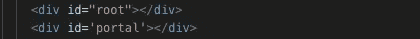

我们的 index.html 文件与新创建的门户网站。

太好了！现在，我们要确保我们的`index.js`文件知道在哪里可以找到`div`，这样我们就可以使用我们将要创建的门户组件:

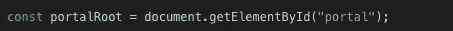

我们的 index.js 文件带有一个指向门户 div 的变量。

类似于`index.js`如何呈现`App`组件中的内容，我们需要创建一个`Portal`组件来设置门户，并允许我们添加子组件来呈现门户。

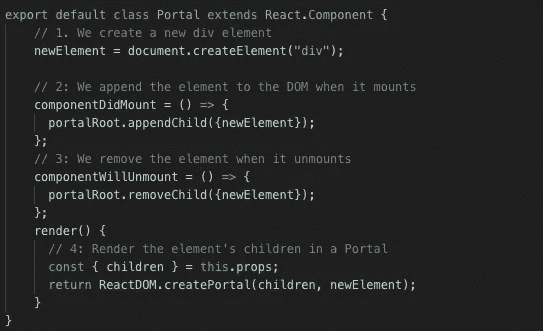

新的门户组件！

下面我们来分解一下`createPortal`在做什么。它有两个参数:第一个(`child`)是任何[可渲染的 React 子节点](https://reactjs.org/docs/react-component.html#render)，比如元素、字符串或片段。第二个参数(`container`)是一个 DOM 元素。

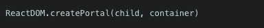

React 门户的基本设置。

在我们上面的例子中，`child`是门户元素的道具。容器是我们创建的 div `newElement`。当组件挂载时，DOM 树将看起来像这样:

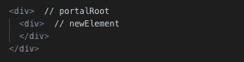

门户组件挂载时的 DOM 树。

现在，无论何时呈现`Portal`组件，它(及其所有子组件)都会在`portalRoot`上呈现。

## 实施门户网站

是时候测试我们的门户是否有效了！假设我们希望我们的应用程序在加载时显示一些文本和一个按钮。该按钮将允许我们显示或隐藏`Portal`组件。由于我们的`App`组件控制了我们应用程序的其余部分，我们需要给它一些方法，并告诉它呈现`Portal`组件！让我们在`App`实现我们想要的:

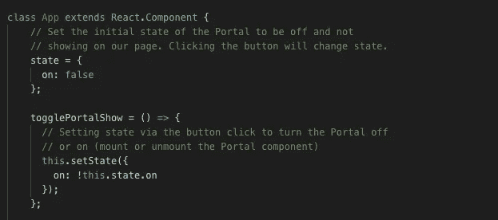

我们设置状态的切换函数。

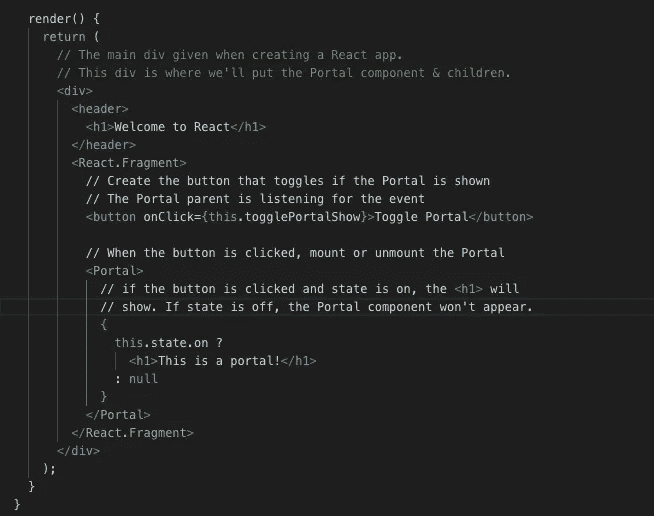

为门户组件提供子组件，并创建安装/卸载门户的按钮。

这是当`on`状态被设置为`true`时的 DOM。

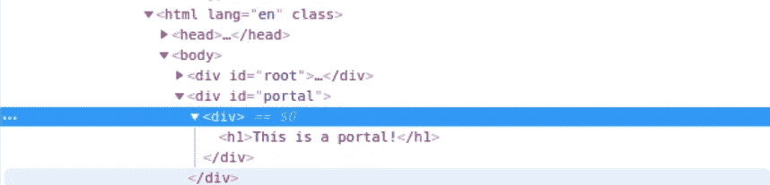

image:[https://CSS-tricks . com/using-react-portals-to-render-children-outside-the-DOM-hierarchy/](https://css-tricks.com/using-react-portals-to-render-children-outside-the-dom-hierarchy/)

当`on`为`false`时，门户组件不被渲染。

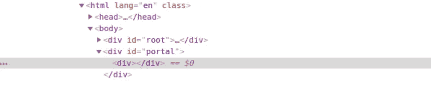

image:[https://CSS-tricks . com/using-react-portals-to-render-children-outside-the-DOM-hierarchy/](https://css-tricks.com/using-react-portals-to-render-children-outside-the-dom-hierarchy/)

就是这样！当点击按钮时，我们的门户和`<h1>`标签呈现在我们的`App`组件之外，当再次点击按钮时，它们消失。请通过 [Codepen](https://codepen.io/gaearon/pen/yzMaBd/) 查看门户网站运行的实例:

Dan Abramaov/React 的门户示例。

我们做到了！要了解更多关于门户网站的信息，请点击[此处](https://reactjs.org/docs/portals.html)。感谢阅读！

GIF 来自 giphy.com