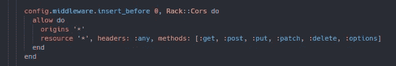

# 使用 JWT 第一部分从头开始进行 React & Rails 验证

> 原文：<https://levelup.gitconnected.com/react-rails-full-auth-from-scratch-using-jwt-part-i-963c4b83cbe8>

先决条件:

[反应](https://reactjs.org/docs/getting-started.html)安装完毕

[轨道](https://guides.rubyonrails.org/getting_started.html)安装完毕

## 开始使用:

我们将首先通过创建用户模型、控制器、迁移以及打开必要的路径来构建我们的 Rails 后端。要做到这一点，请确保 cd 进入我们的 rails 项目 auth_backend。要一次性轻松完成这项工作，我们只需运行:

这将创建上面列出的所有内容，但是在我们开始之前，我们还需要做一些其他的事情。首先，我们将通过运行以下命令将 JWT 添加到我们的 gem 文件中:

打开 Gemfile 后，您会看到它已经被添加。在 Gemfile 中，您还需要取消 bcrypt 和 rack-cors 的注释。这样做将确保我们的用户能够有一个安全的密码，并给你交叉引用的能力。请注意，并非所有的 Gemfiles 都附带 rack-cors，在这种情况下，请跳到下一节。您还需要确保您的 origin 和 resource 设置为 all，简称为*。您的 cors.rb 文件位于 config/initializer 中，应该是这样的:

如果您的 Gemfile 不包含 rack-cors，我们需要进行一点额外的设置。首先，您需要将 rack-cors 添加到您的 gem 文件中。为此，我们只需运行:

如果您想再次检查 rack-cors 是否添加正确，您可以检查您的 gem 文件。所有新增加的宝石将会在底部。

这样做之后，我们需要进入 config 文件夹，打开 application.rb。我个人把它放在类 Application < Rails:: Application 的下面，但是如果需要的话，可以在类内随意调整位置。为此，我们需要添加以下代码:

确保它被放置在您的后端模块中

这个过程的最后一步是转到我们的 application_controller.rb，它位于我们的 app/controller 文件夹中。您应该只看到一个空类，但是我们需要添加下面的代码行来防止 rails 令牌问题。

在进行了添加这些新的依赖项所需的更改之后，我们将安装这些新添加的 gem，并运行我们的 rails 迁移。为此，我们只需在终端中运行:

然后

我们现在需要做的最后一件事是确保我们的用户有一个安全的密码。这都是由 bcrypt gem 处理的，但是我们需要添加一行代码。在您的应用程序文件夹中，向下滚动到您的模型文件夹并打开您的用户模型。您需要添加的只是 has_secure_password。它应该是这样的:

我强烈建议在你的终端上打开两个标签，这将允许我们同时运行后端服务器(Rails)和前端服务器(React)。如果您像我一样喜欢在 VScode 中编码或使用 ConEmu 终端，请不要担心。

在 VScode 中，在你的终端中，你可以通过简单地点击新建终端按钮 a +和终止终端按钮垃圾桶之间的按钮来“拆分”你的终端。这将使您可以使用两个终端进行任何调试。使用 ConEmu 就简单多了，您只需要在该目录中创建另一个选项卡。

此锅炉铭牌的副本可在[这里](https://github.com/TheRealKevBot/Auth_Boiler_Plate)找到。

在分割你的终端后，一个在你的 auth_backend 目录中，另一个在你的 auth_frontend 目录中。在各自的终端中运行:

和

注意，你应该总是在你的前端之前启动你的后端服务器，因为 rails 将默认为 localhost:3000。React 也希望这样做，但是如果使用了以前的端口，它将适应在 localhost:3001 上启动。

一旦我们的后端和前端服务器启动并运行，我们可以分别访问 [http://localhost:3000](http://localhost:3000) 和 [http://localhost:3001](http://localhost:3001) 。既然我们已经运行了前端和后端服务器，我们现在不必担心它们。

在查看我们的前端页面时，我们看到了这个可爱的自动生成的 react 显示页面。如前所述，我们需要编辑 App.js，它位于 auth_frontend 目录下的 src 文件夹中。对于这个例子，我们将不使用钩子，而是使用类和函数组件。

我们需要做的第一步是将 App 变成一个类。为此，我们必须记住从 react 导入组件并呈现我们的返回。此外，我们还将删除 div 应用程序中的所有 html 元素，以及徽标导入，因为我们不再需要它们。我们最好现在就将用户的状态设置为一个空对象。

您的代码应该是这样的:

现在我们有了空白画布，我们可以开始创建我们的注册表单。首先，我们需要在 src 文件夹中创建一个名为 components 的新文件夹。在这个文件夹中，我们将创建一个名为 SignUp.js 的文件，它将保存我们的注册表单。一旦创建，我们将使它成为一个类组件。您的代码应该是这样的:

现在我们需要为我们的用户提供一些输入，我们碰巧刚刚为 rails 创建了这些输入。我们需要为用户需要的所有内容创建一个输入，如用户名、密码、名字和姓氏。在我们的表单中，我们将为每一个创建标签和输入。我们还将添加一个额外的输入作为我们的提交按钮。您的代码应该是这样的:

> 请注意，我使用了密码输入类型 password。这将掩饰或隐藏屏幕上看到的值。

因为我们使用的是一个受控的表单，所以我们需要为每个输入添加状态和道具。尤其重要的是，您的状态键名称要与您的输入名称直接匹配，否则您将面临一些问题。同样重要的是，我们的输入值被设置为 state。为此，我们将输入值设置为 this.state.the inputs name。到目前为止，您完成的表单应该是这样的:

现在我们将创建一个名为 handleChange 的函数，你猜对了，它将处理我们的 on change 事件，我们将把它放在我们的每个输入上。我们可以单独设置每个输入的状态，但是我的一个好朋友，独一无二的达蒙·齐沃斯，教了我一种将四个独立的功能合并为一个的方法，这就是设置匹配名称的重要性发挥作用的地方。

我们的 handleChange 函数将从接受事件作为参数开始。我们将设置我们的键来接受事件目标名称，我们的值将是事件目标值。您的功能应该是这样的:

为了更好地理解这个函数，我们将进一步对它进行分解。设置状态的关键是我们的输入名称，它恰好与我们的状态属性完全匹配。因此，由于我们的动态名称匹配方案，我们现在可以为每个输入重用这个函数。

我们现在需要向所有的文本输入添加一个 on change 事件，这样我们的新函数就可以实际运行了。每个输入都应该有这样的 onChange 附加项:

现在，我们已经准备好了所有的功能，看起来我们的主要问题是让它显示在页面上，因为在之前对 App.js 进行删除后，它应该是空白的。现在，这似乎是显而易见的，但我们需要将我们的注册表单导入到我们的 App.js 中，并将我们的新注册组件放在我们的 div 中。您的 App.js 应该如下所示:

刷新后，你的网页应该显示一个非常基本和丑陋的注册表单，但不用担心，我会给你提供一些 css 来帮助你。首先，我们将转到 App.css 文件，删除所有内容并从头开始。由于我们的注册表单是我们的应用程序的一部分，我们可以直接从 out App.css 对其进行样式化。请确保您的 css 文件匹配以获得最佳结果:

现在我们已经有了一些看起来还不错的东西，让我们继续让我们的表单实际做一些事情，给它一些功能。为此，我们将把注意力转回到 SignUp.js 上，并在表单上放置一个 on submit 事件，这样我们就可以对该状态做一些事情。例如，将它设置为我们实际用户的…在我们的提交事件中，我们希望放置一个 handleSubmit，这是我们将构建的另一个函数。您的表单添加应该如下所示:

在 handleChange 函数的正下方，我们将构建 handleSubmit 函数来捕获注册表单的状态。我们将在 App.js 中构建真正的函数，所以让我们快速切换到那里，创建一个名为 signUp 的匿名函数。在这个函数中，我们将设置用户的状态，并将该用户存储在我们的后端，但首先让我们实际上对我们的后端进行一些添加。

为了让这个注册功能进入高速档，我们需要在我们的用户控制器的后端添加以下内容。我们将首先定义一个索引方法，这不是必需的，但却是查看后端信息的好方法。然后，我们将需要定义我们的创建方法，该方法实际上允许我们创建我们的用户。最后，我们将创建一个私有方法来存储用户的参数。虽然这可以在 create 方法中定义，但它增加了额外的安全层。完成更改后，您的代码看起来应该是这样。

现在终于到了将所有这些绑成一个漂亮、整洁的蝴蝶结的时候了。让我们回到我们的前端，进入 App.js 中的注册功能。我们将获取我们的后端，特别是我们的用户所在的位置。这也是您可以去的地方，检查您的数据库中当前有哪些用户，[http://localhost:3000/users](http://localhost:3000/users)。我们的基本获取将包含一个 post 方法，带有通常的头，以及一个需要包含后端所期望的内容的主体。这很关键，因为如果你的键和值不匹配，你会收到一个错误。

紧盯哪个是 JavaScript，哪个是 ruby。这可以通过将 ruby 放在 snake_case 中，将 JavaScript 放在 camelCase 中轻松实现。最重要的是，在获取结束时，我们需要解析我们的响应，然后设置用户的状态。要完成所有这些，您的注册函数应该是这样的:

现在我们已经完成了注册功能，我们将使用 turnery 操作进行一些条件渲染，如果用户处于状态，将显示一个简单的欢迎页面。如果没有，我们将看到注册表单，这样我们就可以进入该页面。我们还将把注册函数传递给注册表单组件，这样我们就可以调用它来完成表单。您需要在 App.js 上的 div 之间放置以下代码:

现在我们已经可以访问 SignUp.js 中的注册函数，我们将完成 handleSubmit 函数。它需要接受事件，就像我们的 handleChange 函数一样。我们还需要防止默认，所以表单不会自动提交自己，因为默认是提交。通过将我们的注册函数作为道具传递到 handleSubmit 中，我们可以调用它来从我们的参数中设置用户的状态。您的句柄提交代码应该如下所示:

恭喜你成功了！如果您正确地遵循了所有步骤，您应该能够注册，然后会看到您的登录页面。要再次检查您的用户是否确实访问了后端，您可以再次访问[http://localhost:3000/users](http://localhost:3000/users)，在那里您将能够查看所有注册了您的应用程序的用户。

如果你想看第一部分已完成的回购，你可以在这里找到[。](https://github.com/TheRealKevBot/Auth_Part-I_Complete)

如果你喜欢本演练的第一部分，请加入我的第二部分，我们将学习如何认证我们的新用户[这里](https://real-kevbot.medium.com/react-rails-full-auth-from-scratch-using-jwt-part-ii-1da2b54b7cb1)！！！