# 使用 JWT 第二部分从头开始 React & Rails Auth

> 原文：<https://levelup.gitconnected.com/react-rails-full-auth-from-scratch-using-jwt-part-ii-1da2b54b7cb1>

先决条件:

[反应](https://reactjs.org/docs/getting-started.html)安装完毕

[轨道](https://guides.rubyonrails.org/getting_started.html)安装完毕

欢迎大家回来，这是 React 和 Rails 认证构建的第二部分。正如您在第 1 部分中所记得的，我们构建了一个简单的注册表单，然后将新用户带到欢迎页面。现在，我们将通过创建一个允许用户登录的登录表单来验证我们的用户。如果你没有跟上第一部分，但希望从这里开始，你可以找到一份回购协议，我们将从今天开始[在这里](https://github.com/TheRealKevBot/Auth_Part-I_Complete)。

唯一的更改是添加了一个。服务器启动时，前端的 env 文件将默认端口设置为 9000。如果您刚刚复制了 reop，您将需要在您的终端中运行下面几行。如果您从第一部分开始就一直在学习，那么您只需要运行每个终端中的最后一行。

在我们的后端:

在我们的前端:

一旦两个服务器都启动并运行，我们将能够注册一个用户，并让他们登陆一个欢迎他们的页面。我们目前面临的一个主要问题是，并不是所有的用户都是新用户。因为这对你的应用程序和股东来说是个好消息，但这是不现实的，大多数用户会将用户返回到你的优秀应用程序。

已经说过，我们今天构建的任务是让用户登录。为了让事情开始，我们需要构建我们的登录功能，这恰好有点类似于我们的注册功能。为了让事情开始，我们将前往我们的前端，并开始建立我们的登录表单。

在前端，在组件文件夹中创建一个名为 SignIn.js 的新文件。您的组件文件夹应该有您的 SignIn.js 和您的 SignUp.js。在我们的 SignIn.js 中，我们将开始构建我们的表单，类似于我们的注册表单，我们将使用类。您的表单应该有两个标签和输入，分别用于用户名和密码。我们还将为 state 添加用户名和密码，添加一个标题并提交表单输入。您的代码应该是这样的:

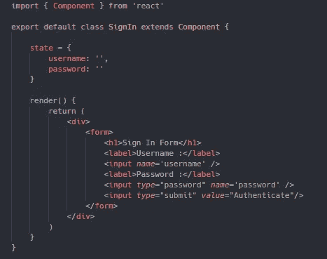

现在，我们已经有了基本的登录表单，我们将把它导入到 App.js 中，就在 SignUp.js 的下面。为了简单起见，现在我们将在前面构建的三元组中，在我们的注册表单上面呈现我们的登录表单。这不是你的应用程序想要的外观，因为两个表单将出现在同一个页面上，添加和使用 react-navigation 将帮助你创建单独的页面并更容易地浏览它们，但这是不同的一天。您的导入和返回应该如下所示:

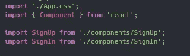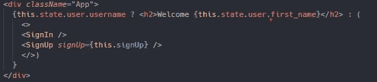

如果您现在看一下您的页面，您应该会看到您现在有一个登录和注册表单。我们在第一部分中所做的样式化的好的部分是，因为这也是一个 css 将样式化的表单，因为 App.js 是接收样式化的表单。虽然此时表单不做任何事情，但是看到页面上显示一些东西总是很棒的。

现在，我们将返回到 SignIn.js，构建我们的表单，赋予它更多的功能。因为我们有用户名和密码的状态，所以我们希望从每个输入中获取这些值。就像我们的注册表单一样，我们的值将等于您正在设置的 this.state. property。

同样，我们也将输入名与状态名保持一致，这样我们就可以调用之前使用过的同一个动态函数。因此，我们将再次添加 onChange 事件到我们的输入中，并接收我们将要构建的函数 handleChange。在这个阶段，您的表单应该是这样的:

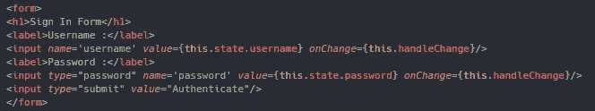

现在我们的表单有了更多的内容，让我们构建我们的 handle change 函数。我们将再次使用在注册类中实现的相同的 handleChange 函数。该函数将再次动态设置每个输入的状态。

虽然我们仍在使用 SignIn.js，但我们还需要将一个 onSubmit 事件放置到我们的表单中，类似于我们的注册表单，这样它就可以真正完成它应该做的事情。我们的函数看起来与在 SignUp.js 中的完全一样，除了我们将在 App.js 中创建自己的函数 signIn 来为我们处理这项工作。您完成的登录类应该如下所示:

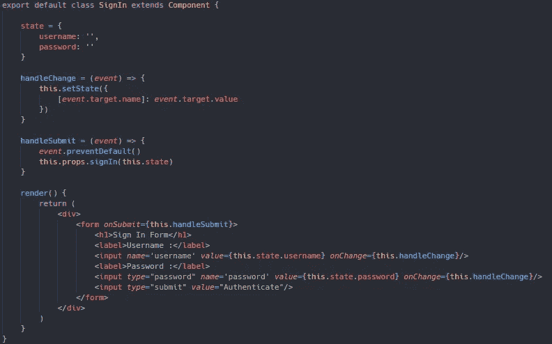

完成注册表格后，我们需要创造真正的奇迹。首先，我们将前往我们的 App.js，在我们的注册函数下面，我们将创建一个名为 signIn 的新函数。这个函数将接受一个用户作为它的参数。我们将对我们的后端进行 post 提取，但将使用一个我们尚未设置的名为 login 的自定义路由。所以我们的获取 url 需要是我们的 rails 基本 URL/登录。

然后，我们将编写我们的 post fetch，就像我们对任何其他人一样，确保我们的用户键只发送用户名和密码，因为这是我们从当前表单中提供的。为此，我们将把我们的登录功能传递给我们的登录组件。您的登录功能现在应该是这样的:

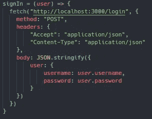

你的回归

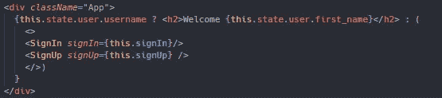

目前我们的获取还不能工作，因为我们还没有定制登录路径，所以让我们来解决这个问题。我们将需要前往我们的后端现在，并创建自定义路线。为此，我们将进入配置文件夹并打开 routes.rb。

首先需要添加 http 方法，在本例中是 post。接下来，我们将创建实际的路由或端点，它将是/login。你必须确保把它放在一个字符串中！最后，我们将告诉它去哪里，这是在用户控制器调用登录方法，我们将创建。你的路线应该是这样的:

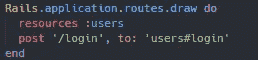

让我们开始创建登录方法吧！我们将需要前往我们的用户控制器，在那里我们将把我们的新方法。我们首先需要在数据库中找到我们的用户，因为我们只向 rails 发送用户名和密码，所以我们将使用用户的用户名。请注意，因为我们发送的是用户对象，所以您需要接收用户并提取他们的用户名。这可能看起来有点令人困惑，所以对于那些更注重视觉的人来说，下面是代码的一个片段:

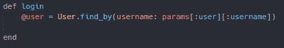

一旦我们找到该用户，我们将需要做两件事，如果他们的密码是正确的，就让他们登录，或者向他们发送一个错误消息，因为他们没有正确的用户凭证。为此，我们将在登录方法中使用 if else 语句。简单地说，如果我们的用户有正确的凭证，他们可以继续通过，如果没有，那么他们最好仔细检查他们的密码和用户名组合。

我们可以先设置 else 语句，因为这非常简单。如果找不到用户，我们将呈现一个状态为未授权的简单错误消息，该消息将简单地向网络终端发送 404。您的 else 语句应该是这样的:

如果我们确实找到了一个用户，我们还希望根据他们提供给我们的凭据来验证或确认该用户。在这种情况下，我们将根据用户输入的密码对用户进行身份验证，并且碰巧从我们之前安装的 bcrypt gems 中获得了一个身份验证方法。这将获取输入的散列密码，并将其与存储在我们数据库中的散列密码进行比较。您的 if 语句应该是这样的:

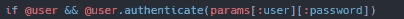

一旦找到并验证了用户，我们现在就可以给用户一个令牌来实际登录页面。这是我们将使用 JWT 的地方，我们之前也将它添加到我们的 Gemfile 中，它将为我们的用户提供他们的 web 令牌。我们将创建一个令牌变量，其中我们将使用 JWT 来编码用户 id。这样做的原因是每个用户 id 都是唯一的，这意味着每个用户都将获得一个很好的唯一令牌。如果您愿意，您可以对用户名甚至整个用户进行编码，但是对于本例，我们将使用用户 id。

我们还需要对我们的“秘密”进行编码，这可能正是我们的“秘密”。字符串形式的任何内容都是可以接受的，但是 rails 有一个内置的方法来为您创建一个秘密，这个方法就是 rails . application . secrets . secret _ key _ base[0]。相当拗口，但我喜欢有额外的安全层，我甚至不知道其中的秘密。之后，我们需要将令牌提交给我们的前端，我也将发送用户，以便我们可以设置用户的状态。如果您一直遵循您的登录方法，应该是这样的:

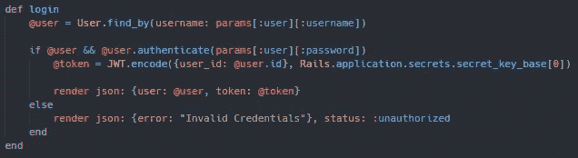

现在我们的登录方法已经完成了，让我们把注意力转回到前端，这样我们就可以最终使用这个方法了。让我们打开 App.js，继续构建我们的登录功能。我们首先需要检查我们的用户是否有令牌，因为我们不想让任何人进门。我们可以通过使用 and if 语句来实现这一点，如果我们的响应包含一个令牌，那么我们将把用户的状态设置为我们的用户的状态。在我们设置用户状态之前，虽然我们想让用户在使用我们的应用程序时保持授权。为此，我们需要将用户令牌存储在本地存储中，以便在加载到新页面时保持用户登录。

应该在登录函数获取调用的末尾添加以下内容:

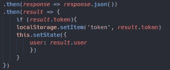

没有代币怎么办？这是我们的 else 语句发挥作用的地方，我们已经在后端创建了一个错误消息。为此，我们需要创建一个错误状态。因为我们的错误响应是作为一个对象发送回来的，所以我们可以将错误状态设置为一个空字符串。我们的 else 语句将我们刚刚创建的错误状态设置为登录方法中的错误消息。还要注意将您的状态或错误传递给您的注册组件。这将使我们能够访问我们的登录表单中的错误状态。如果你一直在关注你的 App.js 应该是这样的:

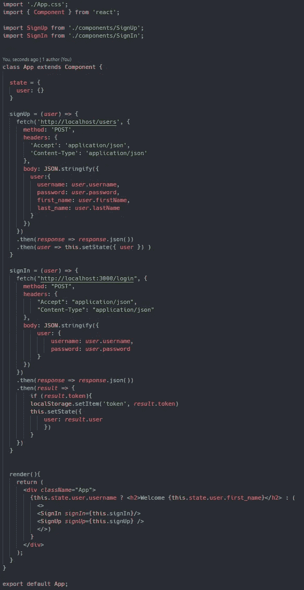

因为我们可以访问我们的错误状态，所以让我们使用它并返回到我们的 SignIn.js。为了让我们的错误消息正确工作，我们将使用三元组进行更多的条件呈现。简而言之，如果有错误，我们将向用户显示错误消息，如果没有，它永远不会显示在页面上。因为这是一个错误信息，所以我决定在显示的时候给它一个红色，这样它就可以和表单上的其他东西区分开来。和第一部一样，这个巧妙的小技巧归功于达蒙·齐沃斯。如果到目前为止您已经完成了，那么您完成的 SignIn.js 应该是这样的:

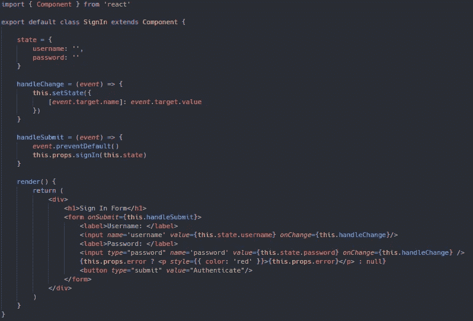

恭喜你成功了！如果您正确地遵循了这些步骤，现在您应该能够使用之前注册过的用户登录。如果您已经为演练的这一部分克隆了 repo，则首先需要创建一个用户来登录。你也可以通过在注册字段中输入废话来测试你的错误信息。任何不在我们数据库中的用户都不会得到令牌，并将收到此错误。

如果你想看第二部分已完成的回购，你可以在这里 [找到它。](https://github.com/TheRealKevBot/Auth_Part-II_Complete.)

如果你喜欢本演练的第二部分，请和我一起参加第三部分，在这里我们将学习如何授权我们的用户！！！