# 使用 JWT 第三部分从头开始 React & Rails Auth

> 原文：<https://levelup.gitconnected.com/react-rails-full-auth-from-scratch-using-jwt-part-iii-f1f665fe3347>

先决条件:

[反应](https://reactjs.org/docs/getting-started.html)安装完毕

[轨道](https://guides.rubyonrails.org/getting_started.html)安装完毕

欢迎大家回来，这是 React 和 Rails 认证构建的第三部分，也是最后一部分。正如您在第二部分中所记得的，我们添加了注册功能，还创建了一个验证用户身份的登录功能。如果你没有跟上第一或第二部分，你可以在这里[找到一份我们将从今天开始的回购协议。](https://github.com/TheRealKevBot/Auth_Part-II_Complete)

如果您刚刚复制了回购，您将需要运行:

在后端:

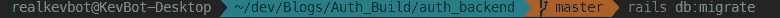

在前端:

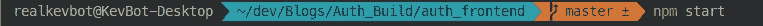

如果您已经完成了第一部分和第二部分，那么您只需要通过运行每个服务器的最后一行代码来启动您的服务器。

现在我们已经启动并运行了我们的两个服务器，我们应该看到我们的登录表单和注册表单。两者都应该还在正常工作，并在我们的登陆页面登陆我们。对于那些刚刚克隆了 repo 的用户，您需要首先创建一个用户来使用您的登录功能，因为您的数据库将是空的。

今天，我们的应用程序需要解决一个小问题，即在页面刷新时，我们的用户将显示我们的登录或注册表单。这意味着我们在刷新时会丢失用户的状态，这是我们想要解决的问题。我们将授权我们的用户，这将有助于我们在整个应用程序中保持用户的状态。这是通过利用我们之前通过注册功能放入本地存储的令牌来实现的。

为了让事情开始，我们将需要前往我们的后端，并打开我们的应用程序控制器。我们将在这里创建名为 is_authorized 的方法，该方法将检查以确保我们的用户确实得到了授权。在这种情况下，如果我们的用户被授权，他们将有权访问他们的用户信息。如果没有，那么他们将看到一个错误，要求他们登录，以便可以访问用户信息。您授权方法应该如下所示:

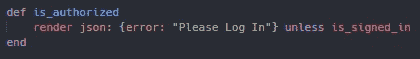

从代码中你可以看到，我们的用户将得到一个错误，除非他们登录。我们调用了方法 is_signed_in，现在需要构建它。为此，我们只需通过将当前用户设置为布尔值来检查用户当前是否正在使用我们的应用程序。为我们提供 is_signed_in 的当前状态的 the 或“falsey”值。这反过来意味着我们还需要构建 current_user 方法，该方法将检查提供给用户的令牌的合法性。我们可以从后端请求的授权头中提取用户令牌。您的两个新方法应该如下所示:

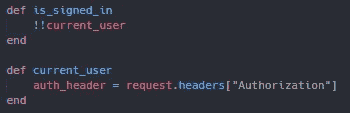

现在，当我们当前的用户运行时，我们将得到一个包含载体和令牌的字符串。我们首先需要创建一个 if 语句，接受 auth_header 的参数。我们只需要授权头中的实际令牌，为此，我们只需将该字符串转换为一个数组，并删除除用户令牌之外的所有内容。在您当前的用户方法中，您的 if 语句应该如下所示:

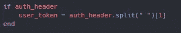

现在，我们已经可以访问我们用户的令牌，我们将希望继续下去，并解码它。这是为了确保用户是他们通过原始编码令牌所声称的人，我们之前通过登录方法编码的用户实际上是相同的。在我们的例子中，它指的是我们的用户 id，因为这是我们选择编码的内容。

这是一个微妙的过程，因为如果令牌不存在，rails 在试图解码时会给我们一个很大的 500 错误。这会让我们的应用程序停止运行，这是我们不想经历的，更别说我们的用户了。为了避免这个问题，我们将通过使用 begin 和 rescue，这将让我们尝试解码我们收到的令牌。如果我们遇到错误，比如我之前提到的 500，拯救将允许我们避免这样的错误，否则会锁定我们的应用程序。您的 if 语句也应该这样更新。

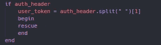

现在我们已经准备好了安全网，让我们开始构建它，并获得我们用户的令牌。这看起来类似于我们在登录方法中编码令牌时的情况，但有一些不同。为此，我们将调用 JWT 来解码我们的原始令牌，该令牌包含我们的用户 id 以及我们的秘密，因为这是我们在登录方法中对用户进行编码的内容。编码和解码相同的信息是至关重要的，否则你将不会接收到被编码的信息。

一旦 JWT 解码了我们的令牌，我们将返回一个数组，从我们解码的令牌中，我们将需要取出他们的 id。我们可以简单地通过调用我们编码的对象的索引，我们的用户 id，然后从它的键中取出它，我们将得到用户 id。我们还将把它设置为 user id 的一个实例变量，因为如果一切顺利的话，我们将得到一个用户数字 id。

如果一切都不顺利，我们的拯救会把我们从即将发生的错误中拯救出来。我们将使用我们的救援，以阻止 JWT 的解码错误运行，在这种情况下，将返回零，或什么都没有。更新后的 begin 和 rescue 应该如下所示。

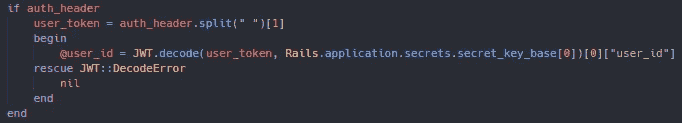

现在，我们应该有我们的用户的 id，我们仍然需要得到我们的用户，我们将根据他们的 id。为此，我们将在刚刚完成的最后一个 if 语句之后创建另一个 if 语句。如果我们有一个用户的 id，那么我们将找到那个用户并返回他们，或者返回 nil。在我们在这个方法中返回 nil 的两个实例中，都会导致我们的自定义错误从我们的 is authorized 方法中呈现。我们的第一个实例将停止 JWT 解码错误，在这个实例中，如果数据库中不存在该用户 id，它将停止活动记录错误。您完成的当前用户方法应该如下所示。

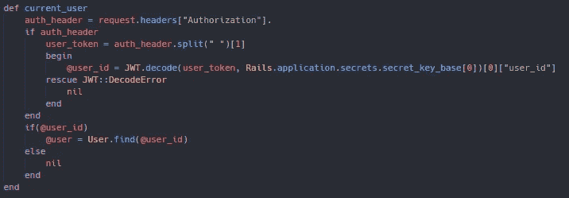

我们当前的 user 方法肯定有很多工作要做，但本质上是在做我们的 login 方法所做的事情，只是相反，然后返回 user。既然我们有能力判断一个用户是否被授权，让我们确保只有被授权的用户才能访问我们的应用程序。为此，我们将在顶部创建一个 before 操作。我们的 before 操作将采用我们的方法进行授权，现在将完全锁定我们的应用程序。您之前的操作应该如下所示。

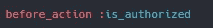

如果你想看这方面的例子，尝试去你的路线之一，如用户。您应该会看到您创建的自定义错误消息

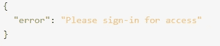

这就产生了一个问题，那就是我们如何在用户注册之前授权他们呢？不要担心，这不是一个难题，你不能！但是我们可以做的是创建一个动作前跳转，我们将把它放在我们的用户控制器中。在我们过于超前之前，您完成的应用程序控制器应该是这样的。

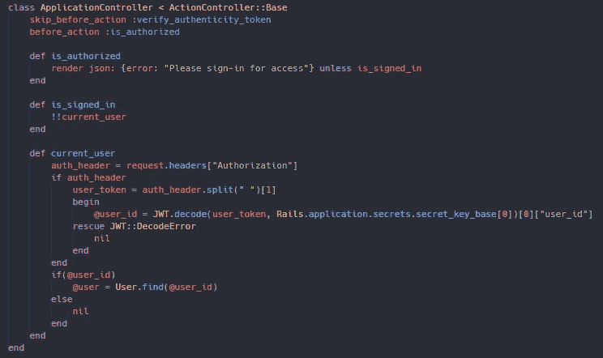

由于 rails 的 rack-cors 问题，我有一个“跳过之前”操作，您可能需要也可能不需要，这取决于本演练的第一部分对您的帮助。

现在让我们转到用户的控制器，在顶部，我们将创建一个“授权操作前跳转”。这里的小问题是，我们现在已经跳过了 is authorized 方法，除非我们给它一些参数，否则它现在实际上是无用的。本质上，如果某人没有被授权，什么是允许的，什么是不允许的。我们希望用户在获得授权之前能够访问的两种方法是注册，这将是我们的创建方法，以及使用我们的创建方法登录。当仍在开发中，我个人将包括我的所有控制器的索引行动，但不会推荐部署的应用程序。这将允许我在用户需要授权之后，查看我的 rails 数据库 localhost:3000/your route 中保存了什么。您的“动作前跳过”应该是这样的。

这个难题的最后一部分是，一旦我们的用户最终获得授权，我们将希望授予他们访问其数据的权限，这正是您将在您的个人资料中看到的内容。要做到这一点，我们只需在我们的“跳过之前”操作下创建一个名为 user_profile 的新方法。如果您已经使用 rails g scaffold 创建了控制器和表，那么我们将要构建的用户配置文件方法将只是一个 show 方法。在我们的用户配置文件方法中，我们只想显示或呈现我们的用户。更新后的用户控制器应该如下所示。

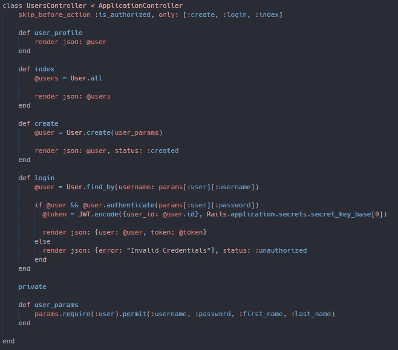

请注意，我们是从应用程序控制器中的当前用户的返回值中获取用户的

最后，我们需要为我们的用户配置文件设置路由，并为我们的新方法添加一个 get 请求。这与索引的不同之处在于，它只显示授权用户的信息，而不是所有用户的信息。此外，即使设置了新路线，您仍然无法访问它。展示你的 auth 能为你做的优势。更新后的 routes.rb 应该如下所示。

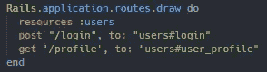

现在是时候转到我们的前端了，在那里我们将真正做承诺的事情，即使在刷新时也能让我们的用户保持当前状态。这都要归功于我们的令牌，为了让事情开始，我们将需要前往我们的 App.js。目前，每当我们刷新页面时，页面上的组件都会被重新装载，我们需要改变这种方式。

为了实现这一点，我们将使用一个带有 if 语句的组件 did mount，这样当页面刷新时，我们的用户就已经有权访问我们的应用程序了。我们首先需要来自本地存储的令牌，我们将把它设置为变量 token。如果我们的应用程序有一个令牌，我们将获取我们已经创建的新路线，配置文件。它与它的路由相似，因为它是一个 get 请求，但是我们将使用我们的令牌发送授权头。我们将需要格式化我们的响应，因为它应该被接收，这是一个包含载体和令牌的字符串。您完成的获取应该如下所示。

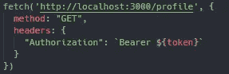

确保用户字符串插值包含我们的变量 token

来自 fetch 调用的响应要么返回我们的授权用户，要么返回我们的错误。这意味着我们需要以 if 语句的形式进行一些条件渲染，以处理每一种可能的结果。为此，我们将检查我们的结果是否包含用户对象可能包含的内容。正如你之前看到的，我更喜欢使用用户的 id 来处理他们，所以这就是我们要检查的。如果一个 id 出现在我们的结果中，那么我们将把用户的状态设置为我们的结果，因为结果是用户对象。您安装的完整组件应该如下所示。

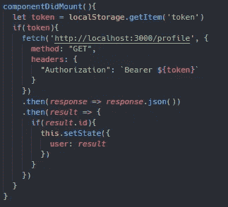

现在，一旦您的用户登录并且页面刷新，您的用户将仍然有权使用该应用程序。需要注意的是，你的组件 did mount 函数需要传递到你要添加到应用程序的其他页面。因为你不能向下传递，所以你需要创建一个名为 validation 的函数，它包含了我们组件中当前已经挂载的所有东西。这个函数可以传递到你的其他页面，同时仍然在你的当前页面上被调用。

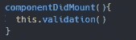

恭喜你成功了！如果您正确遵循了这些步骤，现在您应该能够创建用户，让他们登录，并在登录后保持该用户有权使用我们的应用程序。如果您已经为演练的这一部分克隆了 repo，则首先需要创建一个用户来登录。你也可以通过在注册字段中输入废话来测试你的错误信息，也可以尝试访问我们在后端设置为私有的任何路线。任何拥有令牌的用户现在都将被授权在登录后使用我们的应用程序。

如果您想查看已完成的回购，您可以在此处找到[。](https://github.com/TheRealKevBot/Auth_Part-III_Complete)

感谢您的关注，我希望这个由三部分组成的关于认证的系列文章对您的帮助和对我的帮助一样多！请关注未来的博客、技巧和演练！