# 反应还原

> 原文：<https://levelup.gitconnected.com/react-redux-d6a88f99adff>

*如果你想避免将属性从 React 父组件传递到其子组件或孙子组件的属性钻取，你一定要阅读这篇关于 React-Redux 的教程。*

# Redux 是什么？

根据 Redux [文档](https://redux.js.org/tutorials/essentials/part-1-overview-concepts)，Redux 是一个管理和更新应用状态的模式和库，使用称为“动作”的事件。它充当需要在整个应用程序中使用的状态的集中存储，规则确保状态只能以可预测的方式更新。

在本教程中，我们将建立我们的文件结构，如下图所示，并为 reducers 创建一个文件夹，我们稍后会谈到这个文件夹。

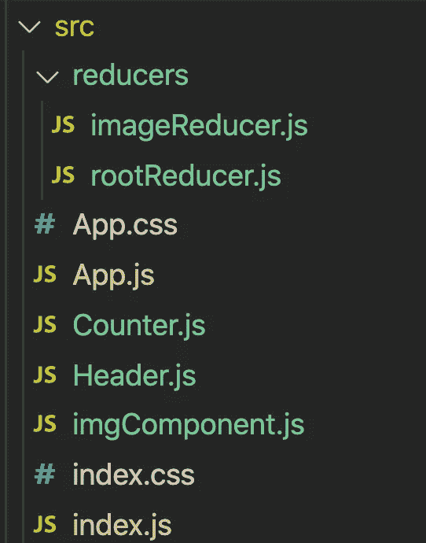

首先，我们需要安装 react-redux 和 redux 的库:

`npm install redux`和`npm install react-redux`然后让我们从 **index.js** 文件开始我们的旅程。

## **index.js 文件:**

这里，我们从`react-redux`引进了`Provider Component`。什么是提供商？这是一个上下文包装器，我们将使用它来包装我们的整个应用程序，它接收**商店**作为属性。它的唯一目的是通过 Redux 的方法使`Redux store`对我们应用程序的其余部分可用。

现在，我们来谈谈`Redux store`。 [Redux store](https://redux.js.org/tutorials/fundamentals/part-4-store) 集合了组成应用程序的状态、动作和 reducers。Store 就像一个外部状态容器，每个 React 组件都可以访问它。非常重要的是，回想一下，在 Redux 应用程序中只有一个商店。

**创建商店**

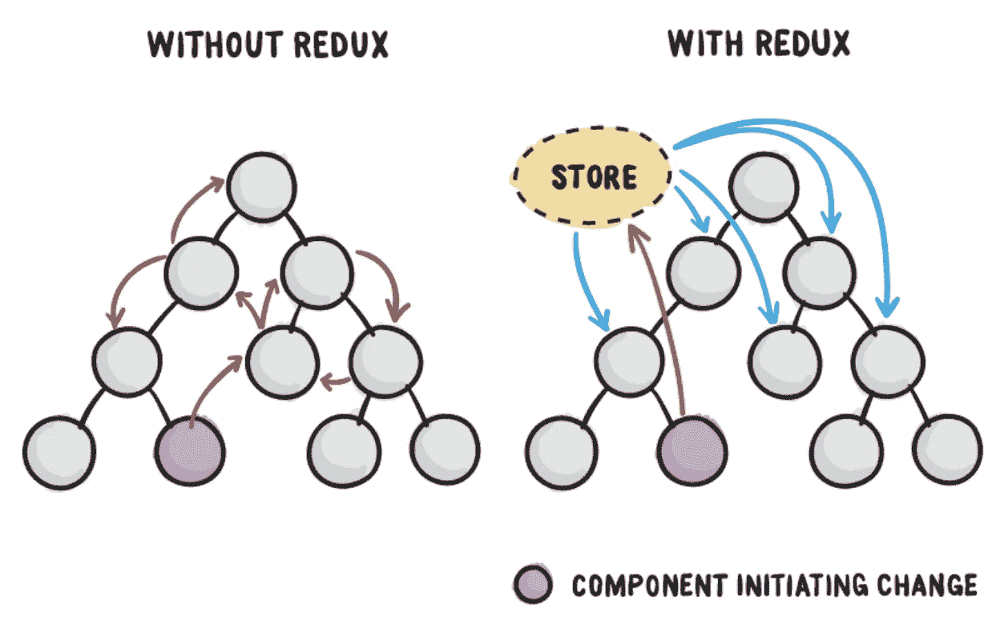

在第 7 行，我们从`redux`导入了`createStore`。CreateStore 是一个函数，它创建一个`Redux store`并将接受一个`reducer`函数作为参数。在这段时间里，我们已经走过了`rootReducer`。什么是 rootReducer？这也是一个 reducer 函数，但是现在，让我们先把这个问题放一放，我们很快就会回来。在第 10 行，我们使用 createStore 函数创建 Redux 存储，并将其赋给变量`store`。在第 13 行，我们将我们的存储作为道具或属性传递给提供者组件，这样 Redux 存储就可以通过一些 Redux 函数被整个应用程序的每个组件访问。

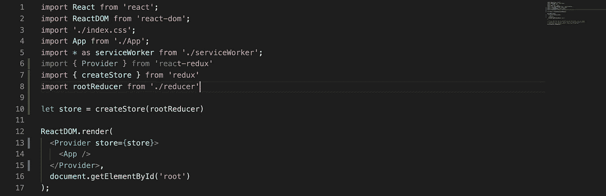

## **减速器文件夹:**

在这个文件夹中，有两个文件: **imageReducer.js** 和 **rootReducer.js.**

[**什么是 reduce**](https://redux.js.org/recipes/structuring-reducers/basic-reducer-structure#basic-reducer-structure)**:**redux 是一个 redux 函数，会作为实参传入`createStore`。回想一下，你可以有许多减速器，但是你只能传递给`createStore`一个减速器函数。我们稍后会在这个博客中讨论这个问题。

1.  **imageReducer.js:** 在这个文件的第 1 行，我们刚刚设置了一个`initialState`，因为每个 Reducer 都需要一些初始状态。在第 5 行，我们将`initialState`和`action`作为参数传递给了我们的`ImgReducer`函数。到目前为止，`ImgReducer`是我们 App 唯一的减压器功能。要记住，reducers 一般使用 [**ES6 默认参数语法**](https://redux.js.org/tutorials/fundamentals/part-3-state-actions-reducers) 来提供初始状态:`(state = initialState, action)`。

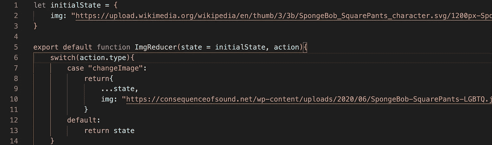

2. **rootReducer.js:** 在这个文件`rootReducer.js`中，我们做的第一件事就是从**导入`ImgReducer`。/imageReducer "。**在这里，我们有另一个减速器功能，即`reducer`。如上所述，我们只能将一个缩减器作为参数传递给`createStore`函数，因为我们有两个缩减器，我们需要另一个函数将我们的两个缩减器合并成一个。为此，我们必须从`redux`导入`combineReducers`功能。`[combineReducers](https://redux.js.org/api/combinereducers)`辅助函数将一个值为不同减函数的对象转换成一个可以传递给`createStore`的减函数。

在第 26 行，我们将两个缩减器`ImgReducer` & `reducer`传递给`combineReducers`，并将其赋给变量`rootReducer`，最后，我们使`rootReducer`可导出。

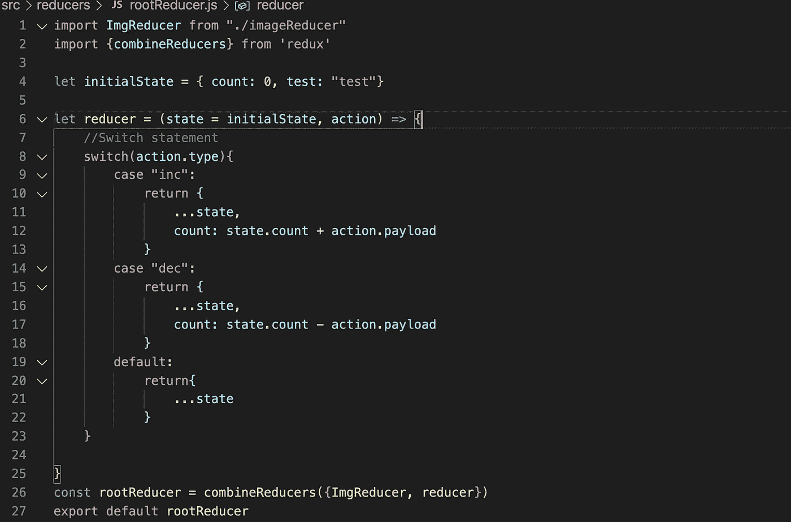

## **返回 index.js 文件:**

在第 8 行，我们在 index.js 文件中导入了`rootReducer`。在第 10 行，我们将`rootReducer`作为参数传递给`createStore`函数，并将其分配给我们的`Redux store`。此时，我们的`Redux store`包含了我们的状态、动作和 rootReducer (combineReducers)。最后，我们将该存储作为属性传递给提供者组件，以便在整个应用程序中，所有组件都可以访问它。

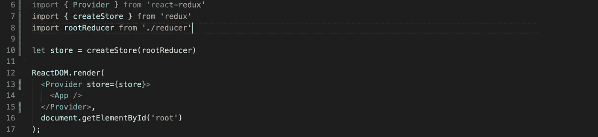

## **Count.js 文件:**

**组件如何访问 Redux store 的数据？**

React-redux 为我们提供了另一个函数`connect()`，组件可以使用这个函数来访问 store 的数据。`connect()`函数将一个 React 组件连接到一个 Redux 存储。它有两个目的:它将组件连接到存储，以便从存储中获取数据，并将信息发送到存储。让我们把`connect`看作 React 组件和 Redux store 之间的连接器或桥梁。

现在让我们看看如何将我们的功能组件**计数器**连接到我们的 Redux 存储并从中获取 can 数据。首先，我们需要从`'react-redux'`(第 2 行)导入`connect`。

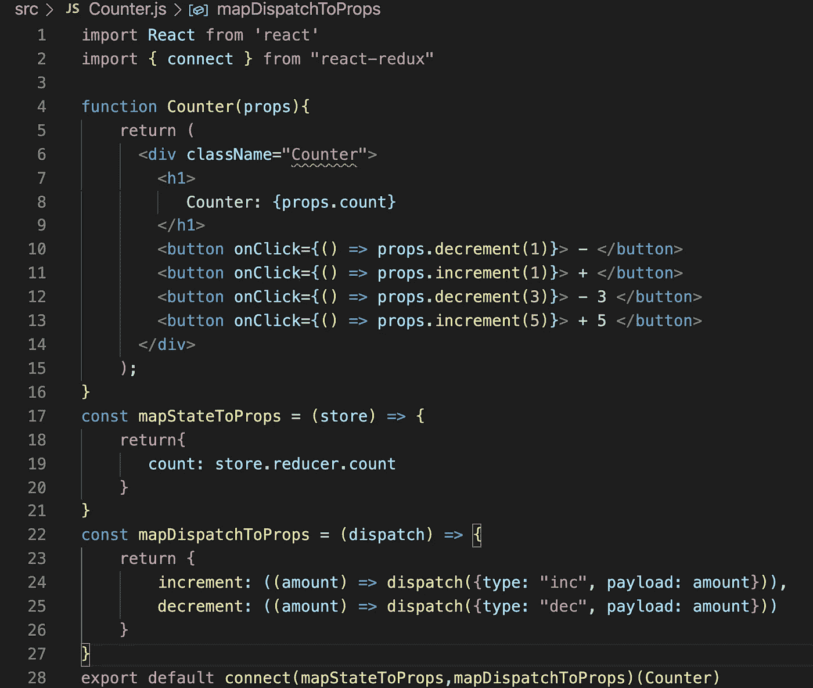

`[Connect](https://react-redux.js.org/7.1/api/connect#connect)`接受四个不同的参数，全部可选。按照惯例，它们被称为:

1.  `mapStateToProps?: Function`
2.  `mapDispatchToProps?: Function | Object`
3.  `mergeProps?: Function`
4.  `options?: Object`

在这个例子中，我们将使用前两个:`mapStateToProps`和`mapDispatchToProps`。

# `**mapStateToProps**`

这是一个函数，按照惯例，它将是`connect`函数的第一个参数。您的`mapStateToProps`函数应该返回一个对象。这个对象，通常被称为`[stateProps](https://react-redux.js.org/7.1/api/connect#connect)`，将作为道具合并到我们的连接组件，这里是计数器组件。

因为我们使用`connect()`将计数器组件连接到 store，所以让我们将传递给`mapStateToProps`的参数命名为 store 和`console.log`(您可以随意命名)。

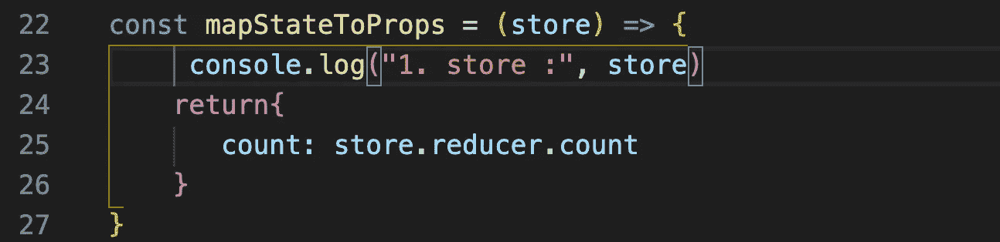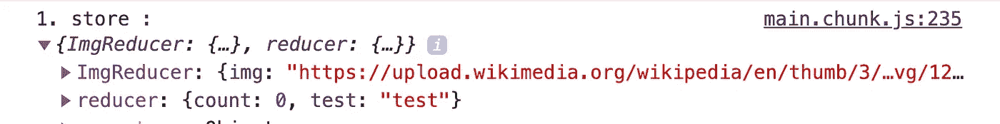

原来，我们的商店包含了我们所在州的`rootReducer` ( `ImgReducer`和`reducer)`)。因为期望`mapStateToProps`返回 state，所以我们的目标是从`rootReducer`访问 state 并返回它。

**从我们的减速器进入状态:**

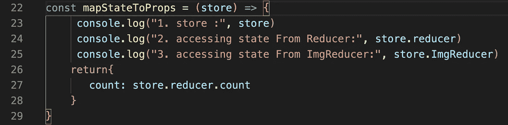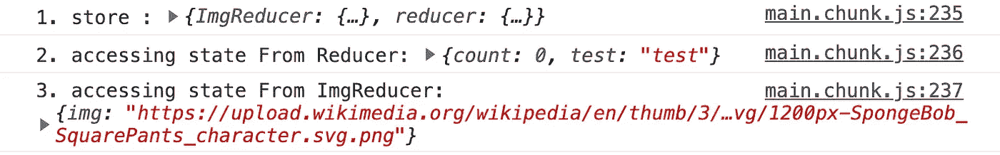

**返回状态:**对于这个组件，我们只需要计数器组件的`count`字段，我们知道 count 在`reducer`中，这将很容易检索。我们知道`mapStateToProps`将返回一个对象，因此我们将这个对象的`key`命名为`count`，它的`value`将为`store.reducer.count.`

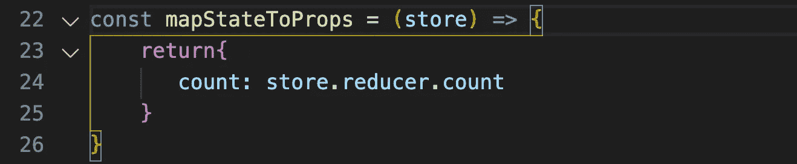

如上所述，无论什么样的`mapStateToProps`回报都将是我们反制组件的道具。如果有什么道具的话，我们去开发者工具里面看看吧。正如你在下面看到的，我们的计数器组件现在有了`count`作为道具。

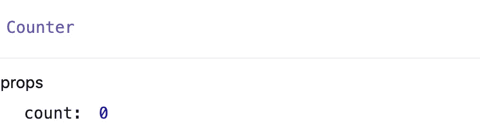

# `**mapDispatchToProps**`

按照惯例，`connect()`采用的第二个参数是`mapDispatchToProps`。回想一下，您的组件将默认接收`dispatch`，例如您没有向`connect()`提供第二个参数。

如果你的`[mapDispatchToProps](https://react-redux.js.org/7.1/api/connect#connect)`被声明为一个带一个参数的函数，它将被赋予你的`store.`的`dispatch`。你的`[mapDispatchToProps](https://react-redux.js.org/7.1/api/connect#connect)`函数应该返回一个对象，对象的每个字段都应该是一个函数，调用它应该向商店发送一个动作。无论它返回什么，都将被合并为你的连接组件的道具，这里是计数器组件。

`Dispatch`:作为参数`action`。[动作](https://redux.js.org/tutorials/fundamentals/part-3-state-actions-reducers)是普通的 JavaScript 对象，有一个`type`字段。您可以将动作视为描述应用程序中发生的事情的事件。最重要的是，`actions`也有`payload`字段，我们将描述正在发生的事情所需的任何额外数据放入`action.payload`字段。这可能是一个数字、一个字符串或一个包含多个字段的对象。

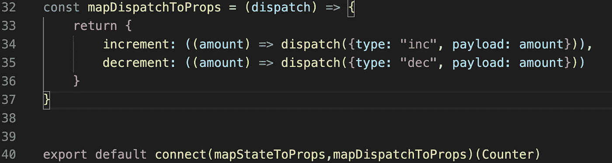

因为`mapStateToProps`和`mapDispatchToProps`函数的返回将作为道具合并到您连接的计数器组件中，所以让我们打开我们的 DevTools 来看看吧。下面我们可以看到我们的组件有一些道具:`count`、`decrement`和`increment`。

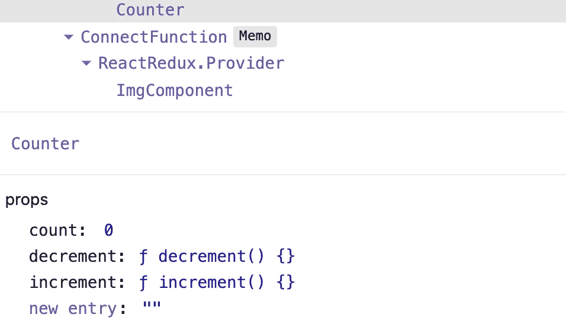

> 让我们通过使用 connect 函数将从`mapStateToProps`和`mapDispatchToProps`收到的那些道具记录到我们连接的计数器组件中。

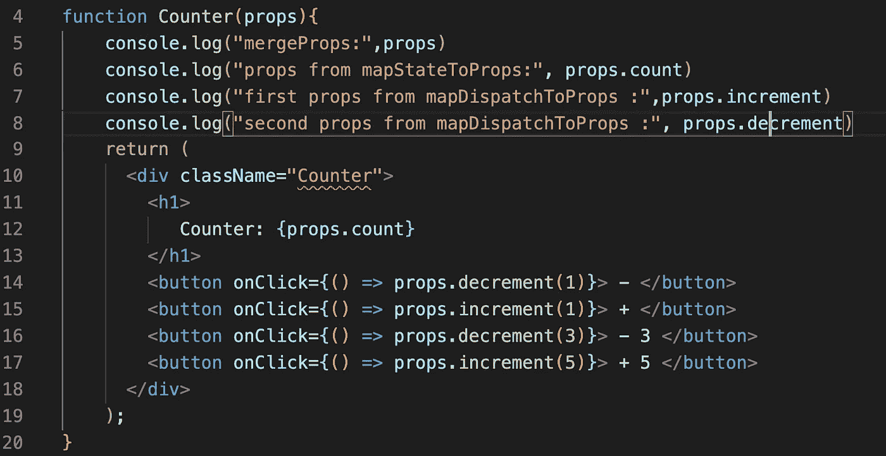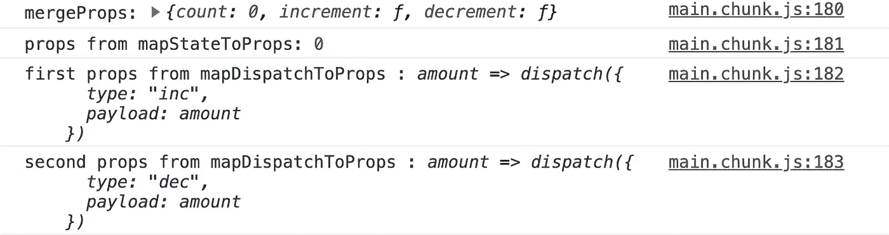

## rootReducer.js:

让我向您介绍一下我们的减压器功能。它需要两个参数`state`和`action`。我们使用 Switch case 语句来检查条件，如果`action.type`是“inc ”,我们希望我们的 reducer 函数首先返回当前状态，然后通过增加来更新`count`字段。在这个例子中，我们使用了 spread 操作符来复制当前的`(…state)`。另一方面，如果`action.type`是“dec ”,我们希望我们的缩减器返回当前状态，并通过减少它来更新`count`字段。如果这些条件都不满足，我们的 reducer 函数将默认返回当前状态。

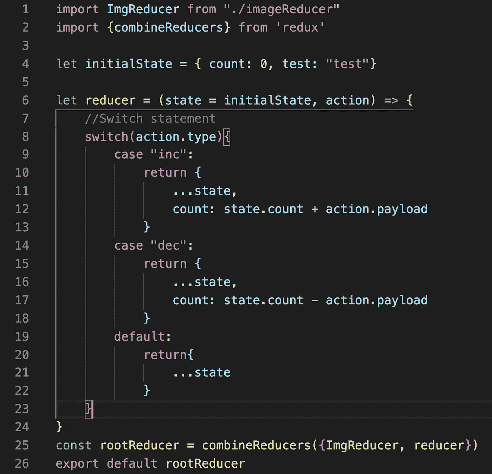

不过，在这一点上，我希望您可以看到 Redux 如何通过避免所谓的 [Prop Drilling](https://medium.com/javascript-in-plain-english/how-to-avoid-prop-drilling-in-react-using-component-composition-c42adfcdde1b) 来使我们的生活变得更加容易，所谓的 Prop Drilling 就是通过遍历不需要数据的其他部分来将数据从 React 组件树的一部分传递到另一部分，而这些部分只是帮助传递数据

如果你做到了这一步，感谢你的阅读！

PS:我在下面分享了`ImgComponent`,我不会对它进行评论，因为我们已经通过`counter Component.`在 counter.js 文件中介绍了相同的过程

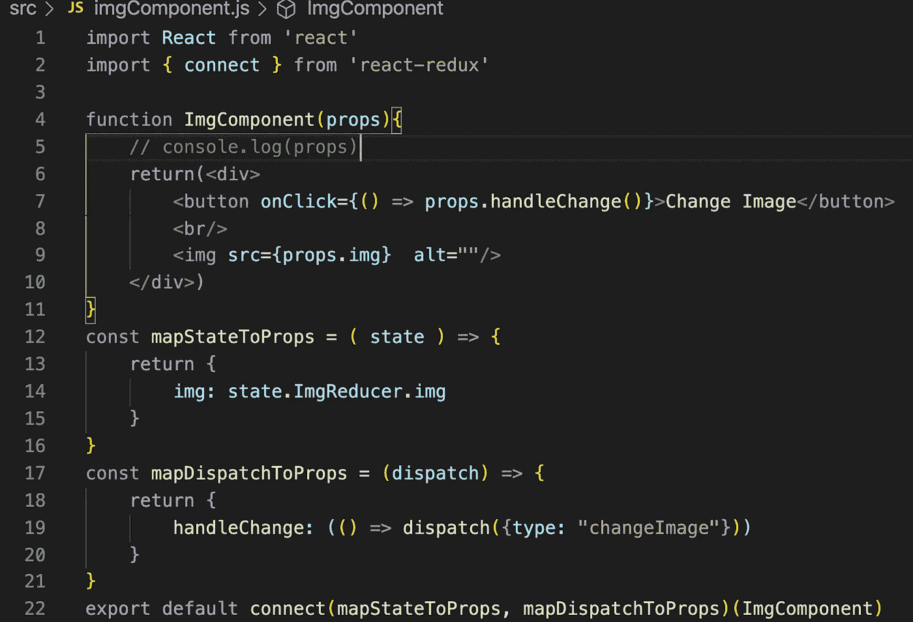

资源:[https://redux.js.org/introduction/getting-started](https://redux.js.org/introduction/getting-started)，

[https://redux . js . org/tutorials/fundamentals/part-3-state-actions-reducers](https://redux.js.org/tutorials/fundamentals/part-3-state-actions-reducers)，

https://react-redux.js.org/7.1/api/connect#connect，

[https://react-redux . js . org/7.1/introduction/why-use-react-redux](https://react-redux.js.org/7.1/introduction/why-use-react-redux)