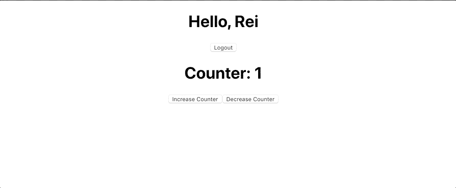
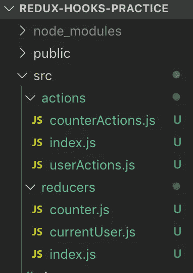

# React-Redux 挂钩:useSelector 和 useDispatch

> 原文：<https://levelup.gitconnected.com/react-redux-hooks-useselector-and-usedispatch-f7d8c7f75cdd>

## 使用 Redux 和 React 挂钩来清理代码的指南


反应还原

React Redux 提供了一组钩子作为现有的`connect()` 高阶组件的替代。这些钩子允许您连接到 Redux store 并分派动作，而不必将组件包装在`connect()`中。

本指南将介绍如何在您的应用程序中实现 React-Redux 挂钩`useSelector`和`useDispatch`。

# 入门指南

首先在您的应用程序中安装以下内容:

```
npm install reduxnpm install react-redux
```

本指南中的示例将引用我的存储库:

[](https://github.com/reireynoso/react-redux-hooks-practice) [## reireynoso/react-redux-hooks-练习

### 这个项目是用 Create React App 引导的。在项目目录中，您可以运行:在…中运行应用程序

github.com](https://github.com/reireynoso/react-redux-hooks-practice) 

下面是该应用功能的快速 gif 图:



React-Redux 钩子练习 Gif

有两种独立的状态，一种用于跟踪计数器，另一种用于跟踪登录的用户。我们将有单独的文件来处理每个状态。

# 创建一个操作和减速器文件夹



操作和减速器文件夹

## 行动

让我们从定义`counterActions.js`中计数器的动作开始。有几个方法是必须的，`increment`和`decrement`。我们将在一个对象中导出这两个方法。

反作用

类似地，让我们在`userActions.js` **、**中定义当前用户的动作，其中也将有两个方法`setUser`和`logOut`，它们将在一个对象中导出。

用户操作. js

为了有条理，我们将这两个文件导入到一个位置，即`actions`文件夹中的`index.js` 文件。我们创建一个变量`allActions`并将其设置为一个对象，该对象包含将要导出的导入动作。

操作-> index.js

## 还原剂

与操作文件结构采用的方法相似，我们创建单独的`reducers`文件夹来保存用户和计数器 reducers。先说计数器减速器，`counter.js`。

一个 reducer 函数接受两个参数，`state`和`action`。状态不一定必须设置为对象。在这种情况下，状态的默认值被设置为一个整数。

正如我们前面定义的，一个动作返回一个对象，该对象可以包含两个键，`type`和一个可选的`payload`。基于动作类型，状态的值将被改变。请记住，在调用不存在的动作类型的情况下，默认情况是必要的，以防止应用程序中断。

计数器减速器，counter.js

对于当前用户 reducer`currentUser.js`，状态将被设置为一个空对象，其中包含键`user`和`loggedIn`。请注意`counter`和`currentUser`之间返回内容的差异。在所有情况下，计数器缩减器返回一个整数，因为它的初始值是一个整数。对于当前用户 reducer，总是返回一个对象。

当前用户减少器。currentUser.js

我们需要将这些减速器合二为一。在`reducers/index.js`下，让我们导入 reducer 文件以及`combineReducers`:

```
import {combineReducers} from 'redux'
```

合并 reducers 顾名思义就是将独立的 reducer 文件合并成一个文件。它接受一个参数，一个包含 reducer 文件的对象。现在我们的动作和 reducers 已经设置好了，让我们继续在应用程序中实现 Redux。

# 实施 Redux

在我们的`index.js`下的`src`文件夹中，我们将导入以下内容:

```
import {Provider} from 'react-redux';
import {createStore} from 'redux'
import rootReducer from './reducers'
```

将使用方法`createStore`创建一个 Redux 存储。它接受两个参数，即组合了我们的 reducers 和 Redux devtools 扩展的文件`rootReducer`。

最后，我们用来自`react-redux`的`Provider`组件包装我们的`App`组件。`Provider`组件将接收一个道具，从`createStore`存储到`store`中。

# 实现 useSelector/useDispatch

我们从 react-redux、`useSelector`和`useDispatch`导入以下钩子。之前，我们必须从 react-redux 导入`connect()`,并用它包装我们的组件，以便将状态映射到道具，并将调度映射到道具。

## 使用选择器

地图状态相当于道具的是`useSelector`。它接受一个函数参数，返回您想要的状态部分。在这种情况下，我们有以下来自状态定义的键，`counter`和`currentUser`。我们之前在组合异径管时定义了这些。

```
const counter = useSelector(state => state.counter)
// 1const currentUser = useSelector(state => state.currentUser)
// {}
```

因此，变量`counter`和`currentUser`被设置为由它们各自的减速器定义的状态。

## 使用显示器

相当于地图分派到道具的是`useDispatch`。我们将调用`useDispatch`并将其存储到变量`dispatch`中。Dispatch 将使用从 actions 文件夹导入的`allActions`。例如，`useEffect`用下面的动作`allActions.userActions.setUser(user)`调用一个`dispatch`。用户被定义为:

```
const user = {name: "Rei"}
```

请记住，`allActions`是一个以`userActions`和`counterActions`为关键字的对象。作为对`userActions.js`中定义的`setUser`功能的复习:

```
const setUser = (userObj) => { return { type: "SET_USER", payload: userObj }}
```

`setUser`将返回一个带有`type`和`payload`的对象。Dispatch 将接受这个对象，并检查与动作类型匹配的 reducers。在这种特殊情况下，它位于`reducers`文件夹中的`currentUser.js`。

```
case "SET_USER": return { ...state, user: action.payload, loggedIn: true}
```

应用程序组件

现在你知道了。React-Redux 挂钩`useSelector`和`useDispatch`在 React 应用中实现。与`connect()`替代方案相比，代码更干净、更有条理。

感谢您的阅读！

# 分级编码

感谢您成为我们社区的一员！升级正在改变技术招聘。 [**在最好的公司找到你的完美工作**](https://jobs.levelup.dev/talent)**。**

**[](https://jobs.levelup.dev/talent) [## 提升——改变招聘流程

### 🔥让软件工程师找到他们热爱的完美角色🧠寻找人才是最痛苦的部分…

作业. levelup.dev](https://jobs.levelup.dev/talent)**