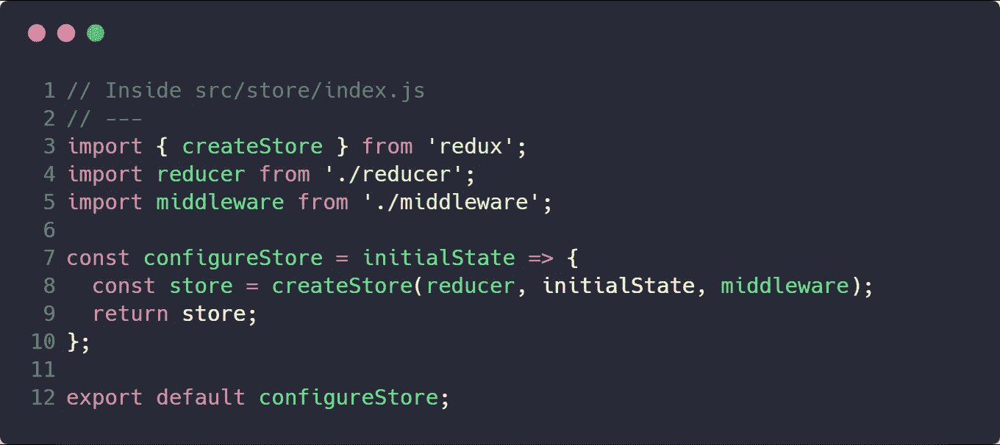

# React & Redux 教程—构建一个黑客新闻克隆

> 原文：<https://levelup.gitconnected.com/react-redux-tutorial-build-a-hacker-news-clone-64f320364f85>

## 使用 Redux 和样式化组件构建一个生产 React 项目。使用 GitHub 页面部署应用程序。

这是 [gitconnected Hacktoberfest 项目](https://gitconnected.com/hacktoberfest)的分步解决方案。

在本教程中，我们将构建一个生产质量的黑客新闻克隆。我们将介绍初始化应用程序、添加 [Redux](https://redux.js.org/) 来管理状态、在 React 中构建 UI 以及将解决方案部署到 GitHub 页面的步骤。我们将使用[样式化组件](https://www.styled-components.com/)对应用程序进行样式化，并使用 [axios](https://github.com/axios/axios) 库调用公共[黑客新闻 API](https://github.com/HackerNews/API) 。

[**GitHub —查看来源**](https://github.com/gitconnected/hacker-news-reader)

[**下载黑客新闻克隆作为 Chrome 扩展(太牛逼了！)**](https://chrome.google.com/webstore/detail/hacker-news/hknoigmfpgfdkccnkbfbjfnocoegoefe?pli=1&authuser=1)

[](https://gitconnected.com/portfolio-api) [## 组合 API -轻松发展您的编码事业| gitconnected

### 消除在每个单独位置手动更新您的详细信息的痛苦。只需在您的中更改一次数据…

gitconnected.com](https://gitconnected.com/portfolio-api) 

如果你喜欢视频，你也可以在我们的 YouTube 上跟随这个教程。[http://www.youtube.com/watch?v=oGB_VPrld0U&index = 2&list = pltt C1 k 14 kaxhj 6 aftnrud 28 sqaovauvl 3](http://www.youtube.com/watch?v=oGB_VPrld0U&index=2&list=PLTTC1K14KAxHj6AftnRUD28SQaoVauvl3)


# 初始化项目

我们将使用 [create-react-app](https://github.com/facebook/create-react-app) 来启动项目。这允许我们构建 React 应用程序，而不用担心配置。首先，确保你已经安装了`create-react-app`。

```
npm i -g create-react-app
```

通过运行下面的命令初始化您的项目。`create-react-app`安装所有必要的包来构建 React 应用程序，它有默认脚本来管理开发和生产构建。

```
create-react-app hn-clone
# Wait for everything to finish... 
cd hn-clone
```

现在让我们安装我们将需要的核心包。我用的是`yarn`，但是如果你有`npm`，就用`npm install`代替`yarn add`。

```
yarn add redux styled-components react-redux redux-logger redux-thunk axios
```

`create-react-app`使用`NODE_PATH`环境变量创建绝对路径。我们可以在`.env`文件中声明环境变量，然后`create-react-app` [会识别它](https://github.com/facebook/create-react-app/blob/master/packages/react-scripts/template/README.md#adding-development-environment-variables-in-env)并使用 [dotenv 库](https://www.npmjs.com/package/dotenv)应用它。

```
# Create a .env file using the touch command touch .env # Inside the .env file add: 
# NODE_PATH=src
```

如果您不熟悉这种模式，当我们开始构建应用程序时，它会更有意义。它允许你做的是直接导入文件，而不需要跟踪你的文件夹路径。类似这样的`../../components/List`变成了`components/List`——方便多了。

# 文件夹结构

在`src`中，让我们更新我们的文件夹结构，使其更具可伸缩性，更适用于生产应用程序。


*   `components`:这个文件夹将包含我们所有的 React 组件(包括容器和表示)。
*   `services`:服务允许您连接到 API(例如使用 axios 调用 HN API)或为应用程序提供扩展功能(例如添加降价支持)。
*   `store`:存储保存了我们所有的 Redux 和管理状态的逻辑。
*   `styles`:在 styles 文件夹中，我们声明了可以在组件中共享的变量、模板和可重用的样式模式。
*   `utils`:可以在整个应用程序中重用的助手函数。

> *这个文件夹结构有两个方面值得注意:*
> 
> 1.我们的应用程序只有一个路由，它是根`/`。如果我们有多个路由，我也会使用`react-router`并为页面级组件创建一个`pages`文件夹。
> 
> 2.我不使用单独的`containers`文件夹来连接 Redux。我发现这增加了不必要的复杂性和混乱，因为开发人员会从不正确的位置导入(当他们想要`components`时是`containers`，反之亦然)。以我的经验来看，在实际环境中，只有一个真实的进口来源会更好。

由于我们正在使用`styled-components`，我们可以删除`index.css`文件和`App.css`文件。现在我们可以添加一些样板基础样式。在`src/styles`文件夹中创建名为`globals.js`和`palette.js`的文件。

调色板将包含我们将在应用程序中使用的颜色分组，并为我们的 UI 创建主题。将以下代码添加到`src/styles/palette.js`。


`globals.js`用于生成我们在整个应用程序中共享的默认基本样式。`styled-components`中的`createGlobalStyle`方法应该谨慎使用，但它对应用程序级样式很有用。它生成一个具有全局应用样式的新组件。


在`components`文件夹内创建一个`App`文件夹。将默认的 CRA 文件移动到这个位置，并将`App.js`重命名为`index.js`。这允许我们导入`components/App`。


现在，打开`src/index.js`(项目的根文件)并更新内容以使用我们新的文件夹结构。


[https://cdn-images-1 . medium . com/max/1600/1 * z 6 kykt 6 alzubepwybpjra . png](https://cdn-images-1.medium.com/max/1600/1*z6KYkt6aLZubEPWYBFPjRA.png)

注意，由于我们之前设置了`NODE_PATH`，我们可以使用`components/App`导入`App`，使用`styles/globals`导入`GlobalStyles`。在 styled-components v4 中，这是一个我们将与`<App />`组件并行包含的组件，用于全局应用样式。

现在我们已经准备好开始我们的开发环境，我们的核心结构已经就位。运行以下命令启动应用程序，您应该会在`http://localhost:3000`上看到它。还没什么可看的，但我们会看到的:)

```
yarn start
```


# 向 React 应用程序添加 Redux

在我们的`src/store`文件夹中，创建一个`index.js`文件、一个`reducer.js`文件和一个`middleware.js`文件。让我们也初始化一个`app`特性来管理应用程序的状态。


> *根据我的经验，如果你按功能而不是按特性分组，生产中的 Redux 更容易管理，类似于* [*鸭子接近*](https://medium.freecodecamp.org/scaling-your-redux-app-with-ducks-6115955638be) *。在“按功能分组”的方法中，所有操作、缩减器等都位于一个单独的文件夹中，当生产中文件数量增加时，在文件之间导航会变得越来越困难。按功能分组时，您总是可以在一个紧凑的位置找到所需的文件。*

在`index.js`中，我们将创建一个`configureStore`函数，这是我们在应用程序中初始化 Redux 的方式。



我们使用 Redux 中的`createStore`来构建初始的`store`。我们从根 reducer 文件导入`reducer`，从中间件配置文件导入`middleware`。`initialState`将在运行时提供并传递给我们的函数。在生产中，我们可以管理复杂的功能，如 SSR 或在初始加载时从服务器传递数据，这使我们能够优雅地处理这些功能，并将其从商店创建中抽象出来。

在`reducer.js`文件中，使用`combineReducers`创建根减速器。这个函数组合了所有的 reducer 函数来构建一个状态树。


接下来，我们可以在`middleware.js`文件中创建中间件。中间件是一个被分派的动作每次都必须通过的功能。它用于扩展 Redux 的功能。将以下代码添加到文件中。


我们还将制造我们的第一个减速器。在`src/store/app`内部，创建`reducer.js`和`actions.js`文件。我们将添加在白天模式和夜晚模式之间切换的功能，因此让我们创建一个操作来管理该功能。在`src/stre/app/actions.js`内部，添加以下代码。


我们创建一个`actionTypes`对象来保存我们的动作类型常量。这些将在减速器中使用，以使类型与状态变化相匹配。我们还创建了一个`actions`对象，它保存了我们将从应用程序中`dispatch`的函数，以创建状态变化。每个动作都会有一个`type`和一个`payload`。

最后，我们可以创建我们的减速器。


当我们`dispatch`一个`SET_THEME`动作时，它会将状态的`theme`值更新为有效载荷内部的值。`payload`将是一个形式为`{ theme: 'value' }`的对象。当我们展开`…`对象时，`state`的键将替换`...state`中匹配的键，在本例中是`theme`。

为了本文的简洁，如果您需要进一步了解 Redux 的基础知识，[请查看 Redux 的创建者](https://egghead.io/courses/getting-started-with-redux) [Dan Abramov](https://medium.com/u/a3a8af6addc1?source=post_page-----64f320364f85--------------------------------) 的免费视频。

返回到`src/index.js`，现在我们可以更新它来将我们的应用程序连接到 Redux。为`Provider`添加一个导入，并更新你的渲染方法，如下所示。


这应该就是你将 Redux 与应用程序集成所需要的一切！返回到`http://localhost:3000`，当你打开你的 Chrome 控制台时，你应该会看到以下内容。


# 用 React 和样式化组件构建 UI

既然 Redux 已经初始化，我们可以开始处理我们的 UI 了。首先，让我们声明一些将在组件中使用的样式常量。在这种情况下，我们将创建一个`mediaQueries`文件来保存常数，以便于为我们的应用程序添加移动响应。创建一个`src/styles/mediaQueries.js`文件，并对每个文件执行以下代码。


返回我们的`src/components/App`文件夹。在`index.js`里面，我们更新内容如下。


我们使用来自`styled-components`的`ThemeProvider`组件。这提供的功能使我们能够将一个“主题”作为一个`prop`传递给我们构建的所有样式化组件。我们在这里将其初始化为`colorsDark`对象。

`App`包含我们还没有构建的组件，所以让我们现在就构建。首先，让我们构建我们的样式组件。在`App`文件夹中创建一个文件`styles.js`，并添加以下代码。


这为我们称为`Wrapper`的页面创建了`div`，并为作为组件`Title`的页面创建了`h1`。`styled-components`语法使用您在`styled`对象之后指定的 HTML 元素创建一个组件。您使用一个字符串来定义该组件的 CSS 属性。

注意在第 20 行，我们使用了我们的`theme`道具。一个包含`props`作为参数的函数被`styled-components`注入到样式字符串中，允许我们提取属性或添加逻辑来构造样式，从使用它们的组件中抽象出来。

接下来我们创建我们的`List`组件，它将包含我们的黑客新闻故事。创建一个`src/components/List`文件夹，添加一个`index.js`和`styles.js`文件。在`index.js`内添加以下内容。


在`styles.js`内部，我们创建了`ListWrapper`。我们使用从`ThemeProvider`组件获得的`theme`支柱来设置`background-color`。


最后，我们创建我们的`ListItem`组件，它将显示各个故事。创建一个`src/components/ListItem`文件夹和一个`index.js`和`style.js`文件。

我们希望我们的用户界面模仿黑客新闻。现在，我们将在我们的`ListItem`中使用假数据来模拟这一点。将以下代码添加到`index.js`文件中。


每个故事都有标题、作者、分数、发布时间、源 URL 和评论数。我们初始化这些来测试值，这样我们就可以看到它在我们的 UI 中的样子。出于安全原因添加了`rel="nofollow noreferrer noopener"`。

在`styles.js`文件中，添加以下代码。


这应该是我们需要的基本 UI 组件！回到你的浏览器，你应该有一个带有虚假数据的单品提要。


# 使用 Redux 和 Axios 进行 API 调用

是时候给我们的应用添加真实数据了。我们将使用`axios`请求库调用黑客新闻 API。调用 API 会给我们的应用程序引入一个“[副作用](https://en.wikipedia.org/wiki/Side_effect_%28computer_science%29)”，这意味着它会从本地环境之外的源修改状态。

API 调用被认为是副作用，因为它们会将过时的数据引入我们的状态。其他副作用的例子是在浏览器中与`localStorage`交互，跟踪用户分析，连接到 web 套接字，等等。有多个库来管理 Redux 应用程序中的副作用，从简单的 [redux-thunk](https://github.com/reduxjs/redux-thunk) 到更复杂的 [redux-saga](https://github.com/redux-saga/redux-saga) 。然而，它们都服务于同一个目的——允许 Redux 与外界进行交互。`redux-thunk`是使用起来最简单的库之一，除了动作`objects`之外，它还允许你`dispatch`一个 JavaScript `function`。这正是我们需要通过利用一个管理从 API 调用返回的承诺的函数来使用`axios`的功能。

在我们的`src/services`文件夹中，创建一个`Api.js`文件和`hackerNewsApi.js`。`axios`库非常强大且可扩展。`Api.js`将包含使`axios`请求变得容易的配置。我们不会在这里复制整个文件，但是你可以从[源代码](https://github.com/gitconnected/hacker-news-reader/blob/master/src/services/Api.js)中获得内容，它使用了我们在这个项目中需要的基本 API 请求的合理缺省值。

在`src/services/hackerNewsApi.js`文件中，我们将定义向黑客新闻 API 发出请求的函数。[文档](https://github.com/HackerNews/API)显示将使用`/v0/topstories`端点获取 id 列表，使用`/v0/items/<id>`端点获取每个单独故事的数据。


`/v0/topstories`端点返回列表中大约 400–500 个条目的所有头条新闻 id。因为我们为每个故事单独获取数据，所以立即获取所有 500 个单独的项目会降低性能。为了解决这个问题，我们一次只能获取 20 个故事。我们`.slice()`基于当前页面的 story ID 数组，并返回该部分的 story 条目。因为我们为每个故事 ID 调用了`/v0/item/<id>`，所以我们使用了一个`Promise.all`来将响应承诺压缩到一个数组中，该数组解析为一个`.then()`，并保留了故事 ID 的顺序。

为了管理应用程序中故事的状态，我们将创建一个`story`缩减器。创建一个`src/store/story`文件夹，并在其中添加一个`reducer.js`文件和一个`actions.js`文件。在`actions.js`文件中，添加以下代码。


我们为 story ID 和 story items API 调用的请求、成功和失败状态创建`actionTypes`。

我们的`actions`对象将包含管理请求的`thunk`函数。通过分派函数而不是动作对象，我们能够在请求生命周期的不同点执行`dispatch`动作。

函数`getTopStoryIds`将进行 API 调用以获取完整的故事列表。在`getTopStoryIds`的成功回调中，我们`dispatch`了`fetchStories`动作来检索故事条目的第一页结果。

当我们的 API 调用成功返回时，我们`dispatch`成功`action`，允许我们用新数据更新我们的 Redux 存储。

> *thunk 包的基本实现只使用了几行代码。完全理解它需要 Redux 中间件的知识，但是从代码中我们可以看到，如果我们的* `*action*` *是一个* `*function*` *而不是一个* `*object*` *，我们执行那个函数并传递* `*dispatch*` *作为参数。*


现在我们需要创建 reducer 来存储 Redux 状态中的数据。在`src/store/story/reducer.js`文件中，添加以下内容。


对于`FETCH_STORY_IDS_SUCCESS`动作类型，我们扩展当前状态和有效负载。有效负载中唯一的键/值是`storyIds`，它会将状态更新为新值。

对于`FETCH_STORIES_SUCCESS`动作类型，我们将新的故事添加到先前创建的故事列表中，这将使它们在我们获取更多页面时保持有序。此外，我们增加页面并将`isFetching`状态设置为 false。

既然我们在 Redux 中管理我们的故事的状态，我们可以使用我们的组件显示这些数据。

# 将 React 应用程序连接到 Redux 商店

通过使用`react-redux`绑定，我们能够`connect`将我们的组件存储并接收 Redux 状态作为`props`。然后，任何时候商店有更新，道具也会改变，导致我们的组件重新渲染，这将更新用户界面。

我们还将函数作为道具传递给我们的组件。当我们在组件内部调用这些函数时，它会触发 Redux 存储中的状态变化。

让我们看看如何在我们的应用程序中管理这一点。返回到`src/components/App`文件夹创建一个`App.js`文件，将`src/components/App/index.js`中的内容复制粘贴到新的`App.js`文件中。在`index.js`内部，我们将把`App`组件连接到 Redux。将以下代码添加到`index.js`文件中。


`mapStateToProps`是一个函数，它将 Redux `state`作为参数，并返回一个对象，该对象作为道具传递给连接的组件。对于`App`，我们需要`stories`的数组，当前的`page`，数组`storyIds`，和`isFetching`指示器。

`mapDispatchToProps`是一个函数，它将`dispatch`函数作为参数，并返回一个作为道具传递给组件的函数对象。我们创建一个函数`fetchStoriesFirstPage`来`disptach`获取故事 id 的动作(然后获取故事条目的第一页)。

我们在`App.js`文件中使用这些道具。首先，我们添加了一个`componentDidMount`,这样一旦组件在 DOM 中，就可以获取故事。这就把`stories`道具传给了我们的`List`组件


在`src/components/List/index.js`中，我们映射 stories 数组并创建一个`ListItem`组件数组。我们将关键字设置为 story ID，并传播 story 对象`…story`——这将对象的所有值作为单独的道具传递给组件。作为数组安装的组件需要`key`属性，以便在渲染过程中更新组件时 React 可以更快。


如果我们现在看屏幕，我们应该有 20 个列表项，但是仍然使用硬编码的数据。


我们需要更新我们的`ListItem`来使用故事中的值。同样在《黑客新闻》中，它显示了自故事发表以来的时间以及消息来源的域。我们将安装`[timeago.js](https://www.npmjs.com/package/timeago.js)`和`[url](https://www.npmjs.com/package/url)`包来帮助计算这些值，因为它们不是直接从 API 传递来的。使用以下命令安装它们。

```
yarn add timeago.js url
```

我们还将编写助手函数来构建这些值。将`src/utils`文件夹中的文件复制到[源代码](https://github.com/gitconnected/hacker-news-reader/tree/master/src/utils)中。

现在我们可以将我们的`src/components/ListItem/index.js`文件更新为以下内容。


通过这一步，我们现在在我们的应用程序中显示前 20 个顶级黑客新闻，非常酷！


# 无限滚动分页请求

现在我们想在用户向下滚动屏幕时获取一个额外的页面。回想一下，每次我们成功获取故事时，我们都会增加存储中的页码，因此在收到第一页后，我们的 Redux 存储现在应该显示为`page: 1`。我们需要一种方法来`dispatch`滚动上的`fetchStories`动作。

为了实现无限滚动，我们将使用`react-infinite-scroll-component`。我们还希望有一种方法来确定我们是否有更多的页面要加载，我们可以在一个选择器中使用`[reselect](https://www.npmjs.com/package/reselect)`来做到这一点。

```
yarn add react-infinite-scroll-component reselect
```

首先，我们将构建我们的选择器来计算是否存在更多的故事。创建一个`src/store/story/selectors.js`文件。为了确定是否存在更多的故事，我们查看 Redux 存储中的`storyIds`的数组长度是否与`stories`的数组长度相同。如果`stories`数组更短，我们知道会有更多的页面。


在`src/components/App/index.js`容器中，我们导入`hasMoreStoriesSelector`并为我们的`mapStateToProps`添加一个`hasMoreStories`键。此外，将`fetchStories`动作添加到我们的`mapDispatchToProps`中，这样我们可以在滚动时加载它们。


我们将希望在等待 API 请求时显示一个加载动画。创建一个`src/components/Loader`文件夹以及`index.js`和`styles.js`文件。我们希望我们的动画是 3 个褪色的点。


在`styles.js`文件中添加以下代码。


[@keyframes](https://developer.mozilla.org/en-US/docs/Web/CSS/@keyframes) API 是一种定义动画的 CSS 技术。上面的代码展示了样式化组件中对它的抽象。我们将在屏幕上有 3 个点，它们的不透明度从 0.2 开始，增加到 1，然后回到 0.2。我们给第二个和第三个点添加了动画延迟，这样就有了偏移反弹的效果。

我们的`Loader`组件将只是我们的`Animation`风格的组件，具有包含句点的 3 个跨度。


现在，我们准备将功能添加到我们的列表中。在`App`组件中导入无限滚动模块和我们的`Loader`。我们还将创建一个`fetchStories`回调，该回调将调用`fetchStories` prop 来调度下一页的请求。只有当`isFetching`为假时，我们才调用`fetchStories`分派属性。否则，我们可能会多次获取同一个页面。您的`src/components/App/App.js`现在应该如下所示。


当我们向下滚动页面时，只要`hasMoreStories`为真，`InfiniteScroll`组件就会调用`this.fetchStories`。当 fetchStories API 请求返回时，新的故事被追加到`stories`数组，将它们添加到页面中。

有了这个功能，您现在可以滚动浏览整个头条新闻列表！*击掌*

# 你最后的挑战

在本教程的开始，我们在`App`缩减器中初始化了一个`theme`属性。现在，我将让您自己实现切换功能。您将希望在某个组件中添加一个点击事件，该事件将分派`setTheme`动作并在`light`和`dark`之间切换。您将希望在您的`ThemeProvider`组件上有一个三元条件，如果`state.app.theme === 'dark'`通过`colorsDark`，否则使用`colorsLight`。

如果你被卡住了，参考[源代码](https://github.com/gitconnected/hacker-news-reader)查看我们的实现，[加入我们的 Slack，至于帮助](https://community.gitconnected.com/)，以及[在我们的工作解决方案](https://chrome.google.com/webstore/detail/hacker-news/hknoigmfpgfdkccnkbfbjfnocoegoefe?authuser=1)上尝试一下。

# 部署到 GitHub 页面

任何生产应用程序的最后一步实际上都是将其推向生产。因为我们所有的功能都在客户端，所以我们可以使用 [GitHub Pages](https://pages.github.com/) 免费将它部署为一个静态站点。

提交你所有的代码，推送到 GitHub。我把我的回购命名为`hn-clone`。如果你在创建回购和上传代码方面需要帮助，请遵循本指南。

现在使用以下步骤将其托管在 GitHub 页面上:

1.  将`"homepage": "http://<username>.github.io/<repo-name>"`添加到您的`package.json`中。用您使用的值替换`<username>`和`<repo-name>`——我的值是`treyhuffine`和`hn-clone`。


1.  将`gh-pages`作为开发依赖项安装

```
yarn add -D gh-pages
```

1.  向您的`package.json`添加 2 个脚本

```
"predeploy": "npm run build","deploy": "gh-pages -d build"
```


1.  最后，运行`yarn deploy`并访问您在主页中指定的 URL。


现在你有一个黑客新闻的克隆产品！*双高五*

# 结论

这涵盖了构建黑客新闻克隆所需的基本功能。[源代码](https://github.com/gitconnected/hacker-news-reader)有一些额外的功能，并且正在继续更新，因此请查看那里以获得一些灵感来继续构建应用程序并了解更多 React。

别忘了下载 Chrome 扩展并访问 gitconnected.com[加入开发者社区](https://gitconnected.com/)。

**最初发布于**[**gitconnected.com-开发者社区**](https://gitconnected.com/courses/learn-react-redux-tutorial-build-a-hacker-news-clone) **。**

*如果您觉得本文有帮助，请点击*👏*。* [*关注我*](https://medium.com/@treyhuffine) *了解更多关于 React、Node.js、JavaScript 和开源软件的文章！也可以在*[*Twitter*](https://twitter.com/treyhuffine)*或者*[*git connected*](https://gitconnected.com/treyhuffine)*上找我。*

[](https://levelup.gitconnected.com)