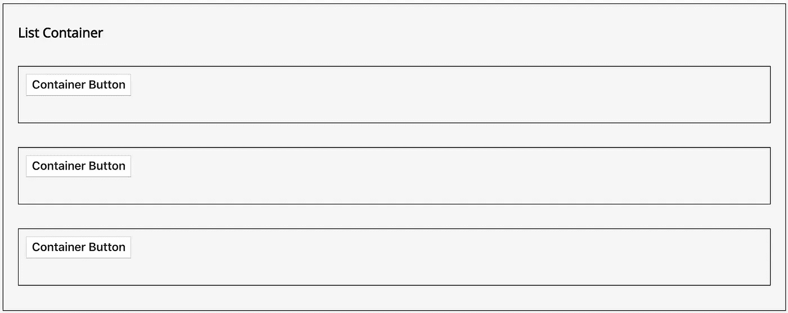
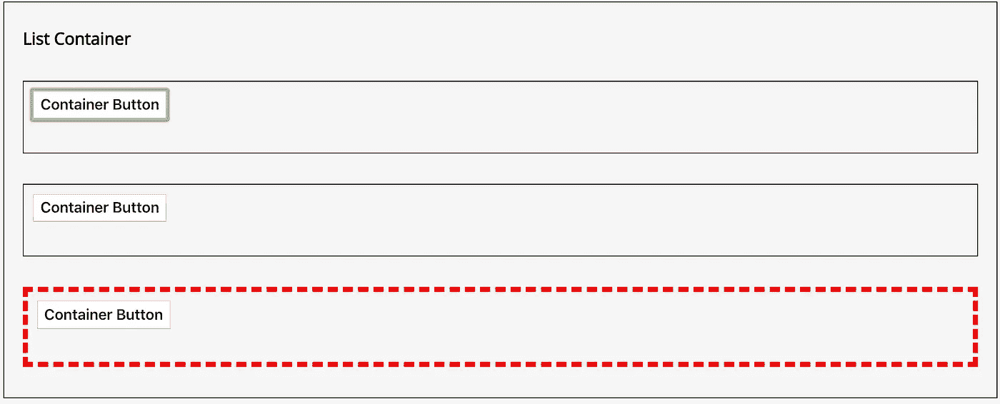
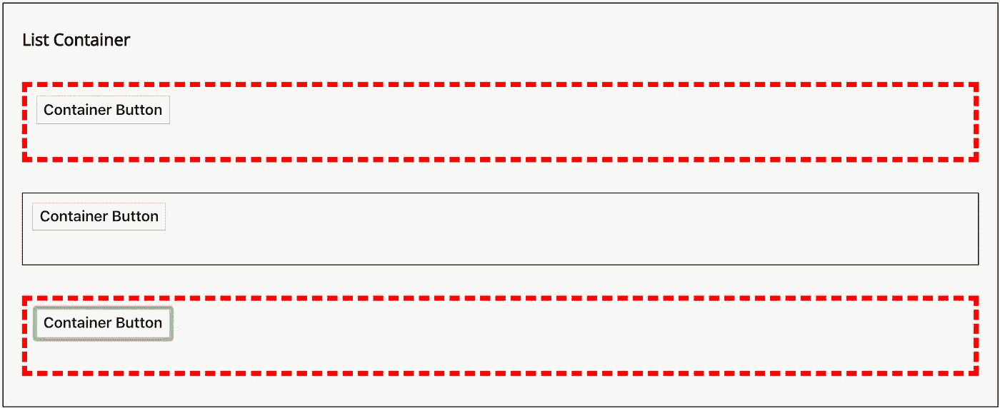

# 对功能组件的引用做出反应

> 原文：<https://levelup.gitconnected.com/react-refs-for-function-components-44f1a5a2332a>


React 组件表示 DOM 标签，这些标签组成了由`render`方法返回的 UI 的特定部分。对于希望在常规 React 生命周期之外与 DOM 节点交互的情况，我们可以使用 refs。

在这篇文章中，我们将通过演示`useRef`和`createRef`的不同之处来回顾一个简短的例子，在这个例子中，我们需要动态地引用功能子组件中的 DOM 节点。

[](https://skilled.dev) [## 编写面试问题

### 一个完整的平台，在这里我会教你找到下一份工作所需的一切，以及…

技术开发](https://skilled.dev) 

# `Create the ref object using useRef`

> `*useRef*` *返回一个可变 ref 对象，其* `*.current*` *属性初始化为传递的参数(* `*initialValue*` *)。返回的对象将在组件的整个生存期内保持不变。—反应文件*

让我们声明一个父子关系，其中列表组件呈现一些不确定数量的行:

```
// Parent: Feed
// Child: FancyRow 
function Feed({ edges }: FeedProps): React.Element<'div'> {
  const parentRef = useRef<HTMLDivElement>();
  return (
    <div className={styles[‘feed’]}>
      <h4 className={styles[‘feed__item-title’]}>
         List Container
      </h4>
      {edges.map((edge, i) => (
      <**FancyRow** key={i} />
      ))}
    </div>
  );
}
```

React 在制作列表时对待`ref`属性类似于对待`key`道具。在函数组件上声明`ref`属性会在控制台中触发错误。

```
/* Error, ref will be undefined */
{edges.map((edge, i) => (
   <**FancyRow** **ref**={parentRef} key={i} />
))}
```

为了理解为什么会发生这种情况，回想一下 React 类是创建实例来保存对象状态的对象。

另一方面，功能组件没有实例。当函数组件被重新渲染时，`refObject`将失去对 DOM 的引用，并且未定义。

# 备用道具

我们可以通过从父级声明一个替代属性来从子级引用我们的 DOM，如下所示:

```
// Parent
{edges.map((edge, i) => (
   <**FeedRow** **parentRef**={parentRef} key={i} />
))}// Child 
function **FeedRow**(props: RowProps): React.Element<’div’>{
 return (
    <div **ref**={**props.parentRef**} className={styles[‘feed__item’]} >
       <div className={styles[‘feed__item-meta’]}>
         <button>Container Button</button>
       </div>
    </div>
 );
};
```

或者，根据文档，我们可以使用`forwardRef`将引用直接“转发”到子组件。我们可以使用 regular `ref`属性，并从作为 regular `props.`包装在`forwardRef`中的组件中获取对其中一个子组件的引用

```
// Parent
{edges.map((edge, i) => (
   <**FancyRow** r**ef**={parentRef} key={i} />
))}const FancyRow = React.**forwardRef**((props, ref) => 
 <FeedRow 
   key={props.edge} 
   **parentRef**={ref} 
   {…props} 
 />// Child 
function FeedRow(props: RowProps): React.Element<’div’>{
 return (
    <div ref={**props.parentRef**} className={styles[‘feed__item’]} >
       <div className={styles[‘feed__item-meta’]}>
         <button>Container Button</button>
       </div>
    </div>
 );
};
```

到目前为止，我们有一个行容器列表。



让我们进一步看看`useRef` 钩子是如何引用从子进程呈现的 DOM 的。这里，我们从父节点创建一个点击处理程序，并将其作为常规道具传递给子节点。

```
function Feed({ edges }: Props): ReactNode {
 const **parentRef** = React.useRef();const **onClick** = () => {
   if (**parentRef**.**current**) {
    **parentRef.current.style.border = ‘5px dashed red’;**
   }
 };return (
   <div className={styles[‘feed’]}>
    <h4 className={styles[‘feed__item-title’]}>List Container</h4>
    {edges.map((edge, i) => (
      <FancyRow
       ref={parentRef}
       key={i}
       parentOnClick={**onClick**}
       edge={edge}/>))}
    </div>
 );
}
```

我们还想更新`FeedRow`并从 props 中附加我们的 click 处理程序作为按钮的事件处理程序。

```
const FeedRow = (props): React.Element<’div’> => {
 return (
  <div ref={props.parentRef} className={styles[‘feed__item’]} >
   <div className={styles[‘feed__item-meta’]}>
 **<button onClick={() => props.parentOnClick()}>**
       Container Button
     </button>
   </div>
  </div>
 );
};
```

如果我们单击列表中的任何按钮，只有最终的容器会呈现红色虚线边框。正如文档所述，由返回的对象将在组件的整个生存期内保持不变。我们对`FeedRow`的 DOM 节点的引用是在 Feed 的生命周期中设置一次*来呈现其子元素。*

**

# *`Create the ref object using createRef`*

*与`useRef`不同的是，`createRef`不会将引用实例保存到子对象的 DOM 中，并且*总是会*创建一个新的引用。*

*在基于数据动态呈现子元素的应用程序中，我们希望在初始呈现时为每个子元素分配新的 ref 对象。我们可以在当地的`Feed`州存储一个参考列表*

```
*const [elements] = **useState**<Array<HTMLDivElement>>(
    Array(edges.length)
    .fill(0)
    .map(() => React.createRefuseState<Array<?HTMLDivElement>>())
);*
```

*重新访问我们的顶级父组件，在映射数据时，我们向引用数组传递一个索引值。*

```
*// Parentconst onClick = (rowIndex: number): void => {
    if (elements[rowIndex]) {
      elements[rowIndex].current.style.border = '5px dashed red';
    }
};
...
{edges.map((edge, **i**) => (
    <FancyRow
       rowIndex={i}
 **ref={elements[i]}**
       key={i}
       parentOnClick={onClick}
       edge={edge}>
    </FancyRow>))}*
```

*通过将 index prop 从子组件作为参数传递给 click handler 函数，我们可以获得正确的 DOM 引用:*

```
*const FeedRow = (props): Element<’div’> => { return (
    <div ref={props.parentRef} className={styles[‘feed__item’]} >
      <div className={styles[‘feed__item-meta’]}>
       <button onClick={() =>                  
           props.parentOnClick(props.rowIndex)}>
          Container Button</button>
      </div>
    </div>);
};*
```

*现在你知道了。使用这种模式动态地将 refs 分配给子节点，以便引用它们的 DOM 节点。*

**

*感谢阅读！*

## *来源*

*[](https://reactjs.org/docs/forwarding-refs.html) [## 转发参考-反应

### 引用转发是一种通过组件将引用自动传递给其子组件的技术。这是…

reactjs.org](https://reactjs.org/docs/forwarding-refs.html) [](https://www.robinwieruch.de/react-function-component#react-function-component-lifecycle) [## 反应功能部件- RWieruch

### React 功能组件-也称为 React 功能组件-是编写现代 React 的现状…

www.robinwieruch.de](https://www.robinwieruch.de/react-function-component#react-function-component-lifecycle)  [## 6.4 引用组件实例

### 当一个组件被渲染时，一个 React 组件实例从传递的配置选项中被创建。一个人可以…

reactenlightenment.com](https://reactenlightenment.com/basic-react-components/6.4.html)  [## 对组件的引用|反应

### 在 GitHub 上编辑构建完组件后，您可能会发现自己想要“伸出手”并调用…

zhenyong.github.io](https://zhenyong.github.io/react/docs/more-about-refs.html)*