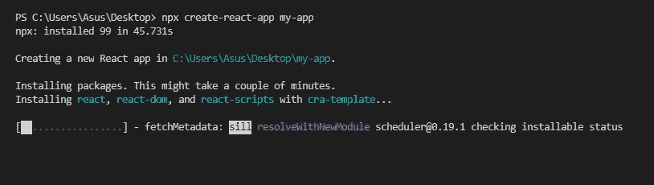
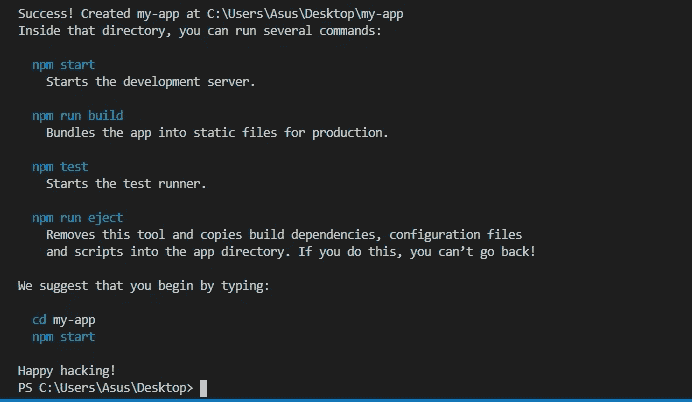
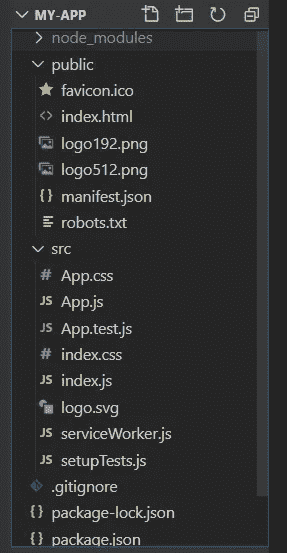
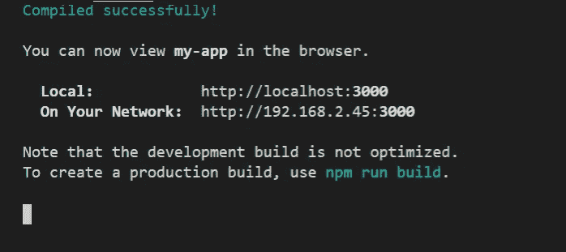
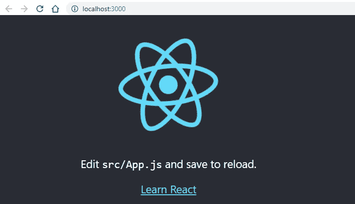
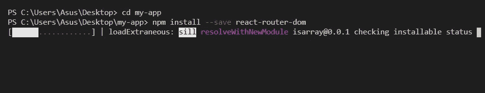
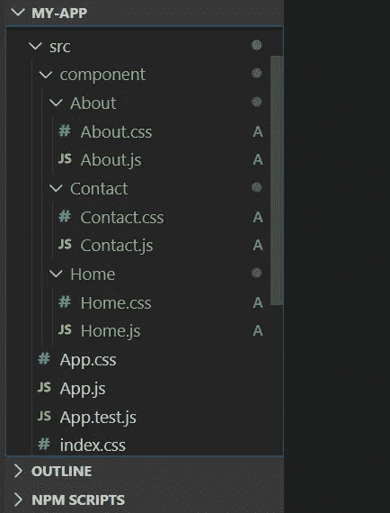
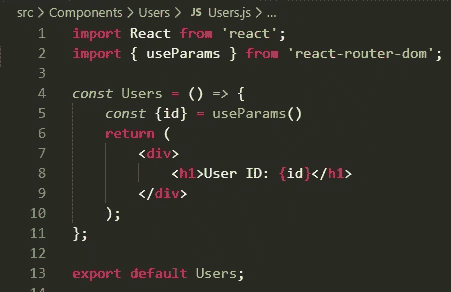

# 初学者用 React 路由器

> 原文：<https://levelup.gitconnected.com/react-router-for-beginners-788486cb3b>


任何现代网站实际上都是由一个页面组成的。它们看起来就像多个页面，因为它们包含了呈现为独立页面的组件。这些通常被称为单个应用程序。

# **React 路由器的用途:**

**React Router** 和动态客户端 **routing** ，允许我们构建单页面 web 应用和导航，而无需在用户导航时刷新页面。 **React 路由器**使用组件结构基于路由调用组件，显示适当的信息。

# React 路由器是如何工作的？

React 路由器的主要组件包括:

browser router:browser router 是一个路由器实现，它使用 HTML5 历史 API (pushState、replaceState 和 popstate 事件)来保持你的 UI 与 URL 同步。它是用于存储所有其他组件的父组件。

**路由:**`<Route>`组件是 React 路由器的主要构建模块。路线有三个属性，可以用来定义当路线的路径匹配时应该呈现什么。应该只给一个`<Route>`元素提供一个。

`component` —一种反应成分。当带有组件属性的路由匹配时，该路由将返回一个新元素，其类型是提供的 React 组件(使用`React.createElement`创建)。

`render` —返回 React 元素的函数。当路径匹配时将调用它。这类似于`component`，但是对于内联渲染和向元素传递额外的属性很有用。在内部，传递给`component`和`render`的组件的最大区别是`component`将使用`React.createElement`创建元素，而`render`将使用[渲染道具模式](/understanding-react-render-props-by-example-71f2162fd0f2?source=friends_link&sk=f44aed6129cede85c72b6eace5f84673)作为函数调用组件。

`children` —返回 React 元素的函数。与前面的两个道具不同，无论路线的路径是否与当前位置匹配，这个道具都会被渲染。

**链接:** `Link`组件用于创建不同路线的链接，实现应用程序的导航。它就像一个 HTML 锚标签一样工作。如果我们使用锚元素创建链接，点击它们会导致整个页面重新加载。React 路由器提供了一个`<Link>`组件来防止这种情况发生。当点击一个`<Link>`时，URL 会被更新，呈现的内容会改变，无需重新加载页面。

`<Link>`让我们使用`to`道具来描述他们应该导航到的位置。这可以是一个字符串，也可以是一个位置对象(包含`pathname`、`search`、`hash`和`state`属性的组合)。当它是一个字符串时，它将被转换成一个位置对象。

**开关:** `Switch`组件用于只渲染与位置匹配的第一条路线，而不是渲染所有匹配的路线。

# 入门指南

首先，我们将为我们的应用程序创建一个 react 应用程序。

## ***设置 React 应用:***

**步骤 1** :安装 NodeJS。您可以访问 NodeJS 的[官方下载链接](https://nodejs.org/en/download/current/)下载并安装最新版本的 NodeJS。

**第二步**:用`create-react-app`创建一个 React 应用，姑且称之为 **my-app。**在您的终端或命令提示符下运行以下命令:

`**npx create-react-app my-app**`

> **注意 *:*** npx 始终使用最新版本。(npx 附带 npm 5.2+及更高版本)



运行上述命令并成功安装后，您的终端将显示如下图所示的一些输出:



上述语句将在您的当前目录下创建一个名为 ***myapp*** 的新目录，其中包含成功运行 React 应用程序所需的一系列文件。

让我们看看上面的命令创建的目录:



在上面的目录中，你可以看到一些文件。我们将在基础课程中使用的主要文件是***index.html***和 ***index.js*** 。***index.html***文件将有一个带`id = “root”`的`div`元素，在里面所有的东西都将被渲染，我们所有的 React 代码都将在 ***index.js*** 文件里面。

既然我们已经成功设置了开发环境，剩下的最后一件事就是**启动开发服务器**。

**步骤 3** :要启动开发服务器，进入当前目录“ ***myapp*** ”并执行以下命令:

`npm start`

成功运行上述命令后，您的编译器将显示以下消息:



你可以去上面消息里显示的网址( [http://localhost:3000](http://localhost:3000/) )看看你在 App 里做的改动。默认情况下，上述 URL 将显示以下页面:



您的开发环境已经准备好了。现在让我们在应用程序中安装 React 路由器。

## ***安装 React 路由器:***

React 路由器可以通过`[npm](https://www.geeksforgeeks.org/node-js-npm-node-package-manager/)`安装在 React 应用程序中。按照下面给出的步骤在 React 应用程序中安装路由器:

**第一步:** `[cd](https://www.geeksforgeeks.org/cd-command-in-linux-with-examples/)`进入你的项目目录即**我的 app** 。

**步骤 2:** 使用以下命令安装 React 路由器:

`npm install — save react-router-dom`

> **注:** React 路由器兼容 React > = 16.8。



之后到你的`src`文件夹打开 ***index.js*** 导入`BrowserRouter`。`BrowserRouter`可能需要额外的服务器配置来处理动态请求。在你的***src/index . js****中添加这一行。*

`import { BrowserRouter } from ‘react-router-dom’;`

在路由器内部，您只能使用一个子元素。因此，有必要创建一个根组件来呈现应用程序的其余部分，然后将它作为路由器的子组件传递进来。为此，React 已经提供了一个 ***App*** 组件。我们需要将 ***App*** 组件放在`BrowserRouter`中，以便路由可以为整个应用程序工作。


还有一种选择是我们可以直接使用 ***App.js*** 中的`BrowserRouter`。在本文中，我正在使用这个过程。那么，让我们现在开始工作吧…..

## **使用 React 路由器:**

要使用 react 路由器，让我们首先在 React 应用程序中创建几个组件。在您的项目目录中，在`src`文件夹中创建一个名为**组件**的文件夹，现在将名为 **Home** 、 **About** 和 **Contact** 的 3 个文件夹添加到组件文件夹中。



## **添加 React 路由器组件:**

要在您的应用程序中添加 React 路由器组件，请在您使用的编辑器中打开您的项目目录，并转到 ***App.js*** 文件。现在，在 ***App.js 中添加下面的代码:***

```
import {
      BrowserRouter as Router,
      Switch,
      Route,
      Link
} from "react-router-dom";
```

让我们为我们的 3 个组件添加一些代码:

*Home.js:*

```
import React from 'react';   
function Home (){ 
    return <h1>Welcome to the world of Web Development!</h1> 
}  
export default Home;
```

*About.js:*

```
import React from 'react';   
function About () { 
    return <div> 
        <h2>    
                Hello I'm
                Nury Fatema!
                I'm a web designer / developer based in Dhaka, Bangladesh. I have a passion for web design and love to create for web and mobile devices.
        </h2> 
      </div> 
} 
export default About;
```

*Contact.js:*

```
import React from 'react';  
function Contact (){ 
 return <address> 
            You can find us here:<br /> 
            Lorem Ipsum is simply dummy text of the printing and typesetting industry. Lorem Ipsum has been the industry's standard dummy text ever since the 1500s
        </address> 
}   
export default Contact;
```

**现在，将 React 路由器组件包含到应用程序中:**

**BrowserRouter:** 将别名为 Router 的`BrowserRouter`添加到您的 ***App.js*** 文件中，以便包装所有其他组件。`BrowserRouter`是父组件，只能有一个子组件。

```
function App() {
  return (
    <div>
     <Router>

     </Router>
     <Header></Header>
    </div>   
  );
}
export default App;
```

**Route:** 添加`Route`组件现在将帮助我们建立组件的 UI 和 URL 之间的链接。在`Route`组件中，我们需要传递两个道具:`path`和`component`。

***路径*** :表示我们需要指定路径。一个`<Route>`期望一个路径属性，这是一个描述路由匹配的路径名的字符串——例如，`<Route path='/about'/>`应该匹配一个以`/about`开头的路径名。当当前位置的路径名与`path`匹配时，route 将呈现一个 React 元素。当路径不匹配时，该路径不会渲染任何内容。

***组件*** :用户导航到该路径时需要看到哪个组件。

要将`routes`添加到应用程序中，请将下面给出的代码添加到您的 ***App.js:***

```
 <Route path="/ ">
        <Home></Home>
 </Route>
 <Route path="/about">
        <About></About>
 </Route>
 <Route path="/contact">
        <Contact></Contact>
 </Route>
```

现在将组件导入应用程序:

```
import Header from './component/Header/Header';
import Home from './component/Home/Home';
import About from './component/About/About';
import Contact from './component/Contact/Contact';
```

很多首页网址都是站点名称后面跟着`"/"`。在这种情况下，我们将`exact`添加到`Route`标签中。这是因为其他 URL 也包含“/”，所以如果我们不告诉应用程序它只需要查找`/`，它会加载第一个匹配路径的 URL，这样我们就需要处理一个非常棘手的 bug。例如，`exact path=’/about’`将只呈现与路径完全匹配的组件，但是如果我们从语法中移除`exact`，那么即使结构类似于`/about/10`，UI 仍然会被呈现。

**精确:**我们可以为下面给出的精确位置设置“`exact`”关键字:

```
<Route exact path="/">
    <Home></Home>
</Route>
```

# 增加 404 页

## 什么是 404 页面？

404 页面也被称为未找到的页面，这意味着当用户导航到网站中不存在的错误路径时，我们需要显示未找到的页面。

## **如何在 react 中添加 404 页面？**

如果我们导航到网站中不存在的错误路径怎么办？我们也可以使用“*”为所有其他错误路径设置一个路径。为了解决这个问题，创建一个 ***NotFound*** 组件。

*未找到. js:*

```
import React from 'react';
const NotFound = () => {
  return (
    <div>
        <h1>
            Page Not Found
        </h1>
    </div>
    );
};
export default NotFound;
```

现在将 ***未找到的*** 组件导入到 ***App.js*** 文件中，并包含以下代码:

```
<Route path="*">
    <NotFound></NotFound>
</Route>
```

如果你运行应用程序，你会看到我们的项目有问题。我们将一起看到“`/`”和“`*`”的内容。而如果我们转到“`**/about**`页，就会显示三页在一起。但是为什么呢？这里可以说“`*`”是针对所有页面的。那么，我们能做什么呢？我们可以用`**Swich**` 表述。这和我们的 JavaScript `switch`语句一模一样。如果你以前没见过，你可以把`Switch`想成一个`if-else`条件。

**Switch:** 为了渲染一个单独的组件，把所有的路线都包装在`Switch`组件里面。`Switch`将几个`routes`组合在一起，遍历它们，找到第一个匹配`path`的。由此，呈现对应于`path`的组件。

```
function App() {
  return (
    <div>
      <Router>
        <switch> 
           <Route exact path="/">
             <Home></Home>
           </Route>
           <Route path="/about">
             <About></About>
           </Route>
           <Route path="/contact">
             <Contact></Contact>
           </Route>
        </switch>
    </Router>
    </div>
  );
}
```

添加所有组件后，这里是我们完整的源代码:

```
import React from 'react';
import logo from './logo.svg';
import './App.css';
import {
  BrowserRouter as Router,
  Switch,
  Route,
  Link
} from "react-router-dom";
import Home from './component/Home/Home';
import About from './component/About/About';
import Contact from './component/Contact/Contact';
import NotFound from './component/NotFound/NotFound';function App() {
  return (
    <div>
       <Router>
         <switch> 
           <Route exact path="/">
             <Home></Home>
           </Route>
           <Route path="/about">
             <About></About>
           </Route>
           <Route path="/contact">
             <Contact></Contact>
           </Route>
           <Route path="*">
             <NotFound></NotFound>
           </Route>
         </switch>
     </Router>
    </div>
  );
}
export default App;
```

## 创建动态路径:

为了给我们的项目创建一个动态路径，我们需要使用冒号标点符号(`:`)。首先，我们创建另一个名为“ ***用户*** ”的组件，并将其添加到 ***App.js*** 文件中。

```
<Route path="user/:id">
 <Users></Users>
</Route>
```

如果我们使用`user/id`，我们将进入`user/id`页面。但是我们想特别进入用户页面。你可以说，`:id`不是确切的东西，我们可以通过这个传递一个动态值。如果我们有三/四个像“Amio”、“Christina”、“Othelo”这样的用户，我们可以通过`:`传递用户 id。

但是用户组件如何获得`id`的值呢？



在 ***Users.js*** 文件中，我们可以使用`useParams`，它也在我们的`react-router-dom`中。这样，我们就可以得到这个组件的参数。然后我们可以随心所欲地使用我们的 id。

# 结论

所以我们有它。如果你想在 React 应用中轻松导航，忘记锚标签，添加 React 路由器。它是干净的，有条理的，它使得添加和删除页面变得更加容易。