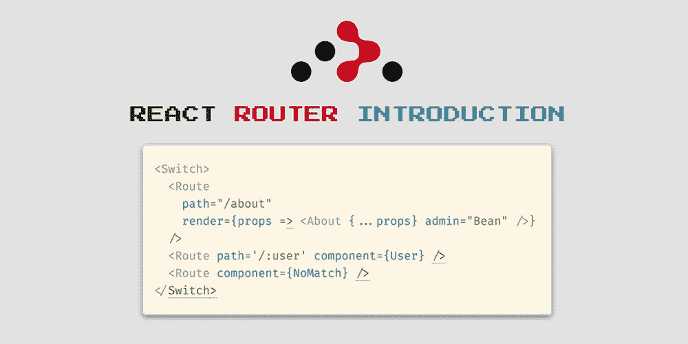
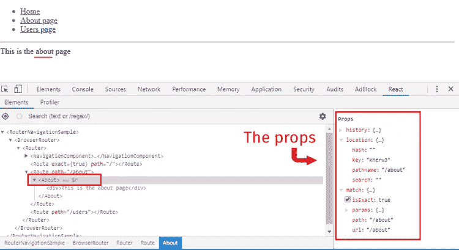

# 反应路由器游戏攻略

> 原文：<https://levelup.gitconnected.com/react-router-introduction-8ee330524853>



[React Router](https://reacttraining.com/react-router/web/guides/quick-start) 是为解决 React app 中路由问题而创建的第三方库。它包装了浏览器历史 API，并负责保持 React 应用程序 UI 与浏览器的 URL 同步。

React 路由器有两个包:`react-router-dom`用于 React 和`react-router-native`用于 React Native。既然你正在学习制作网络应用程序，你只需要安装`react-router-dom`:

```
npm install react-router-dom
```

最小导航中常用的 React 路由器基本组件有 3 个，分别是`BrowserRouter`、`Route`和`Link`。先来探讨一下`BrowserRouter`和`Route`:

```
import { BrowserRouter as Router, Route } from 'react-router-dom'class RouterNavigationSample extends React.Component {
  render() {
    return (
      <Router>
      <>
        <NavigationComponent />
        <Route exact path="/" component={Home} />
        <Route path="/about" component={About} />
      </>
      </Router>
    )
  }
}
```

作为`Router`导入的`BrowserRouter`充当父组件，包装所有 React 组件。它将截取浏览器请求 URL，并将其路径与相应的`Route`组件匹配。因此，如果浏览器 URL 是`localhost:3000/about`,`Router`将获取该信息，然后寻找具有`/about`的`path`属性的`Route`组件。

您将通过将`component`属性添加到`Route`来决定要呈现的内容。

在上面的示例中，一个`exact`属性被添加到默认的`Route`路径(`/`，因为如果没有它，任何带有`/`的路线也会呈现`Home`组件，导致导航不一致。

第三个组件`Link`用于导航，代替 HTML 的常规`<a>`标签。这是因为常规的 HTML 锚标记会在点击时完全刷新浏览器，这不适合 React 应用程序。React 应用程序只需更新 URL、浏览器历史和组件，无需刷新浏览器:

```
import { Link } from "react-router-dom";class NavigationComponent extends React.Component {
  render() {
    return (
      <>
        <ul>
          <li>
            <Link to="/">Home</Link>
          </li>
          <li>
            <Link to="/about">About page</Link>
          </li>
        </ul>
        <hr />
      </>
    );
  }
}
```

你可以试试这里的工作演示。

请注意如何使用浏览器导航栏的“上一页”和“下一页”按钮，url 会随着后续导航更新，而无需加载浏览器。这就是 React 路由器的强大之处。

# 制作动态路由

您已经看到了如何使用 React 路由器创建简单导航，但是大多数 web 应用程序需要比这更高级的功能。您可能需要一个动态路由，您可以在其中放置类似于`/user/:id`的东西，其中 React 需要根据`:id`的值呈现一些东西。

旧链接也可能是死的，需要重定向到新的链接。

此外，如果浏览器 URL 不匹配任何现有的路由，您需要显示 404 页面。

这就是为什么你需要学习另外两个组件，`Switch`和`Redirect`。`[Switch](https://reacttraining.com/react-router/web/api/Switch)`是一个独特的组件，它将渲染第一个匹配的`Route`，然后停止。为了说明这个例子:

```
import { Route } from 'react-router'<Route path="/about" component={About}/>
<Route path="/:user" component={User}/>
<Route component={NoMatch}/>
```

在上面的代码中，一个浏览器 URL`/about`将匹配所有三个路由，导致它们都被渲染并堆叠在彼此之下。现在通过使用`Switch`组件，React Router 将渲染`About`组件路线，然后停止。

```
import {Switch, Route} from 'react-router';<Switch>
  <Route path='/about' component={About} />
  <Route path='/:user' component={User} />
  <Route component={NoMatch} />
</Switch>;
```

`Switch`中的`Route`组件的顺序很重要，所以确保在用 url 参数和 404 route 声明路由之前先声明所有静态路由。

现在对于`Redirect`，组件非常简单。您只需要添加声明旧 URL 的`from`属性和指定要链接的新 URL 的`to`属性。

```
import {Redirect} from 'react-router';<Redirect from='/old-match' to='/will-match' />;
```

# 嵌套路由

为了创建嵌套的 route，您需要在父组件中声明另一个`Route`。例如，假设您有`/users`将呈现给用户组件。

让我们做一个小练习。首先，创建一个存储用户数据的对象数组，如下所示:

```
const users = [
  {
    id: '1',
    name: 'Nathan',
    role: 'Web Developer',
  },
  {
    id: '2',
    name: 'Johnson',
    role: 'React Developer',
  },
  {
    id: '3',
    name: 'Alex',
    role: 'Ruby Developer',
  },
];
```

现在在应用程序中创建一个简单的路由:

```
class RouterNavigationSample extends React.Component {
  render() {
    return (
      <Router>
        <>
          <NavigationComponent />
          <Route exact path='/' component={Home} />
          <Route path='/about' component={About} />
          <Route path='/users' component={Users} />
        </>
      </Router>
    );
  }
}
```

NavigationComponent 是您编写用于导航应用程序的`Link`组件的地方:

```
class NavigationComponent extends React.Component {
  render() {
    return (
      <>
        <ul>
          <li>
            <Link to='/'>Home</Link>
          </li>
          <li>
            <Link to='/about'>About page</Link>
          </li>
          <li>
            <Link to='/users'>Users page</Link>
          </li>
        </ul>
        <hr />
      </>
    );
  }
}
```

是时候创建要在特定路线上呈现的组件了。`Home`和`About`组件将呈现一个 div，而`Users`将有另一个`Link`和`Route`组件。

在 Users 组件中，您将呈现一个用户列表，通过 ID 将一个*嵌套路由*提供给单个用户，如`/users/:id`:

```
const Home = () => {
  return <div>This is the home page</div>;
};const About = () => {
  return <div>This is the about page</div>;
};const Users = () => {
  return (
    <>
      <ul>
        {users.map(({name, id}) => (
          <li key={id}>
            <Link to={`/users/${id}`}>{name}</Link>
          </li>
        ))}
      </ul>
      <Route path='/users/:id' component={User} />
      <hr />
    </>
  );
};
```

这段代码没有什么新内容。所以现在您可以编写`User`组件了:

```
const User = ({match}) => {
  const user = users.find((user) => user.id === match.params.id);return (
    <div>
      Hello! I'm {user.name} and I'm a {user.role}
    </div>
  );
};
```

现在有一些我没告诉过你的新东西。每当一个组件被渲染到一个特定的路由中，该组件从 React 路由器接收路由属性。有 3 个路线道具被传入组件:`match`、`location`、`history`。

您可以通过打开 React 开发人员工具来查看 props，并突出显示匹配的组件路径:



(如果您从 Codesandbox 打开，您可以在一个新的单独窗口中打开演示以启用 React DevTool)

注意如何在`Users`组件嵌套路由中添加`/:id` URL 参数。这个 id 通过`match.params.id`对象属性传递给`User`组件。如果您将 URL 参数作为`/:userId`传递，它将作为`match.params.userId`传递。

现在您已经了解了路由属性，让我们稍微重构一下`Users`组件:

```
const Users = ({ match }) => {
  return (
    <>
      <ul>
        {users.map(({ name, id }) => (
          <li key={id}>
            <Link to={`${match.url}/${id}`}>{name}</Link>
          </li>
        ))}
      </ul>
      <Route path={`${match.url}/:id`} component={User} />
      <hr />
    </>
  );
}
```

一如既往，[这里的](https://codesandbox.io/s/nrm107nvxp)是一个工作演示。

# 将属性传递给路由组件

您可能认为将属性传递给 Route 组件与传递给 regular 组件是一样的:

```
<Route path="/about" component={About} user='Jelly'/>
```

不幸的是，React Router 不会将进入`Route`组件的道具转发到`component`道具中，所以你必须使用另一种方法。

幸运的是，React Router 提供了一个 [render](https://reacttraining.com/react-router/web/api/Route/render-func) 属性，该属性接受在 URL 位置匹配时调用的函数。该道具也接收与`component`道具相同的`route props`:

```
<Route
  path="/about"
  render={props => <About {...props} admin="Bean" />}
/>// the component
const About = props => {
  return <div>This is the about page {props.admin}</div>;
};
```

首先，您从 React Router 获取给定的`props`并将其传递给组件，以便组件可以在必要时使用`match`、`location`或`history`道具。然后你把你自己的额外道具加进去。上面的例子使用任意的`admin`道具作为例子。

这里可以看到完整的代码[。](https://codesandbox.io/s/2vrx41m6jn)

现在你已经了解了 React 路由器，试着在你的 React 应用中实现它！

你在努力学习 React 吗？ [*本书*](https://sebhastian.com/react-distilled/) *或许能帮到你！*

*最初发表于*[*sebhastian.com*](https://sebhastian.com/react-router-introduction)*。*

[](https://levelup.gitconnected.com)[](https://gitconnected.com/learn/react) [## 学习 React -最佳 React 教程(2019) | gitconnected

### 排名前 49 的 React 教程-免费学习 React。课程由开发人员提交并投票，使您能够…

gitconnected.com](https://gitconnected.com/learn/react)